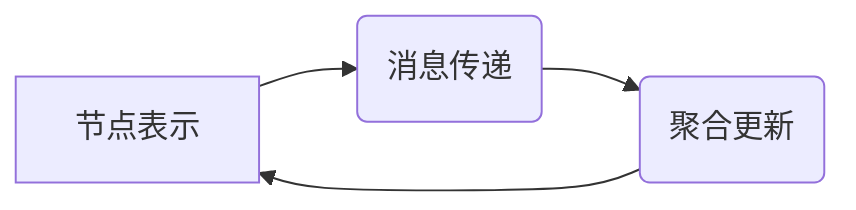
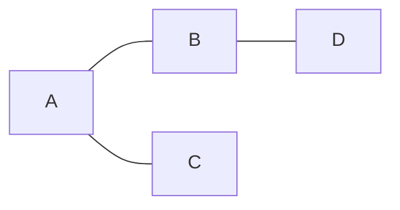

# 图神经网络(Graph Neural Networks) - 原理与代码实例讲解

## 1. 背景介绍

### 1.1 图数据的广泛应用

在现实世界中,许多数据都可以用图(Graph)的形式来表示。例如社交网络、交通网络、分子结构、知识图谱等。图数据具有独特的特点,节点之间存在复杂的连接关系和交互作用。传统的机器学习方法如卷积神经网络(CNN)主要处理规则的结构化数据如图像,很难直接应用于图数据。因此,图神经网络(Graph Neural Networks, GNNs)应运而生,为处理图结构数据提供了新的思路。

### 1.2 图神经网络的发展历程

早在2005年,Gori等人就提出了图神经网络的雏形。此后Scarselli等人进一步完善了图神经网络模型。但由于训练的难度,图神经网络并未得到广泛关注。  

直到2017年,Kipf和Welling提出了图卷积网络(Graph Convolutional Networks, GCN),利用卷积的思想定义了图上的传播规则,有效降低了训练难度。GCN的出现掀起了图神经网络的研究热潮。

此后,各种图神经网络模型如雨后春笋般涌现,如GraphSAGE、GAT、GIN等。图神经网络在图表示学习、节点分类、链路预测等任务上取得了显著成果,成为图机器学习领域的重要工具。

## 2. 核心概念与联系

### 2.1 图的基本概念

在介绍图神经网络之前,我们先回顾一下图的基本概念。图G=(V, E)由节点集V和边集E组成。每个节点可以携带属性信息,每条边也可能带有权重。根据边的方向,图可以分为有向图和无向图。

一些常见的图的变种:
- 多重图:允许两个节点之间存在多条边
- 超图:一条边可以连接两个以上的节点
- 异构图:包含多种类型的节点和多种类型的边

### 2.2 图神经网络的核心思想

图神经网络的核心思想是通过神经网络对图结构数据进行表示学习,学习到节点的低维向量表示,从而可以应用于下游的图分析任务。

具体来说,图神经网络通过迭代的信息传播过程来更新节点表示。每个节点汇聚其邻居节点的信息,与自身原有的特征进行聚合,产生新的节点表示。随着层数的加深,节点可以获取到越来越多的结构信息。最后一层的节点表示就可以用于节点分类、链路预测等任务。

### 2.3 图神经网络的通用框架

尽管图神经网络有各种不同的模型,但它们大多可以用一个通用的消息传递框架来描述:



- 消息传递:每个节点根据自身特征和边的信息,产生消息传递给邻居节点
- 聚合更新:每个节点聚合所有邻居传来的消息,与自身特征结合,更新节点表示

不同的图神经网络模型在实现消息传递和聚合更新的方式上有所不同,但都遵循这一通用范式。

## 3. 核心算法原理具体操作步骤

下面我们以图卷积网络(GCN)为例,详细介绍图神经网络的核心算法。

### 3.1 图卷积网络(GCN)的前向传播

GCN的核心是图卷积层,每一层的前向传播可以表示为:

$$H^{(l+1)} = \sigma(\hat{A} H^{(l)} W^{(l)})$$

其中:
- $H^{(l)}$是第$l$层的节点表示矩阵,每一行对应一个节点的表示向量
- $\hat{A}$是对称归一化的邻接矩阵,用于聚合邻居信息
- $W^{(l)}$是第$l$层的权重矩阵,是需要学习的参数
- $\sigma$是激活函数,如ReLU

可以看到,图卷积层的计算可以分为两步:
1. 邻居聚合:$\hat{A} H^{(l)}$,每个节点聚合其归一化的邻居特征
2. 特征变换:$(\cdot)W^{(l)}$,对聚合后的特征进行线性变换,并使用激活函数进行非线性转换

通过多层图卷积层的堆叠,可以得到蕴含丰富结构信息的节点表示。

### 3.2 GCN的训练算法

GCN的训练采用端到端的监督学习范式,以节点分类任务为例:

1. 将节点分为训练集、验证集和测试集
2. 在训练集上进行前向传播,得到输出层节点的预测概率分布
3. 计算交叉熵损失函数,进行反向传播,更新模型参数
4. 在验证集上评估模型性能,调整超参数
5. 在测试集上评估模型的泛化性能

GCN的训练可以使用梯度下降法,如Adam优化器。通过反复迭代,可以得到性能优异的节点分类器。

## 4. 数学模型和公式详细讲解举例说明

这里我们详细推导GCN中使用的对称归一化邻接矩阵$\hat{A}$。

首先我们定义图的邻接矩阵$A$,$A_{ij}=1$表示节点$i$和$j$之间有边相连,$A_{ij}=0$表示不相连。

为了引入自环,我们定义:

$$\tilde{A} = A + I$$

其中$I$为单位矩阵。即在原图的基础上,给每个节点添加一个指向自身的边。

然后我们定义度矩阵$\tilde{D}$,其中$\tilde{D}_{ii} = \sum_j \tilde{A}_{ij}$,即第$i$个节点的度。

对称归一化邻接矩阵定义为:

$$\hat{A} = \tilde{D}^{-\frac{1}{2}} \tilde{A} \tilde{D}^{-\frac{1}{2}}$$

直观上看,这一归一化操作可以理解为:
1. 先将邻接矩阵$\tilde{A}$中每一行除以该节点的度,得到随机游走的转移概率矩阵
2. 再将得到的矩阵对称化,得到$\hat{A}$

通过这种对称归一化,可以在聚合邻居信息时平衡不同节点的度的影响。

举一个具体的例子,假设有一个无向图:



其邻接矩阵为:

$$
A = \begin{bmatrix}
0 & 1 & 1 & 0\\
1 & 0 & 0 & 1\\
1 & 0 & 0 & 0\\
0 & 1 & 0 & 0
\end{bmatrix}
$$

添加自环后:

$$
\tilde{A} = \begin{bmatrix}
1 & 1 & 1 & 0\\
1 & 1 & 0 & 1\\
1 & 0 & 1 & 0\\
0 & 1 & 0 & 1
\end{bmatrix}
$$

度矩阵为:

$$
\tilde{D} = \begin{bmatrix}
3 & 0 & 0 & 0\\
0 & 3 & 0 & 0\\
0 & 0 & 2 & 0\\
0 & 0 & 0 & 2
\end{bmatrix}
$$

最终得到对称归一化邻接矩阵:

$$
\hat{A} = \begin{bmatrix}
\frac{1}{3} & \frac{1}{\sqrt{3\cdot3}} & \frac{1}{\sqrt{3\cdot2}} & 0\\
\frac{1}{\sqrt{3\cdot3}} & \frac{1}{3} & 0 & \frac{1}{\sqrt{3\cdot2}}\\
\frac{1}{\sqrt{3\cdot2}} & 0 & \frac{1}{2} & 0\\
0 & \frac{1}{\sqrt{3\cdot2}} & 0 & \frac{1}{2}
\end{bmatrix}
$$

可以看到,对称归一化后,邻接矩阵变得更加平滑,有利于信息在图上传播。这就是GCN中使用对称归一化邻接矩阵的数学原理。

## 5. 项目实践：代码实例和详细解释说明

下面我们使用Python和PyTorch库来实现一个简单的两层图卷积网络,并在Cora引文网络数据集上进行节点分类实验。

### 5.1 数据准备

首先导入需要的库:

```python
import torch
import torch.nn as nn
import torch.optim as optim
from torch_geometric.datasets import Planetoid
from torch_geometric.nn import GCNConv
```

其中`torch_geometric`是专门用于图神经网络的PyTorch扩展库。

然后加载Cora数据集:

```python
dataset = Planetoid(root='/tmp/cora', name='cora')
```

Cora是一个常用的图节点分类数据集,包含2708个科学出版物,分为7个类别。数据集中每个节点都有1433维的特征向量。

### 5.2 定义GCN模型

我们定义一个简单的两层GCN模型:

```python
class GCN(nn.Module):
    def __init__(self, in_dim, hidden_dim, out_dim):
        super(GCN, self).__init__()
        self.conv1 = GCNConv(in_dim, hidden_dim)
        self.conv2 = GCNConv(hidden_dim, out_dim)

    def forward(self, data):
        x, edge_index = data.x, data.edge_index
        x = self.conv1(x, edge_index)
        x = torch.relu(x)
        x = self.conv2(x, edge_index)
        return x
```

其中:
- `in_dim`是输入特征的维度,对于Cora数据集为1433
- `hidden_dim`是隐藏层的维度,这里设置为16
- `out_dim`是输出的类别数,对于Cora数据集为7

在前向传播函数中,我们使用`GCNConv`层来实现图卷积,并在两层之间使用ReLU激活函数。

### 5.3 训练与评估

定义一些超参数:

```python
epochs = 200
lr = 0.01
weight_decay = 5e-4
```

然后定义模型、优化器和损失函数:

```python
device = torch.device('cuda' if torch.cuda.is_available() else 'cpu')
model = GCN(dataset.num_node_features, 16, dataset.num_classes).to(device)
data = dataset[0].to(device)
optimizer = optim.Adam(model.parameters(), lr=lr, weight_decay=weight_decay)
criterion = nn.CrossEntropyLoss()
```

开始训练:

```python
model.train()
for epoch in range(epochs):
    optimizer.zero_grad()
    out = model(data)
    loss = criterion(out[data.train_mask], data.y[data.train_mask])
    loss.backward()
    optimizer.step()
```

在训练集上计算损失,并进行反向传播和参数更新。

最后在测试集上评估模型性能:

```python
model.eval()
pred = model(data).argmax(dim=1)
correct = (pred[data.test_mask] == data.y[data.test_mask]).sum()
acc = int(correct) / int(data.test_mask.sum())
print(f'Accuracy: {acc:.4f}')
```

在Cora数据集上,这个简单的两层GCN可以达到80%以上的分类准确率。

## 6. 实际应用场景

图神经网络在许多实际场景中都有广泛应用,下面列举几个典型的应用方向:

### 6.1 社交网络分析

在社交网络中,用户可以看作节点,用户之间的关系(如好友关系)可以看作边。图神经网络可以用于:
- 社区发现:将相似的用户聚类在一起
- 链接预测:预测两个用户之间是否可能成为好友
- 节点分类:预测用户的属性,如年龄、性别、兴趣等

### 6.2 推荐系统

在推荐系统中,用户和商品可以看作两类节点,用户的购买行为可以看作边。图神经网络可以用于:
- 商品推荐:根据用户的历史行为,推荐用户可能感兴趣的商品
- 用户聚类:将相似的用户聚类在一起,进行群体化推荐

### 6.3 交通预测

在交通网络中,道路的交叉口可以看作节点,道路可以看作边。图神经网络可以用于:
- 交通流量预测:根据