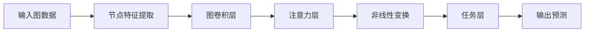

# 图神经网络原理与代码实战案例讲解

## 1. 背景介绍

### 1.1 图数据的重要性

在现实世界中,许多复杂的系统都可以用图的形式来表示和建模。例如社交网络、蛋白质互作网络、交通网络、知识图谱等,它们都由节点(nodes)和连接节点的边(edges)组成。图不仅能够有效地表示这些系统中的实体及其相互关系,而且能够揭示隐藏在复杂网络拓扑结构中的丰富信息。

随着图数据的快速增长,有效地挖掘和利用图结构数据中蕴含的知识和规律,成为了当前数据挖掘和机器学习领域的一个重要研究方向。传统的机器学习算法主要关注于欧几里得空间中的数据,而图数据由于其非欧几里得特性,使得常规的机器学习方法难以直接应用。因此,迫切需要发展能够直接处理图结构数据的新型机器学习模型和算法。

### 1.2 图神经网络的兴起

图神经网络(Graph Neural Networks, GNNs)作为一种新兴的深度学习架构,被设计用于直接处理图结构数据。它能够有效地捕获图数据中节点之间的拓扑结构信息和节点属性信息,并将它们融合到端到端的神经网络模型中进行训练和预测。

图神经网络的核心思想是通过迭代地聚合每个节点的邻居节点的表示,并与该节点自身的表示相结合,从而得到节点的新表示。通过多次迭代聚合,每个节点的表示都会被其更大邻域范围内的拓扑结构和节点属性所影响和丰富。经过足够多次迭代后,图神经网络就能够学习到图数据中节点之间复杂的结构化模式。

近年来,图神经网络在诸多领域取得了卓越的性能,例如节点分类、链接预测、图生成、图表示学习等,展现出了广阔的应用前景。本文将系统地介绍图神经网络的基本原理、核心算法、实现细节以及实战案例,帮助读者全面掌握这一新兴而前沿的深度学习技术。

## 2. 核心概念与联系

在深入探讨图神经网络的细节之前,我们有必要先介绍一些核心概念和相关背景知识。

### 2.1 图的表示

图G=(V,E)由一组节点V和一组连接节点的边E组成。每个节点v∈V可以携带一个节点属性向量x_v,用于描述该节点的特征信息。每条边e=(u,v)∈E连接两个节点u和v,也可以关联一个边属性向量x_e,用于描述该边的特征信息。

根据边是否带有方向,图可以分为有向图和无向图两种。在有向图中,边e=(u,v)具有方向,表示从节点u指向节点v。而在无向图中,边e=(u,v)没有方向,等价于e=(v,u)。

此外,根据边是否携带权重,图也可以分为加权图和非加权图。在加权图中,每条边e都关联一个权重w_e,用于表示该边的重要性或强度。而在非加权图中,所有边的权重被视为相等。

### 2.2 图卷积神经网络

图卷积神经网络(Graph Convolutional Networks, GCNs)是最早也是最具代表性的一种图神经网络模型。它的核心思想是定义一种图卷积操作,用于聚合每个节点的邻居节点的表示,并与该节点自身的表示相结合,从而得到节点的新表示。

具体来说,给定一个图G=(V,E),图卷积操作对每个节点v∈V执行以下更新:

$$H^{(l+1)}_v = \sigma\left(\sum_{u\in\mathcal{N}(v)\cup\{v\}}c(v,u,\Theta)H^{(l)}_u\right)$$

其中:
- $H^{(l)}_v$是节点v在第l层的表示向量
- $\mathcal{N}(v)$是节点v的邻居节点集合
- $c(v,u,\Theta)$是一个可学习的聚合函数,用于计算节点v和u之间的关系权重
- $\sigma$是一个非线性激活函数,如ReLU

通过堆叠多层图卷积层,节点的表示向量能够不断地被其更大邻域范围内的拓扑结构和节点属性所影响和丰富。最终,这些节点表示可以被馈送到下游的任务层(如全连接层)中,用于执行诸如节点分类、链接预测等任务。

图卷积神经网络为图神经网络的发展奠定了基础,但它也存在一些局限性,例如无法很好地处理大规模图数据、难以捕获长程依赖关系等。为了克服这些缺陷,研究人员提出了多种改进的图神经网络模型。

### 2.3 图注意力网络

图注意力网络(Graph Attention Networks, GATs)是一种流行的图神经网络模型,它引入了注意力机制来自适应地学习节点之间的关系权重。

在GAT中,节点v的表示更新如下:

$$H^{(l+1)}_v = \sigma\left(\sum_{u\in\mathcal{N}(v)}\alpha_{vu}^{(l)}W^{(l)}H^{(l)}_u\right)$$

其中,注意力系数$\alpha_{vu}^{(l)}$用于衡量节点u对节点v的重要性,它是通过一个注意力机制来自适应地学习的:

$$\alpha_{vu}^{(l)} = \mathrm{softmax}_u\left(f\left(W^{(l)}H^{(l)}_v,W^{(l)}H^{(l)}_u\right)\right)$$

这里,函数$f$可以是任何可学习的注意力函数,例如点积、加性或缩放点积注意力。

通过引入注意力机制,GAT能够自适应地为不同邻居节点分配不同的权重,从而更好地捕获图数据中的重要结构信息。此外,GAT还支持多头注意力,进一步提高了模型的表示能力。

### 2.4 图同构网络

图同构网络(Graph Isomorphism Networks, GINs)是一种具有理论保证的强大图神经网络模型。它能够通过特殊设计的卷积操作,从理论上保证学习到图同构不变的表示。

GIN的核心思想是将每个节点的表示更新为其自身表示与邻居节点表示的和的非线性变换:

$$H^{(l+1)}_v = \mathrm{MLP}^{(l)}\left(\left(1+\epsilon^{(l)}\right)\cdot H^{(l)}_v + \sum_{u\in\mathcal{N}(v)}H^{(l)}_u\right)$$

其中,MLP是一个多层感知机,用于对聚合后的表示进行非线性变换。$\epsilon^{(l)}$是一个可学习的标量,用于平衡节点自身表示和邻居表示的相对重要性。

通过特殊设计的卷积操作,GIN能够区分不同的图结构,从而具有强大的表示能力。同时,GIN还具有较高的计算效率和良好的泛化性能。

### 2.5 Mermaid 流程图

下面的 Mermaid 流程图展示了图神经网络的核心工作流程:

该流程图清晰地展示了图神经网络的主要组成部分及其相互关系:

1. 输入图数据,包括节点、边以及相关特征信息。
2. 对节点特征进行提取和编码,得到初始节点表示向量。
3. 通过一系列图卷积层,聚合每个节点的邻居节点表示,并与该节点自身表示相结合,得到新的节点表示。
4. 注意力层用于自适应地学习节点之间的关系权重,进一步提高表示能力。
5. 非线性变换层对节点表示进行非线性映射,增强模型的表示能力。
6. 任务层根据具体任务(如节点分类、链接预测等)对节点表示进行处理,得到最终输出。
7. 输出预测结果。

通过上述流程,图神经网络能够有效地捕获图数据中的拓扑结构信息和节点属性信息,并将它们融合到端到端的神经网络模型中进行训练和预测,从而实现对图数据的高效处理和挖掘。

## 3. 核心算法原理具体操作步骤

在上一节中,我们介绍了图神经网络的核心概念和基本工作原理。接下来,我们将深入探讨图神经网络中一些最具代表性的算法模型,并详细阐述它们的原理和具体操作步骤。

### 3.1 图卷积神经网络(GCN)

图卷积神经网络(Graph Convolutional Networks, GCNs)是最早也是最具影响力的图神经网络模型之一。它的核心思想是定义一种图卷积操作,用于聚合每个节点的邻居节点的表示,并与该节点自身的表示相结合,从而得到节点的新表示。

GCN的具体操作步骤如下:

1. **输入处理**:给定一个图G=(V,E),其中V是节点集合,E是边集合。每个节点v∈V携带一个节点属性向量x_v,用于描述该节点的特征信息。

2. **节点表示初始化**:将每个节点v的初始表示向量H^(0)_v设置为其节点属性向量x_v。

3. **图卷积层**:在第l层,对每个节点v∈V执行以下图卷积操作,得到其在第l+1层的表示向量H^(l+1)_v:

$$H^{(l+1)}_v = \sigma\left(\sum_{u\�\mathcal{N}(v)\cup\{v\}}c(v,u,\Theta^{(l)})H^{(l)}_u\right)$$

其中:
- $\mathcal{N}(v)$是节点v的邻居节点集合
- $c(v,u,\Theta^{(l)})$是一个可学习的聚合函数,用于计算节点v和u之间的关系权重
- $\Theta^{(l)}$是第l层图卷积层的可学习参数
- $\sigma$是一个非线性激活函数,如ReLU

通过堆叠多层图卷积层,节点的表示向量能够不断地被其更大邻域范围内的拓扑结构和节点属性所影响和丰富。

4. **任务层**:将最后一层图卷积层的输出节点表示向量H^(L)_v(L是层数)馈送到下游的任务层(如全连接层)中,用于执行诸如节点分类、链接预测等任务。

5. **模型训练**:使用监督学习方式,基于任务层的输出和真实标签,计算损失函数,并通过反向传播算法优化GCN模型的可学习参数。

GCN的优点在于其简单高效,能够有效地捕获图数据中的结构化模式。然而,它也存在一些局限性,例如无法很好地处理大规模图数据、难以捕获长程依赖关系等。为了克服这些缺陷,研究人员提出了多种改进的图神经网络模型。

### 3.2 图注意力网络(GAT)

图注意力网络(Graph Attention Networks, GATs)是一种流行的图神经网络模型,它引入了注意力机制来自适应地学习节点之间的关系权重。

GAT的具体操作步骤如下:

1. **输入处理**:与GCN相同,给定一个图G=(V,E)及其节点属性向量。

2. **节点表示初始化**:将每个节点v的初始表示向量H^(0)_v设置为其节点属性向量x_v。

3. **注意力图卷积层**:在第l层,对每个节点v∈V执行以下注意力图卷积操作,得到其在第l+1层的表示向量H^(l+1)_v:

$$H^{(l+1)}_v = \sigma\left(\sum_{u\in\mathcal{N}(v)}\alpha_{vu}^{(l)}W^{(l)}H^{(l)}_u\right)$$

其中:
- $\alpha_{vu}^{(l)}$是注意力系数,用