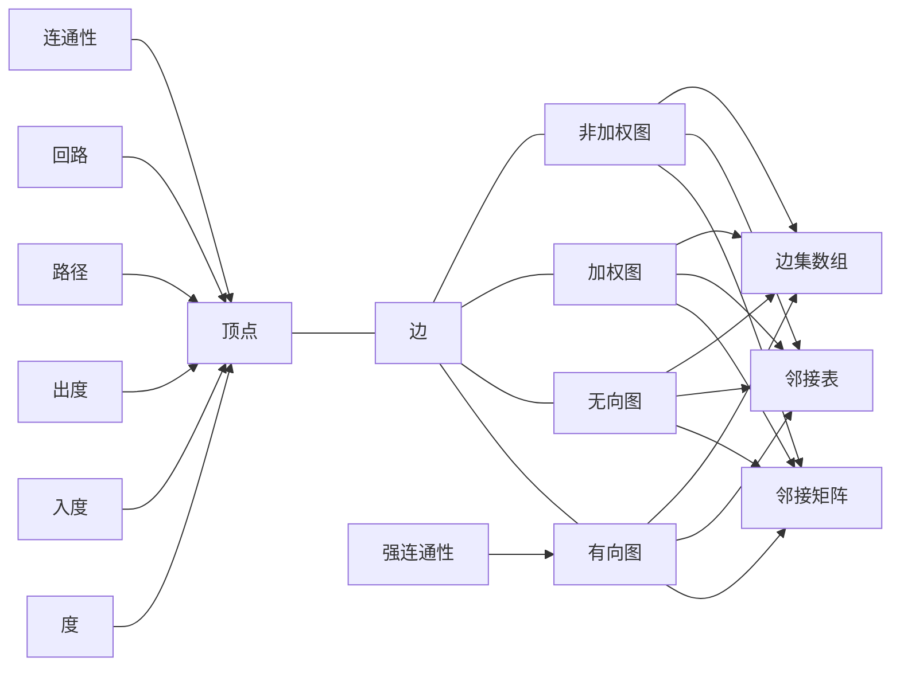

# 图算法 原理与代码实例讲解

## 1. 背景介绍
### 1.1 图论的起源与发展
#### 1.1.1 欧拉的七桥问题
#### 1.1.2 图论的诞生
#### 1.1.3 现代图论的发展
### 1.2 图在现实世界中的应用  
#### 1.2.1 社交网络分析
#### 1.2.2 交通运输网络优化
#### 1.2.3 计算机网络设计
### 1.3 图算法的重要性
#### 1.3.1 高效解决复杂问题
#### 1.3.2 优化资源配置
#### 1.3.3 预测未来趋势

## 2. 核心概念与联系
### 2.1 图的定义与表示
#### 2.1.1 顶点与边
#### 2.1.2 有向图与无向图
#### 2.1.3 加权图与非加权图
### 2.2 图的存储方式
#### 2.2.1 邻接矩阵
#### 2.2.2 邻接表
#### 2.2.3 边集数组 
### 2.3 图的基本概念
#### 2.3.1 度、入度与出度
#### 2.3.2 路径与回路
#### 2.3.3 连通性与强连通性



## 3. 核心算法原理具体操作步骤
### 3.1 图的遍历算法
#### 3.1.1 深度优先搜索(DFS)
1. 选择起始顶点并标记为已访问
2. 递归访问起始顶点的未被访问的邻接点
3. 若当前顶点的所有邻接点都已被访问，回溯到前一个顶点
4. 重复步骤2-3直到所有顶点都被访问

#### 3.1.2 广度优先搜索(BFS) 
1. 选择起始顶点并标记为已访问，将其入队
2. 当队列非空时，出队一个顶点，访问其所有未被访问的邻接点并入队
3. 重复步骤2直到队列为空

### 3.2 最小生成树算法
#### 3.2.1 Prim算法
1. 选择起始顶点加入生成树
2. 从剩余顶点中选择与当前生成树有边相连的最小权值的顶点加入
3. 重复步骤2直到所有顶点都加入生成树

#### 3.2.2 Kruskal算法  
1. 将所有边按权值从小到大排序
2. 从权值最小的边开始，如果该边的两个顶点不在同一集合，则加入生成树
3. 重复步骤2直到生成树包含n-1条边

### 3.3 最短路径算法
#### 3.3.1 Dijkstra算法
1. 初始化起点距离为0，其他顶点距离为无穷大
2. 选择未访问的距离最小的顶点，标记为已访问
3. 更新该顶点的邻接点的距离
4. 重复步骤2-3直到所有顶点都被访问

#### 3.3.2 Floyd算法
1. 初始化距离矩阵，不相邻点距离为无穷大
2. 遍历中间点k，更新任意两点i,j之间的最短距离
3. 重复步骤2直到所有顶点都被遍历

## 4. 数学模型和公式详细讲解举例说明
### 4.1 图的数学表示
#### 4.1.1 G=(V,E)的含义
设G为一个图，V是顶点集合，E是边集合，则图G可表示为G=(V,E)。其中：
$$V=\{v_1,v_2,...,v_n\}, E=\{e_1,e_2,...,e_m\}$$

#### 4.1.2 邻接矩阵
用一个n×n的矩阵A表示图G，矩阵元素$a_{ij}$定义为：
$$
a_{ij}=
\begin{cases}
1, & \text{if $(v_i,v_j) \in E$} \\
0, & \text{otherwise}
\end{cases}
$$

#### 4.1.3 邻接表
用一个长度为n的数组Adj存储图G，数组元素Adj[i]存储顶点$v_i$的所有邻接点。

### 4.2 最短路径的数学模型 
#### 4.2.1 Dijkstra算法
设源点为$v_s$，距离数组为dis，dis[i]表示$v_s$到$v_i$的最短距离。初始时：
$$
dis[i]=
\begin{cases}
0, & \text{if $i=s$} \\
\infty, & \text{otherwise}
\end{cases}
$$
每次选择未访问的dis最小的顶点$v_k$，更新其邻接点$v_j$的距离：
$$dis[j]=min(dis[j], dis[k]+w(k,j))$$
其中，$w(k,j)$为边$(v_k,v_j)$的权值。

#### 4.2.2 Floyd算法
设距离矩阵为dis，$dis(i,j)$表示$v_i$到$v_j$的最短距离。初始时：  
$$
dis(i,j)=
\begin{cases}
0, & \text{if $i=j$} \\
w(i,j), & \text{if $(v_i,v_j) \in E$} \\ 
\infty, & \text{otherwise}
\end{cases}
$$
遍历中间点k，更新$dis(i,j)$：
$$dis(i,j)=min(dis(i,j), dis(i,k)+dis(k,j))$$

## 5. 项目实践：代码实例和详细解释说明
### 5.1 图的表示
```cpp
// 邻接矩阵
int n;  // 顶点数
vector<vector<int>> adj_mat(n, vector<int>(n));

// 邻接表 
vector<vector<int>> adj_list(n);
```

### 5.2 深度优先搜索
```cpp
vector<bool> visited(n); // 标记顶点是否被访问

void dfs(int v) {
    visited[v] = true;
    for (int u : adj_list[v]) {
        if (!visited[u]) {
            dfs(u);
        }
    }
}
```

### 5.3 广度优先搜索
```cpp
vector<bool> visited(n);
queue<int> q;

void bfs(int s) {
    visited[s] = true;
    q.push(s);
    while (!q.empty()) {
        int v = q.front(); q.pop();
        for (int u : adj_list[v]) {
            if (!visited[u]) {
                visited[u] = true;
                q.push(u);
            }
        }
    }
}
```

### 5.4 Dijkstra算法
```cpp
vector<int> dis(n, INT_MAX);
vector<bool> visited(n);

void dijkstra(int s) {  
    dis[s] = 0;
    for (int i = 0; i < n; i++) {
        int u = -1;
        for (int j = 0; j < n; j++) {
            if (!visited[j] && (u == -1 || dis[j] < dis[u])) {
                u = j;
            }
        }
        visited[u] = true;
        for (int v = 0; v < n; v++) {
            dis[v] = min(dis[v], dis[u] + adj_mat[u][v]);
        }
    }
}
```

### 5.5 Floyd算法
```cpp
vector<vector<int>> dis(n, vector<int>(n, INT_MAX));

void floyd() {
    for (int i = 0; i < n; i++) {
        dis[i][i] = 0;
    }
    for (int k = 0; k < n; k++) {
        for (int i = 0; i < n; i++) {
            for (int j = 0; j < n; j++) {
                dis[i][j] = min(dis[i][j], dis[i][k] + dis[k][j]);
            }
        }
    }
}
```

## 6. 实际应用场景
### 6.1 路径规划
- 地图导航：使用Dijkstra或Floyd算法计算最短路径
- 旅行商问题：寻找访问所有城市的最短回路

### 6.2 网络流量优化
- 最大流问题：计算网络中从源点到汇点的最大流量
- 最小割问题：找出网络中的关键边和顶点

### 6.3 社交网络分析
- 社区发现：使用图的聚类算法发现紧密联系的社区
- 影响力最大化：寻找影响力最大的节点集合

### 6.4 推荐系统
- 协同过滤：基于用户-物品二部图的推荐算法
- 基于图的随机游走算法：PersonalRank等

## 7. 工具和资源推荐
### 7.1 图可视化工具
- Gephi：开源的交互式图可视化平台
- Cytoscape：复杂网络分析和可视化软件
- Neo4j：图数据库管理系统

### 7.2 图算法库
- Boost Graph Library (BGL)：C++模板库，包含多种图算法
- NetworkX：Python科学计算包，提供丰富的图算法和生成器
- JGraphT：Java图论库，支持各种图算法和数据结构

### 7.3 在线学习资源
- Coursera - Graph Search, Shortest Paths, and Data Structures
- edX - Graph Algorithms
- Khan Academy - Graph representation

## 8. 总结：未来发展趋势与挑战
### 8.1 大规模图计算
- 亿级、十亿级节点的超大规模图的高效处理
- 并行图算法、分布式图计算框架的发展

### 8.2 图神经网络
- 将深度学习与图结构数据相结合
- 在图表示学习、节点分类、链路预测等任务上的应用

### 8.3 动态图与时序图
- 图结构随时间动态变化的建模与分析
- 时序图上的异常检测、趋势预测等

### 8.4 知识图谱
- 构建大规模、高质量的知识图谱
- 基于知识图谱的智能问答、推理决策等应用

## 9. 附录：常见问题与解答
### Q1: 图的存储方式如何选择？
A1: 对于稠密图，邻接矩阵更节省空间；对于稀疏图，邻接表更高效。同时考虑算法的时间复杂度进行选择。

### Q2: 有向图和无向图的区别是什么？  
A2: 有向图的边有方向，可以表示非对称关系；无向图的边没有方向，表示对称关系。在存储和算法设计上有所不同。

### Q3: 最短路径算法中Dijkstra和Floyd的区别？
A3: Dijkstra适合求单源最短路径，时间复杂度为$O(n^2)$；Floyd适合求多源最短路径，时间复杂度为$O(n^3)$。

### Q4: 图神经网络与传统图算法的区别？  
A4: 图神经网络可以自动学习图的表示，端到端地解决图上的任务；传统图算法需要人工设计特征，针对不同问题单独优化。

### Q5: 知识图谱构建的主要难点有哪些？
A5: 实体对齐、关系抽取、知识融合、知识推理等都是知识图谱构建中的难点和热点问题，需要融合自然语言处理、机器学习等技术。

作者：禅与计算机程序设计艺术 / Zen and the Art of Computer Programming