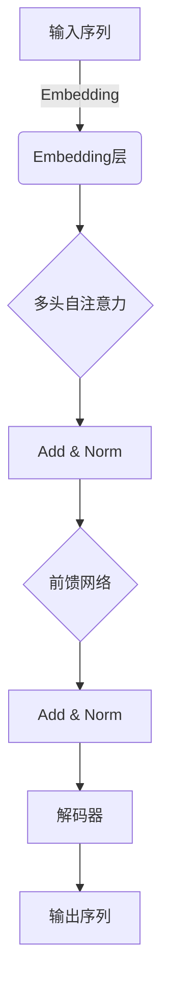

# 在Wiki-GPT基础上训练自己的简版ChatGPT

## 1.背景介绍

### 1.1 ChatGPT的崛起

2022年11月，OpenAI推出了一款基于大型语言模型的对话式AI助手ChatGPT，它凭借出色的自然语言理解和生成能力，在短时间内就引起了全球的广泛关注。ChatGPT不仅能够回答各种问题,还能撰写文章、编写代码、创作诗歌等,展现出惊人的通用能力。它的出现被视为人工智能发展的一个重要里程碑,标志着大型语言模型正在向通用人工智能迈进。

### 1.2 Wiki-GPT:开源的GPT模型

虽然ChatGPT展现出了强大的能力,但它是一个封闭的商业系统,无法查看和修改其内部结构。对于想要深入学习和研究大型语言模型的开发者和研究人员来说,拥有一个开源的GPT模型是非常重要的。幸运的是,由于Transformer模型和自注意力机制的发明者之一、谷歌大脑的研究员Ashish Vaswani等人的努力,我们现在拥有了一个名为Wiki-GPT的开源GPT模型。

Wiki-GPT是一个基于Wikipedia语料训练的开源生成式预训练转换器(GPT)模型。它使用与GPT-2相同的架构,但在训练语料和模型规模上有所不同。Wiki-GPT的训练语料来自Wikipedia,而GPT-2则使用了更广泛的网络语料。此外,Wiki-GPT的模型规模较小,参数数量在3.44亿左右,而GPT-2的参数数量高达15亿。

尽管Wiki-GPT在规模和能力上无法与GPT-3或ChatGPT相提并论,但它作为一个开源的GPT模型,为研究人员提供了一个宝贵的学习和实验平台。通过对Wiki-GPT进行微调和扩展,我们可以在本地训练出自己的简版ChatGPT,从而更好地理解和掌握大型语言模型的原理和训练方法。

## 2.核心概念与联系

### 2.1 生成式预训练转换器(GPT)

GPT(Generative Pre-trained Transformer)是一种基于Transformer架构的大型语言模型,它通过在大量文本语料上进行无监督预训练,学习到了丰富的语言知识和上下文信息。GPT模型的核心思想是利用自注意力机制来捕捉输入序列中的长程依赖关系,并通过自回归(Autoregressive)的方式生成连贯的文本。

在预训练阶段,GPT模型使用掩码语言模型(Masked Language Model)的目标,根据上下文预测被掩码的单词。与BERT等双向模型不同,GPT采用的是单向语言模型,只能看到当前位置之前的上下文。预训练完成后,GPT可以在各种下游任务上进行微调,如文本生成、问答、文本摘要等。

GPT模型的架构如下所示:



上图展示了GPT模型的基本架构,包括以下主要组件:

1. **Embedding层**: 将输入的文本序列转换为向量表示。
2. **多头自注意力(Multi-Head Attention)**: 捕捉输入序列中的长程依赖关系,是Transformer的核心部分。
3. **前馈网络(Feed-Forward Network)**: 对每个位置的向量表示进行非线性变换,提供位置信息。
4. **Add & Norm**: 残差连接和层归一化,用于模型优化和收敛。
5. **解码器(Decoder)**: 根据上下文生成输出序列,使用自回归(Autoregressive)的方式。

通过无监督预训练,GPT模型学习到了丰富的语言知识和上下文信息,可以在各种下游任务上进行微调和迁移学习,展现出强大的泛化能力。

### 2.2 Wiki-GPT与GPT-2的区别

虽然Wiki-GPT和GPT-2都是基于Transformer架构的GPT模型,但它们在训练语料和模型规模上存在一些差异:

1. **训练语料**:
   - GPT-2使用了来自网络的大规模语料,包括网页、书籍和维基百科等多种来源。
   - Wiki-GPT则仅使用了Wikipedia的语料进行训练。

2. **模型规模**:
   - GPT-2有多个版本,最大版本的参数数量高达15亿。
   - Wiki-GPT的参数数量约为3.44亿,规模较小。

由于训练语料和模型规模的差异,GPT-2在生成质量和泛化能力上通常优于Wiki-GPT。但是,Wiki-GPT作为一个开源的GPT模型,它的优势在于可以被研究人员自由修改和扩展,用于学习和实验目的。

## 3.核心算法原理具体操作步骤

要在Wiki-GPT的基础上训练出自己的简版ChatGPT,需要经历以下几个主要步骤:

### 3.1 安装环境和依赖

首先,我们需要安装必要的Python环境和相关依赖库,如PyTorch、Transformers等。可以使用Anaconda或者virtualenv来创建一个独立的Python环境,并通过pip安装所需的库。

### 3.2 下载Wiki-GPT预训练模型

接下来,我们需要从Hugging Face的模型库中下载Wiki-GPT的预训练模型权重。可以使用Transformers库提供的函数来完成这一步骤。

```python
from transformers import AutoModelForCausalLM, AutoTokenizer

model = AutoModelForCausalLM.from_pretrained("jatinpuri/wiki-gpt")
tokenizer = AutoTokenizer.from_pretrained("jatinpuri/wiki-gpt")
```

### 3.3 准备训练数据

为了训练自己的ChatGPT模型,我们需要准备一个合适的训练语料。可以使用网络上的公开数据集,如Reddit、StackExchange等,或者自己收集和清理数据。数据预处理是一个非常重要的步骤,包括文本清理、标记化、构建数据加载器等。

### 3.4 微调模型

有了预训练模型和训练数据之后,我们就可以开始对Wiki-GPT进行微调了。微调是一种迁移学习技术,它利用预训练模型作为初始化权重,在新的任务和数据上进行进一步的训练。

微调过程通常包括以下步骤:

1. 定义训练配置,如批大小、学习率、训练轮数等。
2. 定义损失函数和优化器,通常使用交叉熵损失和AdamW优化器。
3. 构建训练循环,在每个epoch中遍历训练数据,计算损失,并执行反向传播和优化。
4. 定期在验证集上评估模型性能,并保存最佳模型权重。

以下是一个简化的微调代码示例:

```python
from transformers import TrainingArguments, Trainer

training_args = TrainingArguments(
    output_dir="./output",
    num_train_epochs=5,
    per_device_train_batch_size=8,
    ...
)

trainer = Trainer(
    model=model,
    args=training_args,
    train_dataset=train_dataset,
    eval_dataset=val_dataset,
)

trainer.train()
```

在微调过程中,我们可以根据需要调整各种超参数,如学习率、批大小等,以获得最佳的模型性能。

### 3.5 生成和评估

经过微调后,我们就可以使用训练好的模型进行文本生成和评估了。Transformers库提供了一个简单的接口来实现这一功能。

```python
input_text = "写一篇关于人工智能的文章"
output = model.generate(tokenizer.encode(input_text, return_tensors="pt"), max_length=1024, do_sample=True, top_k=50, top_p=0.95, num_return_sequences=1)
generated_text = tokenizer.decode(output[0], skip_special_tokens=True)
print(generated_text)
```

上面的代码示例展示了如何使用微调后的模型生成一篇关于人工智能的文章。我们可以通过调整生成参数(如`max_length`、`top_k`、`top_p`等)来控制生成质量和多样性。

同时,我们也可以在测试集上评估模型的性能,例如使用常见的指标如BLEU、ROUGE等。评估结果可以帮助我们了解模型的优缺点,并进一步优化和改进模型。

## 4.数学模型和公式详细讲解举例说明

在GPT模型中,自注意力机制是一个非常重要的组成部分,它能够捕捉输入序列中的长程依赖关系。下面我们将详细介绍自注意力机制的数学原理。

### 4.1 Scaled Dot-Product Attention

自注意力机制的核心是Scaled Dot-Product Attention,它的计算公式如下:

$$
\text{Attention}(Q, K, V) = \text{softmax}\left(\frac{QK^T}{\sqrt{d_k}}\right)V
$$

其中:

- $Q$是查询(Query)矩阵,用于计算注意力分数。
- $K$是键(Key)矩阵,用于计算注意力分数。
- $V$是值(Value)矩阵,表示要关注的信息。
- $d_k$是缩放因子,用于防止内积过大导致的梯度饱和问题。

计算过程如下:

1. 计算查询$Q$和键$K$的点积,得到一个注意力分数矩阵$S$:

$$
S = QK^T
$$

2. 对注意力分数矩阵$S$进行缩放,除以$\sqrt{d_k}$:

$$
S' = \frac{S}{\sqrt{d_k}}
$$

3. 对缩放后的注意力分数矩阵$S'$应用Softmax函数,得到注意力权重矩阵$A$:

$$
A = \text{softmax}(S')
$$

4. 将注意力权重矩阵$A$与值矩阵$V$相乘,得到加权后的值矩阵,即注意力的输出:

$$
\text{Attention}(Q, K, V) = AV
$$

通过这种方式,自注意力机制能够根据查询$Q$和键$K$的相关性,动态地为每个位置分配注意力权重,从而捕捉输入序列中的长程依赖关系。

### 4.2 多头自注意力

在实际应用中,我们通常使用多头自注意力(Multi-Head Attention)来提高模型的表现力。多头自注意力的计算过程如下:

1. 将查询$Q$、键$K$和值$V$线性投影到$h$个不同的子空间,得到$Q_i$、$K_i$和$V_i$,其中$i=1,2,...,h$:

$$
\begin{aligned}
Q_i &= QW_i^Q \\
K_i &= KW_i^K \\
V_i &= VW_i^V
\end{aligned}
$$

2. 对每个子空间,计算Scaled Dot-Product Attention:

$$
\text{head}_i = \text{Attention}(Q_i, K_i, V_i)
$$

3. 将所有头的输出拼接起来,并进行线性变换,得到多头自注意力的最终输出:

$$
\text{MultiHead}(Q, K, V) = \text{Concat}(\text{head}_1, \text{head}_2, ..., \text{head}_h)W^O
$$

其中$W^O$是一个可学习的线性变换矩阵。

多头自注意力机制允许模型从不同的子空间捕捉不同的关系和依赖,从而提高了模型的表现力和泛化能力。

## 5.项目实践:代码实例和详细解释说明

在本节中,我们将提供一个完整的代码示例,展示如何在Wiki-GPT的基础上训练一个简单的ChatGPT模型。该示例使用了Hugging Face的Transformers库,并基于PyTorch实现。

### 5.1 导入必要的库

```python
import torch
from transformers import AutoModelForCausalLM, AutoTokenizer, TrainingArguments, Trainer
from datasets import load_dataset
```

我们导入了PyTorch、Transformers库和Datasets库,后者用于加载和处理训练数据。

### 5.2 加载预训练模型和分词器

```python
model = AutoModelForCausalLM.from_pretrained("jatinpuri/wiki-gpt")
tokenizer = AutoTokenizer.from_pretrained("jatinpuri/wiki-gpt")
```

我们从Hugging Face的模型库中加载Wiki-GPT的预训练模型和分词器。

### 5.3 准备训练数