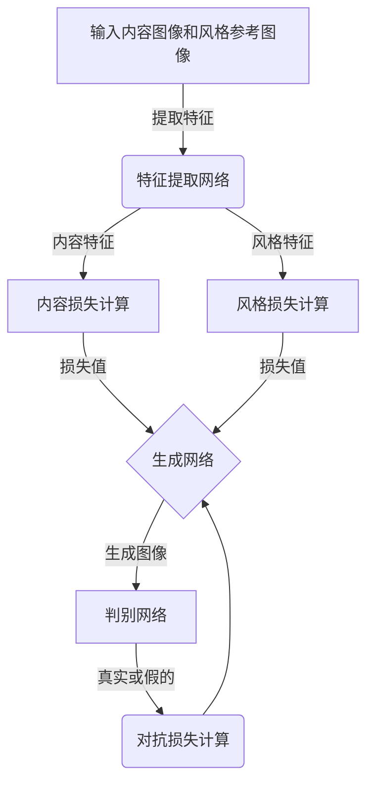

# 基于生成对抗网络的图像风格迁移在教育中的应用模式

## 1.背景介绍

### 1.1 图像风格迁移的概念

图像风格迁移是一种将一种图像的视觉风格迁移到另一种图像上的技术。它可以将一幅内容图像(如风景照片)与一幅风格参考图像(如一幅油画作品)相结合,生成一幅新的图像,保留原始内容图像的内容细节,同时融入了风格参考图像的风格特征。

这项技术在艺术、设计和多媒体领域有着广泛的应用前景,可用于创作独特的视觉作品、图像增强、风格化滤镜等。近年来,基于深度学习的图像风格迁移算法取得了突破性进展,尤其是生成对抗网络(Generative Adversarial Networks, GANs)的出现,为图像风格迁移提供了强大的新方法。

### 1.2 教育领域中的应用需求

在教育领域中,图像风格迁移技术也有着广阔的应用前景。例如:

- 为枯燥的教学材料注入生动有趣的视觉风格,提高学习兴趣
- 将抽象概念可视化,帮助学生更好地理解和记忆知识点
- 为教育APP、网站等增添个性化的视觉体验
- 教师可利用此技术制作生动形象的教学演示文稿
- 学生可以尝试用风格迁移技术创作有创意的艺术作品

基于生成对抗网络的图像风格迁移算法可以满足教育领域的这些需求,为教与学带来全新的视觉体验。

## 2.核心概念与联系

### 2.1 生成对抗网络(GANs)

生成对抗网络是一种由Generator(生成器)和Discriminator(判别器)组成的深度神经网络架构。其中:

- 生成器(Generator)的目标是从随机噪声中生成逼真的图像数据,尽量欺骗判别器
- 判别器(Discriminator)的目标是区分生成器生成的图像和真实图像,不被生成器欺骗

生成器和判别器相互对抗、相互博弈,最终达到一种动态平衡,使生成器能够生成高度逼真的图像。

GANs在图像生成、图像翻译、图像超分辨率等领域表现出色。对于图像风格迁移任务,生成对抗网络可以高效地学习到图像的内容和风格特征,并将两者融合生成风格化图像。

### 2.2 图像风格迁移的核心思想

图像风格迁移的核心思想是将一幅内容图像的内容特征与一幅风格参考图像的风格特征相结合,生成一幅新的图像。这一过程可以通过损失函数的优化来实现:

- 内容损失(Content Loss):衡量生成图像与原始内容图像在内容特征上的差异
- 风格损失(Style Loss):衡量生成图像与风格参考图像在风格特征上的差异

通过最小化内容损失和风格损失,可以生成一幅新图像,保留了原始内容图像的内容细节,同时融入了风格参考图像的风格特征。

GANs可以通过对抗训练的方式,更好地捕捉内容和风格特征,生成更加自然、逼真的风格化图像。

### 2.3 Mermaid流程图



上图展示了基于GANs的图像风格迁移的基本流程:

1. 输入内容图像和风格参考图像
2. 通过特征提取网络提取内容和风格特征
3. 计算内容损失和风格损失
4. 生成网络根据损失值生成风格化图像
5. 判别网络判断生成图像是真实还是假的
6. 计算对抗损失,反馈给生成网络进行优化

通过这种对抗式的训练,生成网络可以学习到更好的内容和风格特征表示,生成更加自然逼真的风格化图像。

## 3.核心算法原理具体操作步骤  

基于生成对抗网络的图像风格迁移算法主要分为以下几个步骤:

### 3.1 数据准备

首先需要准备好内容图像和风格参考图像的数据集。内容图像通常是一些风景照片或日常场景图片,而风格参考图像则可以是各种不同风格的艺术作品、插画等。

### 3.2 特征提取

使用预训练的卷积神经网络(如VGG19)作为特征提取器,从内容图像和风格参考图像中提取出内容特征和风格特征。

内容特征通常来自网络的高层,能够很好地表示图像的语义内容信息。而风格特征则来自网络的不同层次,能够捕捉图像的纹理、颜色、笔触等风格信息。

### 3.3 损失函数构建

构建内容损失函数和风格损失函数:

- 内容损失函数衡量生成图像与内容图像在内容特征上的差异,通常使用均方误差(Mean Squared Error)来计算。
- 风格损失函数衡量生成图像与风格参考图像在风格特征上的差异,通常使用格拉姆矩阵(Gram Matrix)来捕捉风格特征,再计算生成图像和风格参考图像格拉姆矩阵之间的差异。

将内容损失和风格损失相加,得到总的损失函数。

### 3.4 生成网络训练

使用生成对抗网络架构,包含生成器(Generator)和判别器(Discriminator)两部分:

1. 生成器的输入是随机噪声,输出是尝试生成的风格化图像。
2. 判别器的输入是真实图像(内容图像或风格参考图像)和生成器生成的图像,输出是判断输入图像是真实的还是生成的。

生成器的目标是最小化内容损失、风格损失和对抗损失(判别器判断为假的损失),以生成更加逼真的风格化图像,欺骗判别器。而判别器的目标是最大化对抗损失,能够很好地区分真实图像和生成图像。

通过生成器和判别器的对抗训练,可以使生成器学习到更好的内容和风格特征表示,生成更加自然逼真的风格化图像。

### 3.5 风格迁移与图像生成

训练好的生成器可以将任意内容图像与指定的风格参考图像进行风格迁移,生成具有该风格特征的新图像。同时,也可以通过改变输入的随机噪声,使生成器生成全新的图像,实现图像生成的功能。

## 4.数学模型和公式详细讲解举例说明

### 4.1 内容损失

内容损失衡量生成图像与内容图像在内容特征上的差异,使用预训练的卷积神经网络(如VGG19)提取内容特征,通常选择网络的高层作为内容特征。

设$F^l_{ij}$表示网络第$l$层的第$i$个特征映射在第$j$个位置处的激活值,则内容损失可以定义为:

$$J^{content}_{content}(G) = \frac{1}{2}\sum_{i,j}(F^l_{ij}(G) - F^l_{ij}(C))^2$$

其中,$G$表示生成图像,$C$表示内容图像。这个损失函数实际上是生成图像和内容图像在第$l$层的内容特征之间的均方误差。

### 4.2 风格损失

风格损失衡量生成图像与风格参考图像在风格特征上的差异。风格特征通常来自网络的不同层次,可以捕捉图像的纹理、颜色、笔触等风格信息。

我们使用格拉姆矩阵(Gram Matrix)来表示风格特征,格拉姆矩阵的元素$G^l_{ij}$定义为第$l$层的第$i$个特征映射与第$j$个特征映射之间的内积:

$$G^l_{ij} = \sum_k F^l_{ik}F^l_{jk}$$

其中,$F^l_{ik}$表示第$l$层的第$i$个特征映射在第$k$个位置处的激活值。

风格损失可以定义为生成图像和风格参考图像的格拉姆矩阵之间的均方误差:

$$J^{style}_{style}(G,S) = \frac{1}{4N^2_lM^2_l}\sum_{i,j}(G^l_{ij}(G) - G^l_{ij}(S))^2$$

其中,$G$表示生成图像,$S$表示风格参考图像,$N_l$和$M_l$分别表示第$l$层的特征映射的高度和宽度。

通过最小化内容损失和风格损失,可以生成一幅新图像,保留了原始内容图像的内容细节,同时融入了风格参考图像的风格特征。

### 4.3 对抗损失

在生成对抗网络中,还需要考虑对抗损失,即判别器判断生成图像为假的损失。对抗损失可以使生成器生成更加逼真的图像,欺骗判别器。

常用的对抗损失函数有最小二乘损失(Least Squares Loss)、Wasserstein损失等。以最小二乘损失为例,对抗损失可以定义为:

$$J^{adv}_{G}(G) = \frac{1}{2}\mathbb{E}_{x\sim P_{data}}[(D(x) - 1)^2] + \frac{1}{2}\mathbb{E}_{z\sim P_z}[D(G(z))^2]$$
$$J^{adv}_{D}(D) = \frac{1}{2}\mathbb{E}_{x\sim P_{data}}[(D(x) - 1)^2] + \frac{1}{2}\mathbb{E}_{z\sim P_z}[(D(G(z)) - 0)^2]$$

其中,$D$表示判别器,$G$表示生成器,$x$表示真实图像,$z$表示随机噪声。

生成器的目标是最小化$J^{adv}_G(G)$,使判别器判断生成图像为真实图像;而判别器的目标是最小化$J^{adv}_D(D)$,能够很好地区分真实图像和生成图像。

通过生成器和判别器的对抗训练,可以使生成器学习到更好的内容和风格特征表示,生成更加自然逼真的风格化图像。

### 4.4 总体损失函数

将内容损失、风格损失和对抗损失相加,可以得到总体损失函数:

$$J(G) = \alpha J^{content}_{content}(G) + \beta J^{style}_{style}(G,S) + \gamma J^{adv}_{G}(G)$$

其中,$\alpha$、$\beta$、$\gamma$分别是内容损失、风格损失和对抗损失的权重系数,用于平衡三者之间的重要性。

在训练过程中,生成器的目标是最小化总体损失函数$J(G)$,而判别器的目标是最小化对抗损失$J^{adv}_D(D)$。通过交替优化生成器和判别器,可以使生成器逐渐生成更加逼真的风格化图像。

## 5.项目实践:代码实例和详细解释说明

下面是一个基于PyTorch实现的图像风格迁移项目示例,包含了核心代码和详细注释说明。

### 5.1 导入所需库

```python
import torch
import torch.nn as nn
import torchvision.models as models
import torchvision.transforms as transforms
from PIL import Image
import matplotlib.pyplot as plt
```

### 5.2 定义内容损失和风格损失函数

```python
class ContentLoss(nn.Module):
    def __init__(self, target):
        super(ContentLoss, self).__init__()
        self.target = target.detach()

    def forward(self, input):
        self.loss = nn.functional.mse_loss(input, self.target)
        return input

class StyleLoss(nn.Module):
    def __init__(self, target_feature):
        super(StyleLoss, self).__init__()
        self.target = gram_matrix(target_feature).detach()

    def forward(self, input):
        G = gram_matrix(input)
        self.loss = nn.functional.mse_loss(G, self.target)
        return input

def gram_matrix(input):
    batch