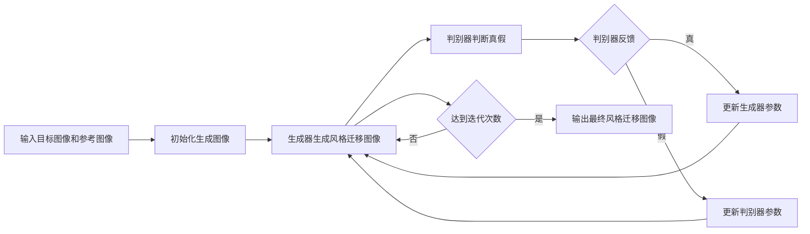

# 基于生成对抗网络的图像风格迁移在用户交互中的体验优化

## 1. 背景介绍
### 1.1 图像风格迁移概述
#### 1.1.1 图像风格迁移的定义
图像风格迁移是一种将参考图像的风格应用到目标图像的技术，使得生成的图像具有参考图像的风格特征，同时保留目标图像的内容信息。这种技术结合了计算机视觉和深度学习，可以创造出独特而有趣的艺术效果。

#### 1.1.2 图像风格迁移的发展历程
早期的图像风格迁移方法主要基于纹理合成和颜色迁移等技术。随着深度学习的兴起，基于卷积神经网络（CNN）的方法逐渐成为主流。2015年，Gatys等人提出了一种基于CNN的神经风格迁移算法，开启了深度学习在图像风格迁移领域的新篇章。此后，各种改进和优化的方法不断涌现，推动了图像风格迁移技术的发展。

### 1.2 生成对抗网络（GAN）简介
#### 1.2.1 GAN的基本原理
生成对抗网络（Generative Adversarial Networks，GAN）是一种无监督学习的深度学习模型，由生成器（Generator）和判别器（Discriminator）两部分组成。生成器的目标是生成尽可能逼真的样本，而判别器的目标是判断输入样本是真实数据还是生成器生成的假样本。通过生成器和判别器的对抗学习，GAN可以生成高质量、逼真的图像。

#### 1.2.2 GAN在图像生成领域的应用
GAN在图像生成领域取得了显著成果，可以生成高分辨率、细节丰富的图像。除了生成逼真的人脸、动物、风景等图像外，GAN还被应用于图像修复、超分辨率重建、图像翻译等任务。GAN强大的图像生成能力为图像风格迁移提供了新的思路和方法。

### 1.3 用户交互体验优化的重要性
#### 1.3.1 用户交互体验的定义
用户交互体验是指用户在与产品或服务交互过程中的主观感受和体验。良好的用户交互体验可以提高用户满意度，增强用户粘性，促进产品的推广和使用。

#### 1.3.2 用户交互体验优化的意义
在图像风格迁移应用中，优化用户交互体验可以让用户更便捷、高效地创作出满意的艺术作品。通过改进交互方式、提高生成速度、增强结果多样性等方面，可以为用户提供更加友好、流畅、有趣的使用体验，提升用户参与度和创作热情。

## 2. 核心概念与联系
### 2.1 图像风格迁移的关键概念
#### 2.1.1 内容损失
内容损失衡量生成图像与目标图像在内容上的相似程度。通过最小化内容损失，可以确保生成图像保留目标图像的主要内容信息。

#### 2.1.2 风格损失
风格损失衡量生成图像与参考图像在风格上的相似程度。通过最小化风格损失，可以使生成图像呈现出与参考图像相似的风格特征，如纹理、色彩等。

#### 2.1.3 全变分正则化
全变分正则化是一种平滑约束，用于抑制生成图像中的噪声和伪影，使生成图像更加平滑自然。

### 2.2 GAN在图像风格迁移中的作用
#### 2.2.1 生成器的作用
在基于GAN的图像风格迁移中，生成器的目标是生成具有目标图像内容和参考图像风格的图像。通过生成器的学习和优化，可以实现高质量、逼真的风格迁移效果。

#### 2.2.2 判别器的作用
判别器的作用是判断输入图像是真实的风格迁移图像还是生成器生成的假图像。通过判别器的反馈，生成器可以不断调整和改进，生成更加逼真、风格迁移效果更好的图像。

### 2.3 用户交互体验优化与图像风格迁移的关系
#### 2.3.1 交互方式的改进
优化图像风格迁移应用的用户交互方式，如提供直观的参数调节界面、支持实时预览等，可以让用户更便捷、灵活地控制风格迁移效果，提升用户体验。

#### 2.3.2 生成速度的提高
提高图像风格迁移的生成速度，可以减少用户等待时间，让用户更快速地看到风格迁移结果，增强用户的使用体验和满意度。

#### 2.3.3 结果多样性的增强
增强图像风格迁移结果的多样性，如支持多种风格选择、随机化生成等，可以为用户提供更丰富、有趣的创作可能，激发用户的创造力和参与热情。

## 3. 核心算法原理具体操作步骤
### 3.1 基于GAN的图像风格迁移算法流程


### 3.2 算法关键步骤详解
#### 3.2.1 输入目标图像和参考图像
选择需要进行风格迁移的目标图像和提供风格参考的参考图像，将其输入到算法中。

#### 3.2.2 初始化生成图像
随机初始化一个与目标图像大小相同的噪声图像，作为生成器的初始输入。

#### 3.2.3 生成器生成风格迁移图像
生成器接收初始化的生成图像，通过卷积神经网络对其进行处理，生成具有目标图像内容和参考图像风格的风格迁移图像。

#### 3.2.4 判别器判断真假
判别器接收生成器生成的风格迁移图像和真实的风格迁移图像，通过卷积神经网络对其进行判断，输出真假概率。

#### 3.2.5 判别器反馈和参数更新
根据判别器的反馈，更新生成器和判别器的参数。如果判别器认为生成图像是真实的，则更新生成器参数，使其生成更逼真的风格迁移图像；如果判别器认为生成图像是假的，则更新判别器参数，提高其判别能力。

#### 3.2.6 迭代优化
重复步骤3.2.3到3.2.5，进行多轮迭代优化，直到达到预设的迭代次数或满足一定的收敛条件。

#### 3.2.7 输出最终风格迁移图像
当迭代优化完成后，输出生成器生成的最终风格迁移图像，即为目标图像内容与参考图像风格相结合的艺术创作结果。

## 4. 数学模型和公式详细讲解举例说明
### 4.1 内容损失函数
内容损失函数用于衡量生成图像与目标图像在内容上的相似程度。假设 $F_l(x)$ 表示目标图像 $x$ 在第 $l$ 层卷积神经网络的特征图，$F_l(y)$ 表示生成图像 $y$ 在第 $l$ 层的特征图，则内容损失函数可以定义为：

$$L_{content}(y, x) = \frac{1}{2}\sum_{i,j}(F_l(y) - F_l(x))^2$$

其中，$i, j$ 表示特征图的空间位置索引。内容损失函数通过最小化生成图像与目标图像在特定卷积层的特征图差异，来确保生成图像保留目标图像的主要内容信息。

### 4.2 风格损失函数
风格损失函数用于衡量生成图像与参考图像在风格上的相似程度。假设 $G_l(x)$ 表示参考图像 $x$ 在第 $l$ 层卷积神经网络的特征图的Gram矩阵，$G_l(y)$ 表示生成图像 $y$ 在第 $l$ 层的特征图的Gram矩阵，则风格损失函数可以定义为：

$$L_{style}(y, x) = \sum_{l=0}^L w_l \frac{1}{4N_l^2M_l^2}\sum_{i,j}(G_l(y) - G_l(x))^2$$

其中，$L$ 表示卷积神经网络的层数，$w_l$ 表示第 $l$ 层的权重，$N_l$ 表示第 $l$ 层特征图的通道数，$M_l$ 表示第 $l$ 层特征图的空间尺寸。Gram矩阵通过计算特征图之间的内积，捕捉了图像的纹理和风格信息。风格损失函数通过最小化生成图像与参考图像在多个卷积层的Gram矩阵差异，来使生成图像呈现出与参考图像相似的风格特征。

### 4.3 全变分正则化
全变分正则化是一种平滑约束，用于抑制生成图像中的噪声和伪影。假设 $y$ 表示生成图像，则全变分正则化项可以定义为：

$$L_{tv}(y) = \sum_{i,j}((y_{i,j+1} - y_{i,j})^2 + (y_{i+1,j} - y_{i,j})^2)$$

其中，$i, j$ 表示图像的空间位置索引。全变分正则化通过最小化相邻像素之间的差异，使生成图像更加平滑自然，减少噪声和伪影的出现。

### 4.4 总损失函数
将内容损失、风格损失和全变分正则化项组合，得到总损失函数：

$$L_{total}(y, x) = \alpha L_{content}(y, x) + \beta L_{style}(y, x) + \gamma L_{tv}(y)$$

其中，$\alpha, \beta, \gamma$ 分别表示内容损失、风格损失和全变分正则化项的权重系数，用于平衡不同损失项的重要性。通过最小化总损失函数，可以生成既保留目标图像内容，又呈现参考图像风格，同时具有平滑自然特性的风格迁移图像。

## 5. 项目实践：代码实例和详细解释说明
下面是一个基于TensorFlow和Keras实现图像风格迁移的示例代码：

```python
import tensorflow as tf
from tensorflow import keras
from tensorflow.keras.applications import vgg19

# 加载预训练的VGG19模型
base_model = vgg19.VGG19(weights='imagenet', include_top=False)

# 定义内容损失函数
def content_loss(base_content, target):
    return tf.reduce_mean(tf.square(base_content - target))

# 定义风格损失函数
def gram_matrix(input_tensor):
    channels = int(input_tensor.shape[-1])
    a = tf.reshape(input_tensor, [-1, channels])
    n = tf.shape(a)[0]
    gram = tf.matmul(a, a, transpose_a=True)
    return gram / tf.cast(n, tf.float32)

def style_loss(base_style, gram_target):
    height, width, channels = base_style.get_shape().as_list()
    gram_style = gram_matrix(base_style)
    return tf.reduce_mean(tf.square(gram_style - gram_target))

# 定义全变分正则化项
def total_variation_loss(x):
    a = tf.square(x[:, :, 1:, :] - x[:, :, :-1, :])
    b = tf.square(x[:, 1:, :, :] - x[:, :-1, :, :])
    return tf.reduce_sum(tf.pow(a + b, 1.25))

# 定义总损失函数
def total_loss(content_image, style_image, generated_image, alpha, beta, gamma):
    content_features = base_model(content_image)
    style_features = base_model(style_image)
    generated_features = base_model(generated_image)
    
    content_loss_value = content_loss(content_features, generated_features)
    style_loss_value = style_loss(style_features, generated_features)
    tv_loss_value = total_variation_loss(generated_image)
    
    total_loss_value = alpha * content_loss_value + beta * style_loss_value + gamma * tv_loss_value
    return total_loss_value

# 定义风格迁移函数
def style_transfer(content_image, style_image, alpha=1e-2,