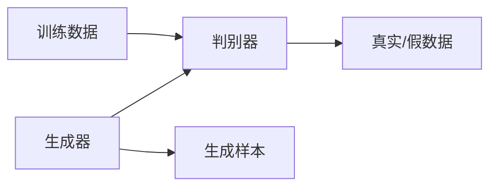
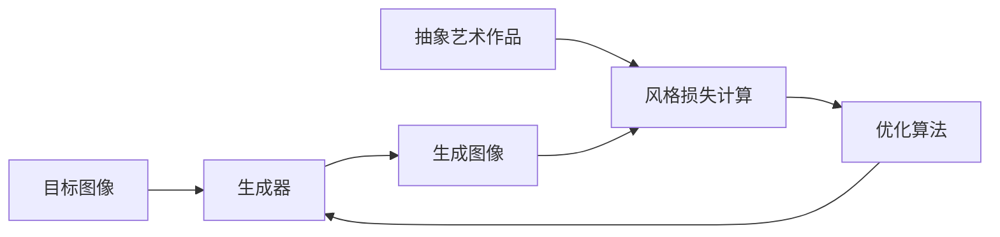

# 基于生成对抗网络的抽象艺术图像风格迁移机制

## 1. 背景介绍

### 1.1 艺术与科技的融合

在当代社会中,艺术与科技的融合已经成为一种趋势。人工智能(AI)技术的快速发展为艺术创作带来了新的可能性,使得艺术家能够利用算法和数据来创造出前所未有的艺术作品。其中,生成对抗网络(Generative Adversarial Networks,GAN)作为一种强大的深度学习模型,已经被广泛应用于图像生成、风格迁移等领域,为艺术创作提供了新的工具和方法。

### 1.2 抽象艺术的重要性

抽象艺术是一种具有重要意义的艺术形式,它通过抽象化的视觉元素来表达艺术家的主观感受和内心世界。与具象艺术不同,抽象艺术更加强调形式、色彩和构图的力量,它能够激发观众的想象力和情感体验。然而,创作出优秀的抽象艺术作品需要艺术家具备丰富的经验和创造力,这对于普通人来说往往是一个挑战。

### 1.3 GAN在艺术领域的应用

GAN的出现为抽象艺术的创作提供了新的可能性。通过训练GAN模型,我们可以捕捉抽象艺术作品中的风格特征,并将这种风格应用于其他图像,从而实现风格迁移。这种技术不仅能够帮助艺术家更加高效地创作出具有独特风格的作品,也为普通人提供了一种探索和体验抽象艺术的新途径。

## 2. 核心概念与联系

### 2.1 生成对抗网络(GAN)

生成对抗网络(GAN)是一种由两个神经网络组成的深度学习模型,包括生成器(Generator)和判别器(Discriminator)。生成器的目标是生成逼真的数据样本(如图像),而判别器的目标是区分生成器生成的样本和真实数据样本。通过生成器和判别器之间的对抗训练过程,生成器不断优化以欺骗判别器,而判别器也在不断提高识别能力,最终使生成器能够生成逼真的数据样本。



### 2.2 风格迁移

风格迁移(Style Transfer)是一种将一种艺术风格应用于另一种内容的技术。在图像处理领域,风格迁移通常指将一种艺术风格(如油画、素描等)应用于另一幅图像,从而创造出具有该风格特征的新图像。传统的风格迁移方法通常依赖于手工特征提取和参数调整,而基于深度学习的风格迁移方法能够自动学习风格特征,并实现更加精准和灵活的风格迁移。

### 2.3 GAN与风格迁移的结合

将GAN与风格迁移技术相结合,我们可以实现基于生成对抗网络的抽象艺术图像风格迁移。具体来说,我们可以使用一组抽象艺术作品作为训练数据,训练一个GAN模型来捕捉这些作品的风格特征。然后,我们可以利用训练好的生成器将这种抽象艺术风格应用于其他图像,从而生成具有相似风格的新图像。这种方法不仅能够帮助艺术家更加高效地创作出具有独特风格的作品,也为普通人提供了一种探索和体验抽象艺术的新途径。

## 3. 核心算法原理具体操作步骤

实现基于生成对抗网络的抽象艺术图像风格迁移机制需要以下几个关键步骤:

### 3.1 数据准备

首先,我们需要准备一组高质量的抽象艺术作品图像作为训练数据。这些图像应该具有相似的风格特征,如色彩、笔触、构图等。同时,我们也需要准备一些用于风格迁移的目标图像。

### 3.2 构建GAN模型

我们需要构建一个生成对抗网络模型,包括生成器和判别器两个部分。生成器的输入通常是一个随机噪声向量,输出是一幅图像。判别器的输入是真实图像或生成器生成的图像,输出是一个标量值,表示输入图像是真实的还是生成的。

生成器和判别器的具体网络结构可以根据实际需求进行设计和调整。常见的网络结构包括卷积神经网络(CNN)、残差网络(ResNet)等。

### 3.3 训练GAN模型

将准备好的抽象艺术作品图像作为训练数据,对生成对抗网络进行训练。训练过程中,生成器和判别器会不断进行对抗,生成器试图生成更加逼真的图像来欺骗判别器,而判别器则试图更好地区分真实图像和生成图像。

训练过程可以使用各种优化算法和损失函数,如Adam优化器、最小二乘损失函数等。同时,也可以引入一些正则化技术,如dropout、批归一化等,以提高模型的泛化能力。

### 3.4 风格迁移

当GAN模型训练完成后,我们可以利用训练好的生成器来实现风格迁移。具体操作步骤如下:

1. 将目标图像输入到生成器中,生成器会根据目标图像的内容生成一幅新的图像。
2. 将生成器输出的图像与训练数据中的抽象艺术作品图像进行对比,计算它们之间的风格损失。
3. 通过优化算法(如梯度下降)调整生成器的输入噪声向量,使生成的图像与训练数据中的抽象艺术作品图像具有更加相似的风格特征,从而最小化风格损失。
4. 重复步骤2和3,直到风格损失达到最小,得到具有期望风格的目标图像。

在这个过程中,我们可以调整风格损失的权重,控制风格迁移的程度。同时,也可以引入其他损失函数,如内容损失,以保留目标图像的原始内容。



## 4. 数学模型和公式详细讲解举例说明

在基于生成对抗网络的抽象艺术图像风格迁移机制中,我们需要定义一些数学模型和公式来量化风格特征和风格损失。

### 4.1 风格表示

我们可以使用深度卷积神经网络(CNN)来提取图像的风格特征。具体来说,我们可以将图像输入到预训练的CNN中,并从网络的某一层获取特征映射(feature maps)。这些特征映射可以反映图像的风格特征,如颜色、纹理、笔触等。

设$F^l_{ij}$表示第$l$层的第$i$个特征映射在空间位置$(j,j)$处的值,则该层的格拉姆矩阵(Gram Matrix)$G^l$可以定义为:

$$G^l_{ij} = \sum_k F^l_{ik}F^l_{jk}$$

其中$i,j$表示特征映射的索引,而$k$表示空间位置的索引。格拉姆矩阵可以捕捉特征映射之间的相关性,从而反映图像的风格特征。

### 4.2 风格损失

为了量化生成图像与目标风格之间的差异,我们可以定义风格损失(Style Loss)。风格损失是生成图像的格拉姆矩阵与目标风格图像的格拉姆矩阵之间的加权平均差异:

$$L_{style}(a,x) = \sum_{l=1}^L \frac{1}{N_l^2M_l^2} \sum_{i,j} (G^l_{ij}(a) - G^l_{ij}(x))^2$$

其中$a$表示生成图像,$x$表示目标风格图像,$L$表示选择的CNN层数,$N_l$和$M_l$分别表示第$l$层的特征映射的高度和宽度。

通过最小化风格损失,我们可以使生成图像的风格特征逐渐接近目标风格图像。

### 4.3 内容损失(可选)

为了在风格迁移过程中保留目标图像的原始内容,我们可以引入内容损失(Content Loss)。内容损失是生成图像与目标内容图像在某一CNN层的特征映射之间的差异:

$$L_{content}(a,x) = \frac{1}{N_lM_l} \sum_{i,j} (F^l_{ij}(a) - F^l_{ij}(x))^2$$

其中$a$表示生成图像,$x$表示目标内容图像,$F^l$表示第$l$层的特征映射,$N_l$和$M_l$分别表示该层的特征映射的高度和宽度。

通过最小化内容损失,我们可以使生成图像保留目标内容图像的主要内容特征。

### 4.4 总体损失函数

最终,我们可以将风格损失和内容损失(如果需要)组合成总体损失函数:

$$L_{total}(a,x,s) = \alpha L_{content}(a,x) + \beta L_{style}(a,s)$$

其中$\alpha$和$\beta$分别是内容损失和风格损失的权重系数,用于控制两种损失在总体损失函数中的相对重要性。$x$表示目标内容图像,$s$表示目标风格图像。

通过优化总体损失函数,我们可以生成既保留了目标内容特征,又具有目标风格特征的图像。

## 5. 项目实践:代码实例和详细解释说明

在这一部分,我们将提供一个基于PyTorch实现的基于生成对抗网络的抽象艺术图像风格迁移项目实例,并对关键代码进行详细解释。

### 5.1 导入必要的库

```python
import torch
import torch.nn as nn
import torchvision
import torchvision.transforms as transforms
import matplotlib.pyplot as plt
import numpy as np
from PIL import Image
```

### 5.2 定义生成器和判别器网络

```python
# 生成器网络
class Generator(nn.Module):
    def __init__(self, input_dim, output_dim):
        super(Generator, self).__init__()
        self.main = nn.Sequential(
            nn.ConvTranspose2d(input_dim, 512, 4, 1, 0, bias=False),
            nn.BatchNorm2d(512),
            nn.ReLU(True),
            # ... (更多卷积层)
            nn.ConvTranspose2d(64, output_dim, 4, 2, 1, bias=False),
            nn.Tanh()
        )

    def forward(self, input):
        return self.main(input)

# 判别器网络
class Discriminator(nn.Module):
    def __init__(self, input_dim):
        super(Discriminator, self).__init__()
        self.main = nn.Sequential(
            nn.Conv2d(input_dim, 64, 4, 2, 1, bias=False),
            nn.LeakyReLU(0.2, inplace=True),
            # ... (更多卷积层)
            nn.Conv2d(512, 1, 4, 1, 0, bias=False),
            nn.Sigmoid()
        )

    def forward(self, input):
        return self.main(input)
```

在这个示例中,我们定义了一个基于卷积神经网络的生成器和判别器网络。生成器网络使用转置卷积层(ConvTranspose2d)来生成图像,而判别器网络使用普通卷积层(Conv2d)来判断输入图像是真实的还是生成的。

### 5.3 训练GAN模型

```python
# 初始化生成器和判别器
generator = Generator(100, 3)
discriminator = Discriminator(3)

# 定义损失函数和优化器
criterion = nn.BCELoss()
g_optimizer = torch.optim.Adam(generator.parameters(), lr=0.0002, betas=(0.5, 0.999))
d_optimizer = torch.optim.Adam(discriminator.parameters(), lr=0.0002, betas=(0.5, 0.999))

# 训练循环
for epoch in range(num_epochs):
    for i, (real_images, _) in enumerate(dataloader):
        # 训练判别器
        d_optimizer.zero_grad()
        real_output = discriminator(real_images)
        real_loss = criterion(real_output, torch.ones_like(real_output))
        noise = torch.randn(batch_size, 100, 1, 1