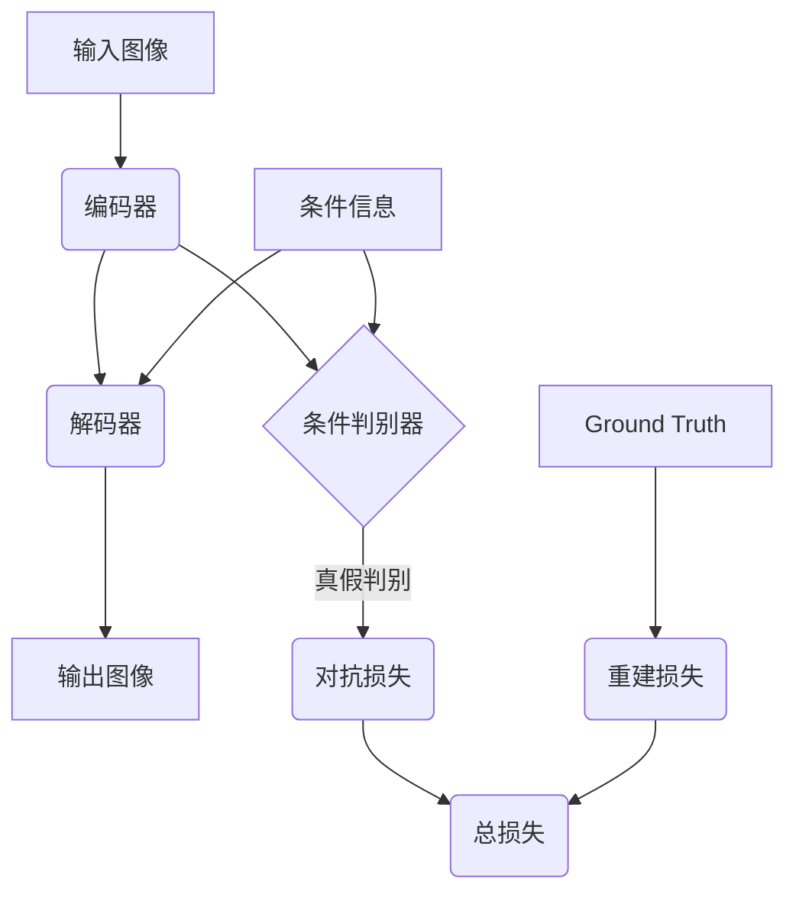

# 基于生成对抗网络的自动图像上色与风格迁移一体化模型

## 1. 背景介绍

### 1.1 图像上色与风格迁移的重要性

在数字图像处理领域,图像上色和风格迁移是两个非常重要的任务。图像上色指的是将灰度或线稿图像自动上色,赋予其真实的色彩。而风格迁移则是将一种风格迁移到另一种图像上,使图像获得新的视觉风格。这两个任务在多个领域都有广泛的应用,例如:

- 影视制作:可将动画线稿或老照片自动上色,节省大量人工上色成本。
- 文物修复:对于古籍文物等灰度图像,可以赋予合理的色彩,重现当年的风采。
- 个性化设计:将个人喜好的风格迁移到普通图像,获得个性化设计作品。

传统的图像上色和风格迁移方法主要依赖于手工设计的规则和大量的人工标注数据,存在效率低下、泛化性差等缺陷。而近年来,生成对抗网络(GAN)的出现为这两个任务提供了新的解决思路。

### 1.2 生成对抗网络概述

生成对抗网络是一种由生成网络和判别网络组成的无监督学习框架。生成网络的目标是从随机噪声中生成逼真的样本数据,而判别网络则判断生成的样本是真是假。两个网络相互对抗,最终达到一种动态平衡,使生成网络能够生成高质量的样本。GAN自问世以来在图像、语音、视频等多个领域展现出了强大的生成能力。

## 2. 核心概念与联系  

### 2.1 条件生成对抗网络

普通的生成对抗网络只能无条件地生成样本,无法控制生成的内容。为了解决这个问题,研究人员提出了条件生成对抗网络(Conditional GAN)的概念。条件GAN在生成网络和判别网络中增加了条件信息,使得生成的样本不仅要逼真,还要满足给定的条件约束。

对于图像上色任务,条件信息可以是灰度图像;对于风格迁移任务,条件信息可以是内容图像和风格图像。通过条件GAN,我们可以实现自动图像上色和风格迁移。

### 2.2 图像到图像的转换

图像上色和风格迁移实际上都属于图像到图像的转换(Image-to-Image Translation)任务。给定一个输入图像,我们需要将其转换为满足特定条件的输出图像。这种任务通常使用条件GAN或其变种网络来实现。

著名的Pix2Pix模型就是一种将输入图像映射到输出图像的条件GAN框架。它使用编码器-解码器结构,并在生成网络和判别网络中引入条件信息,实现了多种图像到图像的转换任务,如将线稿图像转换为彩色图像、将航拍图像转换为街景图像等。

### 2.3 多任务学习

单一的网络模型通常只能完成单一任务。但在实际应用中,我们往往希望模型能够同时完成多个相关的任务,提高模型的泛化能力和效率。多任务学习(Multi-Task Learning)正是解决这个问题的有效方法。

多任务学习通过在单一模型中共享部分网络层,使模型能够同时学习多个任务的特征表示,从而提高了各个任务的性能。同时,多任务学习还有助于缓解过拟合问题,提高模型的泛化能力。

## 3. 核心算法原理具体操作步骤

### 3.1 网络架构

本文提出的一体化模型基于条件GAN框架,采用编码器-解码器结构。网络架构如下图所示:

该网络由以下几个主要组件构成:

1. **编码器(Encoder)**: 将输入图像编码为特征向量。
2. **解码器(Decoder)**: 将编码器输出的特征向量和条件信息解码为输出图像。
3. **条件判别器(Conditional Discriminator)**: 判断输出图像是真实的还是生成的,并考虑条件信息。
4. **对抗损失(Adversarial Loss)**: 基于判别器的输出计算生成网络和判别网络之间的对抗损失。
5. **重建损失(Reconstruction Loss)**: 将输出图像与 Ground Truth 图像进行比较,计算像素级的重建损失。

### 3.2 损失函数

该模型的总损失函数由对抗损失和重建损失两部分组成:

$$\mathcal{L}_{total} = \mathcal{L}_{adv} + \lambda \mathcal{L}_{rec}$$

其中:

- $\mathcal{L}_{adv}$ 是对抗损失,用于驱动生成网络生成逼真的图像。
- $\mathcal{L}_{rec}$ 是重建损失,用于约束输出图像与 Ground Truth 之间的差异。
- $\lambda$ 是一个超参数,用于平衡两个损失项的权重。

对抗损失 $\mathcal{L}_{adv}$ 采用标准的 GAN 损失函数:

$$\mathcal{L}_{adv} = \mathbb{E}_{x,y}[\log D(x,y)] + \mathbb{E}_{x,z}[\log(1-D(x,G(x,z)))]$$

其中 $x$ 是输入图像, $y$ 是 Ground Truth 输出图像, $z$ 是条件信息, $D$ 是判别器, $G$ 是生成网络。

重建损失 $\mathcal{L}_{rec}$ 可以使用不同的距离度量,如 L1 距离或者感知损失(Perceptual Loss)。在本文中,我们采用 L1 距离:

$$\mathcal{L}_{rec} = \|y - G(x,z)\|_1$$

### 3.3 训练过程

模型的训练过程包括以下几个步骤:

1. **初始化**: 初始化生成网络 $G$ 和判别网络 $D$ 的参数。

2. **采样数据**: 从训练集中采样一批输入图像 $x$、Ground Truth 输出图像 $y$ 和条件信息 $z$。

3. **前向传播**:
   - 将输入图像 $x$ 和条件信息 $z$ 输入生成网络 $G$,得到生成的输出图像 $G(x,z)$。
   - 将真实的输出图像 $y$ 和条件信息 $z$ 输入判别器 $D$,得到真实图像的判别结果 $D(x,y)$。
   - 将生成的输出图像 $G(x,z)$ 和条件信息 $z$ 输入判别器 $D$,得到生成图像的判别结果 $D(x,G(x,z))$。

4. **计算损失**:
   - 根据公式计算对抗损失 $\mathcal{L}_{adv}$。
   - 根据公式计算重建损失 $\mathcal{L}_{rec}$。
   - 计算总损失 $\mathcal{L}_{total} = \mathcal{L}_{adv} + \lambda \mathcal{L}_{rec}$。

5. **反向传播**:
   - 更新判别器 $D$ 的参数,最小化 $-\mathcal{L}_{adv}$。
   - 更新生成网络 $G$ 的参数,最小化 $\mathcal{L}_{total}$。

6. **重复训练**: 重复步骤 2-5,直到模型收敛或达到最大迭代次数。

在训练过程中,生成网络 $G$ 和判别网络 $D$ 相互对抗,最终达到一种动态平衡,使生成网络能够生成高质量的输出图像。

## 4. 数学模型和公式详细讲解举例说明

在上一节中,我们介绍了该模型的核心算法原理和损失函数。现在,我们将更详细地解释其中的数学模型和公式,并给出具体的例子说明。

### 4.1 对抗损失

对抗损失 $\mathcal{L}_{adv}$ 是 GAN 框架中的标准损失函数,它由两部分组成:

$$\mathcal{L}_{adv} = \mathbb{E}_{x,y}[\log D(x,y)] + \mathbb{E}_{x,z}[\log(1-D(x,G(x,z)))]$$

第一项 $\mathbb{E}_{x,y}[\log D(x,y)]$ 是判别器对真实数据的损失。我们希望判别器能够正确识别真实的输出图像 $y$,因此需要最大化这一项。

第二项 $\mathbb{E}_{x,z}[\log(1-D(x,G(x,z)))]$ 是判别器对生成数据的损失。我们希望判别器能够正确识别生成网络生成的输出图像 $G(x,z)$ 是假的,因此需要最小化这一项。

通过最小化判别器的总损失 $-\mathcal{L}_{adv}$,我们可以使判别器在区分真实数据和生成数据方面表现得越来越好。

同时,生成网络的目标是欺骗判别器,使其无法区分真实数据和生成数据。因此,生成网络需要最大化 $\mathbb{E}_{x,z}[\log(D(x,G(x,z)))]$,也就是最小化 $-\mathbb{E}_{x,z}[\log(D(x,G(x,z)))]$。

通过这种对抗训练过程,生成网络和判别网络相互驱动,最终达到一种动态平衡,使生成网络能够生成高质量的输出图像。

**例子**:

假设我们有一个输入图像 $x$,条件信息 $z$ 是灰度图像,目标是生成对应的彩色图像 $y$。在训练过程中,我们将 $x$ 和 $z$ 输入生成网络 $G$,得到生成的彩色图像 $G(x,z)$。同时,我们将真实的彩色图像 $y$ 和条件信息 $z$ 输入判别器 $D$,得到真实图像的判别结果 $D(x,y)$。我们还将生成的彩色图像 $G(x,z)$ 和条件信息 $z$ 输入判别器 $D$,得到生成图像的判别结果 $D(x,G(x,z))$。

根据上面的公式,我们可以计算对抗损失 $\mathcal{L}_{adv}$。判别器的目标是最小化 $-\mathcal{L}_{adv}$,也就是最大化真实图像的判别概率 $D(x,y)$,同时最小化生成图像的判别概率 $D(x,G(x,z))$。而生成网络的目标是最小化 $-\mathbb{E}_{x,z}[\log(D(x,G(x,z)))]$,也就是最大化生成图像被判别为真实的概率。

通过这种对抗训练,判别器学会了区分真实图像和生成图像,而生成网络则学会了生成逼真的彩色图像。

### 4.2 重建损失

重建损失 $\mathcal{L}_{rec}$ 用于约束生成网络的输出图像 $G(x,z)$ 与 Ground Truth 输出图像 $y$ 之间的差异。在本文中,我们采用 L1 距离作为重建损失:

$$\mathcal{L}_{rec} = \|y - G(x,z)\|_1$$

L1 距离也被称为最小绝对偏差(Mean Absolute Deviation, MAD),它计算了两个向量之间的元素绝对差值的平均值。对于图像数据,L1 距离可以直观地反映像素值的差异。

**例子**:

假设我们有一个输入图像 $x$,条件信息 $z$ 是灰度图像,目标是生成对应的彩色图像 $y$。生成网络 $G$ 根据 $x$ 和 $z$ 生成了一个彩色图像 $G(x,z)$。我们将 $G(x,z)$ 与 Ground Truth 彩色图像 $y$ 进行比较,计算它们之间的 L1 距离:

$$\mathcal{L}_{rec} = \|y - G(x,z)\|_1 = \frac{1}{W \times H \times C} \sum_{i=1}^{