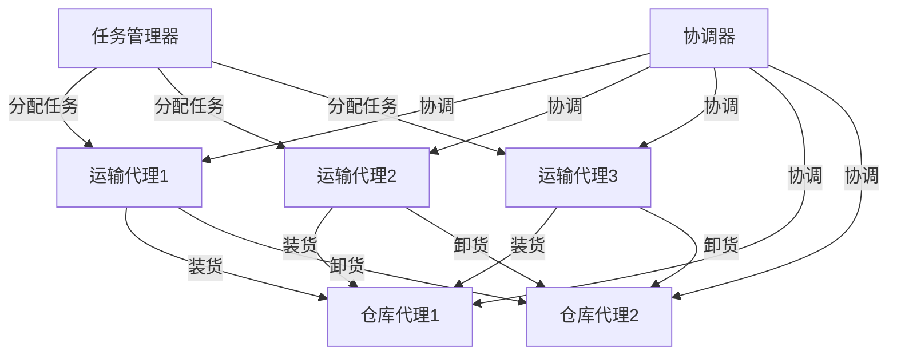

# 多代理系统中的工作流协调与效能优化

## 1. 背景介绍

### 1.1 多代理系统的兴起

在当今快节奏的商业环境中,组织越来越多地采用分布式系统来提高效率和灵活性。这些系统通常由多个自治代理组成,它们协同工作以完成复杂的任务。多代理系统为解决复杂问题提供了一种有前景的方法,但同时也带来了协调和优化的挑战。

### 1.2 工作流协调的重要性

在多代理系统中,工作流协调对于确保系统的高效运行至关重要。代理需要协调它们的行为,以避免冲突、重复工作和资源浪费。有效的工作流协调可以提高整体系统的性能、可靠性和可扩展性。

### 1.3 效能优化的需求

除了协调外,还需要优化多代理系统的整体效能。这包括提高吞吐量、降低延迟、减少资源消耗等方面。效能优化有助于提高系统的响应能力,满足不断增长的业务需求。

## 2. 核心概念与联系

### 2.1 工作流

工作流是一系列有序的活动,旨在实现特定的业务目标。在多代理系统中,工作流由多个代理协作完成。每个代理负责执行特定的任务,并与其他代理协调以确保工作流的顺利进行。

### 2.2 协调机制

协调机制是指用于管理和协调代理之间交互的策略和算法。常见的协调机制包括契约网协议、拍卖机制、组织结构等。选择合适的协调机制对于实现高效的工作流协调至关重要。

### 2.3 效能指标

效能指标用于衡量多代理系统的性能表现。常见的效能指标包括:

- 吞吐量:系统在单位时间内能够处理的任务数量。
- 延迟:从任务提交到完成所需的时间。
- 资源利用率:系统资源(如CPU、内存等)的利用效率。
- 可扩展性:系统在负载增加时的性能表现。

优化这些指标有助于提高系统的整体效能。

## 3. 核心算法原理具体操作步骤

### 3.1 工作流建模

为了有效协调工作流,首先需要对工作流进行建模。常用的建模方法包括:

1. **Petri网**:使用位置(Place)、转移(Transition)和弧(Arc)来描述工作流的控制流和数据流。
2. **有限状态机**:将工作流表示为一系列状态和状态转移。
3. **BPMN(业务流程建模与标记语言)**:使用标准化的图形符号来描述工作流。

建模的目标是捕获工作流的逻辑结构、控制流程和数据依赖关系。

### 3.2 协调算法

根据工作流模型,可以设计协调算法来管理代理之间的交互。常见的协调算法包括:

1. **契约网协议(Contract Net Protocol, CNP)**:代理通过竞标和投标的方式分配任务。
2. **拍卖机制(Auction Mechanisms)**:代理通过拍卖的方式分配资源和任务。
3. **组织结构(Organizational Structures)**:代理根据预定义的层次结构和角色进行协调。

这些算法旨在实现高效的任务分配、资源共享和冲突解决。

### 3.3 效能优化策略

为了提高多代理系统的效能,可以采用以下策略:

1. **负载均衡**:合理分配任务和资源,避免代理过载或资源浪费。
2. **并行执行**:在可能的情况下,并行执行独立的任务,提高吞吐量。
3. **资源管理**:有效管理和调度系统资源,提高资源利用率。
4. **动态调度**:根据系统状态动态调整任务分配和资源分配策略。
5. **容错机制**:通过冗余和备份机制提高系统的可靠性和容错能力。

这些策略可以单独或组合使用,以满足特定系统的需求。

## 4. 数学模型和公式详细讲解举例说明

### 4.1 契约网协议建模

契约网协议(CNP)是一种常用的协调算法,可以用数学模型进行描述和分析。假设有一个任务 $t$,需要由 $n$ 个代理 $\{a_1, a_2, \ldots, a_n\}$ 中的一个代理来执行。

令 $c_i$ 表示代理 $a_i$ 执行任务 $t$ 的成本,则代理 $a_i$ 的效用函数可以表示为:

$$u_i(t) = v_i(t) - c_i$$

其中 $v_i(t)$ 表示代理 $a_i$ 完成任务 $t$ 的价值。

根据CNP,代理管理器首先向所有代理发送任务通知,每个代理根据自身的效用函数决定是否投标。假设 $m$ 个代理投标,它们的投标价格分别为 $b_1, b_2, \ldots, b_m$。代理管理器将任务分配给出价最低的代理,即:

$$\text{winner} = \arg\min_{1 \leq i \leq m} b_i$$

通过建模和分析,我们可以优化CNP的参数,如投标截止时间、重新投标策略等,以提高协调效率和系统效能。

### 4.2 拍卖机制建模

拍卖机制是另一种常用的协调算法,可以用于任务分配和资源分配。假设有 $n$ 个代理 $\{a_1, a_2, \ldots, a_n\}$,需要分配 $m$ 个任务 $\{t_1, t_2, \ldots, t_m\}$。

令 $v_{ij}$ 表示代理 $a_i$ 对任务 $t_j$ 的估值,则代理 $a_i$ 的效用函数可以表示为:

$$u_i(T) = \sum_{j \in T} v_{ij} - c_i(T)$$

其中 $T$ 是代理 $a_i$ 获得的任务集合,而 $c_i(T)$ 是代理 $a_i$ 执行这些任务的成本。

在拍卖过程中,每个代理都会为感兴趣的任务出价。假设代理 $a_i$ 对任务 $t_j$ 的出价为 $b_{ij}$,则拍卖机制的目标是最大化社会福利,即:

$$\max \sum_{i=1}^n \sum_{j=1}^m b_{ij} x_{ij}$$

其中 $x_{ij}$ 是一个二值变量,表示任务 $t_j$ 是否分配给代理 $a_i$。这个优化问题需要满足一些约束条件,如每个任务只能分配给一个代理,每个代理的资源限制等。

通过建模和优化,我们可以设计高效的拍卖机制,实现任务和资源的最优分配。

## 5. 项目实践:代码实例和详细解释说明

为了更好地理解多代理系统中的工作流协调和效能优化,我们将通过一个实际项目来进行实践。这个项目模拟了一个智能物流系统,其中包含多个代理协同工作以完成货物运输任务。

### 5.1 系统架构

智能物流系统由以下几个主要组件组成:

1. **任务管理器(Task Manager)**:负责接收货物运输任务,并将任务分配给合适的运输代理。
2. **运输代理(Transport Agent)**:代表实际的运输工具(如卡车、无人机等),负责执行运输任务。
3. **仓库代理(Warehouse Agent)**:代表货物的起点和终点,负责货物的装卸和存储。
4. **协调器(Coordinator)**:负责协调运输代理和仓库代理之间的交互,以确保工作流的顺利进行。

下面是系统架构的 Mermaid 流程图:



### 5.2 协调算法实现

在这个项目中,我们采用了契约网协议(CNP)作为协调算法。当有新的运输任务到达时,任务管理器会向所有运输代理发送任务通知。每个运输代理会根据自身的状态(如位置、可用容量等)计算执行该任务的成本,并决定是否投标。任务管理器会将任务分配给出价最低的运输代理。

下面是 Python 中实现 CNP 的代码示例:

```python
import random

class TransportAgent:
    def __init__(self, name, location, capacity):
        self.name = name
        self.location = location
        self.capacity = capacity

    def bid(self, task):
        # 计算执行任务的成本
        distance = abs(self.location - task.origin)
        cost = distance * random.uniform(0.5, 1.5)
        return cost

class TaskManager:
    def __init__(self, agents):
        self.agents = agents

    def assign_task(self, task):
        bids = [(agent, agent.bid(task)) for agent in self.agents]
        winner = min(bids, key=lambda x: x[1])
        print(f"Task {task} assigned to {winner[0].name} with bid {winner[1]}")

# 创建运输代理和任务管理器
agents = [
    TransportAgent("Agent1", 10, 50),
    TransportAgent("Agent2", 20, 30),
    TransportAgent("Agent3", 15, 40)
]
task_manager = TaskManager(agents)

# 分配任务
task1 = Task(5, 30)
task_manager.assign_task(task1)
```

在这个示例中,我们定义了 `TransportAgent` 类来表示运输代理,以及 `TaskManager` 类来管理任务分配。`TransportAgent` 的 `bid` 方法根据代理的位置和任务的起点计算出价。`TaskManager` 的 `assign_task` 方法收集所有代理的出价,并将任务分配给出价最低的代理。

### 5.3 效能优化实现

为了优化系统的效能,我们采用了以下几种策略:

1. **负载均衡**:任务管理器会考虑每个运输代理的当前负载,优先将任务分配给负载较低的代理。
2. **并行执行**:如果有多个独立的运输任务,系统会并行分配给不同的运输代理,提高吞吐量。
3. **动态调度**:协调器会根据实时的交通状况和代理状态,动态调整运输路线和任务分配策略。

下面是动态调度策略的 Python 实现示例:

```python
class Coordinator:
    def __init__(self, agents, warehouses):
        self.agents = agents
        self.warehouses = warehouses
        self.traffic_map = {}  # 存储实时交通状况

    def update_traffic(self, location, congestion_level):
        self.traffic_map[location] = congestion_level

    def route_agent(self, agent, task):
        # 根据实时交通状况计算最优路线
        best_route = self.find_best_route(agent.location, task.origin, task.destination)
        agent.follow_route(best_route)

    def find_best_route(self, start, origin, destination):
        # 使用算法(如 Dijkstra 算法)计算最优路线
        # ...
        return best_route

# 创建协调器
coordinator = Coordinator(agents, warehouses)

# 更新交通状况
coordinator.update_traffic(15, 0.8)  # 位置 15 的拥堵程度为 0.8

# 动态调度运输代理
task2 = Task(10, 40)
agent = agents[0]
coordinator.route_agent(agent, task2)
```

在这个示例中,我们定义了 `Coordinator` 类来管理协调器的功能。`update_traffic` 方法用于更新实时交通状况。`route_agent` 方法根据代理的位置、任务的起点和终点,以及实时交通状况,计算最优路线并指导运输代理执行任务。

通过实现这些优化策略,我们可以提高