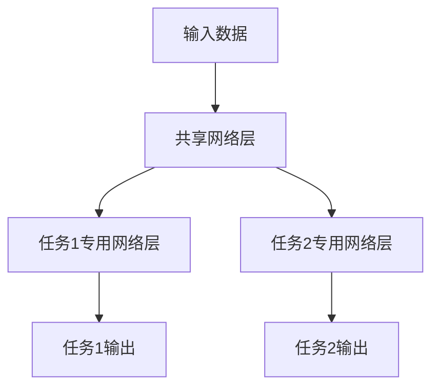

# 多任务学习 (Multi-Task Learning) 原理与代码实例讲解

## 1. 背景介绍

在传统的机器学习中,我们通常会为每个任务训练一个单独的模型。然而,在现实世界中,不同的任务往往存在着一些相关性和共享的知识。如果我们能够利用这些共享的知识,就可以提高模型的性能和泛化能力。多任务学习(Multi-Task Learning, MTL)就是为了解决这个问题而提出的一种机器学习范式。

多任务学习的核心思想是:通过在相关任务之间共享表示,使得模型能够从这些任务中学习到更加通用和鲁棒的特征表示,从而提高模型在每个单个任务上的性能。与训练多个单任务模型相比,多任务学习能够更有效地利用数据,减少过拟合的风险,并提高模型的泛化能力。

## 2. 核心概念与联系

### 2.1 任务相关性

多任务学习的基础是不同任务之间存在某种相关性或共享的知识。如果任务之间完全独立,那么多任务学习就无法发挥作用。任务之间的相关性可以体现在以下几个方面:

1. **输入数据相似性**: 不同任务的输入数据可能来自相同或相似的数据分布,因此它们可能共享一些低层次的特征表示。
2. **表示层相关性**: 不同任务可能需要学习一些相似的中间层表示,例如在计算机视觉任务中提取边缘、纹理等低层次特征。
3. **任务相关性**: 一些任务可能存在一定的语义相关性,例如图像分类和目标检测任务都需要理解图像中的物体概念。

### 2.2 共享表示学习

多任务学习的核心思想是通过在不同任务之间共享部分网络层或参数,使模型能够学习到更加通用和鲁棒的特征表示。共享表示学习可以分为以下几种方式:

1. **硬参数共享**: 不同任务共享完全相同的一些网络层或参数。这种方式共享程度最高,但也可能限制了模型在每个任务上的表现。
2. **软参数共享**: 不同任务的参数虽然不完全相同,但是受到某种正则化约束,使得它们保持一定的相似性。
3. **层级共享**: 不同任务在网络的不同层次上共享不同程度的参数,通常是在底层共享更多参数,在顶层各自独立。
4. **跨模态共享**: 不同模态任务(如图像、文本、语音等)之间也可以共享一些底层的表示。

### 2.3 损失函数设计

在多任务学习中,我们需要设计一个合适的损失函数来平衡不同任务之间的权重。常见的损失函数设计方式包括:

1. **加权求和**: 将不同任务的损失加权求和,权重可以是固定的或可学习的。
2. **梯度归一化**: 对不同任务的梯度进行归一化,使它们对模型参数的影响程度相近。
3. **不确定性加权**: 根据每个任务的不确定性动态调整其权重,不确定性高的任务获得更高的权重。

## 3. 核心算法原理具体操作步骤

多任务学习的核心算法原理可以概括为以下几个步骤:

### 3.1 构建共享表示网络

首先,我们需要构建一个能够学习共享表示的网络结构。常见的做法是将网络分为两部分:共享部分和任务专用部分。共享部分用于学习不同任务之间共同的特征表示,而任务专用部分则针对每个任务进行特定的处理。



### 3.2 定义任务损失函数

对于每个任务,我们需要定义一个合适的损失函数,用于衡量模型在该任务上的性能。常见的损失函数包括交叉熵损失(用于分类任务)、均方误差损失(用于回归任务)等。

### 3.3 构建多任务损失函数

接下来,我们需要将每个任务的损失函数组合成一个多任务损失函数。常见的做法是将不同任务的损失加权求和,权重可以是固定的或可学习的。

$$
\mathcal{L}_{total} = \sum_{i=1}^{N} \lambda_i \mathcal{L}_i
$$

其中 $\mathcal{L}_i$ 表示第 $i$ 个任务的损失函数, $\lambda_i$ 表示该任务的权重,  $N$ 表示总任务数量。

### 3.4 训练模型

使用多任务损失函数,我们可以同时在所有任务上训练模型。在每个训练批次中,我们可以采样不同任务的数据,计算相应的损失,并根据多任务损失函数进行参数更新。

### 3.5 模型评估和调整

在训练过程中,我们需要定期评估模型在每个任务上的性能,并根据需要调整任务权重或其他超参数。此外,我们还可以尝试不同的共享策略(如硬参数共享、软参数共享等),以找到最佳的共享方式。

## 4. 数学模型和公式详细讲解举例说明

在多任务学习中,我们通常会使用一些数学模型和公式来描述和优化模型。下面我们将详细讲解一些常见的数学模型和公式。

### 4.1 硬参数共享

硬参数共享是最简单的共享方式,不同任务完全共享一些网络层或参数。假设我们有 $N$ 个任务,每个任务的输入为 $\mathbf{x}_i$,输出为 $\mathbf{y}_i$,共享网络参数为 $\mathbf{W}$,任务专用参数为 $\mathbf{V}_i$,那么模型的输出可以表示为:

$$
\mathbf{y}_i = f_i(\mathbf{x}_i; \mathbf{W}, \mathbf{V}_i)
$$

其中 $f_i$ 表示第 $i$ 个任务的模型函数。在训练过程中,我们需要优化以下多任务损失函数:

$$
\mathcal{L}_{total} = \sum_{i=1}^{N} \lambda_i \mathcal{L}_i(\mathbf{y}_i, \mathbf{y}_i^{*})
$$

其中 $\mathbf{y}_i^{*}$ 表示第 $i$ 个任务的ground truth,  $\mathcal{L}_i$ 表示该任务的损失函数,  $\lambda_i$ 表示该任务的权重。

### 4.2 软参数共享

软参数共享允许不同任务的参数不完全相同,但是受到某种正则化约束,使得它们保持一定的相似性。一种常见的做法是在损失函数中加入一个正则化项,惩罚不同任务参数之间的差异。

假设我们有 $N$ 个任务,每个任务的参数为 $\mathbf{W}_i$,我们可以定义以下正则化项:

$$
\Omega(\mathbf{W}_1, \mathbf{W}_2, \dots, \mathbf{W}_N) = \sum_{i=1}^{N} \sum_{j=i+1}^{N} \left\lVert \mathbf{W}_i - \mathbf{W}_j \right\rVert_2^2
$$

该正则化项衡量了不同任务参数之间的欧几里得距离,并将其加入到多任务损失函数中:

$$
\mathcal{L}_{total} = \sum_{i=1}^{N} \lambda_i \mathcal{L}_i(\mathbf{y}_i, \mathbf{y}_i^{*}) + \gamma \Omega(\mathbf{W}_1, \mathbf{W}_2, \dots, \mathbf{W}_N)
$$

其中 $\gamma$ 是一个超参数,用于控制正则化项的权重。

### 4.3 梯度归一化

在多任务学习中,不同任务的梯度可能具有不同的尺度,这可能会导致某些任务对模型参数的更新占主导地位。为了解决这个问题,我们可以对不同任务的梯度进行归一化,使它们对模型参数的影响程度相近。

假设我们有 $N$ 个任务,每个任务的损失函数梯度为 $\nabla \mathcal{L}_i$,我们可以计算每个任务的梯度范数:

$$
g_i = \left\lVert \nabla \mathcal{L}_i \right\rVert_2
$$

然后,我们可以使用这些范数对梯度进行归一化:

$$
\tilde{\nabla} \mathcal{L}_i = \frac{\nabla \mathcal{L}_i}{g_i + \epsilon}
$$

其中 $\epsilon$ 是一个小常数,用于避免分母为零。最终,我们可以使用归一化后的梯度来更新模型参数。

### 4.4 不确定性加权

在某些情况下,不同任务的重要性可能是不同的,我们可以根据每个任务的不确定性动态调整其权重。一种常见的做法是使用任务不确定性对数值作为权重。

假设我们有 $N$ 个任务,每个任务的不确定性为 $\sigma_i$,我们可以定义以下加权多任务损失函数:

$$
\mathcal{L}_{total} = \sum_{i=1}^{N} \exp(-\sigma_i) \mathcal{L}_i(\mathbf{y}_i, \mathbf{y}_i^{*})
$$

其中 $\exp(-\sigma_i)$ 作为第 $i$ 个任务的权重。不确定性越高,权重越大,模型会更关注该任务。

不确定性可以通过多种方式估计,例如使用蒙特卡罗dropout或者贝叶斯神经网络等技术。

## 5. 项目实践: 代码实例和详细解释说明

为了更好地理解多任务学习的原理和实现,我们将通过一个具体的代码示例来演示如何在PyTorch中实现多任务学习。在这个示例中,我们将使用一个简单的神经网络来同时解决图像分类和回归任务。

### 5.1 导入所需的库

```python
import torch
import torch.nn as nn
import torch.optim as optim
from torchvision import datasets, transforms
```

### 5.2 定义数据集和数据加载器

在这个示例中,我们将使用MNIST数据集进行训练和测试。我们将使用PyTorch内置的`datasets`模块来加载数据集,并使用`transforms`模块对数据进行预处理。

```python
# 定义数据预处理
transform = transforms.Compose([
    transforms.ToTensor(),
    transforms.Normalize((0.1307,), (0.3081,))
])

# 加载训练集和测试集
train_dataset = datasets.MNIST(root='./data', train=True, download=True, transform=transform)
test_dataset = datasets.MNIST(root='./data', train=False, download=True, transform=transform)

# 创建数据加载器
batch_size = 64
train_loader = torch.utils.data.DataLoader(train_dataset, batch_size=batch_size, shuffle=True)
test_loader = torch.utils.data.DataLoader(test_dataset, batch_size=batch_size, shuffle=False)
```

### 5.3 定义多任务模型

我们将定义一个简单的神经网络模型,该模型将同时解决图像分类和回归任务。模型包含一个共享的特征提取器和两个任务专用的头部。

```python
class MultiTaskModel(nn.Module):
    def __init__(self):
        super(MultiTaskModel, self).__init__()
        
        # 共享特征提取器
        self.feature_extractor = nn.Sequential(
            nn.Conv2d(1, 32, kernel_size=3, padding=1),
            nn.ReLU(),
            nn.MaxPool2d(2, 2),
            nn.Conv2d(32, 64, kernel_size=3, padding=1),
            nn.ReLU(),
            nn.MaxPool2d(2, 2)
        )
        
        # 分类头部
        self.classifier = nn.Sequential(
            nn.Dropout(0.25),
            nn.Linear(64 * 7 * 7, 128),
            nn.ReLU(),
            nn.Dropout(0.5),
            nn.Linear(128, 10)
        )
        
        # 回归头部
        self.regressor = nn.Sequential(
            nn.Dropout(0.25),
            nn.Linear(64 * 7 * 7, 128),
            nn.ReLU(),
            nn.Dropout(0.5),
            nn.Linear(128, 1)
        )
        
    def forward(self, x):