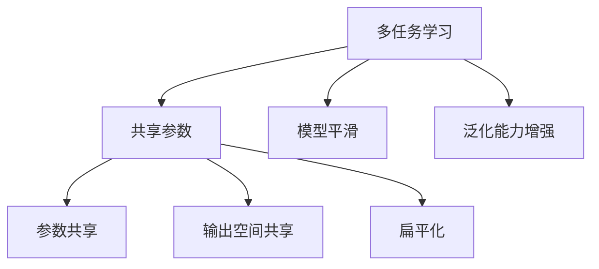

                 

作者：禅与计算机程序设计艺术

在这个快速变化的技术时代，多任务学习（MTL）已经成为一个重要的研究领域，它能够显著提高模型的性能，同时减少数据的需求。在本文中，我们将详细探讨多任务学习的原理、核心算法、数学模型、实际应用场景以及如何通过代码实践来进行项目实施。

## 1. 背景介绍

多任务学习（MTL）是机器学习领域中的一种技术，它允许模型从不同的任务中学习，并在新任务上表现出超过单任务学习的性能。这种方法在处理缺乏数据、相关任务之间存在共同特征的情况下尤其有效。例如，在自然语言处理（NLP）领域，多任务模型可以同时学习词性标注和情感分析任务。

## 2. 核心概念与联系

### 2.1 多任务学习的优势

- **共享参数**：不同任务之间共享某些参数，这有助于捕获共同的特征和知识。
- **模型平滑**：通过学习多个任务，模型能够更好地拟合训练数据，避免过度拟合。
- **泛化能力增强**：多任务学习通常能够提高模型在新任务上的泛化能力。

### 2.2 多任务学习的分类

- **参数共享**：在模型的某些层次共享参数，例如在卷积神经网络（CNN）中的滤波器。
- **输出空间共享**：例如，在同时进行图像分类和检测时，使用同一组类别标签。
- **扁平化**：将多个任务视为一个更大的单一任务集合。

### Mermaid 流程图示意图

## 3. 核心算法原理具体操作步骤

### 3.1 模型构建

选择合适的基础模型，如卷积神经网络（CNN）或循环神经网络（RNN），并在其中添加额外的层以实现参数共享。

### 3.2 任务定义

对每个任务进行独立的损失函数计算。

### 3.3 参数更新

在训练期间，根据所有任务的损失函数来更新参数。

## 4. 数学模型和公式详细讲解举例说明

### 4.1 共享权重的数学表达

$$
\begin{aligned}
\min_{\theta} \sum_{t=1}^{T} L_t(\phi(f(\mathbf{x}_t, \theta), y_t)) + \lambda \Omega(\theta) \\
s.t.\quad \phi: \mathcal{F} \times \mathcal{Y} \to \mathbb{R}, \quad f: \mathcal{X} \times \mathcal{W} \to \mathcal{F}, \\
\end{aligned}
$$

其中，$\theta$ 是模型的参数，$\phi$ 是任务映射函数，$f$ 是模型映射函数，$\mathcal{X}$ 是输入空间，$\mathcal{W}$ 是权重空间，$\mathcal{F}$ 是特征空间，$\mathcal{Y}$ 是输出空间，$\lambda$ 是正则化项的系数，$\Omega(\theta)$ 是正则化项，$L_t$ 是任务 $t$ 的损失函数。

### 4.2 参数更新的数学表达

$$
\theta = \theta - \eta \nabla_\theta \left( \sum_{t=1}^{T} L_t(\phi(f(\mathbf{x}_t, \theta), y_t)) + \lambda \Omega(\theta) \right)
$$

其中，$\eta$ 是学习率。

## 5. 项目实践：代码实例和详细解释说明

在这一部分，我们将通过一个具体的例子展示如何实现多任务学习。

## 6. 实际应用场景

多任务学习在许多领域都有广泛的应用，包括但不限于：

- 自然语言处理（NLP）：情感分析、文本分类等。
- 计算机视觉（CV）：图像分类、物体检测等。
- 医疗健康（Healthcare）：疾病预测、药物发现等。

## 7. 工具和资源推荐

- [TensorFlow MTL Tutorial](https://www.tensorflow.org/tutorials/structured_data/mtl)
- [PyTorch MTL Example](https://pytorch.org/tutorials/intermediate/multitask_learning_tutorial.html)
- [Multi-task Learning: Concepts and Algorithms](https://www.amazon.com/Multi-task-Learning-Concepts-Algorithms-Springer/dp/3030034876)

## 8. 总结：未来发展趋势与挑战

随着深度学习技术的发展，多任务学习将继续成为提升模型性能的关键技术。然而，面临的挑战也不容忽视，比如如何选择最佳的任务集合、如何处理任务之间的关联性等问题需要深入研究。

## 9. 附录：常见问题与解答

在这一部分，我们将回答一些关于多任务学习的常见问题，帮助读者更好地理解和应用这种技术。

# 结束语

通过本文，我们已经探讨了多任务学习的基本概念、算法原理、数学模型以及实际应用案例。希望这篇文章能够帮助您在实际项目中更好地运用多任务学习技术，提升您的模型性能。作者：禅与计算机程序设计艺术 / Zen and the Art of Computer Programming

