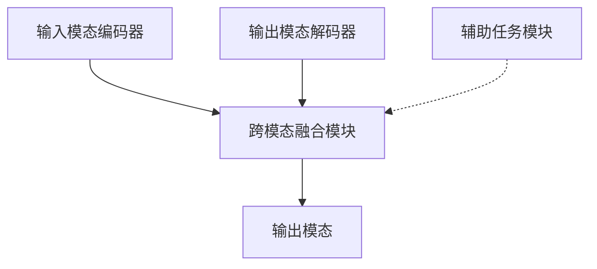

# 多模态大模型：技术原理与实战 国内外多模态大模型对比

## 1. 背景介绍

### 1.1 人工智能的新时代

人工智能(AI)技术在过去几年经历了飞速发展,催生了诸多突破性的创新。其中,大型语言模型(Large Language Model,LLM)的出现,标志着人工智能进入了一个新的里程碑。这些模型通过消化海量文本数据,学习人类语言的语义和语法规则,从而获得了出色的自然语言理解和生成能力。

然而,纯文本的大型语言模型也存在明显的局限性。人类的认知和交互不仅依赖于语言,还需要视觉、听觉等多模态信息的支持。为了更好地模拟人类的认知方式,多模态人工智能应运而生。

### 1.2 多模态人工智能的兴起

多模态人工智能(Multimodal AI)旨在将不同模态的信息(如文本、图像、视频、音频等)融合在一个统一的框架中进行建模和处理。这种跨模态的学习方式更加贴近人类的认知过程,有望推动人工智能系统在理解能力、交互方式等多个维度实现质的飞跃。

近年来,随着算力、数据和模型的不断进步,多模态人工智能的发展进入了快车道。以多模态大模型(Multimodal Large Model,MLM)为代表的新一代人工智能系统,正在为各行各业带来革命性的变革。

## 2. 核心概念与联系

### 2.1 多模态大模型的定义

多模态大模型是指能够同时处理多种模态数据(如文本、图像、视频等)的大型人工智能模型。它们通过统一的框架对不同模态的信息进行联合建模,实现跨模态的理解、推理和生成能力。

与传统的单一模态模型相比,多模态大模型具有以下优势:

1. **更全面的理解能力**:通过融合多模态信息,模型能够获得更丰富、更全面的语义表示,从而提高对复杂场景的理解能力。
2. **更自然的交互方式**:模型可以同时处理多种模态的输入和输出,实现更加自然、无缝的人机交互体验。
3. **更广阔的应用前景**:多模态大模型的通用性使其能够应用于多个领域,如视觉问答、多模态对话、内容生成等。

### 2.2 多模态大模型的架构

尽管具体实现方式有所不同,但多模态大模型通常采用了类似的架构设计。一个典型的多模态大模型架构包括以下几个核心组件:



1. **输入模态编码器**:负责对不同模态的输入数据进行编码,生成相应的表示向量。
2. **跨模态融合模块**:将来自不同模态的表示向量进行融合,建立跨模态的联系。
3. **输出模态解码器**:根据融合后的表示向量,生成目标模态的输出。
4. **辅助任务模块**(可选):通过引入辅助任务(如图像分类、视频描述等),进一步增强模型对各个模态的理解能力。

### 2.3 多模态大模型的训练策略

训练多模态大模型是一个巨大的挑战,需要解决以下几个关键问题:

1. **大规模多模态数据集构建**:模型需要消化大量的多模态数据进行训练,但高质量的多模态数据集资源往往匮乏。
2. **有效的跨模态融合机制**:如何设计高效的融合机制,充分利用不同模态之间的相关性,是多模态建模的核心问题之一。
3. **计算资源需求**:训练大型多模态模型需要大量的计算资源,包括算力、内存和存储等。
4. **多任务学习与知识迁移**:通过在不同任务和领域之间进行知识迁移,可以提高模型的泛化能力和效率。

研究人员提出了多种创新的训练策略来应对这些挑战,例如对比学习、自监督学习、模态对齐等,极大推动了多模态大模型的发展。

## 3. 核心算法原理具体操作步骤

虽然不同的多模态大模型在具体实现上有所差异,但它们通常遵循一些共同的算法原理和操作步骤。以下是一个典型的多模态大模型训练和推理流程:

### 3.1 数据预处理

1. **数据收集**:从各种来源(如网络、数据集等)收集包含多种模态(如文本、图像、视频等)的原始数据。
2. **数据清洗**:对原始数据进行清洗,去除噪声、错误数据等。
3. **数据标注**:根据具体任务,对数据进行人工或自动标注,生成监督信号。
4. **数据划分**:将数据划分为训练集、验证集和测试集。

### 3.2 模态编码

1. **特征提取**:对每种模态的输入数据进行特征提取,生成相应的特征向量。常用的特征提取方法包括:
   - 文本:使用预训练语言模型(如BERT、GPT等)进行编码
   - 图像:使用卷积神经网络(如ResNet、VGG等)提取图像特征
   - 视频:使用3D卷积神经网络(如C3D、I3D等)提取视频特征
   - 音频:使用递归神经网络(如LSTM、GRU等)提取音频特征
2. **特征融合**:将不同模态的特征向量进行融合,生成一个统一的多模态表示向量。常用的融合方法包括:
   - 拼接(Concatenation)
   - 加权求和(Weighted Sum)
   - 注意力融合(Attention Fusion)
   - 双向交叉注意力(Bidirectional Cross-Attention)

### 3.3 跨模态建模

1. **编码器-解码器架构**:多模态大模型通常采用编码器-解码器架构,将多模态表示向量作为编码器的输入,生成目标模态的输出序列。
2. **自注意力机制**:在编码器和解码器内部,使用自注意力机制捕获不同位置特征之间的长程依赖关系。
3. **跨模态注意力**:在编码器和解码器之间,使用跨模态注意力机制建立不同模态之间的关联。
4. **辅助任务**:引入辅助任务(如图像分类、视频描述等)作为正则化,帮助模型更好地理解各个模态的语义。

### 3.4 模型训练

1. **损失函数**:根据具体任务,设计合适的损失函数,如交叉熵损失(Cross-Entropy Loss)、对比损失(Contrastive Loss)等。
2. **优化算法**:使用优化算法(如Adam、AdamW等)对模型进行端到端的训练。
3. **预训练与微调**:首先在大规模无监督数据上进行预训练,获得通用的多模态表示;然后在具体任务数据上进行微调,提高模型的特定领域能力。
4. **模型并行与数据并行**:利用多GPU并行训练,加速模型收敛。

### 3.5 模型推理

1. **输入预处理**:对输入的多模态数据进行预处理,生成模型可接受的格式。
2. **前向传播**:将预处理后的输入数据输入到模型中,进行前向传播计算。
3. **输出后处理**:对模型输出进行后处理,生成最终的结果(如文本、图像等)。
4. **结果评估**:使用合适的指标(如准确率、BLEU分数等)评估模型在测试集上的表现。

## 4. 数学模型和公式详细讲解举例说明

多模态大模型通常采用基于注意力机制的编码器-解码器架构,其核心数学模型包括自注意力(Self-Attention)和跨模态注意力(Cross-Modal Attention)。下面将详细介绍这两种注意力机制的数学原理。

### 4.1 自注意力机制(Self-Attention)

自注意力机制是transformer模型的核心组件,它能够捕获输入序列中任意两个位置之间的长程依赖关系。对于一个长度为$n$的输入序列$X = (x_1, x_2, \dots, x_n)$,自注意力的计算过程如下:

1. **线性投影**:将输入序列$X$分别投影到查询(Query)、键(Key)和值(Value)空间,得到$Q$、$K$和$V$:

$$Q = XW^Q, K = XW^K, V = XW^V$$

其中$W^Q$、$W^K$和$W^V$分别是查询、键和值的线性投影矩阵。

2. **计算注意力分数**:计算查询$Q$和键$K$之间的点积,得到注意力分数矩阵$A$:

$$A = \text{softmax}\left(\frac{QK^\top}{\sqrt{d_k}}\right)$$

其中$d_k$是缩放因子,用于防止内积值过大导致梯度饱和。

3. **加权求和**:将注意力分数$A$与值$V$相乘,得到加权和表示$Z$:

$$Z = AV$$

$Z$即为自注意力的输出,它捕获了输入序列中不同位置特征之间的依赖关系。

### 4.2 跨模态注意力机制(Cross-Modal Attention)

跨模态注意力机制是多模态模型中的关键组件,它能够建立不同模态之间的关联,实现跨模态融合。假设我们有两个模态的表示$X$和$Y$,跨模态注意力的计算过程如下:

1. **线性投影**:将$X$和$Y$分别投影到查询、键和值空间,得到$Q_X$、$K_Y$、$V_Y$和$Q_Y$、$K_X$、$V_X$:

$$Q_X = XW_X^Q, K_Y = YW_Y^K, V_Y = YW_Y^V$$
$$Q_Y = YW_Y^Q, K_X = XW_X^K, V_X = XW_X^V$$

2. **计算注意力分数**:计算$Q_X$和$K_Y$之间的注意力分数$A_{X \rightarrow Y}$,以及$Q_Y$和$K_X$之间的注意力分数$A_{Y \rightarrow X}$:

$$A_{X \rightarrow Y} = \text{softmax}\left(\frac{Q_XK_Y^\top}{\sqrt{d_k}}\right)$$
$$A_{Y \rightarrow X} = \text{softmax}\left(\frac{Q_YK_X^\top}{\sqrt{d_k}}\right)$$

3. **加权求和**:将注意力分数与值相乘,得到跨模态表示$Z_X$和$Z_Y$:

$$Z_X = A_{Y \rightarrow X}V_X$$
$$Z_Y = A_{X \rightarrow Y}V_Y$$

$Z_X$和$Z_Y$捕获了不同模态之间的相关性,可用于后续的跨模态融合和建模。

通过自注意力和跨模态注意力机制,多模态大模型能够有效地融合不同模态的信息,实现强大的跨模态理解和生成能力。这些注意力机制的设计体现了模型对输入数据的自适应性,使其能够自动学习输入数据中的重要特征及其相互关系。

## 5. 项目实践:代码实例和详细解释说明

为了更好地理解多模态大模型的工作原理,我们将通过一个具体的代码实例来演示如何构建和训练一个简单的多模态模型。在这个例子中,我们将构建一个能够同时处理文本和图像的模型,用于图像描述任务。

### 5.1 数据准备

首先,我们需要准备一个包含图像和对应描述的数据集。在这个例子中,我们将使用MSCOCO数据集。MSCOCO数据集包含了大量的图像及其对应的多个描述,非常适合用于图像描述任务。

```python
from torchvision.datasets import CocoCaptions
import torchvision.transforms as transforms

# 定义数据预处理转换
transform = transforms.Compose([
    transforms.Resize(256),
    transforms.CenterCrop(224),
    transforms.ToTensor(),
    transforms.Normalize(mean=[0.485, 0.456, 0.406], std=[0.229, 0.224, 0.225])
])

#