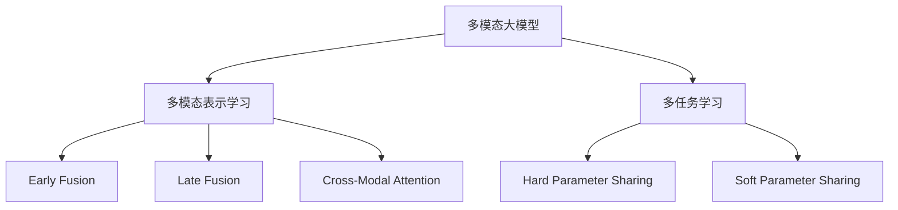
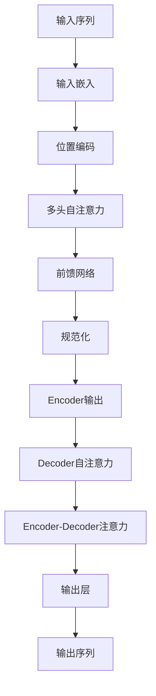
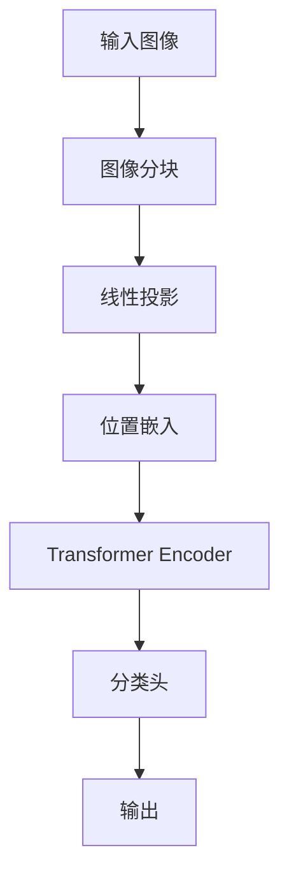
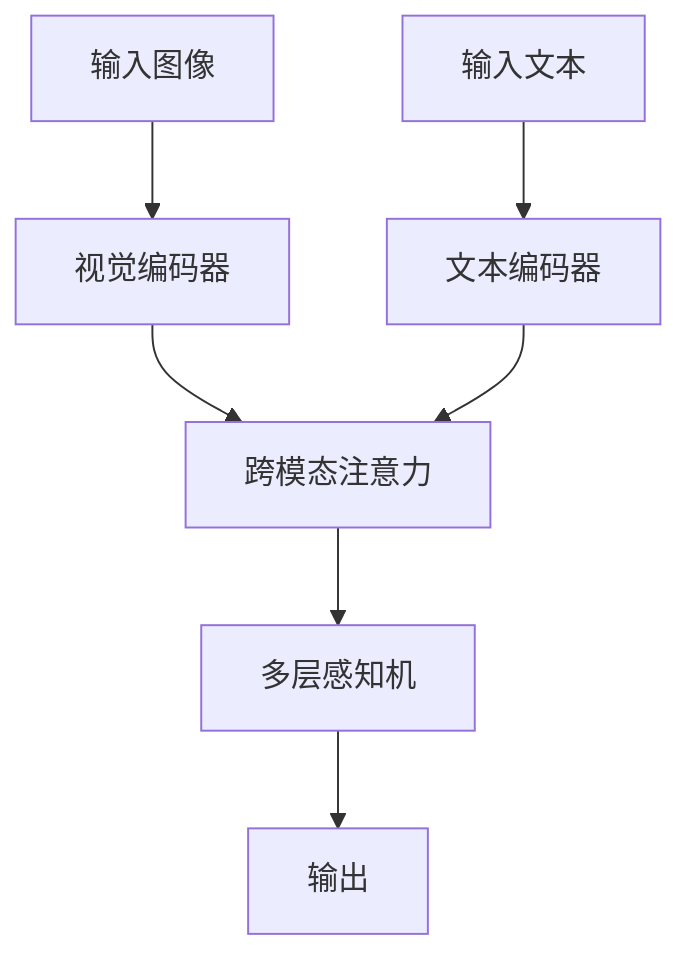

# 多模态大模型：技术原理与实战 多模态大模型在教育培训领域的应用

## 1.背景介绍

### 1.1 人工智能发展历程

人工智能(Artificial Intelligence, AI)是当代科技发展的重要领域,近年来取得了长足进步。从20世纪50年代提出人工智能概念,到70年代专家系统、80年代神经网络、90年代机器学习,再到21世纪深度学习的兴起,人工智能经历了不同的发展阶段。

### 1.2 大模型兴起

2018年,谷歌发布BERT(Bidirectional Encoder Representations from Transformers)模型,标志着大模型时代的到来。大模型通过预训练技术在海量数据上学习,获得通用知识表示能力,再通过微调(fine-tuning)等技术应用于下游任务,展现出强大的性能。

### 1.3 多模态大模型兴起

传统的人工智能模型主要关注单一模态数据,如文本或图像。但真实世界是多模态的,人类认知和交互也是多模态的。为更好地模拟人类智能,多模态人工智能应运而生。多模态大模型能够同时处理文本、图像、视频、音频等多种模态数据,是人工智能发展的新阶段。

### 1.4 多模态大模型在教育领域的应用

教育培训是多模态大模型的重要应用场景。教育过程中涉及文字、图像、视频等多种模态数据。多模态大模型能够深度理解和生成多模态内容,为教育提供智能辅助、个性化学习、交互式教学等新体验,有望促进教育变革和创新。

## 2.核心概念与联系

### 2.1 多模态表示学习

多模态表示学习(Multimodal Representation Learning)是多模态大模型的核心,旨在学习不同模态数据的联合表示。常用方法包括:

1. **Early Fusion**: 在输入层级将不同模态数据拼接,送入后续模型。
2. **Late Fusion**: 分别对每种模态数据进行编码,在高层级融合不同模态的表示。
3. **Cross-Modal Attention**: 使用注意力机制捕获不同模态间的相关性。

### 2.2 多任务学习

多任务学习(Multi-Task Learning)是多模态大模型的另一核心,通过同时学习多个相关任务来提高模型的泛化能力。常见的多任务学习范式包括:

1. **Hard Parameter Sharing**: 不同任务共享底层网络参数。
2. **Soft Parameter Sharing**: 不同任务有自己的网络,但参数受到正则化约束。

### 2.3 多模态大模型架构

常见的多模态大模型架构包括:

1. **Vision-Language Model**: 同时处理视觉和文本数据,如CLIP、ALIGN等。
2. **Multimodal Transformer**: 基于Transformer结构,融合多种模态信息,如Unified Transformer等。
3. **Modality Agnostic Model**: 模态无关的通用架构,如Perceiver等。

这些架构采用不同的融合策略和注意力机制,实现多模态表示学习和多任务学习。



## 3.核心算法原理具体操作步骤

### 3.1 Transformer模型

Transformer是多模态大模型的核心基础模型,采用自注意力机制捕获长距离依赖关系,通过Encoder-Decoder结构实现序列到序列的建模。以下是Transformer的基本操作步骤:

1. **输入嵌入**: 将输入序列(如文本)映射为嵌入向量。
2. **位置编码**: 为每个位置添加位置信息。
3. **多头自注意力**: 计算查询(Query)与键(Key)的相关性,获得值(Value)的加权和作为注意力输出。
4. **前馈网络**: 对注意力输出进行非线性变换。
5. **规范化**: 对每层输出进行归一化。
6. **Encoder输出**: 将Encoder输出作为Decoder的输入。
7. **Decoder自注意力**: 类似于Encoder,但遮挡未来位置信息。
8. **Encoder-Decoder注意力**: Decoder关注Encoder输出。
9. **输出层**: 将Decoder输出映射为目标序列。



### 3.2 Vision Transformer

Vision Transformer(ViT)是将Transformer应用于计算机视觉任务的重要模型,可直接对图像分块进行建模,无需手工设计卷积核。ViT的基本操作步骤如下:

1. **图像分块**: 将输入图像划分为多个图像块(Image Patches)。
2. **线性投影**: 将每个图像块映射为一个向量(Patch Embedding)。
3. **位置嵌入**: 为每个图像块添加位置信息。
4. **Transformer Encoder**: 输入Patch Embedding和位置嵌入,通过Transformer Encoder进行建模。
5. **分类头**: 对Encoder输出进行分类或其他视觉任务。



### 3.3 Vision-Language Model

Vision-Language Model(VLM)是将视觉和文本信息融合的多模态模型,常用于图像描述、视觉问答等任务。典型的VLM操作步骤如下:

1. **视觉编码器**: 采用ViT或CNN对输入图像进行编码,获得视觉特征。
2. **文本编码器**: 采用Transformer等模型对输入文本进行编码,获得文本特征。
3. **跨模态注意力**: 计算视觉特征和文本特征之间的相关性。
4. **多层感知机**: 将融合后的多模态特征输入MLP进行预测或生成。



## 4.数学模型和公式详细讲解举例说明

### 4.1 自注意力机制

自注意力是Transformer的核心,能够捕获输入序列中任意两个位置之间的依赖关系。给定查询(Query) $\mathbf{Q}$、键(Key) $\mathbf{K}$和值(Value) $\mathbf{V}$,自注意力的计算公式如下:

$$\mathrm{Attention}(\mathbf{Q}, \mathbf{K}, \mathbf{V}) = \mathrm{softmax}\left(\frac{\mathbf{Q}\mathbf{K}^\top}{\sqrt{d_k}}\right)\mathbf{V}$$

其中, $d_k$ 是缩放因子,用于防止点积过大导致梯度消失。多头注意力机制将查询、键和值线性投影为多个子空间,分别计算注意力,再进行拼接:

$$\begin{aligned}
\mathrm{MultiHead}(\mathbf{Q}, \mathbf{K}, \mathbf{V}) &= \mathrm{Concat}(\mathrm{head}_1, \dots, \mathrm{head}_h)\mathbf{W}^O\\
\mathrm{head}_i &= \mathrm{Attention}(\mathbf{Q}\mathbf{W}_i^Q, \mathbf{K}\mathbf{W}_i^K, \mathbf{V}\mathbf{W}_i^V)
\end{aligned}$$

其中, $\mathbf{W}_i^Q$、$\mathbf{W}_i^K$、$\mathbf{W}_i^V$ 和 $\mathbf{W}^O$ 是可学习的线性投影参数。

### 4.2 Vision Transformer 模型

Vision Transformer(ViT)直接对图像分块进行线性投影,获得 Patch Embedding。给定图像 $\mathbf{x} \in \mathbb{R}^{H \times W \times C}$,将其划分为 $N = HW/P^2$ 个大小为 $P \times P$ 的图像块,其线性投影公式为:

$$\mathbf{x}_{p} = \mathbf{x}_{p}^{N \times P^2C} + \mathbf{E}_{pos}$$

其中, $\mathbf{E}_{pos}$ 是可学习的位置嵌入,用于保留图像块的位置信息。然后将 Patch Embedding 输入 Transformer Encoder 进行建模:

$$\hat{\mathbf{y}} = \mathrm{Transformer}(\mathbf{x}_{p})$$

最后,将 Transformer 输出的 Classification Token 送入分类头进行分类或其他视觉任务。

### 4.3 Vision-Language Model 跨模态注意力

Vision-Language Model(VLM)中的跨模态注意力机制能够捕获视觉和文本特征之间的相关性。给定视觉特征 $\mathbf{V}$ 和文本特征 $\mathbf{L}$,跨模态注意力的计算公式为:

$$\begin{aligned}
\mathbf{A}_{v} &= \mathrm{softmax}\left(\frac{\mathbf{Q}_v\mathbf{K}_l^\top}{\sqrt{d_k}}\right)\mathbf{V}_l\\
\mathbf{A}_{l} &= \mathrm{softmax}\left(\frac{\mathbf{Q}_l\mathbf{K}_v^\top}{\sqrt{d_k}}\right)\mathbf{V}_v\\
\mathbf{O} &= \left[\mathbf{A}_v; \mathbf{A}_l\right]
\end{aligned}$$

其中, $\mathbf{Q}_v$、$\mathbf{K}_v$、$\mathbf{V}_v$ 分别是视觉特征的查询、键和值; $\mathbf{Q}_l$、$\mathbf{K}_l$、$\mathbf{V}_l$ 分别是文本特征的查询、键和值。最终将视觉注意力 $\mathbf{A}_v$ 和文本注意力 $\mathbf{A}_l$ 拼接作为多模态融合特征 $\mathbf{O}$。

## 5.项目实践：代码实例和详细解释说明

以下是一个基于 PyTorch 实现的简单 Vision-Language Model 示例,用于图像描述任务。

### 5.1 导入必要库

```python
import torch
import torch.nn as nn
from torchvision import models
```

### 5.2 定义视觉编码器

我们使用预训练的 ResNet-50 作为视觉编码器的骨干网络。

```python
class VisualEncoder(nn.Module):
    def __init__(self, embed_dim):
        super().__init__()
        resnet = models.resnet50(pretrained=True)
        modules = list(resnet.children())[:-2]
        self.resnet = nn.Sequential(*modules)
        self.avg_pool = nn.AdaptiveAvgPool2d((1, 1))
        self.projection = nn.Linear(resnet.fc.in_features, embed_dim)

    def forward(self, x):
        x = self.resnet(x)
        x = self.avg_pool(x)
        x = x.view(x.size(0), -1)
        x = self.projection(x)
        return x
```

### 5.3 定义文本编码器

我们使用简单的 LSTM 作为文本编码器。

```python
class TextEncoder(nn.Module):
    def __init__(self, vocab_size, embed_dim, hidden_dim):
        super().__init__()
        self.embedding = nn.Embedding(vocab_size, embed_dim)
        self.lstm = nn.LSTM(embed_dim, hidden_dim, batch_first=True)
        self.projection = nn.Linear(hidden_dim, embed_dim)

    def forward(self, x):
        x = self.embedding(x)
        x, _ = self.lstm(x)
        x = self.projection(x[:, -1])
        return x
```

### 5.4 定义跨模态注意力模块

```python
class CrossModalAttention(nn.Module):
    def __init__(self, embed_dim):
        super().__init__()
        self.v_proj = nn.Linear(embed_dim, embed_dim)
        self.t_proj = nn.Linear(embed_dim, embed_dim)
        self.concat_proj = nn.Linear(2 * embed_dim, embed_dim)

    def forward(self, v_feat, t_feat):
        v_att = self.v_proj(v_feat)
        t_att