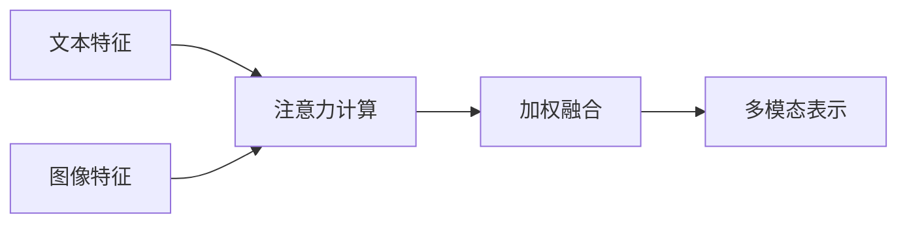
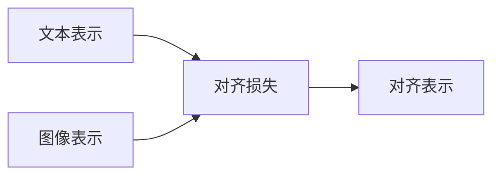
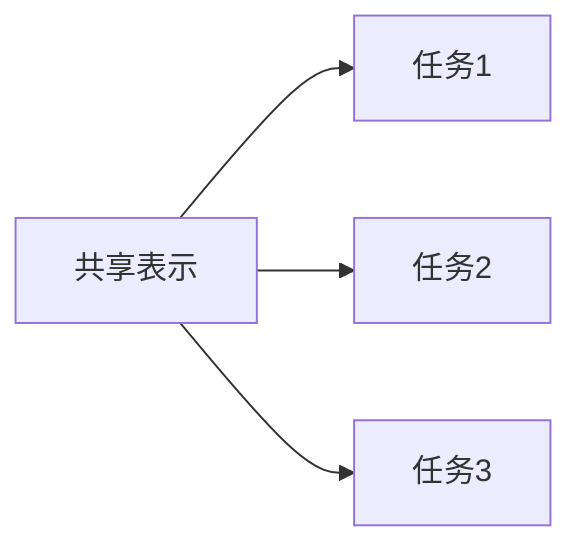

# 多模态大模型：技术原理与实战 多模态大模型对比

## 1. 背景介绍

### 1.1 人工智能发展历程

人工智能(Artificial Intelligence, AI)是当代科技发展的前沿领域,自20世纪50年代诞生以来,已经经历了数次演进和突破。在早期,人工智能主要集中在专家系统、机器学习等领域,旨在模拟人类的思维和推理能力。随着算力和数据的不断积累,深度学习(Deep Learning)技术在21世纪初开始兴起,推动了人工智能在计算机视觉、自然语言处理等领域取得了长足进展。

### 1.2 大模型兴起

近年来,随着算力、数据和模型规模的持续增长,大模型(Large Model)开始在各个领域崭露头角。大模型通过在海量数据上进行预训练,学习到丰富的知识和语义表示,从而在下游任务上展现出强大的泛化能力。自2018年GPT模型问世以来,大模型在自然语言处理领域掀起了一股热潮,BERT、GPT-3等模型相继问世,展现出令人惊叹的语言理解和生成能力。

### 1.3 多模态大模型的兴起

尽管单模态大模型在特定领域取得了卓越成就,但现实世界中的信息通常呈现多模态(Multi-Modal)的形式,包括文本、图像、视频、音频等。为了更好地理解和表达这些多模态信息,多模态大模型(Multimodal Large Model)应运而生。多模态大模型旨在融合不同模态的信息,实现跨模态的理解、推理和生成,从而更好地服务于现实世界的应用场景。

## 2. 核心概念与联系

### 2.1 多模态表示学习

多模态表示学习(Multimodal Representation Learning)是多模态大模型的核心概念之一。它旨在学习不同模态数据的联合表示,捕捉模态间的相关性和互补性。通过在预训练阶段接触到大量的多模态数据,模型可以学习到丰富的跨模态知识,从而在下游任务中更好地理解和表达多模态信息。

### 2.2 注意力机制

注意力机制(Attention Mechanism)是多模态大模型中广泛采用的关键技术。它允许模型动态地聚焦于输入数据的不同部分,捕捉模态间的长程依赖关系。通过计算不同模态特征之间的相关性分数,注意力机制可以自适应地分配权重,从而更好地融合多模态信息。

### 2.3 跨模态对齐

跨模态对齐(Cross-Modal Alignment)是多模态大模型中另一个重要概念。它旨在学习不同模态之间的语义对应关系,使得模型能够在不同模态之间进行无缝切换和转换。通过对齐不同模态的表示空间,模型可以更好地捕捉跨模态的一致性,从而实现更加准确和流畅的多模态理解和生成。

### 2.4 多任务学习

多任务学习(Multi-Task Learning)是多模态大模型中常见的训练范式。它允许模型同时学习多个相关任务,利用不同任务之间的知识迁移,提高模型的泛化能力。在多模态场景下,多任务学习可以帮助模型同时学习不同模态的表示,增强模型对跨模态信息的理解能力。

## 3. 核心算法原理具体操作步骤

### 3.1 Transformer 模型

Transformer 是多模态大模型中广泛采用的核心架构,它基于自注意力机制,能够有效捕捉长程依赖关系。Transformer 模型通常由编码器(Encoder)和解码器(Decoder)两个部分组成,用于序列到序列的转换任务。

1. **编码器(Encoder)**
   - 输入embedding层:将输入序列(文本/图像)映射为embedding向量
   - 多头自注意力层:计算输入embedding之间的注意力权重,捕捉序列内部的依赖关系
   - 前馈神经网络层:对注意力输出进行非线性变换,提取更高级的特征表示
   - 层归一化和残差连接:stabilize训练过程

2. **解码器(Decoder)**
   - 输入embedding层:将目标序列映射为embedding向量
   - 掩码多头自注意力层:计算目标序列内部的注意力权重,掩码机制确保每个位置只能关注之前的位置
   - 多头交叉注意力层:计算目标序列和编码器输出之间的注意力权重,捕捉输入和输出之间的依赖关系
   - 前馈神经网络层:对注意力输出进行非线性变换
   - 层归一化和残差连接

3. **训练目标**
   - 最大化目标序列的条件概率:$\mathrm{argmax}_\theta \sum_{(x,y)} \log P(y|x;\theta)$
   - 通过梯度下降优化模型参数$\theta$

### 3.2 Vision Transformer (ViT)

Vision Transformer(ViT)是将Transformer直接应用于计算机视觉任务的一种方法。它将图像分割为多个patch(图像块),并将每个patch投影为一个向量序列,作为Transformer的输入。

1. **图像分割**
   - 将输入图像分割为多个固定大小的patch(例如16x16像素)
   - 将每个patch映射为一个向量(例如768维),形成一个序列

2. **位置嵌入**
   - 为每个patch添加一个位置嵌入,以保留patch在原始图像中的位置信息

3. **Transformer Encoder**
   - 将patch序列和位置嵌入输入到Transformer Encoder中
   - 通过多头自注意力层和前馈神经网络层,捕捉patch之间的关系和高级语义特征

4. **分类头(Classification Head)**
   - 在Transformer Encoder的输出中,取出特殊的[CLS]token对应的向量
   - 通过一个小的前馈神经网络,将该向量映射为分类logits

5. **训练目标**
   - 最小化分类损失函数(如交叉熵损失)

### 3.3 多模态融合策略

多模态大模型需要有效地融合不同模态的信息,常见的融合策略包括:

1. **早期融合(Early Fusion)**
   - 在输入层将不同模态的特征拼接在一起
   - 缺点:无法捕捉模态间的高级语义关系

2. **晚期融合(Late Fusion)**
   - 分别对每个模态进行编码,在高层次将编码后的特征进行融合
   - 缺点:模态间的交互较少,融合效果有限

3. **层级融合(Hierarchical Fusion)**
   - 在不同层次对模态特征进行融合,捕捉不同粒度的交互关系
   - 例如:LXMERT模型在不同Transformer层对视觉和文本特征进行交叉注意力

4. **对比学习融合(Contrastive Fusion)**
   - 通过对比损失函数,最大化不同模态特征之间的相似性
   - 例如:CLIP模型通过对比损失对齐图像和文本表示

不同的融合策略各有优缺点,需要根据具体任务和数据特点进行选择和设计。

## 4. 数学模型和公式详细讲解举例说明

### 4.1 自注意力机制(Self-Attention)

自注意力机制是Transformer模型的核心组件,它能够有效地捕捉序列内部的长程依赖关系。给定一个输入序列$X = (x_1, x_2, \dots, x_n)$,自注意力机制计算每个位置$i$关注其他位置$j$的重要程度,并根据这些权重对应的值进行加权求和,得到该位置的新表示$y_i$。

$$y_i = \sum_{j=1}^n \alpha_{ij}(x_j W^V)$$

其中,$\alpha_{ij}$是注意力权重,表示位置$i$对位置$j$的注意力分数。它通过以下公式计算:

$$\alpha_{ij} = \frac{\exp(e_{ij})}{\sum_{k=1}^n \exp(e_{ik})}$$

$$e_{ij} = \frac{(x_iW^Q)(x_jW^K)^T}{\sqrt{d_k}}$$

$W^Q, W^K, W^V$分别是查询(Query)、键(Key)和值(Value)的线性投影矩阵,$d_k$是缩放因子,用于防止较深层次的值过大导致梯度消失。

多头注意力机制(Multi-Head Attention)将注意力分成多个子空间,分别计算注意力权重,然后将结果拼接起来,从而捕捉不同子空间的依赖关系。

$$\mathrm{MultiHead}(Q, K, V) = \mathrm{Concat}(head_1, \dots, head_h)W^O$$

$$\text{where } head_i = \mathrm{Attention}(QW_i^Q, KW_i^K, VW_i^V)$$

### 4.2 Vision Transformer 中的 Patch Embedding

在Vision Transformer(ViT)中,输入图像首先被分割成多个patch(图像块),每个patch被映射为一个向量,形成一个序列作为Transformer的输入。具体来说,给定一个图像$x \in \mathbb{R}^{H \times W \times C}$,我们将其分割成$N$个patch,每个patch大小为$P \times P$像素,则有$N = HW/P^2$。对于第$i$个patch $x_i^P \in \mathbb{R}^{P^2 \cdot C}$,我们通过一个线性投影层将其映射为一个D维向量:

$$x_i^{(0)} = [x_i^P; \mathbf{0}] + \mathbf{E}_{\mathrm{pos}}^i$$

其中,$\mathbf{E}_{\mathrm{pos}}^i \in \mathbb{R}^D$是该patch对应的可学习的位置嵌入,用于编码patch在原始图像中的位置信息。$[x_i^P; \mathbf{0}]$表示将patch向量$x_i^P$填充为D维,并与位置嵌入相加。

通过这种方式,整个图像被映射为一个向量序列$X^{(0)} = [x_1^{(0)}, x_2^{(0)}, \dots, x_N^{(0)}] \in \mathbb{R}^{N \times D}$,作为Transformer Encoder的输入。

### 4.3 对比学习融合(Contrastive Fusion)

对比学习融合是一种有效的多模态融合策略,它通过最大化不同模态特征之间的相似性,实现模态间的对齐和融合。以CLIP模型为例,给定一个图像-文本对$(I, T)$,我们希望最大化它们对应的特征表示$f(I)$和$g(T)$之间的相似性,同时最小化其与其他负样本之间的相似性。

具体来说,我们定义一个对比损失函数:

$$\mathcal{L}_\mathrm{CLIP} = -\mathbb{E}_{(I, T) \sim p_\mathrm{data}}\left[\log \frac{\exp(\mathrm{sim}(f(I), g(T)) / \tau)}{\sum_{(I', T') \in \mathcal{D}} \exp(\mathrm{sim}(f(I), g(T')) / \tau)}\right]$$

其中,$\mathrm{sim}(\cdot, \cdot)$是一个相似性函数(如点积或余弦相似度),$\tau$是一个温度超参数,$\mathcal{D}$是包含当前样本和所有负样本的数据集。

通过最小化这个对比损失函数,模型被迫学习到一个共享的跨模态表示空间,使得同一对象的不同模态表示彼此靠近,而不同对象的表示则相距较远。这种对齐机制有助于模型捕捉不同模态之间的语义对应关系,从而实现更加准确和流畅的多模态理解和生成。

## 5. 项目实践: