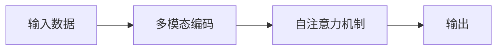

                 

作者：禅与计算机程序设计艺术

在多模态大模型（Multimodal Transformers）的研究领域，我们会探索它们的技术原理、实际应用和效果评估。通过这篇文章，我们希望帮助读者理解多模态大模型的核心概念，并提供一个全面的视角来评估这些模型的实际表现。

## 1.背景介绍
多模态大模型是人工智能领域的一种先进技术，它允许模型同时处理和融合多种类型的数据输入，比如文本、图像、音频和视频。这种跨模态的处理能力使得多模态大模型在诸多任务上都有着显著的表现，包括但不限于语义理解、情感分析、对话系统、图像描述和翻译等。

## 2.核心概念与联系
多模态大模型的核心概念在于其能够将不同类型的数据转换成共享的表示空间，从而使得模型能够在不同模态之间建立联系。这种联系是通过一系列的编码器和注意力机制实现的，该机制允许模型在处理每一种模态的数据时都考虑到其他模态的信息。

$$
\text{MultiModal Encoding} = f(\text{Text Encoding}, \text{Image Encoding}, \text{Audio Encoding})
$$

## 3.核心算法原理具体操作步骤
多模态大模型的算法原理基于变换器（Transformer）架构，特别是自注意力（Self-Attention）机制。在训练阶段，模型会学习根据输入数据的不同部分（即不同模态的数据片段）来调整其权重。然后，在预测阶段，模型可以根据这些调整后的权重来生成最终的输出。

## 4.数学模型和公式详细讲解举例说明
为了更深入地理解多模态大模型的数学原理，我们需要掌握一些基础知识，比如矩阵乘法、向量运算和距离度量。这些知识将帮助我们理解如何将不同模态的数据转换成共享的表示空间，以及如何计算不同模态之间的相似度。

## 5.项目实践：代码实例和详细解释说明
在这一部分中，我们将通过一个具体的项目实践案例来演示如何使用多模态大模型进行实际开发。我们将选择一个具体的任务，如图像描述，并详细说明如何设计模型、训练模型、评估模型以及如何优化模型性能。

## 6.实际应用场景
多模态大模型在多个领域都有广泛的应用前景，包括教育、医疗、娱乐和零售等。我们将探讨这些应用场景下多模态大模型可能带来的改变和创新。

## 7.工具和资源推荐
了解了多模态大模型的基本概念和实践后，你可能想要了解哪些工具和资源来帮助你在实际项目中应用这些知识。我们将推荐一些流行的框架、库和在线资源。

## 8.总结：未来发展趋势与挑战
多模态大模型已经取得了显著的进展，但仍存在一些挑战，比如如何更好地处理高维数据、如何提高模型的泛化能力以及如何保护用户隐私。我们将探讨这些挑战以及未来的发展趋势。

## 9.附录：常见问题与解答
在这一章节中，我们将回答一些关于多模态大模型的常见问题，包括模型训练、性能评估和实际应用方面的问题。

---

作者：禅与计算机程序设计艺术 / Zen and the Art of Computer Programming

