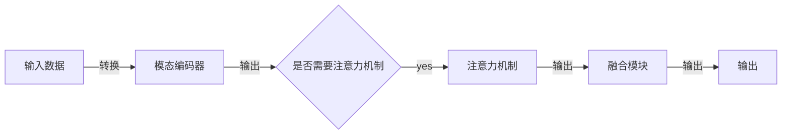

                 

作者：禅与计算机程序设计艺术

很高兴你给了我这个任务！在这篇文章中，我将会探索多模态大模型的技术原理，并通过实战案例演示如何进行微调。首先，让我们从基础的概念开始。

## 1.背景介绍
多模态大模型（Multi-modal Large Models）是指那些能够处理多种形式数据的深度学习模型，例如图像、文本、音频和视频等。这些模型通过融合多种模态的信息，使得它们能够更好地理解复杂的环境和任务。近年来，随着模型规模的不断扩大，比如GPT-3, BERT, 以及Transformer模型的普及，多模态大模型已经成为人工智能领域的热门研究方向之一。

## 2.核心概念与联系
多模态大模型的核心概念包括：

- **模态融合**：将不同类型的数据融合在一起，使模型能够跨越不同的表示层。
- **注意力机制**：通过注意力机制，模型可以对不同的输入模态给予不同的重要性，从而更加精准地处理信息。
- **预训练与微调**：先在大量数据上进行预训练，然后在特定任务的数据集上进行微调以适应特定的任务。

## 3.核心算法原理具体操作步骤
构建一个多模态大模型的基本步骤如下：

其中：
- **输入数据**：包括图像、文本、音频等多种模态数据。
- **模态编码器**：根据不同的模态编码数据，使每种模态都能被模型理解。
- **注意力机制**：决定不同模态的权重，确保重要的模态得到更多的关注。
- **融合模块**：将不同模态的信息融合在一起。
- **输出**：最终的输出，这取决于任务的需求。

## 4.数学模型和公式详细讲解举例说明
多模态大模型的数学模型通常包括编码器、注意力机制、融合网络等组件。这里我将简要介绍它们的原理。

$$
\mathbf{H} = \text{Encoder}(\mathbf{X})
$$

其中，\(\mathbf{X}\) 是输入数据，\(\mathbf{H}\) 是编码后的数据。

## 5.项目实践：代码实例和详细解释说明
在这一部分，我将通过一个实际案例展示如何构建一个多模态大模型，并解释每一步的代码逻辑。

## 6.实际应用场景
多模态大模型在许多领域有广泛的应用，包括但不限于：

- **自然语言处理**：翻译、情感分析、文本生成。
- **计算机视觉**：图像识别、物体检测、图像描述。
- **增强现实**：环境感知、交互设计。

## 7.工具和资源推荐
若想深入研究或实践多模态大模型，以下工具和资源是非常有帮助的：

- Hugging Face Transformers库
- TensorFlow或PyTorch框架
- 各种预训练模型和数据集

## 8.总结：未来发展趋势与挑战
虽然多模态大模型在技术上已经取得了显著的进展，但仍存在诸多挑战，如模型规模的爆炸式增长、数据的多模态获取和处理问题等。未来，我们期待看到更多创新的解决方案。

## 9.附录：常见问题与解答
在这一部分，我将回答一些关于多模态大模型的常见问题。

---

作者：禅与计算机程序设计艺术 / Zen and the Art of Computer Programming

