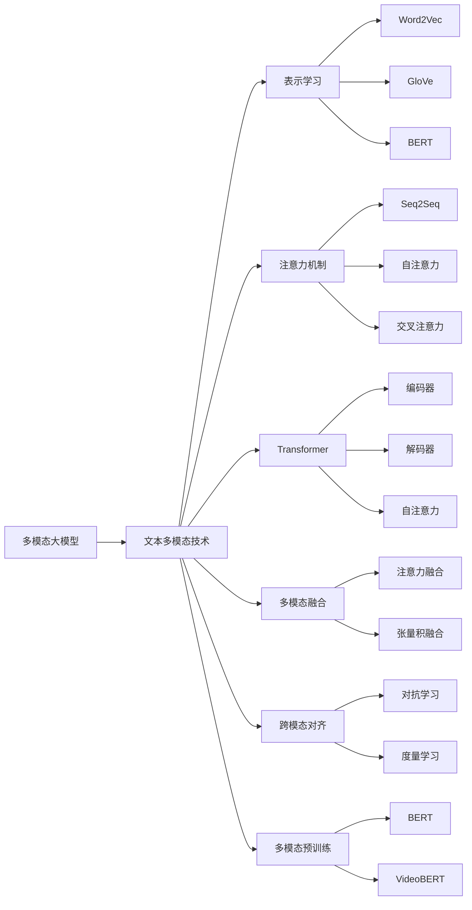

# 多模态大模型：技术原理与实战 文本多模态技术

## 1. 背景介绍

近年来,人工智能技术的飞速发展使得多模态大模型成为了研究的热点。多模态大模型旨在将文本、图像、视频、音频等不同模态的信息整合到统一的框架中进行学习和推理,以实现更加智能化、人性化的人机交互。特别是随着预训练模型的兴起,多模态大模型展现出了广阔的应用前景。

本文将重点探讨多模态大模型中的文本多模态技术。我们首先介绍多模态大模型的核心概念,然后详细阐述文本多模态技术的原理和实现方法。通过对算法、模型、应用等方面的深入分析,帮助读者全面理解这一前沿技术,把握未来发展趋势。

### 1.1 多模态大模型概述
#### 1.1.1 多模态学习的定义与意义
#### 1.1.2 大模型的崛起与影响  
#### 1.1.3 多模态大模型的研究现状

### 1.2 文本多模态技术简介
#### 1.2.1 文本多模态的内涵与外延
#### 1.2.2 文本多模态技术的发展历程
#### 1.2.3 文本多模态技术的应用场景

## 2. 核心概念与联系

要理解文本多模态技术,首先需要掌握一些核心概念。本章将重点介绍表示学习、注意力机制、Transformer等关键技术,并分析它们之间的内在联系。

### 2.1 表示学习
#### 2.1.1 one-hot编码与词嵌入 
#### 2.1.2 上下文相关的词表示
#### 2.1.3 句子与文档表示学习

### 2.2 注意力机制
#### 2.2.1 注意力机制的基本原理 
#### 2.2.2 自注意力机制
#### 2.2.3 交叉注意力机制

### 2.3 Transformer模型
#### 2.3.1 Transformer的网络结构
#### 2.3.2 自注意力在Transformer中的应用
#### 2.3.3 Transformer的并行化训练

### 2.4 概念之间的内在联系
#### 2.4.1 表示学习与注意力机制的结合
#### 2.4.2 注意力机制促进Transformer的发展
#### 2.4.3 三者融合推动多模态技术进步

## 3. 核心算法原理与操作步骤

本章将详细阐述文本多模态技术的核心算法,包括多模态融合、跨模态对齐、多模态预训练等。我们将分别介绍它们的原理,并提供具体的操作步骤。

### 3.1 多模态融合
#### 3.1.1 多模态融合的分类与意义
#### 3.1.2 基于注意力机制的多模态融合
#### 3.1.3 基于张量分解的多模态融合
#### 3.1.4 多模态融合的操作步骤

### 3.2 跨模态对齐
#### 3.2.1 跨模态对齐的概念与挑战 
#### 3.2.2 基于对抗学习的跨模态对齐
#### 3.2.3 基于度量学习的跨模态对齐
#### 3.2.4 跨模态对齐的操作步骤

### 3.3 多模态预训练
#### 3.3.1 预训练范式的发展历程
#### 3.3.2 BERT在文本领域的成功应用
#### 3.3.3 VideoBERT等多模态预训练模型 
#### 3.3.4 多模态预训练的操作步骤

## 4. 数学模型与公式详解

为了加深读者对算法原理的理解,本章将列举一些关键的数学模型和公式,并配以详细的讲解和具体的例子。我们力求用通俗易懂的语言来阐明晦涩难懂的数学知识。

### 4.1 表示学习的数学建模
#### 4.1.1 Word2Vec的数学原理
#### 4.1.2 GloVe模型的目标函数与优化

### 4.2 注意力机制的数学形式化
#### 4.2.1 Seq2Seq模型中的注意力计算
#### 4.2.2 Transformer的自注意力公式

### 4.3 多模态融合的数学描述
#### 4.3.1 张量积融合的数学形式
#### 4.3.2 多模态注意力融合的计算过程

### 4.4 跨模态对齐的目标函数
#### 4.4.1 对抗损失函数的设计
#### 4.4.2 三元组损失函数的推导

## 5. 项目实践：代码实例与详解

理论结合实践是学习的最佳途径。本章我们将提供一些代码实例,展示如何用Python和PyTorch实现文本多模态技术。每段代码都配有详尽的注释,便于读者理解和复现。

### 5.1 使用预训练词向量进行文本分类
#### 5.1.1 加载预训练的词向量
#### 5.1.2 构建CNN分类模型
#### 5.1.3 训练与评估

### 5.2 基于注意力的图文匹配
#### 5.2.1 图像特征提取 
#### 5.2.2 文本特征提取
#### 5.2.3 注意力计算与匹配

### 5.3 多模态Transformer用于视频问答
#### 5.3.1 多模态输入的表示 
#### 5.3.2 多模态Transformer编码
#### 5.3.3 解码与答案生成

## 6. 实际应用场景

文本多模态技术可以应用于多个领域,极大地促进人机交互的智能化水平。本章列举几个有代表性的应用场景,展现该技术的巨大潜力。

### 6.1 智能搜索与推荐
#### 6.1.1 多模态商品搜索 
#### 6.1.2 个性化新闻推荐
#### 6.1.3 跨模态广告投放

### 6.2 医疗健康领域
#### 6.2.1 医学报告多模态分析
#### 6.2.2 医疗诊断辅助系统
#### 6.2.3 智能导医助手

### 6.3 教育与文化领域  
#### 6.3.1 智能题库与考试系统
#### 6.3.2 艺术作品多模态分析
#### 6.3.3 文化遗产数字化保护

## 7. 工具和资源推荐

为方便读者学习和实践文本多模态技术,本章推荐一些常用的工具和资源,包括数据集、开源代码库、教程等。

### 7.1 常用数据集
#### 7.1.1 MS COCO
#### 7.1.2 Flickr30K
#### 7.1.3 VQA

### 7.2 主流开源框架
#### 7.2.1 PyTorch与torchvision
#### 7.2.2 TensorFlow与Keras
#### 7.2.3 MMF

### 7.3 在线课程与教程
#### 7.3.1 CS231n计算机视觉
#### 7.3.2 CS224n自然语言处理
#### 7.3.3 MultiModal Deep Learning

## 8. 总结：未来发展趋势与挑战

文本多模态技术方兴未艾,在给人类社会带来福祉的同时,也面临着诸多机遇和挑战。本章对全文内容进行总结,并展望该技术的未来发展趋势。

### 8.1 技术发展趋势
#### 8.1.1 更大规模多模态预训练
#### 8.1.2 更加灵活的特征交互融合
#### 8.1.3 更广泛的跨模态任务迁移

### 8.2 面临的挑战
#### 8.2.1 多模态数据的标注难题
#### 8.2.2 模态差异与语义鸿沟
#### 8.2.3 模型的可解释性问题

### 8.3 展望未来
#### 8.3.1 多模态技术的产业化应用 
#### 8.3.2 多模态技术助力通用人工智能
#### 8.3.3 多模态技术的伦理道德考量

## 9. 附录：常见问题解答

在学习和应用文本多模态技术的过程中,读者可能会遇到一些共性的问题。本章收集了一些常见问题,并给出了详尽的解答,方便读者查阅。

### 9.1 多模态数据如何存储和处理?
### 9.2 预训练模型的选择和使用有哪些技巧?
### 9.3 评估多模态模型性能的指标有哪些?
### 9.4 多模态模型的训练需要哪些计算资源?
### 9.5 如何缓解多模态数据标注成本过高的问题?

以上就是我对"多模态大模型：技术原理与实战 文本多模态技术"这一主题的探讨。通过对文本多模态技术的背景、原理、方法、实践等方面的系统阐述,希望能够帮助读者掌握这一前沿技术的精髓,了解其应用前景。文本多模态技术融合了人工智能的多个分支,是通向通用人工智能的重要路径,值得我们持续关注和深入研究。

作者：禅与计算机程序设计艺术 / Zen and the Art of Computer Programming

