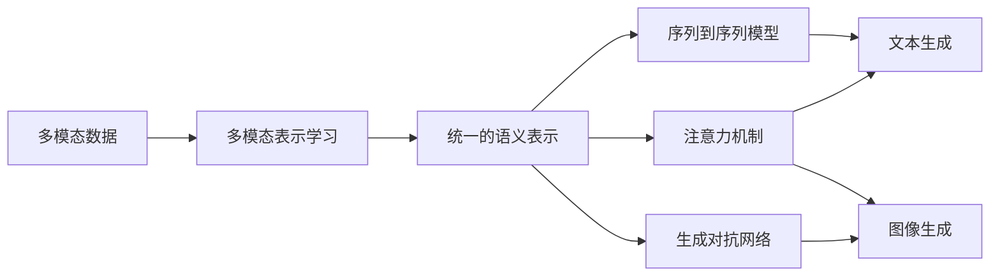

# 多模态生成(Multimodal Generation) - 原理与代码实例讲解

## 1. 背景介绍

多模态生成是人工智能领域的一个前沿研究方向,旨在利用多种不同的数据模态(如文本、图像、音频等)生成新的内容。随着深度学习技术的快速发展,多模态生成已经在许多实际应用中取得了显著成果,如图像描述生成、视频摘要生成、音乐生成等。本文将深入探讨多模态生成的原理、算法、数学模型以及代码实现,帮助读者全面了解这一充满前景的研究方向。

### 1.1 多模态数据的特点
- 异构性:不同模态的数据具有不同的表示形式和统计特性
- 互补性:不同模态的数据从不同角度描述同一个对象或场景
- 时空对齐:不同模态的数据在时间和空间上需要对齐
- 语义对应:不同模态的数据需要在语义层面上建立对应关系

### 1.2 多模态生成的挑战
- 如何有效融合不同模态的信息
- 如何在生成过程中保持不同模态之间的语义一致性  
- 如何评估生成结果的质量
- 如何实现可控、可解释的多模态生成

## 2. 核心概念与联系

要理解多模态生成,需要先了解以下几个核心概念:

### 2.1 多模态表示学习
多模态表示学习的目标是将不同模态的数据映射到一个共同的语义空间,从而实现跨模态的信息融合。常见的多模态表示学习方法包括:
- 基于对抗学习的方法
- 基于注意力机制的方法
- 基于图神经网络的方法

### 2.2 序列到序列模型
序列到序列模型是一种广泛应用于自然语言处理领域的神经网络架构,它由编码器和解码器两部分组成。在多模态生成中,编码器负责将输入的多模态信息编码为一个统一的表示,解码器则根据这个表示生成目标模态的输出。

### 2.3 注意力机制
注意力机制允许模型在生成过程中动态地关注输入数据的不同部分,从而提高生成质量。在多模态生成中,注意力机制可以用于对齐不同模态之间的语义信息,以及控制生成过程。

### 2.4 生成对抗网络(GAN)
生成对抗网络由生成器和判别器两部分组成,通过二者的对抗学习来生成逼真的数据样本。在多模态生成中,GAN可以用于生成高质量的图像、视频等连续型数据。

下图展示了多模态生成中这些核心概念之间的联系:



## 3. 核心算法原理具体操作步骤

本节将详细介绍几种常见的多模态生成算法的原理和操作步骤。

### 3.1 基于编码器-解码器框架的多模态生成

基于编码器-解码器框架的多模态生成通常包括以下步骤:

1. 将不同模态的输入数据分别传入对应的编码器,得到统一的语义表示。
2. 将编码后的语义表示传入解码器,生成目标模态的输出。
3. 在训练过程中,通过最小化生成结果与真实数据之间的差异来优化模型参数。

常见的编码器-解码器架构包括:
- 基于RNN的序列到序列模型
- 基于Transformer的序列到序列模型
- 基于CNN的图像到文本模型

### 3.2 基于注意力机制的多模态生成

基于注意力机制的多模态生成在编码器-解码器框架的基础上引入了注意力机制,具体步骤如下:

1. 在编码阶段,通过注意力机制计算不同模态之间的相关性,得到对齐的语义表示。
2. 在解码阶段,通过注意力机制动态地关注输入数据的不同部分,生成更加精准的输出。
3. 在训练过程中,通过最小化生成结果与真实数据之间的差异来优化模型参数。

常见的基于注意力机制的多模态生成模型包括:
- Show, Attend and Tell
- Multimodal Attention Model
- Memory, Attention and Composition (MAC) Network

### 3.3 基于生成对抗网络的多模态生成

基于生成对抗网络的多模态生成通常包括以下步骤:

1. 生成器接收随机噪声和条件信息(如文本描述)作为输入,生成目标模态的数据(如图像)。
2. 判别器接收生成的数据和真实数据,判断它们是否来自真实数据分布。
3. 生成器和判别器通过对抗学习不断优化,直到生成的数据无法被判别器区分。

常见的基于生成对抗网络的多模态生成模型包括:
- StackGAN
- AttnGAN
- MirrorGAN

## 4. 数学模型和公式详细讲解举例说明

本节将详细介绍多模态生成中涉及的几个关键数学模型和公式。

### 4.1 编码器-解码器模型

编码器-解码器模型可以用下面的公式表示:

$$
\begin{aligned}
\mathbf{h}_t &= f_{\text{enc}}(\mathbf{x}_t, \mathbf{h}_{t-1}) \\
\mathbf{y}_t &= f_{\text{dec}}(\mathbf{h}_t, \mathbf{y}_{t-1})
\end{aligned}
$$

其中,$\mathbf{x}_t$表示第$t$个时间步的输入,$\mathbf{h}_t$表示第$t$个时间步的隐状态,$\mathbf{y}_t$表示第$t$个时间步的输出,$f_{\text{enc}}$和$f_{\text{dec}}$分别表示编码器和解码器的计算函数。

举例来说,在图像描述生成任务中,编码器可以是一个CNN,用于将图像编码为一个固定长度的向量表示;解码器可以是一个RNN,根据图像表示生成对应的文本描述。

### 4.2 注意力机制

注意力机制可以用下面的公式表示:

$$
\begin{aligned}
e_{ti} &= f_{\text{attn}}(\mathbf{h}_t, \mathbf{x}_i) \\
\alpha_{ti} &= \frac{\exp(e_{ti})}{\sum_{j=1}^n \exp(e_{tj})} \\
\mathbf{c}_t &= \sum_{i=1}^n \alpha_{ti} \mathbf{x}_i
\end{aligned}
$$

其中,$\mathbf{h}_t$表示第$t$个时间步的隐状态,$\mathbf{x}_i$表示第$i$个输入,$e_{ti}$表示第$t$个时间步对第$i$个输入的注意力分数,$\alpha_{ti}$表示归一化后的注意力权重,$\mathbf{c}_t$表示第$t$个时间步的上下文向量,$f_{\text{attn}}$表示注意力计算函数。

举例来说,在视频描述生成任务中,注意力机制可以用于对齐视频帧和文本描述之间的语义信息。在每个时间步,模型根据当前的隐状态计算对每个视频帧的注意力分数,然后将这些分数作为权重对视频帧进行加权求和,得到当前时间步的上下文向量。

### 4.3 生成对抗网络

生成对抗网络的训练目标可以用下面的公式表示:

$$
\min_G \max_D V(D, G) = \mathbb{E}_{\mathbf{x} \sim p_{\text{data}}(\mathbf{x})}[\log D(\mathbf{x})] + \mathbb{E}_{\mathbf{z} \sim p_{\mathbf{z}}(\mathbf{z})}[\log(1 - D(G(\mathbf{z})))]
$$

其中,$G$表示生成器,$D$表示判别器,$\mathbf{x}$表示真实数据,$\mathbf{z}$表示随机噪声,$p_{\text{data}}$表示真实数据分布,$p_{\mathbf{z}}$表示噪声分布。

举例来说,在文本到图像生成任务中,生成器可以接收一段文本描述作为条件信息,然后生成与之匹配的图像;判别器则接收生成的图像和真实图像,判断它们是否来自真实数据分布。通过生成器和判别器的对抗学习,模型可以生成高质量、语义一致的图像。

## 5. 项目实践：代码实例和详细解释说明

本节将通过一个具体的项目实践,展示如何使用PyTorch实现一个基于注意力机制的图像描述生成模型。

### 5.1 数据准备

首先,我们需要准备训练数据。这里使用的是Flickr8k数据集,它包含8,000张图像及其对应的5个文本描述。我们将数据集划分为训练集、验证集和测试集,并对图像和文本进行预处理。

```python
import torch
import torchvision.transforms as transforms
from PIL import Image

# 定义图像预处理函数
transform = transforms.Compose([
    transforms.Resize((224, 224)),
    transforms.ToTensor(),
    transforms.Normalize((0.485, 0.456, 0.406), (0.229, 0.224, 0.225))
])

# 加载图像
image = Image.open('image.jpg')
image = transform(image).unsqueeze(0)

# 加载文本
with open('caption.txt', 'r') as f:
    caption = f.read().strip()
```

### 5.2 模型定义

接下来,我们定义编码器和解码器模型。编码器使用预训练的ResNet-50提取图像特征,解码器使用LSTM生成文本描述。在解码器中,我们引入了注意力机制来对齐图像和文本之间的语义信息。

```python
import torch
import torch.nn as nn
import torchvision.models as models

# 定义编码器
class Encoder(nn.Module):
    def __init__(self):
        super(Encoder, self).__init__()
        resnet = models.resnet50(pretrained=True)
        modules = list(resnet.children())[:-1]
        self.resnet = nn.Sequential(*modules)

    def forward(self, images):
        features = self.resnet(images)
        features = features.view(features.size(0), -1)
        return features

# 定义注意力机制
class Attention(nn.Module):
    def __init__(self, encoder_dim, decoder_dim, attention_dim):
        super(Attention, self).__init__()
        self.encoder_att = nn.Linear(encoder_dim, attention_dim)
        self.decoder_att = nn.Linear(decoder_dim, attention_dim)
        self.full_att = nn.Linear(attention_dim, 1)
        self.relu = nn.ReLU()
        self.softmax = nn.Softmax(dim=1)

    def forward(self, encoder_out, decoder_hidden):
        att1 = self.encoder_att(encoder_out)
        att2 = self.decoder_att(decoder_hidden)
        att = self.full_att(self.relu(att1 + att2.unsqueeze(1))).squeeze(2)
        alpha = self.softmax(att)
        attention_weighted_encoding = (encoder_out * alpha.unsqueeze(2)).sum(dim=1)
        return attention_weighted_encoding, alpha

# 定义解码器
class Decoder(nn.Module):
    def __init__(self, attention_dim, embed_dim, decoder_dim, vocab_size, device):
        super(Decoder, self).__init__()
        self.attention_dim = attention_dim
        self.embed_dim = embed_dim
        self.decoder_dim = decoder_dim
        self.vocab_size = vocab_size
        self.device = device

        self.attention = Attention(2048, decoder_dim, attention_dim)
        self.embedding = nn.Embedding(vocab_size, embed_dim)
        self.decode_step = nn.LSTMCell(embed_dim + 2048, decoder_dim, bias=True)
        self.init_h = nn.Linear(2048, decoder_dim)
        self.init_c = nn.Linear(2048, decoder_dim)
        self.f_beta = nn.Linear(decoder_dim, 2048)
        self.sigmoid = nn.Sigmoid()
        self.fc = nn.Linear(decoder_dim, vocab_size)

    def forward(self, encoder_out, captions, lengths):
        batch_size = encoder_out.size(0)
        encoder_dim = encoder_out.size(-1)
        vocab_size = self.vocab_size

        encoder_out = encoder_out.view(batch_size, -1, encoder_dim)
        num_pixels = encoder_out.size(1)

        embeddings = self.embedding(captions)

        h, c = self.init_hidden_state(encoder_out)
        decode_lengths = [length - 1 for length