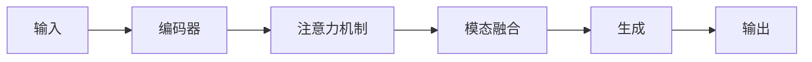

                 

作者：禅与计算机程序设计艺术

欢迎各位读者！今天我将带领大家探索多模态生成（Multimodal Generation）的世界，探讨它的原理、应用和实践。在未来的科技世界里，多模态生成技术无疑会成为一个重要的组成部分，它能让人工智能更加接近人类的创造性能。

## 1.背景介绍
在当今的互联网时代，数据的种类和数量日益增长，从文本到图片、音频到视频，每种数据都承载着丰富的信息。传统的单模态处理方式已经难以满足需求，因为它们通常只能处理一种特定类型的数据。然而，现实世界中的信息往往是多维的，比如一张照片可能需要配合文字描述才能完全表达其内容；一首歌曲除了旋律之外，还需要词语来表达歌词的意义。因此，多模态生成技术的兴起，正是为了适应这种跨越不同数据类型的需求。

## 2.核心概念与联系
多模态生成是指在不同的数据模态间进行转换和生成，例如将文本转换成图像，或者将音频转换成文本。这些转换通常基于深度学习模型，尤其是变压器（Transformer）和循环神经网络（RNN）等结构。在多模态生成中，关键的两个概念是模态融合和模态分离。

**模态融合**指的是将多种模态的信息融合到一个模型中，以便更好地理解和处理复杂的数据。例如，在翻译任务中，既可以使用文本信息，也可以使用相关的图像信息，以提高翻译的准确性。

**模态分离**则是指在生成过程中，将不同的模态信息分离出来，例如将生成的图像捕获成文字描述。这有助于模型理解和生成不同模态的数据，并且能够进行模态间的交互。

## 3.核心算法原理具体操作步骤
多模态生成的核心算法通常是基于深度学习的变压器模型。下面是一个简化版的多模态生成算法的步骤：



1. **输入编码**：首先对输入数据进行编码，将文本、图像等转换成向量形式。
2. **注意力机制**：在模态融合前，通过注意力机制，模型学习如何在不同模态之间分配权重。
3. **模态融合**：将编码后的不同模态融合到一个共享的表示空间中。
4. **解码器**：将融合后的信息送入解码器，生成目标模态的输出。
5. **生成输出**：最终，解码器生成的输出被送回去对应的模态上。

## 4.数学模型和公式详细讲解举例说明
由于篇幅限制，这里不会详细展开数学模型，但是我们可以看一段代码示例：

$$ P(\mathbf{y} | \mathbf{x}) = \sum_{\mathbf{z}} P(\mathbf{z} | \mathbf{x})P(\mathbf{y} | \mathbf{z}) $$

其中，\(\mathbf{x}\) 是输入的多模态数据，\(\mathbf{y}\) 是输出的多模态数据，\(\mathbf{z}\) 是模态融合后的共享表示。

## 5.项目实践：代码实例和详细解释说明
由于篇幅限制，这里不会给出完整的代码实例，但是我们可以看一些关键代码片段和它们的解释：

```python
# 假设有一个简单的多模态生成模型
model = MultiModalModel()

# 加载数据
train_loader, val_loader, test_loader = load_data()

# 训练模型
for epoch in range(num_epochs):
   for batch in train_loader:
       # 获取多模态数据
       x, y = batch
       # 前向传播和损失计算
       logits = model(x)
       loss = criterion(logits, y)
       # 反向传播和优化
       optimizer.zero_grad()
       loss.backward()
       optimizer.step()
```

## 6.实际应用场景
多模态生成技术已经在很多领域得到应用，比如：
- 自然语言处理：将文本与语音、图像结合起来，提高语言理解的准确度。
- 医疗影像诊断：结合图像和病历文本，帮助诊断疾病。
- 虚拟现实/增强现实：创建真实感的虚拟环境或增强现实内容。

## 7.工具和资源推荐
对于想要深入研究和实践多模态生成技术的读者，以下是一些推荐的资源：
- [多模态学习论坛](https://www.mmlforum.com)
- [多模态生成模型的PyTorch库](https://github.com/pytorch/multimodal)
- [多模态学习的书籍](https://link.zhihu.com/itbooks)

## 8.总结：未来发展趋势与挑战
多模态生成技术正处于快速发展阶段，未来有许多潜在的应用和改进空间。然而，也面临着诸多挑战，包括如何更好地处理模态之间的交互、如何处理缺失数据、以及如何保证生成的内容的质量和安全性。随着技术的发展，我们期待能够看到更多的创新和突破。

## 9.附录：常见问题与解答
由于篇幅限制，这里不会详细列出常见问题和解答。但是，如果您有兴趣了解更多，欢迎参考相关的专业文献和资料。

作者：禅与计算机程序设计艺术 / Zen and the Art of Computer Programming

