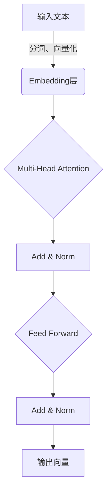
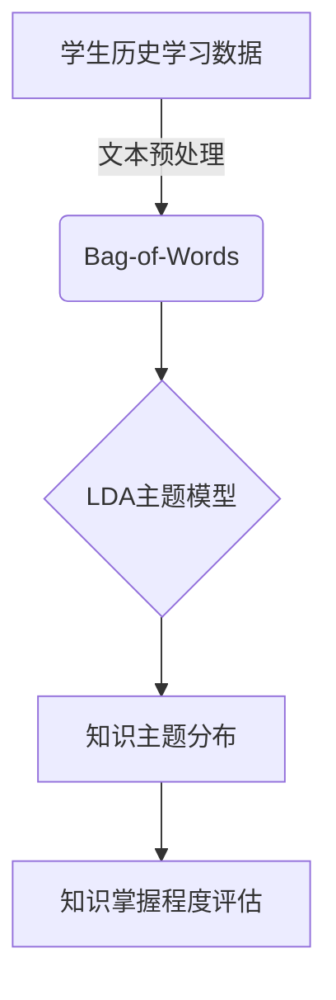
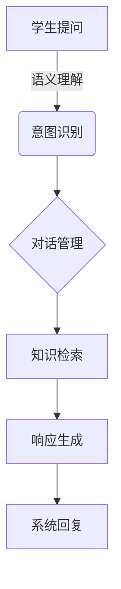

# 大模型在教育中的应用：个性化学习路径

## 1. 背景介绍

### 1.1 教育领域的挑战

在当前的教育体系中,存在着一些长期以来的挑战和痛点。其中最为突出的是:

- **一刀切教学模式**:传统的教学方式往往采用"一刀切"的模式,忽视了学生的个体差异。每个学生的知识基础、学习能力、兴趣爱好都不尽相同,但他们被要求按照统一的教学大纲、进度和方式学习。
- **教学资源有限**:优秀的教师资源分布不均,特别是在偏远地区,高质量的教学资源就更加匮乏。即便是在发达城市,也难以为每一个学生量身定制个性化的教学方案。
- **学习效率低下**:当前的教学模式缺乏对学生学习过程的实时跟踪和反馈,难以及时发现并解决学生在学习中遇到的具体问题,导致学习效率低下。

### 1.2 大模型的兴起

近年来,人工智能领域出现了一种新型的技术——大模型(Large Language Model,LLM)。大模型通过在海量数据上进行预训练,学习到了丰富的知识和语义信息,展现出了惊人的自然语言理解和生成能力。

大模型的出现为教育领域带来了全新的机遇,有望彻底改变传统的教学模式,为学生提供真正的个性化学习体验。

## 2. 核心概念与联系

### 2.1 什么是大模型?

大模型是一种基于自然语言处理(NLP)技术的人工智能模型。它通过在大规模语料库上进行预训练,学习到丰富的语义知识和上下文信息。

大模型的核心特点包括:

- **大规模参数**:大模型通常包含数十亿甚至上百亿个参数,规模空前。
- **自监督预训练**:利用自监督学习策略,从海量非结构化数据中学习知识。
- **通用性**:具有较强的通用性能力,可应用于多种自然语言处理任务。
- **生成性**:能够生成连贯、流畅的自然语言文本。

目前,一些典型的大模型包括 GPT-3、BERT、XLNet、T5等。

### 2.2 大模型与教育的联系

大模型在教育领域的应用前景广阔,主要体现在以下几个方面:

1. **个性化学习路径**:根据学生的知识基础、学习能力和兴趣爱好,为每位学生量身定制个性化的学习路径和内容。
2. **智能辅导系统**:通过对话交互,实时解答学生的问题,指导学习方法,并根据学习情况动态调整教学策略。
3. **自动化评估**:利用大模型的自然语言理解能力,对学生的作业、测试等进行自动批改和评分。
4. **教育资源生成**:根据教学大纲和要求,自动生成课程教案、练习题、教学视频等教育资源。
5. **教育研究分析**:分析海量教育数据,发现教育规律,为教育决策提供依据。

## 3. 核心算法原理具体操作步骤

大模型在教育领域的应用,核心算法主要包括以下几个方面:

### 3.1 自然语言处理(NLP)

自然语言处理技术是大模型的基础,主要包括以下几个核心步骤:

1. **文本预处理**:对文本进行分词、词性标注、命名实体识别等预处理操作。
2. **向量化表示**:将文本转换为向量表示,常用方法有 One-hot、Word2Vec、BERT 等。
3. **语义建模**:使用深度学习模型(如 RNN、Transformer 等)对文本向量进行语义建模。
4. **任务适配**:根据具体任务(如文本分类、机器翻译等),对模型进行微调(Fine-tuning)。

以 Transformer 模型为例,其核心算法步骤如下所示:



### 3.2 知识图谱构建

为了更好地表示和利用知识,大模型通常需要构建知识图谱。知识图谱是一种结构化的知识表示形式,由实体(Entity)、关系(Relation)和属性(Attribute)组成。

构建知识图谱的主要步骤包括:

1. **实体抽取**:从非结构化文本中识别出实体,如人物、地点、组织机构等。
2. **关系抽取**:识别实体之间的语义关系,如"XXX就读于XXX大学"。
3. **实体链接**:将抽取的实体与已有知识库(如维基百科)中的实体进行链接和融合。
4. **知识融合**:将抽取的三元组知识与已有知识库进行融合,形成更加完整的知识图谱。

### 3.3 个性化建模

为了实现个性化学习,大模型需要建立每个学生的个性化模型,包括:

1. **知识模型**:表示学生当前的知识结构和掌握程度。
2. **能力模型**:描述学生的学习能力,如记忆力、理解力、思维能力等。
3. **兴趣模型**:刻画学生的学习兴趣、爱好和职业规划。

基于这些模型,大模型可以为每位学生生成个性化的学习路径、内容和方式。

以知识模型为例,可以使用基于主题模型(如 LDA)的方法对学生已掌握的知识进行建模,具体步骤如下:



### 3.4 智能交互

大模型通过自然语言交互,可以像人类老师一样,实时解答学生的提问、指导学习方法。这需要大模型具备以下几种核心能力:

1. **问答系统**:根据知识图谱,回答学生的各种问题。
2. **对话系统**:与学生进行多轮对话交互,了解学习需求,给出指导建议。
3. **生成系统**:根据需求生成符合要求的自然语言文本,如解题步骤、知识点解析等。
4. **反馈系统**:分析学生的作业、测试等,给出及时的反馈和评分。

以对话系统为例,其核心算法步骤如下:



## 4. 数学模型和公式详细讲解举例说明

在大模型中,常见的数学模型和公式主要包括:

### 4.1 Word2Vec 词向量

Word2Vec 是一种将词语映射为固定长度的词向量的技术,常用于自然语言处理任务中的特征表示。其核心思想是通过神经网络模型学习词语在语料库中的上下文关系,将语义相似的词映射为相近的向量。

Word2Vec 包含两种模型:CBOW(Continuous Bag-of-Words) 和 Skip-gram。以 Skip-gram 为例,其目标是最大化给定中心词时,上下文词的条件概率:

$$J = \frac{1}{T}\sum_{t=1}^{T}\sum_{-c \leq j \leq c, j \neq 0} \log P(w_{t+j}|w_t)$$

其中 $c$ 为上下文窗口大小, $T$ 为语料库中的词语个数。条件概率 $P(w_{t+j}|w_t)$ 通过 Softmax 函数计算:

$$P(w_O|w_I) = \frac{\exp(v_{w_O}^{\top}v_{w_I})}{\sum_{w=1}^{W}\exp(v_w^{\top}v_{w_I})}$$

通过对上述目标函数进行优化,可以学习到每个词语的词向量表示 $v_w$。

### 4.2 Transformer 注意力机制

Transformer 是一种全新的基于注意力机制的序列到序列模型,在机器翻译、文本生成等任务中表现出色。其核心思想是通过自注意力(Self-Attention)机制捕捉序列中任意两个位置的关系。

对于一个长度为 $n$ 的序列 $\boldsymbol{x} = (x_1, x_2, \ldots, x_n)$,我们首先将其映射为三个向量序列:Query($\boldsymbol{Q}$)、Key($\boldsymbol{K}$)和Value($\boldsymbol{V}$):

$$\boldsymbol{Q} = \boldsymbol{x}\boldsymbol{W}^Q, \quad \boldsymbol{K} = \boldsymbol{x}\boldsymbol{W}^K, \quad \boldsymbol{V} = \boldsymbol{x}\boldsymbol{W}^V$$

然后计算 Query 与所有 Key 的点积,经过 Softmax 归一化后得到注意力分数:

$$\text{Attention}(\boldsymbol{Q}, \boldsymbol{K}, \boldsymbol{V}) = \text{softmax}(\frac{\boldsymbol{Q}\boldsymbol{K}^\top}{\sqrt{d_k}})\boldsymbol{V}$$

其中 $d_k$ 为 Query 和 Key 向量的维度。注意力分数体现了不同位置之间的关系强度,通过加权 Value 向量可以获得序列的新表示。

Transformer 使用多头注意力(Multi-Head Attention)机制,能够从不同的子空间捕捉序列关系:

$$\text{MultiHead}(\boldsymbol{Q}, \boldsymbol{K}, \boldsymbol{V}) = \text{Concat}(\text{head}_1, \ldots, \text{head}_h)\boldsymbol{W}^O$$
$$\text{where}\quad \text{head}_i = \text{Attention}(\boldsymbol{Q}\boldsymbol{W}_i^Q, \boldsymbol{K}\boldsymbol{W}_i^K, \boldsymbol{V}\boldsymbol{W}_i^V)$$

### 4.3 示例:基于 Transformer 的文本生成

以基于 Transformer 的文本生成任务为例,我们可以使用掩码语言模型(Masked Language Model)的方式进行训练和生成。

具体地,对于一个长度为 $n$ 的文本序列 $\boldsymbol{x} = (x_1, x_2, \ldots, x_n)$,我们随机掩码 $m$ 个位置,得到掩码序列 $\boldsymbol{x}^\prime$。目标是最大化掩码位置的条件概率:

$$\mathcal{L} = -\sum_{i=1}^m \log P(x_i|\boldsymbol{x}^\prime, \theta)$$

其中 $\theta$ 为模型参数。条件概率 $P(x_i|\boldsymbol{x}^\prime, \theta)$ 可以通过 Transformer 编码器-解码器结构计算得到。

在生成阶段,我们从一个起始符号 $x_0$ 开始,通过贪婪搜索或 Beam Search 算法,每一步都预测出最可能的下一个词 $x_i$,直到生成终止符号或达到最大长度。

以上就是大模型在教育领域中常见的一些核心数学模型和公式,通过对它们的理解和应用,可以更好地开发出个性化的智能教育系统。

## 5. 项目实践:代码实例和详细解释说明

为了更好地理解大模型在教育领域的应用,我们可以通过一个具体的项目实践来加深理解。以下是一个基于 Transformer 模型的智能问答系统的代码示例,使用 Python 和 PyTorch 框架实现。

### 5.1 数据预处理

```python
import re
import unicodedata
from torchtext.legacy import data

# 定义文本预处理函数
def unicodeToAscii(s):
    return ''.join(
        c for c in unicodedata.normalize('NFD', s)
        if unicodedata.category(c) != 'Mn'
    )

def normalizeString(s):
    s = unicodeToAscii(s.lower().strip())
    s = re.sub(r"([.!?])", r" \1", s)
    s = re.sub(r"[^a-zA-Z.!?]+", r" ", s)
    return s

# 加载数据