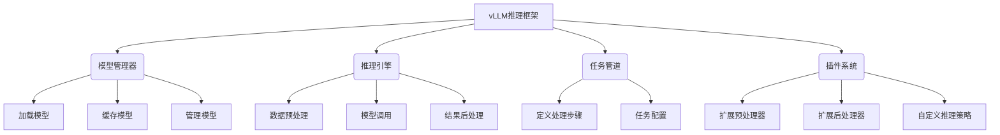

# 大规模语言模型从理论到实践 vLLM推理框架实践

## 1. 背景介绍

### 1.1 人工智能的崛起

近年来,人工智能(AI)技术的飞速发展正在改变着我们的生活和工作方式。大规模语言模型(Large Language Model,LLM)作为人工智能的一个重要分支,已经在自然语言处理、机器翻译、问答系统等领域展现出了令人惊叹的能力。

### 1.2 大规模语言模型的兴起

传统的自然语言处理模型通常基于规则或统计方法,但存在一些局限性。而大规模语言模型则是基于深度学习技术,通过训练海量的文本数据,学习语言的内在规律和语义关系。经过不断迭代,大规模语言模型的性能已经超越了人类水平,成为了自然语言处理领域的主导技术。

### 1.3 vLLM推理框架的重要性

随着大规模语言模型的不断发展,如何高效地利用这些模型进行推理和决策,成为了一个亟待解决的问题。vLLM(Versatile Large Language Model)推理框架应运而生,旨在提供一种统一、高效的方式来管理和调用大规模语言模型,实现各种自然语言处理任务。

## 2. 核心概念与联系

### 2.1 大规模语言模型

大规模语言模型是一种基于深度学习的自然语言处理模型,通过训练海量文本数据,学习语言的语法、语义和上下文关系。常见的大规模语言模型包括GPT(Generative Pre-trained Transformer)、BERT(Bidirectional Encoder Representations from Transformers)等。

这些模型通常采用Transformer架构,具有自注意力机制,能够有效捕捉长距离依赖关系。通过预训练和微调,大规模语言模型可以应用于各种自然语言处理任务,如机器翻译、文本生成、问答系统等。

### 2.2 vLLM推理框架

vLLM推理框架是一个统一的平台,旨在简化大规模语言模型的管理和调用过程。它提供了一套标准的API和工具,使开发人员可以轻松地集成和部署各种大规模语言模型,并在不同的任务和场景中进行推理和决策。

该框架的核心思想是将模型推理过程抽象为一系列可配置的步骤,每个步骤都可以根据需求进行定制和扩展。这种模块化设计提高了系统的灵活性和可扩展性,同时也简化了模型的管理和维护工作。

### 2.3 核心组件

vLLM推理框架由以下几个核心组件组成:

1. **模型管理器(Model Manager)**: 负责加载、缓存和管理各种大规模语言模型。
2. **推理引擎(Inference Engine)**: 执行实际的模型推理过程,包括数据预处理、模型调用和结果后处理等步骤。
3. **任务管道(Task Pipeline)**: 定义了一系列处理步骤,用于完成特定的自然语言处理任务,如问答、文本生成等。
4. **插件系统(Plugin System)**: 允许开发人员扩展框架的功能,如添加新的预处理器、后处理器或自定义推理策略。

这些组件协同工作,为开发人员提供了一个灵活、高效的平台,用于利用大规模语言模型进行各种自然语言处理任务。

## 3. 核心算法原理具体操作步骤

### 3.1 Transformer架构

大规模语言模型的核心架构是Transformer,它由编码器(Encoder)和解码器(Decoder)组成。Transformer采用了自注意力机制,能够有效捕捉长距离依赖关系,从而提高了模型的性能。

#### 3.1.1 编码器(Encoder)

编码器的主要作用是将输入序列(如文本)映射为一系列向量表示。它由多个相同的编码器层组成,每个编码器层包含两个子层:

1. **多头自注意力子层(Multi-Head Attention Sublayer)**: 计算输入序列中每个单词与其他单词的注意力权重,捕捉长距离依赖关系。
2. **前馈神经网络子层(Feed-Forward Neural Network Sublayer)**: 对每个单词的向量表示进行非线性转换,提取更高级的特征。

#### 3.1.2 解码器(Decoder)

解码器的作用是根据编码器的输出和目标序列(如需要生成的文本)生成最终的输出序列。它也由多个相同的解码器层组成,每个解码器层包含三个子层:

1. **掩码多头自注意力子层(Masked Multi-Head Attention Sublayer)**: 计算目标序列中每个单词与其他单词的注意力权重,但会掩码未来的单词,以保证每个单词只依赖于过去的信息。
2. **编码器-解码器注意力子层(Encoder-Decoder Attention Sublayer)**: 计算目标序列中每个单词与编码器输出的注意力权重,捕捉输入序列和目标序列之间的关系。
3. **前馈神经网络子层(Feed-Forward Neural Network Sublayer)**: 对每个单词的向量表示进行非线性转换,提取更高级的特征。

#### 3.1.3 自注意力机制

自注意力机制是Transformer架构的核心,它允许模型捕捉输入序列中任意两个单词之间的依赖关系。具体来说,自注意力机制会计算每个单词与其他单词之间的注意力权重,然后根据这些权重对单词的向量表示进行加权求和,得到新的向量表示。

自注意力机制可以通过以下步骤实现:

1. 计算查询(Query)、键(Key)和值(Value)矩阵,它们都是输入序列的线性映射。
2. 计算查询和键的点积,得到注意力分数矩阵。
3. 对注意力分数矩阵进行缩放和软最大化,得到注意力权重矩阵。
4. 将注意力权重矩阵与值矩阵相乘,得到新的向量表示。

多头自注意力机制是将多个自注意力机制的输出进行拼接,以捕捉不同的依赖关系。

### 3.2 预训练与微调

大规模语言模型通常采用两阶段训练策略:预训练(Pre-training)和微调(Fine-tuning)。

#### 3.2.1 预训练

预训练阶段的目标是在大量无监督文本数据上训练模型,学习通用的语言表示。常见的预训练目标包括:

1. **掩码语言模型(Masked Language Modeling, MLM)**: 随机掩码部分单词,要求模型预测被掩码的单词。
2. **下一句预测(Next Sentence Prediction, NSP)**: 要求模型判断两个句子是否相关。

通过预训练,模型可以学习到语言的语法、语义和上下文信息,为后续的微调阶段打下基础。

#### 3.2.2 微调

微调阶段的目标是在特定的任务数据集上对预训练模型进行进一步训练,使其适应特定的任务。微调过程通常包括以下步骤:

1. 初始化模型参数为预训练得到的参数值。
2. 在任务数据集上训练模型,优化任务相关的损失函数。
3. 根据需要,可以对模型的部分层进行微调,或者对整个模型进行微调。

通过微调,模型可以学习到任务相关的知识,提高在特定任务上的性能。

### 3.3 生成式任务

大规模语言模型可以应用于各种生成式任务,如机器翻译、文本摘要、对话系统等。生成式任务的核心步骤如下:

1. **输入编码**: 将输入序列(如源语言文本)输入编码器,得到编码器的输出向量表示。
2. **序列生成**: 解码器根据编码器的输出和已生成的部分序列,预测下一个单词,直到生成完整序列(如目标语言文本)。
3. **搜索策略**: 在生成过程中,需要采用合适的搜索策略来选择最优的输出序列,如贪心搜索、束搜索等。

生成式任务的质量通常由评估指标来衡量,如BLEU(机器翻译)、ROUGE(文本摘要)等。

### 3.4 判别式任务

除了生成式任务,大规模语言模型也可以应用于各种判别式任务,如文本分类、命名实体识别、关系抽取等。判别式任务的核心步骤如下:

1. **输入编码**: 将输入序列(如文本)输入编码器,得到编码器的输出向量表示。
2. **分类头(Classification Head)**: 在编码器的输出向量表示基础上,添加一个分类头(如全连接层),用于预测任务相关的标签或类别。
3. **损失计算与优化**: 计算预测结果与真实标签之间的损失,并通过梯度下降等优化算法更新模型参数。

判别式任务的质量通常由评估指标来衡量,如准确率(Accuracy)、F1分数等。

### 3.5 prompt学习

prompt学习是一种新兴的范式,旨在通过设计合适的prompt(提示)来指导大规模语言模型完成特定的任务。prompt可以是一段自然语言文本,也可以是一些特殊的符号或模板。

prompt学习的核心步骤如下:

1. **prompt设计**: 根据任务需求,设计合适的prompt,包括prompt的内容、格式和结构。
2. **prompt编码**: 将设计好的prompt编码为模型可以理解的向量表示。
3. **prompt学习**: 在任务数据集上,优化prompt的向量表示,使得模型在给定prompt的情况下,可以生成正确的输出。
4. **推理**: 在推理阶段,使用优化后的prompt向量表示,指导模型完成特定的任务。

prompt学习的优点是可以避免从头开始训练大规模语言模型,只需要优化较小的prompt向量表示,从而节省计算资源。同时,prompt学习也可以提高模型的可解释性和可控性。

## 4. 数学模型和公式详细讲解举例说明

### 4.1 自注意力机制

自注意力机制是Transformer架构的核心,它允许模型捕捉输入序列中任意两个单词之间的依赖关系。具体来说,自注意力机制会计算每个单词与其他单词之间的注意力权重,然后根据这些权重对单词的向量表示进行加权求和,得到新的向量表示。

设输入序列为 $X = (x_1, x_2, \dots, x_n)$,其中 $x_i$ 表示第 $i$ 个单词的向量表示。自注意力机制的计算过程如下:

1. 计算查询(Query)、键(Key)和值(Value)矩阵:

$$
Q = XW^Q \\
K = XW^K \\
V = XW^V
$$

其中 $W^Q$、$W^K$ 和 $W^V$ 分别是查询、键和值的线性变换矩阵。

2. 计算注意力分数矩阵:

$$
\text{Attention}(Q, K, V) = \text{softmax}\left(\frac{QK^T}{\sqrt{d_k}}\right)V
$$

其中 $d_k$ 是缩放因子,用于防止注意力分数过大或过小。

3. 多头自注意力机制将多个自注意力机制的输出进行拼接:

$$
\text{MultiHead}(Q, K, V) = \text{Concat}(head_1, \dots, head_h)W^O
$$

其中 $head_i = \text{Attention}(QW_i^Q, KW_i^K, VW_i^V)$,表示第 $i$ 个注意力头,共有 $h$ 个注意力头。$W_i^Q$、$W_i^K$、$W_i^V$ 和 $W^O$ 都是可学习的线性变换矩阵。

通