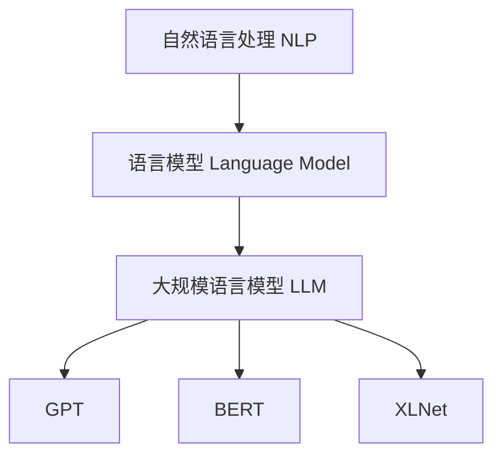

# 大规模语言模型从理论到实践 代码结构

## 1.背景介绍

### 1.1 人工智能的发展

人工智能(Artificial Intelligence, AI)是当代科技发展的前沿领域,近年来取得了长足的进步。语言模型作为自然语言处理(Natural Language Processing, NLP)的核心技术,已经广泛应用于机器翻译、问答系统、文本生成等各种场景。

### 1.2 大规模语言模型的兴起

传统的语言模型通常基于n-gram统计模型或神经网络,但受限于计算能力和数据量,很难捕捉语言的深层次语义信息。随着算力的飞速提升和海量语料的积累,大规模语言模型(Large Language Model, LLM)应运而生,能够从大量无标注文本中学习语言知识,展现出惊人的泛化能力。

### 1.3 大规模语言模型的影响

大规模语言模型不仅在学术界引起广泛关注,也在产业界产生了深远影响。像GPT、BERT、XLNet等模型极大地推动了NLP技术的发展,为智能系统带来了全新的认知能力。同时,大规模语言模型也面临着诸如数据隐私、知识安全等重大挑战。

## 2.核心概念与联系

### 2.1 自然语言处理(NLP)

自然语言处理是人工智能的一个分支,旨在使计算机能够理解和生成人类语言。NLP技术广泛应用于机器翻译、文本挖掘、问答系统等领域。

### 2.2 语言模型(Language Model)

语言模型是NLP的核心技术之一,用于捕捉语言的统计规律和语义信息。传统的语言模型包括n-gram模型、神经网络语言模型等。

### 2.3 大规模语言模型(LLM)

大规模语言模型是指使用大量计算资源和海量语料训练的巨大神经网络模型,能够从海量无标注文本中学习丰富的语言知识。常见的LLM包括GPT、BERT、XLNet等。



## 3.核心算法原理具体操作步骤  

### 3.1 transformer架构

大规模语言模型通常基于transformer架构,该架构由编码器(encoder)和解码器(decoder)组成。编码器将输入序列编码为隐藏表示,解码器则根据隐藏表示生成输出序列。


#### 3.1.1 自注意力机制(Self-Attention)

自注意力机制是transformer的核心,它允许每个位置的输出与输入序列的其他位置相关联,捕捉长距离依赖关系。

$$\mathrm{Attention}(Q, K, V) = \mathrm{softmax}(\frac{QK^T}{\sqrt{d_k}})V$$

其中$Q$为查询(Query)、$K$为键(Key)、$V$为值(Value),$d_k$为缩放因子。

#### 3.1.2 多头注意力(Multi-Head Attention)

多头注意力将注意力分成多个并行的"头"运算,每个头捕捉不同的关系,最后将所有头的结果拼接起来。

$$\mathrm{MultiHead}(Q, K, V) = \mathrm{Concat}(head_1, ..., head_h)W^O$$

其中$head_i = \mathrm{Attention}(QW_i^Q, KW_i^K, VW_i^V)$。

#### 3.1.3 前馈神经网络(Feed-Forward Network)

每个编码器/解码器层中还包含一个前馈全连接神经网络,对序列进行更深层次的非线性变换。

$$\mathrm{FFN}(x) = \max(0, xW_1 + b_1)W_2 + b_2$$

### 3.2 预训练与微调(Pre-training & Fine-tuning)

大规模语言模型通常采用两阶段训练方式:

1. **预训练(Pre-training)**: 使用无监督学习方式,在大量未标注语料上训练模型,学习通用的语言知识。

2. **微调(Fine-tuning)**: 将预训练模型在有标注的下游任务数据上进行进一步训练,使模型适应特定的任务。

这种预训练+微调的范式大幅提高了模型的性能和泛化能力。

### 3.3 常见预训练目标

#### 3.3.1 掩码语言模型(Masked Language Model)

在输入序列中随机掩码部分单词,模型需要预测被掩码的单词。这促使模型学习双向语境信息。

#### 3.3.2 下一句预测(Next Sentence Prediction)

判断两个句子是否为连续的句子对,促使模型学习捕捉句子间的逻辑关系。

#### 3.3.3 序列到序列预训练(Sequence-to-Sequence Pre-training)

输入和输出都是文本序列,模型需要生成与输入相关的输出序列,如机器翻译、文本摘要等。

## 4.数学模型和公式详细讲解举例说明

在transformer模型中,自注意力机制是捕捉序列元素之间关系的关键。我们以一个简单的例子来说明自注意力的计算过程。

假设我们有一个长度为4的输入序列$X = (x_1, x_2, x_3, x_4)$,我们希望计算第3个位置$x_3$的自注意力表示。

1. 首先,我们将输入序列$X$分别通过三个线性变换,得到查询(Query)、键(Key)和值(Value)矩阵:

$$Q = XW_Q, K = XW_K, V = XW_V$$

其中$W_Q, W_K, W_V$为可训练参数。

2. 计算查询$q_3$与所有键$k_j$的点积,得到注意力分数:

$$e_j = q_3 \cdot k_j, \quad j = 1, 2, 3, 4$$

3. 对注意力分数做softmax归一化,得到注意力权重:

$$\alpha_j = \frac{\exp(e_j)}{\sum_{i=1}^4 \exp(e_i)}$$

4. 将注意力权重与值矩阵相乘,得到加权和作为$x_3$的自注意力表示:

$$\mathrm{Attention}(x_3) = \sum_{j=1}^4 \alpha_j v_j$$

通过这种方式,自注意力机制能够自适应地捕捉序列元素之间的关系,赋予不同位置的元素不同的权重。

## 5.项目实践:代码实例和详细解释说明

下面是一个使用PyTorch实现的简化版transformer模型,用于机器翻译任务。

### 5.1 导入库

```python
import torch
import torch.nn as nn
import math
```

### 5.2 位置编码(Positional Encoding)

由于transformer没有使用RNN或CNN捕捉序列顺序,因此需要添加位置编码来注入位置信息。

```python
class PositionalEncoding(nn.Module):
    def __init__(self, d_model, dropout=0.1, max_len=5000):
        super(PositionalEncoding, self).__init__()
        self.dropout = nn.Dropout(p=dropout)
        pe = torch.zeros(max_len, d_model)
        position = torch.arange(0, max_len, dtype=torch.float).unsqueeze(1)
        div_term = torch.exp(torch.arange(0, d_model, 2).float() * (-math.log(10000.0) / d_model))
        pe[:, 0::2] = torch.sin(position * div_term)
        pe[:, 1::2] = torch.cos(position * div_term)
        pe = pe.unsqueeze(0).transpose(0, 1)
        self.register_buffer('pe', pe)

    def forward(self, x):
        x = x + self.pe[:x.size(0), :]
        return self.dropout(x)
```

### 5.3 多头注意力(Multi-Head Attention)

```python
class MultiHeadAttention(nn.Module):
    def __init__(self, heads, d_model, dropout=0.1):
        super().__init__()
        self.d_model = d_model
        self.d_k = d_model // heads
        self.h = heads
        self.q_linear = nn.Linear(d_model, d_model)
        self.v_linear = nn.Linear(d_model, d_model)
        self.k_linear = nn.Linear(d_model, d_model)
        self.dropout = nn.Dropout(dropout)
        self.out = nn.Linear(d_model, d_model)

    def forward(self, q, k, v, mask=None):
        bs = q.size(0)
        k = self.k_linear(k).view(bs, -1, self.h, self.d_k)
        q = self.q_linear(q).view(bs, -1, self.h, self.d_k)
        v = self.v_linear(v).view(bs, -1, self.h, self.d_k)
        k = k.transpose(1, 2)
        q = q.transpose(1, 2)
        v = v.transpose(1, 2)
        scores = attention(q, k, v, self.d_k, mask, self.dropout)
        concat = scores.transpose(1, 2).contiguous().view(bs, -1, self.d_model)
        output = self.out(concat)
        return output
```

其中`attention`函数计算了注意力权重:

```python
def attention(q, k, v, d_k, mask=None, dropout=None):
    scores = torch.matmul(q, k.transpose(-2, -1)) / math.sqrt(d_k)
    if mask is not None:
        mask = mask.unsqueeze(1)
        scores = scores.masked_fill(mask == 0, -1e9)
    scores = F.softmax(scores, dim=-1)
    if dropout is not None:
        scores = dropout(scores)
    output = torch.matmul(scores, v)
    return output
```

### 5.4 编码器层(Encoder Layer)

```python
class EncoderLayer(nn.Module):
    def __init__(self, d_model, heads, dropout=0.1):
        super().__init__()
        self.norm_1 = nn.LayerNorm(d_model)
        self.norm_2 = nn.LayerNorm(d_model)
        self.attn = MultiHeadAttention(heads, d_model)
        self.ff = nn.Sequential(
            nn.Linear(d_model, 4 * d_model),
            nn.ReLU(),
            nn.Linear(4 * d_model, d_model)
        )
        self.dropout_1 = nn.Dropout(dropout)
        self.dropout_2 = nn.Dropout(dropout)

    def forward(self, x, mask):
        x2 = self.norm_1(x)
        x = x + self.dropout_1(self.attn(x2, x2, x2, mask))
        x2 = self.norm_2(x)
        x = x + self.dropout_2(self.ff(x2))
        return x
```

### 5.5 解码器层(Decoder Layer)

```python
class DecoderLayer(nn.Module):
    def __init__(self, d_model, heads, dropout=0.1):
        super().__init__()
        self.norm_1 = nn.LayerNorm(d_model)
        self.norm_2 = nn.LayerNorm(d_model)
        self.norm_3 = nn.LayerNorm(d_model)

        self.dropout_1 = nn.Dropout(dropout)
        self.dropout_2 = nn.Dropout(dropout)
        self.dropout_3 = nn.Dropout(dropout)

        self.attn_1 = MultiHeadAttention(heads, d_model)
        self.attn_2 = MultiHeadAttention(heads, d_model)
        self.ff = nn.Sequential(
            nn.Linear(d_model, 4 * d_model),
            nn.ReLU(),
            nn.Linear(4 * d_model, d_model)
        )

    def forward(self, x, e_outputs, src_mask, trg_mask):
        x2 = self.norm_1(x)
        x = x + self.dropout_1(self.attn_1(x2, x2, x2, trg_mask))
        x2 = self.norm_2(x)
        x = x + self.dropout_2(self.attn_2(x2, e_outputs, e_outputs, src_mask))
        x2 = self.norm_3(x)
        x = x + self.dropout_3(self.ff(x2))
        return x
```

### 5.6 编码器(Encoder)

```python
class Encoder(nn.Module):
    def __init__(self, d_model, N, heads):
        super().__init__()
        self.N = N
        self.pe = PositionalEncoding(d_model)
        self.layers = nn.ModuleList([EncoderLayer(d_model, heads) for _ in range(N)])
        self.norm = nn.LayerNorm(d_model)

    def forward(self, src, mask):
        x = self.pe(src)
        for i in range(self.N):
            x = self.layers[i](x, mask)
        return self.norm(x)
```

### 5.7 解码器(Decoder