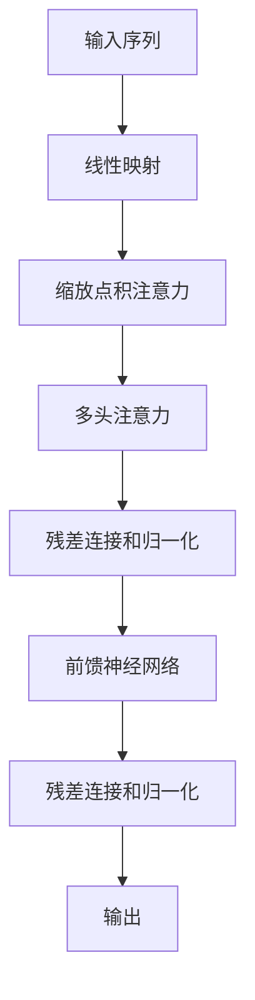
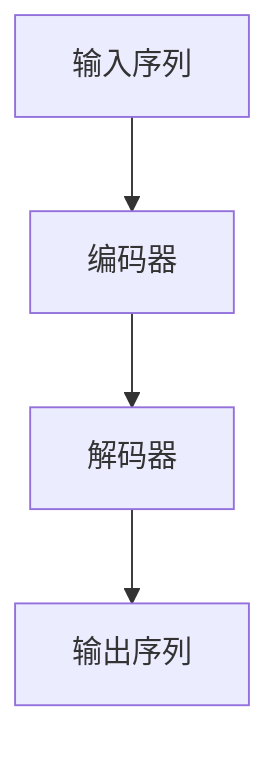

# 大规模语言模型从理论到实践 实践思考

## 1. 背景介绍

### 1.1 语言模型的重要性

语言模型是自然语言处理领域的核心技术之一,它们被广泛应用于机器翻译、语音识别、文本生成、问答系统等各种任务中。近年来,随着深度学习技术的快速发展,基于神经网络的大规模语言模型取得了令人瞩目的成就,展现出强大的语言理解和生成能力。

### 1.2 大规模语言模型的兴起

传统的语言模型通常基于统计方法,如n-gram模型,但它们受到数据稀疏问题的限制,难以捕捉长距离依赖关系。而基于神经网络的语言模型,尤其是基于Transformer的大规模语言模型,通过自注意力机制有效地捕捉长距离依赖关系,并且可以在海量数据上进行预训练,获得丰富的语言知识。

代表性的大规模语言模型包括GPT(Generative Pre-trained Transformer)、BERT(Bidirectional Encoder Representations from Transformers)、XLNet、RoBERTa等,它们在各种自然语言处理任务上取得了state-of-the-art的表现。

## 2. 核心概念与联系

### 2.1 自注意力机制(Self-Attention)



自注意力机制是Transformer模型的核心,它通过计算输入序列中每个位置与其他位置的相关性,捕捉长距离依赖关系。具体来说,自注意力机制包括以下步骤:

1. 线性映射:将输入序列映射到查询(Query)、键(Key)和值(Value)向量。
2. 缩放点积注意力:计算查询向量与所有键向量的点积,除以缩放因子,得到注意力分数。
3. 软最大化:对注意力分数进行软最大化操作,得到注意力权重。
4. 加权求和:使用注意力权重对值向量进行加权求和,得到注意力输出。

### 2.2 多头注意力(Multi-Head Attention)

为了捕捉不同的相关模式,Transformer采用了多头注意力机制。它将查询、键和值向量进行线性映射,得到多组向量,分别计算注意力,最后将多头注意力的输出进行拼接。多头注意力机制可以关注不同的位置,捕捉更丰富的依赖关系。

### 2.3 位置编码(Positional Encoding)

由于自注意力机制没有捕捉序列顺序的能力,Transformer引入了位置编码,将位置信息编码到输入序列中。常见的位置编码方式包括正弦位置编码和可学习的位置嵌入。

### 2.4 预训练与微调(Pre-training & Fine-tuning)

大规模语言模型通常采用两阶段训练策略:

1. 预训练(Pre-training):在大规模无标注语料库上进行自监督训练,学习通用的语言表示。
2. 微调(Fine-tuning):在特定任务的标注数据上进行进一步训练,将预训练模型适应到目标任务。

这种策略可以有效利用大规模无标注数据,提高模型的泛化能力。

## 3. 核心算法原理具体操作步骤

### 3.1 Transformer模型架构

Transformer模型由编码器(Encoder)和解码器(Decoder)组成,两者都采用了多头自注意力和前馈神经网络。编码器将输入序列编码为隐藏表示,解码器则根据编码器的输出和前一步的输出,生成目标序列。



### 3.2 编码器(Encoder)

编码器由多个相同的层组成,每一层包括以下子层:

1. 多头自注意力子层:计算输入序列中每个位置与其他位置的注意力,捕捉长距离依赖关系。
2. 前馈神经网络子层:对每个位置的向量进行独立的前馈神经网络变换,提供非线性映射能力。
3. 残差连接和层归一化:为了保持梯度稳定,每个子层的输出都会与输入进行残差连接,并进行层归一化。

### 3.3 解码器(Decoder)

解码器的结构与编码器类似,但有以下不同:

1. 解码器中的自注意力子层被掩码,只允许关注当前位置及其之前的位置,以保证自回归生成的自动性。
2. 解码器还包含一个编码器-解码器注意力子层,计算目标序列中每个位置与输入序列中所有位置的注意力,捕捉输入和输出之间的依赖关系。

### 3.4 预训练任务

大规模语言模型通常采用自监督的预训练任务,如掩码语言模型(Masked Language Modeling, MLM)和下一句预测(Next Sentence Prediction, NSP)。

1. 掩码语言模型:随机掩码输入序列中的一些词,模型需要根据上下文预测被掩码的词。
2. 下一句预测:给定两个句子,模型需要预测第二个句子是否为第一个句子的下一句。

通过这些预训练任务,模型可以学习到丰富的语言知识和上下文表示能力。

## 4. 数学模型和公式详细讲解举例说明

### 4.1 自注意力计算

给定一个长度为 $n$ 的输入序列 $X = (x_1, x_2, \dots, x_n)$,自注意力机制的计算过程如下:

1. 线性映射:将输入序列 $X$ 映射到查询(Query)、键(Key)和值(Value)向量:

$$
Q = XW^Q, K = XW^K, V = XW^V
$$

其中 $W^Q, W^K, W^V$ 分别为查询、键和值的线性映射矩阵。

2. 缩放点积注意力:计算查询向量与所有键向量的点积,除以缩放因子 $\sqrt{d_k}$,得到注意力分数:

$$
\text{Attention}(Q, K, V) = \text{softmax}\left(\frac{QK^T}{\sqrt{d_k}}\right)V
$$

其中 $d_k$ 为键向量的维度。

3. 多头注意力:将查询、键和值向量分别线性映射 $h$ 次,分别计算注意力,最后将多头注意力的输出进行拼接:

$$
\text{MultiHead}(Q, K, V) = \text{Concat}(head_1, \dots, head_h)W^O
$$

$$
\text{where } head_i = \text{Attention}(QW_i^Q, KW_i^K, VW_i^V)
$$

其中 $W_i^Q, W_i^K, W_i^V$ 为第 $i$ 个注意力头的线性映射矩阵, $W^O$ 为最终的线性映射矩阵。

### 4.2 位置编码

为了捕捉序列的位置信息,Transformer采用了位置编码,将其与输入序列相加。常见的位置编码方式包括正弦位置编码和可学习的位置嵌入。

正弦位置编码的公式如下:

$$
\begin{aligned}
PE_{(pos, 2i)} &= \sin\left(\frac{pos}{10000^{2i/d_\text{model}}}\right) \\
PE_{(pos, 2i+1)} &= \cos\left(\frac{pos}{10000^{2i/d_\text{model}}}\right)
\end{aligned}
$$

其中 $pos$ 为位置索引, $i$ 为维度索引, $d_\text{model}$ 为模型的隐藏维度。

可学习的位置嵌入则是将位置索引作为输入,通过一个嵌入层获得对应的位置向量。

## 5. 项目实践:代码实例和详细解释说明

以下是使用PyTorch实现Transformer模型的简化版本代码,包括编码器、解码器和多头自注意力机制。

```python
import torch
import torch.nn as nn
import math

class MultiHeadAttention(nn.Module):
    def __init__(self, d_model, num_heads):
        super(MultiHeadAttention, self).__init__()
        self.d_model = d_model
        self.num_heads = num_heads
        self.head_dim = d_model // num_heads

        self.query_proj = nn.Linear(d_model, d_model)
        self.key_proj = nn.Linear(d_model, d_model)
        self.value_proj = nn.Linear(d_model, d_model)
        self.output_proj = nn.Linear(d_model, d_model)

    def forward(self, query, key, value, mask=None):
        batch_size = query.size(0)

        query = self.query_proj(query).view(batch_size, -1, self.num_heads, self.head_dim).transpose(1, 2)
        key = self.key_proj(key).view(batch_size, -1, self.num_heads, self.head_dim).transpose(1, 2)
        value = self.value_proj(value).view(batch_size, -1, self.num_heads, self.head_dim).transpose(1, 2)

        attn_scores = torch.matmul(query, key.transpose(-2, -1)) / math.sqrt(self.head_dim)
        if mask is not None:
            attn_scores = attn_scores.masked_fill(mask == 0, -1e9)

        attn_probs = nn.Softmax(dim=-1)(attn_scores)
        attn_output = torch.matmul(attn_probs, value)
        attn_output = attn_output.transpose(1, 2).contiguous().view(batch_size, -1, self.d_model)

        output = self.output_proj(attn_output)
        return output

class TransformerEncoderLayer(nn.Module):
    def __init__(self, d_model, num_heads, ffn_dim, dropout_rate):
        super(TransformerEncoderLayer, self).__init__()
        self.attention = MultiHeadAttention(d_model, num_heads)
        self.ffn = nn.Sequential(
            nn.Linear(d_model, ffn_dim),
            nn.ReLU(),
            nn.Dropout(dropout_rate),
            nn.Linear(ffn_dim, d_model),
            nn.Dropout(dropout_rate)
        )
        self.norm1 = nn.LayerNorm(d_model)
        self.norm2 = nn.LayerNorm(d_model)
        self.dropout1 = nn.Dropout(dropout_rate)
        self.dropout2 = nn.Dropout(dropout_rate)

    def forward(self, x):
        residual = x
        x = self.norm1(x)
        x = self.attention(x, x, x) + residual
        x = self.dropout1(x)

        residual = x
        x = self.norm2(x)
        x = self.ffn(x) + residual
        x = self.dropout2(x)
        return x

class TransformerEncoder(nn.Module):
    def __init__(self, num_layers, d_model, num_heads, ffn_dim, dropout_rate):
        super(TransformerEncoder, self).__init__()
        self.layers = nn.ModuleList([
            TransformerEncoderLayer(d_model, num_heads, ffn_dim, dropout_rate)
            for _ in range(num_layers)
        ])

    def forward(self, x):
        for layer in self.layers:
            x = layer(x)
        return x

class TransformerDecoderLayer(nn.Module):
    def __init__(self, d_model, num_heads, ffn_dim, dropout_rate):
        super(TransformerDecoderLayer, self).__init__()
        self.self_attention = MultiHeadAttention(d_model, num_heads)
        self.encoder_attention = MultiHeadAttention(d_model, num_heads)
        self.ffn = nn.Sequential(
            nn.Linear(d_model, ffn_dim),
            nn.ReLU(),
            nn.Dropout(dropout_rate),
            nn.Linear(ffn_dim, d_model),
            nn.Dropout(dropout_rate)
        )
        self.norm1 = nn.LayerNorm(d_model)
        self.norm2 = nn.LayerNorm(d_model)
        self.norm3 = nn.LayerNorm(d_model)
        self.dropout1 = nn.Dropout(dropout_rate)
        self.dropout2 = nn.Dropout(dropout_rate)
        self.dropout3 = nn.Dropout(dropout_rate)

    def forward(self, x, encoder_output, look_ahead_mask, padding_mask):
        residual = x
        x = self.norm1(x)
        x = self.self_attention(x, x, x, look_ahead_mask) + residual
        x = self.dropout1(x)

        residual = x
        x = self.norm2(x)
        x = self.encoder_attention(x, encoder_output, encoder_output, padding_mask) + residual
        x = self.dropout2(x)

        residual = x
        x = self.norm3(x)
        x = self.ffn(x) + residual
        x