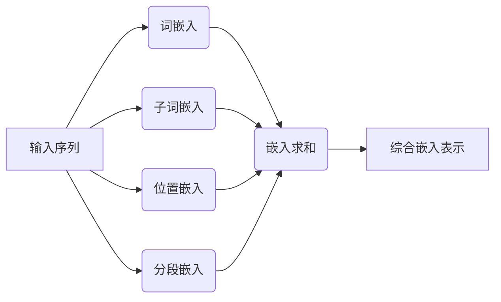

# 大规模语言模型从理论到实践：嵌入表示层

## 1. 背景介绍

### 1.1 自然语言处理的重要性

在当今信息时代,自然语言处理(NLP)已成为人工智能领域的关键技术之一。它使计算机能够理解、处理和生成人类语言,从而实现人机交互、信息检索、机器翻译等广泛应用。随着大数据和计算能力的不断提高,NLP技术也在不断发展和完善。

### 1.2 语言模型的作用

语言模型是NLP中的核心组成部分,旨在捕捉语言的统计规律和语义关系。传统的基于规则或统计方法的语言模型在处理复杂语言现象时存在局限性。近年来,基于深度学习的大规模语言模型(Large Language Model,LLM)凭借强大的表示能力和泛化性能,在各种NLP任务中取得了突破性进展。

### 1.3 嵌入表示层的重要性

嵌入表示层(Embedding Layer)是大规模语言模型的基础组件,负责将离散的词语或子词映射到连续的向量空间中。高质量的嵌入表示对于语言模型的性能至关重要,它决定了模型对语义和语法信息的捕获能力。本文将深入探讨嵌入表示层的理论基础、实现方法和优化技术,为读者提供全面的理解和实践指导。

## 2. 核心概念与联系

### 2.1 词嵌入(Word Embedding)

词嵌入是将单词映射到低维连续向量空间的技术,使得语义相似的词在向量空间中彼此靠近。经典的词嵌入模型包括Word2Vec和GloVe等。

### 2.2 子词嵌入(Subword Embedding)

子词嵌入是将单词拆分为更小的子词单元(如字符或字节对),然后将这些子词单元映射到向量空间。这种方法可以有效处理未见词和构词,提高了模型的泛化能力。常见的子词嵌入模型包括BytePair编码(BPE)和WordPiece等。

### 2.3 位置嵌入(Positional Embedding)

由于语言模型需要捕捉序列信息,位置嵌入被引入以编码每个词或子词在序列中的位置信息。常见的位置嵌入方法包括正弦/余弦位置编码和学习位置嵌入等。

### 2.4 分段嵌入(Segment Embedding)

在某些任务中,输入序列可能包含多个不同的段落或句子。分段嵌入被引入以区分不同段落,提高模型对上下文信息的理解能力。

### 2.5 嵌入表示层的组合

在实际应用中,嵌入表示层通常是词嵌入、子词嵌入、位置嵌入和分段嵌入的综合。这些嵌入表示被合并为最终的输入特征,送入后续的模型层进行处理。

## 3. 核心算法原理具体操作步骤

### 3.1 词嵌入算法

#### 3.1.1 Word2Vec

Word2Vec是一种流行的词嵌入算法,包括连续词袋(CBOW)和跳元模型(Skip-Gram)两种变体。它们的目标是根据上下文预测目标词或根据目标词预测上下文。

1. **CBOW模型**

   输入: 上下文词 $c_1, c_2, ..., c_C$
   
   目标: 预测目标词 $w_t$
   
   模型: $p(w_t | c_1, c_2, ..., c_C) = \frac{e^{v_{w_t}^{\top}v_c}}{\sum_{w \in V} e^{v_w^{\top}v_c}}$
   
   其中, $v_w$ 和 $v_c$ 分别是词 $w$ 和上下文的嵌入向量, $V$ 是词汇表。

2. **Skip-Gram模型**

   输入: 目标词 $w_t$
   
   目标: 预测上下文词 $c_1, c_2, ..., c_C$
   
   模型: $p(c | w_t) = \frac{e^{v_c^{\top}v_{w_t}}}{\sum_{c' \in V} e^{v_{c'}^{\top}v_{w_t}}}$
   
   其中, $v_c$ 和 $v_{w_t}$ 分别是上下文词 $c$ 和目标词 $w_t$ 的嵌入向量。

通过最大化目标函数,可以学习到词嵌入向量。

#### 3.1.2 GloVe

GloVe(Global Vectors for Word Representation)是另一种流行的词嵌入算法,它利用全局词-词共现统计信息来学习词向量。

1. 构建共现矩阵 $X$,其中 $X_{ij}$ 表示词 $i$ 和 $j$ 在语料库中的共现次数。

2. 构造一个对数平滑函数 $f(X_{ij}) = \begin{cases} 
      (\frac{X_{ij}}{X_i})^\alpha & \text{if } X_{ij} < X_{\max}\\
      1 & \text{otherwise}
   \end{cases}$

3. 定义损失函数: $J = \sum_{i,j=1}^{V} f(X_{ij})(w_i^{\top}\tilde{w}_j + b_i + \tilde{b}_j - \log X_{ij})^2$

4. 通过优化损失函数,学习词向量 $w_i$ 和 $\tilde{w}_j$,以及偏置项 $b_i$ 和 $\tilde{b}_j$。

GloVe能够有效捕捉线性正则化和非线性关系,产生高质量的词嵌入表示。

### 3.2 子词嵌入算法

#### 3.2.1 BytePair编码(BPE)

BPE是一种基于字节对的子词分词算法,可以有效减少词汇表的大小,并处理未见词。算法步骤如下:

1. 初始化词汇表为字符集合。
2. 在语料库中找到最频繁的字节对,并将其合并为一个新的子词单元,加入词汇表。
3. 重复步骤2,直到达到预设的词汇表大小或其他停止条件。
4. 对每个单词进行子词分词,并将其映射到子词嵌入向量序列。

例如,对于单词"unrelated",BPE可能将其分词为"un@@ re@@ lat@@ ed"。

#### 3.2.2 WordPiece

WordPiece是一种基于最大匹配模型的子词分词算法,常用于大规模语言模型。算法步骤如下:

1. 初始化词汇表为一个特殊的未知词符号[UNK]。
2. 对于每个单词,从左到右找到最长的子串匹配词汇表中的条目。如果没有匹配,则将该字符作为一个新的子词单元加入词汇表。
3. 重复步骤2,直到所有单词都被分词完毕。
4. 对每个单词进行子词分词,并将其映射到子词嵌入向量序列。

例如,对于单词"unrelated",WordPiece可能将其分词为"un@@ re@@ lated"。

### 3.3 位置嵌入算法

#### 3.3.1 正弦/余弦位置编码

正弦/余弦位置编码是一种固定的位置嵌入方法,它利用三角函数的周期性来编码位置信息。对于位置 $p$ 和嵌入维度 $i$,位置嵌入向量 $PE_{(p,i)}$ 定义为:

$$PE_{(p,i)} = \begin{cases}
\sin(p / 10000^{2i/d_{\text{model}}}) & \text{if } i \text{ is even}\\
\cos(p / 10000^{2i/d_{\text{model}}}) & \text{if } i \text{ is odd}
\end{cases}$$

其中 $d_{\text{model}}$ 是嵌入维度。这种编码方式允许模型自动学习相对位置信息,而不需要额外的位置嵌入参数。

#### 3.3.2 学习位置嵌入

另一种方法是将位置嵌入向量作为可学习的参数,与词嵌入和子词嵌入一样,通过模型训练来学习合适的位置表示。这种方法更加灵活,但需要更多的参数和训练数据。

### 3.4 分段嵌入算法

分段嵌入通常采用与位置嵌入类似的方法,将分段信息编码为一个可学习的嵌入向量,并与其他嵌入表示相加以提供额外的上下文信息。

## 4. 数学模型和公式详细讲解举例说明

### 4.1 词嵌入损失函数

在Word2Vec和GloVe等词嵌入算法中,通常采用以下损失函数来学习词向量:

$$J = -\frac{1}{N}\sum_{n=1}^{N}\sum_{c \in C(w_n)}\log p(c|w_n)$$

其中, $N$ 是语料库中的词数, $C(w_n)$ 是词 $w_n$ 的上下文词集合, $p(c|w_n)$ 是给定 $w_n$ 预测上下文词 $c$ 的概率。对于Word2Vec的Skip-Gram模型,该概率由下式给出:

$$p(c|w_n) = \frac{e^{v_c^{\top}v_{w_n}}}{\sum_{c' \in V} e^{v_{c'}^{\top}v_{w_n}}}$$

其中, $v_c$ 和 $v_{w_n}$ 分别是上下文词 $c$ 和目标词 $w_n$ 的嵌入向量, $V$ 是词汇表。

通过最小化损失函数 $J$,可以学习到能够最大化上下文预测概率的词嵌入向量。

### 4.2 子词嵌入组合

对于由多个子词组成的单词,需要将各个子词的嵌入向量进行组合,以得到该单词的综合嵌入表示。常见的组合方法包括求和、平均和加权求和等。

假设单词 $w$ 由子词序列 $\{s_1, s_2, ..., s_m\}$ 组成,其中 $v_{s_i}$ 是子词 $s_i$ 的嵌入向量,则单词 $w$ 的嵌入向量可以通过以下方式计算:

1. **求和**: $v_w = \sum_{i=1}^{m}v_{s_i}$
2. **平均**: $v_w = \frac{1}{m}\sum_{i=1}^{m}v_{s_i}$
3. **加权求和**: $v_w = \sum_{i=1}^{m}\alpha_iv_{s_i}$, 其中 $\alpha_i$ 是子词 $s_i$ 的权重。

加权求和方法允许模型学习不同子词对综合嵌入的贡献度,但需要引入额外的可学习参数。

### 4.3 注意力机制

在大规模语言模型中,注意力机制被广泛应用于捕捉长距离依赖关系和选择性地聚焦于重要信息。以自注意力(Self-Attention)为例,给定一个序列 $X = (x_1, x_2, ..., x_n)$,其中 $x_i$ 是第 $i$ 个位置的嵌入表示,自注意力机制计算每个位置的加权和表示 $y_i$ 如下:

$$y_i = \sum_{j=1}^{n}\alpha_{ij}(x_jW^V)$$

其中, $W^V$ 是一个可学习的值向