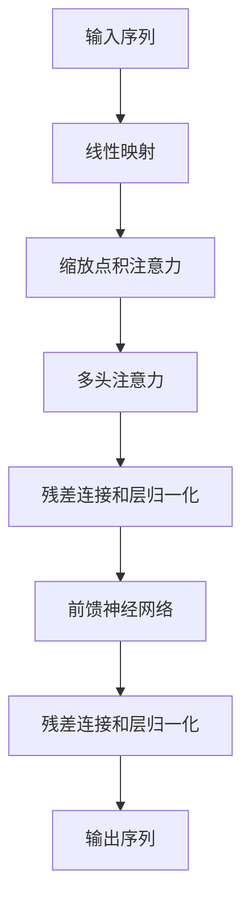

# 大规模语言模型从理论到实践 无监督预训练

## 1. 背景介绍

### 1.1 自然语言处理的重要性

在当今信息时代,自然语言处理(NLP)已成为人工智能领域中最重要和最具挑战性的研究方向之一。作为人类与机器交互的桥梁,NLP技术赋予了计算机理解和生成自然语言的能力,使其能够执行诸如机器翻译、问答系统、文本摘要和情感分析等多种任务。随着大数据时代的到来,海量的非结构化文本数据迫切需要高效的NLP技术来进行处理和分析。

### 1.2 语言模型在NLP中的重要作用

语言模型是NLP的核心组成部分,其目标是学习语言的统计规律,从而能够生成自然、流畅的语言。传统的语言模型通常基于n-gram模型和神经网络模型,但由于其对上下文信息的利用能力有限,导致生成质量和泛化能力较差。近年来,随着深度学习技术的飞速发展,大规模语言模型(Large Language Model,LLM)应运而生,极大地推动了NLP技术的进步。

### 1.3 大规模语言模型的兴起

大规模语言模型通过在大量无标注文本数据上进行无监督预训练,学习丰富的语言知识和上下文信息,从而获得强大的语言理解和生成能力。代表性模型包括GPT(Generative Pre-trained Transformer)、BERT(Bidirectional Encoder Representations from Transformers)和T5(Text-to-Text Transfer Transformer)等。这些模型不仅在各种NLP任务上取得了卓越的表现,更重要的是,它们展现了通过大规模无监督预训练获取通用语言表示的潜力,为解决NLP中的许多挑战性问题提供了新的思路。

## 2. 核心概念与联系

### 2.1 自注意力机制(Self-Attention)

自注意力机制是大规模语言模型的核心组成部分,它允许模型在计算目标词的表示时,直接捕获整个输入序列中的长程依赖关系,而不受序列长度的限制。与传统的RNN和CNN相比,自注意力机制具有更强的并行计算能力和更长的依赖捕获范围,因此在处理长序列任务时表现更加出色。

### 2.2 Transformer架构

Transformer是第一个完全基于自注意力机制的序列到序列模型,它由编码器(Encoder)和解码器(Decoder)两个部分组成。编码器将输入序列映射为上下文表示,解码器则根据上下文表示和输出序列的部分生成目标序列。Transformer架构的引入极大地简化了序列模型的结构,提高了训练效率和并行能力,成为大规模语言模型的主流架构。

### 2.3 掩码语言模型(Masked Language Model)

掩码语言模型是一种无监督预训练任务,它通过随机掩码输入序列中的部分词,并要求模型基于上下文预测被掩码的词。这种方式迫使模型学习双向语境信息,从而获得更好的语言理解能力。BERT就是基于掩码语言模型进行预训练的代表性模型。

### 2.4 因果语言模型(Causal Language Model)

与掩码语言模型不同,因果语言模型是一种单向语言模型,它只利用输入序列左侧的上下文信息来预测当前词。这种方式与语言生成任务更加贴合,因此被广泛应用于文本生成、机器翻译和问答系统等任务中。GPT系列模型就是基于因果语言模型进行预训练的典型代表。

### 2.5 序列到序列模型(Sequence-to-Sequence Model)

序列到序列模型旨在将一个序列映射为另一个序列,常用于机器翻译、文本摘要和问答系统等任务。T5模型就是一种基于编码器-解码器架构的序列到序列模型,它通过将所有NLP任务统一转换为"文本到文本"的形式,实现了跨任务的无缝迁移,展现了强大的泛化能力。

## 3. 核心算法原理具体操作步骤

### 3.1 Transformer编码器

Transformer编码器的核心是多头自注意力机制,它能够捕捉输入序列中任意两个位置之间的依赖关系。具体操作步骤如下:

1. 将输入序列映射为词嵌入向量序列
2. 对词嵌入向量序列执行位置编码,注入位置信息
3. 通过多头自注意力机制计算每个位置的上下文表示
4. 对上下文表示执行残差连接和层归一化
5. 通过前馈神经网络进一步转换上下文表示
6. 再次执行残差连接和层归一化,得到最终的编码器输出

编码器可以堆叠多个相同的层,以增强模型的表示能力。

### 3.2 Transformer解码器

Transformer解码器在编码器的基础上,引入了掩码自注意力机制和编码器-解码器注意力机制,以捕捉输出序列内部和输入序列与输出序列之间的依赖关系。具体操作步骤如下:

1. 将输出序列映射为词嵌入向量序列
2. 对词嵌入向量序列执行位置编码
3. 通过掩码自注意力机制计算每个位置的上下文表示,掩码机制确保每个位置只能关注其左侧的上下文
4. 对上下文表示执行残差连接和层归一化
5. 通过编码器-解码器注意力机制,将编码器的输出与解码器的上下文表示进行融合
6. 再次执行残差连接和层归一化
7. 通过前馈神经网络进一步转换上下文表示
8. 最后一次执行残差连接和层归一化,得到最终的解码器输出
9. 将解码器输出通过线性层和softmax层转换为词的概率分布,即生成下一个词的概率

解码器也可以堆叠多个相同的层,以提高模型的表示能力。

### 3.3 BERT预训练

BERT采用了掩码语言模型和下一句预测两个无监督预训练任务。具体操作步骤如下:

1. 从语料库中随机采样一个文本序列
2. 以一定概率随机替换序列中的部分词为特殊的[MASK]标记
3. 将替换后的序列输入BERT模型,模型需要预测被掩码的词
4. 同时,BERT还需要预测当前序列的下一个序列是否为正确的连续序列
5. 将两个任务的损失函数相加,作为BERT的最终损失函数
6. 使用梯度下降算法优化BERT模型的参数

BERT的预训练过程通常需要消耗大量的计算资源,但预训练一次后,可以在多个下游任务上进行微调,从而获得良好的性能表现。

### 3.4 GPT预训练

GPT采用了因果语言模型的无监督预训练任务。具体操作步骤如下:

1. 从语料库中随机采样一个文本序列
2. 将序列输入GPT模型,模型需要预测序列中每个位置的下一个词
3. 计算模型在每个位置预测的交叉熵损失
4. 将所有位置的损失相加,作为GPT的最终损失函数
5. 使用梯度下降算法优化GPT模型的参数

GPT的预训练过程相对简单,但由于其单向语言模型的特性,更加适合于文本生成等任务。GPT也可以在多个下游任务上进行微调,以获得更好的性能表现。

## 4. 数学模型和公式详细讲解举例说明

### 4.1 注意力机制(Attention Mechanism)

注意力机制是大规模语言模型的核心组成部分,它能够自适应地捕捉输入序列中不同位置之间的依赖关系。具体来说,给定一个查询向量 $\boldsymbol{q}$ 和一组键值对 $(\boldsymbol{k}_1, \boldsymbol{v}_1), (\boldsymbol{k}_2, \boldsymbol{v}_2), \ldots, (\boldsymbol{k}_n, \boldsymbol{v}_n)$,注意力机制的输出是值向量 $\boldsymbol{v}_i$ 的加权和,其中权重由查询向量 $\boldsymbol{q}$ 与每个键向量 $\boldsymbol{k}_i$ 的相似度决定。数学表达式如下:

$$\text{Attention}(\boldsymbol{q}, (\boldsymbol{k}_i, \boldsymbol{v}_i)_{i=1}^n) = \sum_{i=1}^n \alpha_i \boldsymbol{v}_i$$

其中,注意力权重 $\alpha_i$ 通过软max函数计算得到:

$$\alpha_i = \frac{\exp(f(\boldsymbol{q}, \boldsymbol{k}_i))}{\sum_{j=1}^n \exp(f(\boldsymbol{q}, \boldsymbol{k}_j))}$$

$f(\boldsymbol{q}, \boldsymbol{k}_i)$ 是一个相似度函数,常用的有点积相似度和缩放点积相似度:

$$f(\boldsymbol{q}, \boldsymbol{k}_i) = \boldsymbol{q}^\top \boldsymbol{k}_i \quad \text{(点积相似度)}$$

$$f(\boldsymbol{q}, \boldsymbol{k}_i) = \frac{\boldsymbol{q}^\top \boldsymbol{k}_i}{\sqrt{d_k}} \quad \text{(缩放点积相似度)}$$

其中,缩放点积相似度通过除以 $\sqrt{d_k}$ 来缓解较长序列时的梯度消失问题。

在Transformer中,注意力机制被应用于自注意力层和编码器-解码器注意力层。自注意力层将查询向量 $\boldsymbol{q}$、键向量 $\boldsymbol{k}_i$ 和值向量 $\boldsymbol{v}_i$ 都设置为同一个序列的词嵌入向量,从而捕捉序列内部的依赖关系。编码器-解码器注意力层则将查询向量 $\boldsymbol{q}$ 设置为解码器的上下文表示,键向量 $\boldsymbol{k}_i$ 和值向量 $\boldsymbol{v}_i$ 设置为编码器的输出,从而融合编码器和解码器的信息。

### 4.2 多头注意力机制(Multi-Head Attention)

多头注意力机制是对单一注意力机制的扩展,它允许模型从不同的子空间捕捉不同的依赖关系,从而提高模型的表示能力。具体来说,给定一个查询矩阵 $\boldsymbol{Q}$、键矩阵 $\boldsymbol{K}$ 和值矩阵 $\boldsymbol{V}$,多头注意力机制的输出是 $h$ 个注意力头的拼接:

$$\text{MultiHead}(\boldsymbol{Q}, \boldsymbol{K}, \boldsymbol{V}) = \text{Concat}(\text{head}_1, \text{head}_2, \ldots, \text{head}_h) \boldsymbol{W}^O$$

其中,第 $i$ 个注意力头 $\text{head}_i$ 计算如下:

$$\begin{aligned}
\text{head}_i &= \text{Attention}(\boldsymbol{Q}\boldsymbol{W}_i^Q, \boldsymbol{K}\boldsymbol{W}_i^K, \boldsymbol{V}\boldsymbol{W}_i^V) \\
&= \text{Softmax}\left(\frac{(\boldsymbol{Q}\boldsymbol{W}_i^Q)(\boldsymbol{K}\boldsymbol{W}_i^K)^\top}{\sqrt{d_k}}\right)(\boldsymbol{V}\boldsymbol{W}_i^V)
\end{aligned}$$

$\boldsymbol{W}_i^Q \in \mathbb{R}^{d_\text{model} \times d_q}$、$\boldsymbol{W}_i^K \in \mathbb{R}^{d_\text{model} \times d_k}$ 和 $\boldsymbol{W}_i^V \in \mathbb{R}^{d_\text{model} \times d_v}$ 是可学习的线性映射矩阵,用于将查询向量 $\boldsymbol{Q}$、