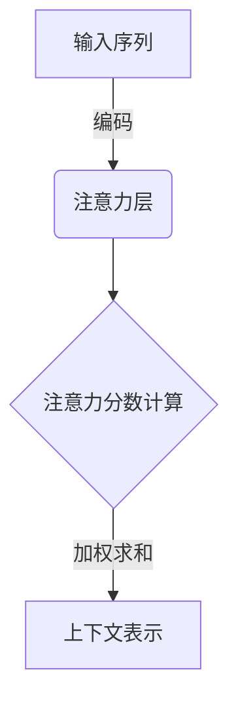
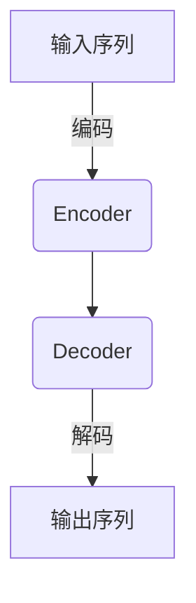
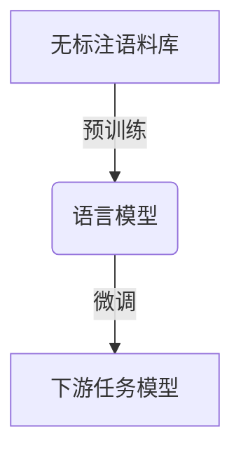
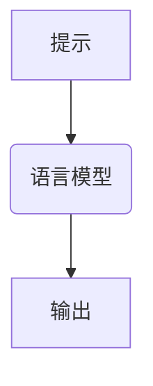

# 大规模语言模型从理论到实践 模型推理

## 1.背景介绍

### 1.1 大规模语言模型的兴起

近年来,随着计算能力的不断提升和海量数据的积累,大规模语言模型在自然语言处理领域取得了令人瞩目的成就。这些模型通过在大量无标注文本数据上进行预训练,学习到了丰富的语言知识和上下文表示能力,为下游任务提供了强大的语义表示。

大规模语言模型的代表有谷歌的BERT、OpenAI的GPT系列、微软的MT-NLG等,它们在机器翻译、问答系统、文本摘要、情感分析等众多任务中表现出色,推动了自然语言处理技术的飞速发展。

### 1.2 模型推理的重要性

虽然大规模语言模型展现出了强大的语言理解和生成能力,但对于模型内部是如何工作的、为什么会产生某种输出,我们仍然缺乏深入的理解。随着这些模型在越来越多的领域得到应用,能够解释和理解模型内部机理变得至关重要。

模型推理(Model Reasoning)旨在探索大规模语言模型内部的工作原理,揭示模型是如何捕获和利用语言知识的,从而更好地解释和控制模型的行为。通过模型推理,我们可以:

1. 提高模型的可解释性和透明度
2. 发现模型的偏差和缺陷,进行针对性的改进
3. 赋予模型更强的推理和理解能力
4. 增强人类对模型的信任度

因此,模型推理是大规模语言模型研究的重要组成部分,对于提升模型性能、可解释性和可靠性具有重要意义。

## 2.核心概念与联系

### 2.1 注意力机制

注意力机制是大规模语言模型的核心组成部分,它赋予了模型捕捉长距离依赖关系的能力。通过计算查询向量和键向量之间的相似性,注意力机制可以自适应地聚焦于输入序列中的关键信息,并将其编码到上下文表示中。

注意力机制的关键在于注意力分数的计算方式。不同的注意力变体,如多头注意力、因果注意力、相对位置编码等,通过改变注意力分数的计算方式,赋予了模型捕捉不同类型的依赖关系的能力。

### 2.2 transformer架构

Transformer是一种全新的序列到序列模型架构,它完全基于注意力机制,摒弃了传统的循环神经网络和卷积神经网络结构。Transformer架构主要由编码器(Encoder)和解码器(Decoder)两部分组成,两者均采用了多层注意力和前馈网络的堆叠结构。

Transformer架构的自注意力机制使得模型可以直接捕捉任意距离的依赖关系,大大提高了并行计算能力。此外,位置编码的引入使得Transformer可以直接处理序列数据,不需要像RNN那样按序处理。这些创新设计使得Transformer在计算效率和建模能力上都有了质的飞跃。

### 2.3 预训练与微调

大规模语言模型通常采用预训练与微调的范式。在预训练阶段,模型在大量无标注文本数据上进行自监督学习,捕捉通用的语言知识和上下文表示能力。常见的预训练目标包括掩码语言模型(Masked Language Model)和下一句预测(Next Sentence Prediction)等。

在微调阶段,预训练好的语言模型将作为初始化权重,在有标注的下游任务数据上进行进一步的监督训练,使模型适应特定的任务。微调过程通常只需要少量的计算资源和标注数据,但可以显著提高模型在下游任务上的性能。

预训练与微调范式的关键在于通过大规模无标注数据学习通用的语言知识,然后将这些知识迁移到特定的下游任务中,从而显著减少了任务专用模型的训练开销。

### 2.4 提示学习

提示学习(Prompt Learning)是一种新兴的范式,旨在通过设计合适的提示(Prompt),引导语言模型生成所需的输出,而无需对模型进行显式的微调。这种方法充分利用了大规模语言模型在预训练过程中获得的广泛知识,避免了微调过程中的"灾难性遗忘"问题。

提示可以是一段自然语言文本,也可以是一些特殊的标记或模板。通过精心设计提示,我们可以指导语言模型完成各种下游任务,如文本生成、问答、文本分类等。提示学习的关键在于如何设计高质量的提示,使得语言模型可以更好地理解任务需求并生成所需的输出。

提示学习为大规模语言模型的应用开辟了新的可能性,它避免了昂贵的微调过程,同时也为我们探索语言模型内部机理提供了新的视角。

## 3.核心算法原理具体操作步骤

### 3.1 自注意力机制

自注意力机制是Transformer架构的核心,它允许模型直接捕捉输入序列中任意距离的依赖关系。自注意力的计算过程可以概括为以下几个步骤:

1. **线性投影**:将输入序列 $\boldsymbol{X} = (\boldsymbol{x}_1, \boldsymbol{x}_2, \ldots, \boldsymbol{x}_n)$ 分别映射到查询(Query)、键(Key)和值(Value)空间,得到 $\boldsymbol{Q}$、$\boldsymbol{K}$ 和 $\boldsymbol{V}$。
   $$\begin{aligned}
   \boldsymbol{Q} &= \boldsymbol{X} \boldsymbol{W}^Q \\
   \boldsymbol{K} &= \boldsymbol{X} \boldsymbol{W}^K \\
   \boldsymbol{V} &= \boldsymbol{X} \boldsymbol{W}^V
   \end{aligned}$$

2. **注意力分数计算**:计算查询 $\boldsymbol{Q}$ 与所有键 $\boldsymbol{K}$ 之间的相似性,得到注意力分数矩阵 $\boldsymbol{A}$。
   $$\boldsymbol{A} = \text{softmax}\left(\frac{\boldsymbol{Q}\boldsymbol{K}^\top}{\sqrt{d_k}}\right)$$

3. **加权求和**:将注意力分数矩阵 $\boldsymbol{A}$ 与值矩阵 $\boldsymbol{V}$ 相乘,得到加权后的上下文表示 $\boldsymbol{C}$。
   $$\boldsymbol{C} = \boldsymbol{A}\boldsymbol{V}$$

4. **残差连接与层归一化**:将上下文表示 $\boldsymbol{C}$ 与输入 $\boldsymbol{X}$ 相加,再进行层归一化,得到自注意力层的最终输出。

自注意力机制的优势在于可以并行计算,避免了RNN的递归计算瓶颈。此外,通过调整注意力分数的计算方式,我们可以赋予自注意力不同的建模能力,如捕捉位置信息、长距离依赖等。

### 3.2 transformer编码器

Transformer的编码器由多层自注意力和前馈网络组成,用于对输入序列进行编码,获得其上下文表示。编码器的计算过程如下:

1. **词嵌入与位置编码**:将输入序列 $\boldsymbol{X}$ 映射到词嵌入空间,并加上位置编码,得到 $\boldsymbol{E}^{(0)}$。
   $$\boldsymbol{E}^{(0)} = \text{WordEmbedding}(\boldsymbol{X}) + \text{PositionEncoding}(\boldsymbol{X})$$

2. **自注意力层**:对 $\boldsymbol{E}^{(0)}$ 进行自注意力计算,得到 $\boldsymbol{C}^{(0)}$。
   $$\boldsymbol{C}^{(0)} = \text{SelfAttention}(\boldsymbol{E}^{(0)})$$

3. **前馈网络层**:将 $\boldsymbol{C}^{(0)}$ 输入到前馈网络中,得到 $\boldsymbol{F}^{(0)}$。
   $$\boldsymbol{F}^{(0)} = \text{FeedForward}(\boldsymbol{C}^{(0)})$$

4. **残差连接与层归一化**:对 $\boldsymbol{C}^{(0)}$ 和 $\boldsymbol{F}^{(0)}$ 分别进行残差连接和层归一化,得到第一层的输出 $\boldsymbol{E}^{(1)}$。
   $$\begin{aligned}
   \boldsymbol{E}^{(1)} &= \text{LayerNorm}(\boldsymbol{F}^{(0)} + \boldsymbol{C}^{(0)}) \\
   &= \text{LayerNorm}(\text{FeedForward}(\text{SelfAttention}(\boldsymbol{E}^{(0)})) + \boldsymbol{E}^{(0)})
   \end{aligned}$$

5. **多层堆叠**:重复步骤2-4,堆叠多层自注意力和前馈网络,得到最终的编码器输出 $\boldsymbol{E}^{(N)}$。

通过多层堆叠,编码器可以逐步提取输入序列的高阶语义和上下文信息。编码器输出 $\boldsymbol{E}^{(N)}$ 将作为解码器的输入,用于生成目标序列。

### 3.3 transformer解码器

Transformer的解码器与编码器结构类似,但增加了一个额外的注意力子层,用于关注编码器的输出。解码器的计算过程如下:

1. **词嵌入与位置编码**:将输入序列 $\boldsymbol{Y}$ 映射到词嵌入空间,并加上位置编码,得到 $\boldsymbol{D}^{(0)}$。
   $$\boldsymbol{D}^{(0)} = \text{WordEmbedding}(\boldsymbol{Y}) + \text{PositionEncoding}(\boldsymbol{Y})$$

2. **掩码自注意力层**:对 $\boldsymbol{D}^{(0)}$ 进行掩码自注意力计算,得到 $\boldsymbol{C}_1^{(0)}$。掩码机制确保每个位置的输出只依赖于该位置之前的输入。
   $$\boldsymbol{C}_1^{(0)} = \text{MaskedSelfAttention}(\boldsymbol{D}^{(0)})$$

3. **编码器-解码器注意力层**:将 $\boldsymbol{C}_1^{(0)}$ 与编码器输出 $\boldsymbol{E}^{(N)}$ 进行注意力计算,得到 $\boldsymbol{C}_2^{(0)}$。
   $$\boldsymbol{C}_2^{(0)} = \text{EncoderDecoderAttention}(\boldsymbol{C}_1^{(0)}, \boldsymbol{E}^{(N)})$$

4. **前馈网络层**:将 $\boldsymbol{C}_2^{(0)}$ 输入到前馈网络中,得到 $\boldsymbol{F}^{(0)}$。
   $$\boldsymbol{F}^{(0)} = \text{FeedForward}(\boldsymbol{C}_2^{(0)})$$

5. **残差连接与层归一化**:对 $\boldsymbol{C}_1^{(0)}$、$\boldsymbol{C}_2^{(0)}$ 和 $\boldsymbol{F}^{(0)}$ 分别进行残差连接和层归一化,得到第一层的输出 $\boldsymbol{D}^{(1)}$。
   $$\begin{aligned}
   \boldsymbol{D}^{(1)} &= \text{LayerNorm}(\boldsymbol{F}^{(0)} + \boldsymbol{C}_2^{(0)}) \\
   &= \text{LayerNorm}(\text{FeedForward}(\text{Enco