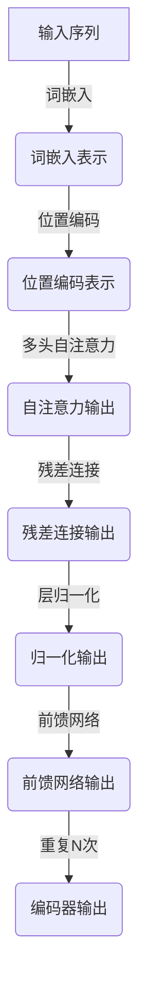
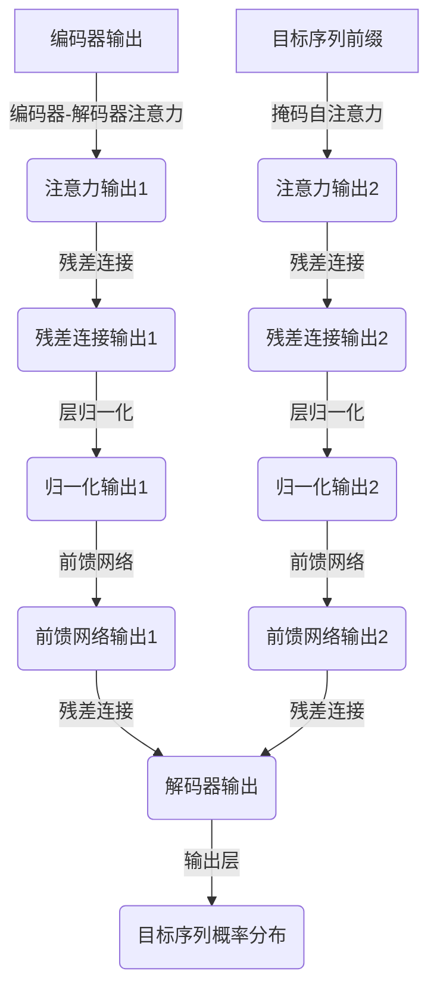

# 大语言模型 (Large Language Models, LLM) 原理与代码实例讲解

## 1. 背景介绍

### 1.1 什么是大语言模型?

大语言模型(Large Language Models, LLM)是一种基于深度学习的自然语言处理(NLP)模型,它被训练用于处理和生成人类语言。这些模型通过在大规模文本数据上进行训练,学习捕捉语言的统计规律和语义关系,从而获得对语言的深入理解和生成能力。

大语言模型的出现源于对更强大的语言模型的需求,以更好地处理复杂的自然语言任务,如机器翻译、问答系统、文本摘要和内容生成等。相比于传统的基于规则或统计方法,大语言模型凭借其强大的语言理解和生成能力,展现出了令人振奋的性能表现。

### 1.2 大语言模型的重要性

大语言模型在自然语言处理领域发挥着越来越重要的作用,主要体现在以下几个方面:

1. **语言理解能力强大**: 大语言模型能够捕捉语言的深层次语义信息,理解上下文关系和隐含含义,为各种NLP任务提供了强有力的支持。

2. **生成性能卓越**: 大语言模型不仅能够理解语言,还能够生成流畅、连贯、富有内容的自然语言文本,为内容创作、对话系统等应用提供了新的可能性。

3. **通用性强**: 大语言模型通过预训练的方式获得了通用的语言理解和生成能力,可以轻松迁移到不同的NLP任务上,降低了开发成本和时间。

4. **持续发展**: 随着计算能力的提高和训练数据的增长,大语言模型的性能不断提升,推动着NLP技术的快速进化。

### 1.3 大语言模型的发展历程

大语言模型的发展经历了几个重要阶段:

1. **Word Embedding阶段**: 通过将单词映射到向量空间,捕捉单词之间的语义关系,奠定了大语言模型的基础。著名的Word2Vec和GloVe等模型就属于这一阶段。

2. **序列到序列模型阶段**: 受到机器翻译任务的推动,出现了基于注意力机制的Transformer等序列到序列模型,能够更好地捕捉长距离依赖关系。

3. **大规模预训练阶段**: 受到BERT等双向Transformer模型的启发,研究人员开始在大规模无标注语料库上预训练语言模型,获得通用的语言表示能力。GPT、XLNet、ALBERT等模型相继问世。

4. **大模型时代**: 随着计算能力的提升,研究人员开始训练规模更大、参数更多的语言模型,如GPT-3、PaLM、Chinchilla等,展现出了令人惊叹的语言理解和生成能力。

通过这一发展历程,大语言模型不断突破性能瓶颈,成为NLP领域的核心驱动力量。

## 2. 核心概念与联系

### 2.1 自注意力机制(Self-Attention)

自注意力机制是大语言模型中一个关键的创新,它允许模型在计算目标单词的表示时,直接捕捉整个输入序列中所有单词之间的依赖关系,而不再局限于序列结构或固定窗口大小。这种机制大大增强了模型对长距离依赖关系的建模能力,使得模型能够更好地理解和生成长序列文本。

在自注意力机制中,每个单词都会与输入序列中的所有其他单词进行关联,通过计算它们之间的相似性分数(注意力分数),从而确定每个单词对目标单词表示的贡献程度。这种全局依赖性建模的方式,使得模型能够更好地捕捉语义和语法信息,提高了语言理解和生成的质量。

### 2.2 Transformer架构

Transformer是一种全新的基于自注意力机制的序列到序列模型架构,它完全摒弃了传统的循环神经网络(RNN)和卷积神经网络(CNN)结构,依靠自注意力机制来捕捉输入序列中的长距离依赖关系。

Transformer架构主要由编码器(Encoder)和解码器(Decoder)两个模块组成。编码器负责将输入序列映射到一系列连续的向量表示,而解码器则基于编码器的输出,生成目标序列。两个模块中都广泛使用了多头自注意力机制和位置编码技术,以捕捉序列中的位置和上下文信息。

Transformer架构的出现,极大地提高了序列建模的性能,成为大语言模型的核心基础架构。许多知名的大语言模型,如BERT、GPT、XLNet等,都是基于Transformer架构构建的。

### 2.3 预训练与微调(Pre-training and Fine-tuning)

大语言模型通常采用预训练与微调的范式进行训练和应用。在预训练阶段,模型会在大规模无标注语料库上进行自监督学习,获得通用的语言表示能力。常见的预训练目标包括掩码语言模型(Masked Language Modeling)和下一句预测(Next Sentence Prediction)等。

经过预训练后,模型获得了对语言的深入理解,可以捕捉语义、语法和上下文信息。然后,在微调阶段,研究人员会在特定的下游任务数据上对预训练模型进行进一步的监督微调,使模型适应特定任务的需求。

这种预训练与微调的范式,不仅提高了模型的性能和泛化能力,还大大降低了开发成本和时间。研究人员只需要在少量的标注数据上进行微调,就可以获得强大的性能表现,而不必从头开始训练整个模型。

### 2.4 模型扩展与提升

为了进一步提高大语言模型的性能,研究人员提出了多种扩展和优化方法,包括:

1. **模型规模扩大**: 增加模型的参数数量和层数,提高模型的容量和表示能力。GPT-3等大模型就采用了这种策略。

2. **训练数据扩展**: 使用更大规模、更多样化的训练数据,帮助模型捕捉更丰富的语言现象和知识。

3. **架构改进**: 优化模型架构,引入新的注意力机制、规范化方法等,提高模型的效率和性能。

4. **知识增强**: 将外部知识库或结构化知识融入模型中,增强模型的理解和推理能力。

5. **多模态扩展**: 将视觉、语音等其他模态信息融入语言模型中,构建多模态大语言模型。

通过这些扩展和优化方法,大语言模型的性能不断得到提升,在各种NLP任务中展现出卓越的表现。

## 3. 核心算法原理具体操作步骤

### 3.1 Transformer编码器(Encoder)

Transformer编码器的主要作用是将输入序列映射为一系列连续的向量表示,以捕捉输入序列中的上下文信息和长距离依赖关系。编码器的核心操作步骤如下:

1. **词嵌入(Word Embedding)**: 将输入序列中的每个单词映射为一个固定长度的向量表示。

2. **位置编码(Positional Encoding)**: 为每个单词添加位置信息,使模型能够捕捉序列中单词的位置关系。

3. **多头自注意力(Multi-Head Attention)**: 计算每个单词与输入序列中所有其他单词之间的注意力分数,捕捉长距离依赖关系。

4. **残差连接(Residual Connection)**: 将注意力输出与输入相加,形成残差连接,有助于梯度传播和模型优化。

5. **层归一化(Layer Normalization)**: 对残差连接的输出进行层归一化,加速模型收敛并提高性能。

6. **前馈网络(Feed-Forward Network)**: 对归一化后的输出应用全连接前馈网络,进一步提取高阶特征表示。

7. **重复步骤3-6**: 重复执行上述步骤,构建多层编码器块,逐层提取更高级的序列表示。

经过多层编码器块的处理,输入序列被映射为一系列连续的向量表示,捕捉了序列中的上下文和长距离依赖关系信息,为后续的解码器模块提供了有价值的输入。

### 3.2 Transformer解码器(Decoder)

Transformer解码器的主要作用是基于编码器的输出,生成目标序列。解码器的核心操作步骤如下:

1. **掩码多头自注意力(Masked Multi-Head Attention)**: 计算目标序列中每个单词与之前单词之间的注意力分数,捕捉目标序列的内部依赖关系。由于未来单词在生成时是未知的,因此需要对未来位置的注意力进行掩码。

2. **编码器-解码器注意力(Encoder-Decoder Attention)**: 计算目标序列中每个单词与编码器输出序列之间的注意力分数,捕捉输入序列和目标序列之间的关系。

3. **残差连接(Residual Connection)**: 将注意力输出与输入相加,形成残差连接。

4. **层归一化(Layer Normalization)**: 对残差连接的输出进行层归一化。

5. **前馈网络(Feed-Forward Network)**: 对归一化后的输出应用全连接前馈网络,进一步提取高阶特征表示。

6. **重复步骤1-5**: 重复执行上述步骤,构建多层解码器块,逐层生成目标序列。

7. **输出层(Output Layer)**: 对最终的解码器输出应用一个线性层和softmax函数,生成目标序列的概率分布。

通过这一系列操作,解码器能够基于编码器的输出和目标序列的部分前缀,逐步生成整个目标序列。掩码自注意力机制确保了模型在生成每个单词时,只依赖于之前已生成的单词,而不会引入未来信息的偏差。

### 3.3 掩码语言模型(Masked Language Modeling)

掩码语言模型是大语言模型预训练的一种常见目标,旨在让模型学习预测被掩码的单词。具体操作步骤如下:

1. **掩码输入**: 从输入序列中随机选择一些单词,用特殊的掩码标记[MASK]替换它们。

2. **前向传播**: 将掩码后的输入序列输入到Transformer模型中,获得每个掩码位置的输出向量表示。

3. **预测掩码单词**: 对于每个掩码位置,将其输出向量输入到一个分类器(通常是线性层加softmax)中,预测该位置最可能的单词。

4. **计算损失**: 将预测的单词概率分布与原始单词的one-hot编码进行比较,计算交叉熵损失。

5. **反向传播**: 根据损失值,使用优化算法(如Adam)对模型参数进行反向传播和更新。

6. **重复训练**: 重复上述步骤,在大规模语料库上进行训练,直到模型收敛。

通过掩码语言模型的预训练,模型学会了根据上下文推断被掩码单词的能力,获得了对语言的深入理解。这种自监督学习