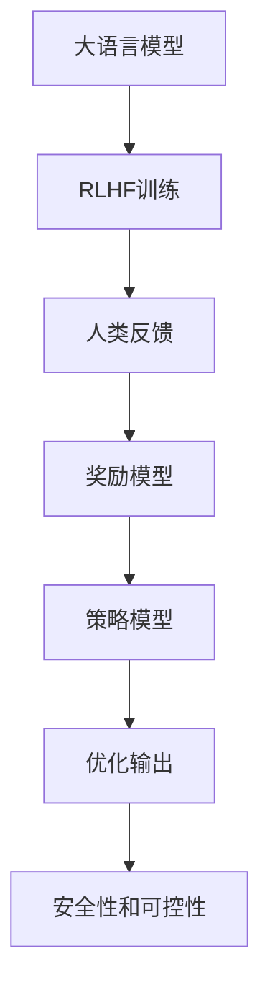

# 大语言模型原理与工程实践：RLHF 的难点和问题

## 1. 背景介绍

### 1.1 大语言模型的兴起

近年来,大型语言模型(Large Language Models, LLMs)在自然语言处理领域取得了令人瞩目的成就。这些模型通过在海量文本数据上进行预训练,学习到了丰富的语言知识和上下文理解能力,在各种自然语言任务上表现出色。

代表性的大语言模型包括 GPT-3、PaLM、ChatGPT 等,它们能够生成看似人类水平的自然语言输出,在问答、文本生成、代码编写等领域展现出惊人的能力。这些模型的出现,为人工智能系统与人类进行自然交互提供了新的可能性。

### 1.2 RLHF 技术的重要性

然而,尽管大语言模型具有强大的语言生成能力,但它们在训练过程中无法完全避免生成有害、不当或不合逻辑的输出。为了提高模型的安全性和可控性,确保其输出符合预期,研究人员提出了 RLHF (Reinforcement Learning from Human Feedback,来自人类反馈的强化学习)技术。

RLHF 通过让人类对模型输出进行评分反馈,并将这些反馈信号融入模型的训练过程,从而引导模型产生更加安全、有用和符合人类价值观的输出。这项技术在 ChatGPT、Claude 等知名大语言模型的训练中发挥了关键作用。

### 1.3 RLHF 的挑战与难点

尽管 RLHF 技术取得了一定成功,但在实际应用过程中,它也面临着诸多挑战和难点。本文将深入探讨 RLHF 在大语言模型训练中的原理、关键步骤,分析其存在的主要难点和潜在问题,并为读者提供工程实践中的解决方案和建议。

## 2. 核心概念与联系



RLHF 技术与大语言模型、强化学习、人类反馈等概念密切相关。上图展示了它们之间的联系:

1. **大语言模型 (A)**: 通过在海量文本数据上预训练而获得强大的语言生成能力,但可能存在不安全或不当输出的风险。

2. **RLHF 训练 (B)**: 一种基于人类反馈的强化学习方法,旨在优化大语言模型的输出,使其更加安全、有用和符合人类价值观。

3. **人类反馈 (C)**: 人类对模型输出进行评分反馈,这些反馈信号被用于训练奖励模型。

4. **奖励模型 (D)**: 基于人类反馈训练的模型,用于评估模型输出的质量或期望程度。

5. **策略模型 (E)**: 根据奖励模型的评分,通过强化学习优化语言模型的生成策略。

6. **优化输出 (F)**: 经过 RLHF 训练后,大语言模型的输出更加安全、有用和符合人类期望。

7. **安全性和可控性 (G)**: RLHF 技术的最终目标,提高大语言模型的安全性和可控性,确保其输出符合预期。

## 3. 核心算法原理具体操作步骤

RLHF 技术的核心算法原理可以概括为以下几个关键步骤:

### 3.1 收集人类反馈数据

首先,需要收集大量的人类反馈数据。这通常是通过让人类评估员对模型生成的输出进行评分来实现的。评估员根据输出的质量、安全性、相关性等因素给出评分,这些评分构成了反馈数据集。

### 3.2 训练奖励模型

利用收集到的人类反馈数据,训练一个奖励模型(Reward Model)。奖励模型的目标是学习预测人类对模型输出的评分,即给定一个输出,预测人类会给出什么样的评分。

奖励模型通常是一个二分类或回归模型,可以使用监督学习算法(如逻辑回归、支持向量机或神经网络)进行训练。

### 3.3 优化策略模型

接下来,使用强化学习算法(如 PPO 或 A2C)优化策略模型(Policy Model),也就是大语言模型本身。在优化过程中,策略模型会生成候选输出,并由奖励模型对这些输出进行评分。

根据奖励模型的评分,强化学习算法会调整策略模型的参数,使其更有可能生成获得高分的输出。这个过程通过多次迭代,逐步优化策略模型的生成策略。

### 3.4 微调和部署

经过上述步骤的训练后,策略模型(即优化后的大语言模型)就可以生成更加安全、有用和符合人类期望的输出了。在部署之前,可以进行进一步的微调和测试,以确保模型的性能和稳定性。

最终,优化后的大语言模型可以被应用于各种自然语言处理任务,如问答系统、文本生成、代码编写等,并提供更加可靠和可控的输出。

## 4. 数学模型和公式详细讲解举例说明

RLHF 技术中涉及到了强化学习和奖励模型的数学模型,下面将详细介绍它们的公式和原理。

### 4.1 强化学习模型

强化学习是一种基于环境反馈的机器学习范式,其目标是找到一个策略,使得在与环境的交互过程中获得的累积奖励最大化。在 RLHF 中,环境就是语言模型生成输出的过程,奖励则来自于人类对输出的评分反馈。

强化学习问题可以形式化为一个马尔可夫决策过程(Markov Decision Process, MDP),定义为一个元组 $(S, A, P, R, \gamma)$,其中:

- $S$ 是状态空间
- $A$ 是动作空间
- $P(s'|s,a)$ 是状态转移概率,表示在状态 $s$ 下执行动作 $a$ 后,转移到状态 $s'$ 的概率
- $R(s,a)$ 是奖励函数,表示在状态 $s$ 下执行动作 $a$ 所获得的即时奖励
- $\gamma \in [0,1)$ 是折现因子,用于权衡即时奖励和未来奖励的重要性

目标是找到一个策略 $\pi(a|s)$,即在给定状态 $s$ 下选择动作 $a$ 的概率分布,使得期望的累积折现奖励最大化:

$$J(\pi) = \mathbb{E}_{\pi}\left[\sum_{t=0}^{\infty} \gamma^t R(s_t, a_t)\right]$$

其中 $s_t$ 和 $a_t$ 分别是第 $t$ 个时间步的状态和动作。

在 RLHF 中,状态 $s$ 可以表示为当前的输入和已生成的部分输出,动作 $a$ 则是模型生成的下一个token。奖励 $R(s,a)$ 来自于人类对生成的输出的评分反馈。

### 4.2 奖励模型

奖励模型的目标是学习预测人类对模型输出的评分,即给定一个输出 $x$,预测人类会给出什么样的评分 $r$。这可以被建模为一个监督学习问题,使用回归或分类算法来训练奖励模型。

假设我们有一个训练数据集 $\mathcal{D} = \{(x_i, r_i)\}_{i=1}^N$,其中 $x_i$ 是模型生成的输出,而 $r_i$ 是人类对该输出的评分。我们希望学习一个函数 $f(x)$,使得对于任意输出 $x$,都有 $f(x) \approx r$。

对于回归问题,我们可以使用均方误差作为损失函数:

$$\mathcal{L}(f) = \frac{1}{N} \sum_{i=1}^N (f(x_i) - r_i)^2$$

对于分类问题,我们可以使用交叉熵损失函数:

$$\mathcal{L}(f) = -\frac{1}{N} \sum_{i=1}^N \sum_{j=1}^C y_{ij} \log f(x_i)_j$$

其中 $C$ 是分类数,而 $y_{ij}$ 是一个one-hot编码,表示第 $i$ 个样本属于第 $j$ 类。

通过优化上述损失函数,我们可以得到一个能够准确预测人类评分的奖励模型 $f(x)$。在强化学习过程中,奖励模型的输出 $f(x)$ 将作为策略模型(即大语言模型)生成输出 $x$ 的奖励信号。

### 4.3 策略梯度算法

在 RLHF 中,我们需要优化策略模型(即大语言模型)的参数 $\theta$,使得期望的累积折现奖励最大化。这可以通过策略梯度算法(Policy Gradient)来实现。

策略梯度算法的目标是最大化目标函数:

$$J(\theta) = \mathbb{E}_{\pi_\theta}\left[\sum_{t=0}^{\infty} \gamma^t R(s_t, a_t)\right]$$

其中 $\pi_\theta(a|s)$ 是参数化的策略模型,表示在状态 $s$ 下选择动作 $a$ 的概率分布。

根据策略梯度定理,目标函数的梯度可以写成:

$$\nabla_\theta J(\theta) = \mathbb{E}_{\pi_\theta}\left[\sum_{t=0}^{\infty} \nabla_\theta \log \pi_\theta(a_t|s_t) Q^{\pi_\theta}(s_t, a_t)\right]$$

其中 $Q^{\pi_\theta}(s_t, a_t)$ 是在策略 $\pi_\theta$ 下,从状态 $s_t$ 执行动作 $a_t$ 开始,获得的期望累积折现奖励。

在实践中,我们通常使用蒙特卡罗估计来近似计算梯度,并使用策略梯度算法(如 REINFORCE、PPO 或 A2C)来更新策略模型的参数。

在 RLHF 的场景下,状态 $s_t$ 可以表示为当前的输入和已生成的部分输出,动作 $a_t$ 则是模型生成的下一个token。奖励 $R(s_t, a_t)$ 来自于奖励模型对生成的输出的评分。通过优化策略模型的参数,我们可以使其更有可能生成获得高分的输出。

## 5. 项目实践: 代码实例和详细解释说明

为了更好地理解 RLHF 技术的实现细节,我们将提供一个基于 PyTorch 和 Hugging Face Transformers 库的代码示例。该示例将演示如何训练一个奖励模型,并使用它来优化一个基于 GPT-2 的语言模型。

### 5.1 准备数据

首先,我们需要准备一个包含人类反馈数据的数据集。这个数据集应该包含模型生成的输出以及对应的人类评分。为了简化示例,我们将使用一个虚构的小型数据集。

```python
import pandas as pd

# 虚构的人类反馈数据
data = [
    ("The quick brown fox jumps over the lazy dog.", 5),
    ("I love reading books and going for walks.", 4),
    ("Thes sentence has grammer errors and misspellings.", 2),
    # ... 更多数据
]

# 将数据转换为 pandas DataFrame
df = pd.DataFrame(data, columns=["text", "score"])
```

### 5.2 训练奖励模型

接下来,我们将使用这个数据集来训练一个奖励模型。在这个示例中,我们将使用一个基于 BERT 的二分类模型来预测输出的评分是高(4或5分)还是低(1至3分)。

```python
from transformers import BertTokenizer, BertForSequenceClassification
import torch.nn.functional as F

# 加载预训练的 BERT 模型和分词器
tokenizer = BertTokenizer.from_pretrained("bert-base-uncased")
reward_model = BertForSequenceClassification.from_pretrained("bert-base-uncased", num_labels=2)

# 准备训练数据
inputs = tokenizer(df["text"].tolist(),