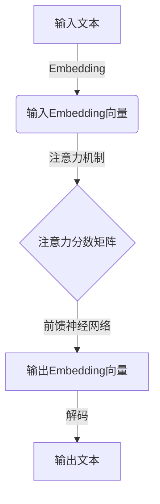

# 大语言模型原理与工程实践：人类和大语言模型进行复杂决策的对比

## 1.背景介绍

### 1.1 人工智能的发展历程

人工智能(Artificial Intelligence, AI)是当代科技领域最具颠覆性和革命性的技术之一。自20世纪50年代AI概念被正式提出以来,经历了几个重要的发展阶段。

- 早期阶段(1950s-1960s):专家系统、博弈理论等理论研究为主
- 知识迁移阶段(1970s-1980s):知识库、机器学习等技术兴起
- 统计学习阶段(1990s-2000s):贝叶斯网络、支持向量机等统计方法应用
- 深度学习阶段(2010s-今):benefiting from大数据、算力提升,深度神经网络取得突破性进展

### 1.2 大语言模型(LLM)的兴起

在深度学习阶段,自然语言处理(NLP)领域取得了长足进步。2018年,谷歌的Transformer模型首次将注意力机制(Attention Mechanism)应用于NLP任务,取得了卓越的成绩,开启了大语言模型的新纪元。

大语言模型(Large Language Model,LLM)是一种基于深度学习的语言模型,能够从大规模文本语料中学习语义和上下文信息,并生成高质量、连贯的自然语言输出。主流的LLM包括GPT(Generative Pre-trained Transformer)、BERT(Bidirectional Encoder Representations from Transformers)等。

### 1.3 LLM在复杂决策中的应用

复杂决策通常需要综合考虑多方面的信息和因素,对人类来说是一个巨大的挑战。而LLM凭借其强大的语义理解和生成能力,在复杂决策支持系统、智能助理等领域展现出巨大的潜力。

本文将对比人类和LLM在复杂决策过程中的差异,剖析LLM的工作原理和局限性,并探讨其在实际应用中的挑战与发展趋势。

## 2.核心概念与联系

### 2.1 人类决策过程

人类进行复杂决策时,需要依赖以下认知能力:

1. 信息获取和处理
2. 知识积累和迁移
3. 逻辑推理和分析
4. 创造性思维和洞见
5. 情绪管理和价值判断

这些认知能力相互影响、相互制约,共同构建了人类复杂决策的框架。

### 2.2 大语言模型工作原理

大语言模型本质上是一种基于自注意力机制的序列到序列(Seq2Seq)模型。它的核心思想是捕捉输入序列中每个元素之间的相关性,并基于这些相关性生成输出序列。

LLM的工作流程可概括为:

1. 输入embedding:将文本转化为向量表示
2. 注意力计算:捕捉序列元素间的相关性
3. 前馈神经网络:融合注意力信息,生成输出
4. 输出解码:将向量转化为自然语言输出



通过在大规模语料上预训练,LLM能够学习丰富的语义和上下文知识,并在下游任务中进行快速迁移。

### 2.3 人类与LLM的区别

人类决策和LLM生成虽然在形式上存在相似性,但两者在本质上存在显著差异:

- 认知基础:人类基于符号推理,LLM基于统计模式
- 知识来源:人类知识源于经验积累,LLM知识源于数据
- 推理方式:人类推理更加灵活多样,LLM推理过程是黑盒
- 决策驱动:人类决策受情感、价值观等主观因素驱动
- 创造力:人类具有真正的创造力,LLM只能在既有知识空间中组合

## 3.核心算法原理具体操作步骤

### 3.1 Transformer模型

Transformer是LLM的核心架构,由编码器(Encoder)和解码器(Decoder)组成。它完全基于注意力机制,摒弃了RNN/CNN等传统架构。

#### 3.1.1 注意力机制(Attention Mechanism)

注意力机制是Transformer的核心创新,它能够自动捕捉输入序列中任意两个元素之间的相关性,并据此对输出序列进行建模。

具体来说,注意力机制包括以下步骤:

1. 计算Query、Key和Value矩阵
2. 计算Query与所有Key的点积,得到未缩放的分数矩阵
3. 对分数矩阵进行缩放,得到注意力分数矩阵
4. 对注意力分数矩阵进行softmax操作,得到注意力权重矩阵
5. 将权重矩阵与Value矩阵相乘,得到注意力输出

$$\begin{aligned}
\text{Attention}(Q, K, V) &= \text{softmax}(\frac{QK^T}{\sqrt{d_k}})V \\
&= \sum_{i=1}^n \alpha_i V_i
\end{aligned}$$

其中,$\alpha_i$表示Query对Key的第i个元素的注意力权重。

通过多头注意力机制(Multi-Head Attention),模型可以从不同的表示子空间捕捉不同的相关模式。

#### 3.1.2 编码器(Encoder)

编码器的主要作用是映射输入序列到连续的表示空间。它由多个相同的层组成,每一层包括:

1. 多头注意力子层:捕捉输入元素间的相关性
2. 前馈神经网络子层:对注意力输出进行进一步编码
3. 残差连接和层归一化:保证梯度传播稳定

#### 3.1.3 解码器(Decoder)

解码器的作用是将编码器的输出映射为目标序列。它的结构与编码器类似,不同之处在于:

1. 增加了一个注意力子层,用于捕捉已生成输出与输入序列的相关性
2. 在自注意力子层中引入掩码,避免关注未来的输出信息

通过编码器-解码器的交互,Transformer能够有效地捕捉输入和输出序列之间的依赖关系。

### 3.2 预训练和微调

LLM通常采用两阶段训练策略:

1. **预训练(Pre-training)**:在大规模无标注语料上训练模型,学习通用的语言知识
2. **微调(Fine-tuning)**:在特定任务的标注数据上继续训练,使模型适应任务需求

#### 3.2.1 预训练目标

常见的预训练目标包括:

- **掩码语言模型(Masked LM)**:随机掩码部分输入token,模型需要预测被掩码的token
- **下一句预测(Next Sentence Prediction)**:判断两个句子是否为连续句子
- **因果语言模型(Causal LM)**:给定前文,模型需要预测下文
- **序列到序列(Seq2Seq)**:直接以序列作为输入和输出,模型需要生成目标序列

通过预训练,LLM能够学习到丰富的语义和上下文知识,为下游任务做好准备。

#### 3.2.2 微调策略

在微调阶段,通常采用以下策略:

- **全模型微调**:对整个模型的参数进行微调
- **前馈层微调**:只微调编码器/解码器的前馈层参数
- **提示微调**:通过设计特定的提示语,指导模型生成所需输出
- **模型蒸馏**:使用较小的学生模型来学习大模型的知识

不同的微调策略在效果、效率和计算成本之间需要权衡。

## 4.数学模型和公式详细讲解举例说明

### 4.1 Transformer中的注意力计算

注意力机制是Transformer的核心创新,下面我们详细解释其数学原理。

假设输入序列为$X=(x_1, x_2, ..., x_n)$,我们希望计算Query $Q$对Key $K$的注意力输出。

首先,我们需要将输入序列$X$分别映射到Query、Key和Value的表示空间,得到$Q、K、V$矩阵:

$$\begin{aligned}
Q &= X \cdot W_Q \\
K &= X \cdot W_K \\
V &= X \cdot W_V
\end{aligned}$$

其中,$W_Q、W_K、W_V$分别为Query、Key和Value的映射矩阵。

接下来,我们计算Query与所有Key的点积,得到未缩放的分数矩阵$S$:

$$S = Q \cdot K^T$$

为了避免较长输入序列导致的梯度不稳定问题,我们需要对分数矩阵进行缩放:

$$\widetilde{S} = \frac{S}{\sqrt{d_k}}$$

其中,$d_k$为Key向量的维度。

然后,我们对缩放后的分数矩阵$\widetilde{S}$进行softmax操作,得到注意力权重矩阵$A$:

$$A = \text{softmax}(\widetilde{S})$$

最后,我们将权重矩阵$A$与Value矩阵$V$相乘,得到注意力输出$Z$:

$$Z = A \cdot V$$

这就是注意力机制的完整计算过程。注意力输出$Z$融合了输入序列中所有元素的信息,其中每个元素的贡献由注意力权重$A$决定。

### 4.2 多头注意力机制

单一的注意力机制只能从一个表示子空间捕捉相关模式,为了提高模型的表达能力,Transformer引入了多头注意力机制。

具体来说,我们将Query、Key和Value矩阵分别映射到$h$个不同的表示子空间,并在每个子空间内计算注意力输出,最后将所有子空间的输出进行拼接:

$$\begin{aligned}
\text{head}_i &= \text{Attention}(Q \cdot W_i^Q, K \cdot W_i^K, V \cdot W_i^V) \\
\text{MultiHead}(Q, K, V) &= \text{Concat}(\text{head}_1, \text{head}_2, ..., \text{head}_h) \cdot W^O
\end{aligned}$$

其中,$W_i^Q、W_i^K、W_i^V$为第$i$个子空间的映射矩阵,$W^O$为最终的线性映射矩阵。

通过多头注意力机制,Transformer能够从不同的表示子空间捕捉不同的相关模式,提高了模型的表达能力。

## 5.项目实践:代码实例和详细解释说明

为了帮助读者更好地理解Transformer的工作原理,我们提供了一个基于PyTorch的代码实例。该实例实现了一个简化版的Transformer模型,用于机器翻译任务。

### 5.1 数据预处理

首先,我们需要对输入数据进行预处理,包括构建词表、数字化等步骤。为了简化代码,我们使用PyTorch内置的数据工具。

```python
from torchtext.data import Field, BucketIterator

# 定义源语言和目标语言的Field
src = Field(tokenize=str.split, 
            init_token='<sos>', 
            eos_token='<eos>',
            lower=True)

tgt = Field(tokenize=str.split, 
            init_token='<sos>', 
            eos_token='<eos>', 
            lower=True)

# 构建词表
src.build_vocab(train_data, min_freq=2)
tgt.build_vocab(train_data, min_freq=2)

# 构建数据迭代器
train_iter, val_iter = BucketIterator.splits(
    (train_data, val_data), 
    batch_size=64,
    sort_key=lambda x: len(x.src),
    device=device)
```

### 5.2 模型定义

接下来,我们定义Transformer模型的各个组件。

```python
import torch
import torch.nn as nn
import math

class PositionalEncoding(nn.Module):
    def __init__(self, d_model, dropout=0.1, max_len=5000):
        ...

    def forward(self, x):
        ...

class MultiHeadAttentionLayer(nn.Module):
    def __init__(self, hid_dim, n_heads, dropout, device):
        ...
    
    def forward(self, query, key, value, mask=None):
        ...

class PositionwiseFeedforwardLayer(nn.Module):
    def __init__(self, hid_dim, pf_dim, dropout):
         ...

    def forward(self, x):
        ...

class EncoderLayer(nn.Module):
    def __init