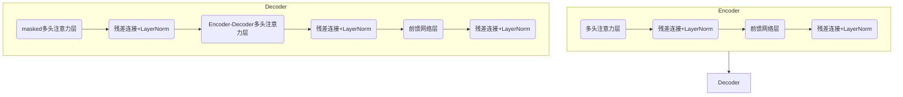

# 大语言模型原理与工程实践：代码数据

## 1. 背景介绍

随着人工智能技术的不断发展,大型语言模型(Large Language Model,LLM)已经成为当前最热门的研究领域之一。这些模型通过在海量文本数据上进行预训练,能够捕捉丰富的语言知识和上下文信息,从而在自然语言处理任务中展现出令人惊叹的性能表现。

大语言模型的出现,不仅推动了自然语言处理技术的飞速发展,也为人工智能的未来发展带来了全新的机遇和挑战。本文将深入探讨大语言模型的核心原理、算法实现、工程实践以及未来发展趋势,为读者提供一个全面而深入的视角,了解这一领域的前沿成果和关键技术细节。

## 2. 核心概念与联系

### 2.1 自注意力机制(Self-Attention)

自注意力机制是大语言模型的核心基础,它能够有效地捕捉输入序列中任意两个位置之间的关系,从而更好地建模长距离依赖。与传统的循环神经网络(RNN)和卷积神经网络(CNN)相比,自注意力机制具有并行计算和长距离依赖建模的优势。

$$
\text{Attention}(Q, K, V) = \text{softmax}(\frac{QK^T}{\sqrt{d_k}})V
$$

其中,Q(Query)、K(Key)和V(Value)分别代表查询向量、键向量和值向量。通过计算查询向量与所有键向量的相似性得分,然后对这些相似性得分进行softmax归一化,最终得到注意力权重,将其与值向量进行加权求和,即可获得注意力输出。

### 2.2 transformer架构

Transformer是第一个完全基于自注意力机制的序列到序列模型,它抛弃了传统的RNN和CNN结构,完全依赖自注意力机制来捕捉输入和输出序列之间的长距离依赖关系。Transformer架构主要包括编码器(Encoder)和解码器(Decoder)两个部分,其中编码器用于编码输入序列,解码器则根据编码器的输出生成目标序列。



### 2.3 预训练与微调(Pre-training & Fine-tuning)

大语言模型通常采用两阶段训练策略:预训练(Pre-training)和微调(Fine-tuning)。在预训练阶段,模型在大规模无监督文本数据上进行通用表示学习,获取丰富的语言知识;在微调阶段,则根据具体的下游任务对预训练模型进行指导性调整,使其能够更好地适应特定的应用场景。

该策略的关键在于,通过预训练学习到通用的语言表示,然后只需在相对较小的任务数据集上进行微调,即可快速适应新的任务,大大降低了从头训练的数据需求和计算开销。

## 3. 核心算法原理具体操作步骤  

### 3.1 Transformer模型训练

1) **输入表示**: 将输入文本序列转换为词汇向量序列,并添加位置编码,以提供位置信息。

2) **编码器(Encoder)**: 输入序列经过多层编码器层,每层包含多头自注意力子层和前馈网络子层,捕捉输入序列中的上下文信息。

3) **解码器(Decoder)**: 在解码器中,除了与编码器类似的自注意力子层和前馈网络子层外,还引入了编码器-解码器注意力子层,将解码器状态与编码器输出进行关联。

4) **生成输出**: 解码器基于编码器输出和前一时间步的输出,自回归地生成下一个词的概率分布,最终输出整个目标序列。

5) **损失计算与优化**: 计算生成序列与真实目标序列之间的损失,并通过反向传播算法对模型参数进行优化。

### 3.2 预训练任务

常见的预训练任务包括:

- **掩码语言模型(Masked Language Modeling, MLM)**: 随机掩蔽输入序列中的部分词,并训练模型基于上下文预测被掩蔽词的正确词汇。

- **次序预测(Next Sentence Prediction, NSP)**: 判断两个句子是否为连续的句子对。

- **替换词语预测(Replaced Token Detection, RTD)**: 随机替换输入序列中的部分词,并训练模型检测出被替换的词语位置。

通过这些预训练任务,模型可以学习到丰富的语言知识和上下文表示能力。

### 3.3 微调流程

1) **任务数据准备**: 根据具体的下游任务,准备相应的训练数据集和测试数据集。

2) **数据预处理**: 对任务数据进行必要的预处理,如分词、词汇映射等。

3) **模型初始化**: 加载预训练好的大语言模型权重作为初始化参数。

4) **微调训练**: 在任务数据集上对模型进行微调训练,根据任务目标设计合适的损失函数和优化策略。

5) **模型评估**: 在测试数据集上评估微调后模型的性能表现。

6) **模型部署**: 根据实际需求将微调后的模型部署到生产环境中。

## 4. 数学模型和公式详细讲解举例说明

### 4.1 自注意力计算

自注意力机制是大语言模型的核心所在,它能够捕捉输入序列中任意两个位置之间的依赖关系。我们以一个简单的例子来说明自注意力的计算过程。

假设输入序列为 $X = (x_1, x_2, x_3)$,其中 $x_i \in \mathbb{R}^{d_\text{model}}$ 表示第 $i$ 个位置的词嵌入向量。我们首先将输入序列分别映射到查询(Query)、键(Key)和值(Value)向量:

$$
\begin{aligned}
Q &= X W^Q \\
K &= X W^K \\
V &= X W^V
\end{aligned}
$$

其中 $W^Q, W^K, W^V \in \mathbb{R}^{d_\text{model} \times d_k}$ 分别为查询、键和值的线性映射矩阵。

接下来,我们计算查询向量与所有键向量的缩放点积注意力得分:

$$
\text{Attention}(Q, K, V) = \text{softmax}(\frac{QK^T}{\sqrt{d_k}})V
$$

其中,分母中的 $\sqrt{d_k}$ 是为了防止内积值过大导致softmax函数饱和。

假设查询向量为 $Q = (q_1, q_2, q_3)$,键向量为 $K = (k_1, k_2, k_3)$,值向量为 $V = (v_1, v_2, v_3)$,则注意力输出为:

$$
\begin{pmatrix}
\alpha_{11} v_1 + \alpha_{12} v_2 + \alpha_{13} v_3 \\
\alpha_{21} v_1 + \alpha_{22} v_2 + \alpha_{23} v_3 \\
\alpha_{31} v_1 + \alpha_{32} v_2 + \alpha_{33} v_3
\end{pmatrix}
$$

其中,注意力权重 $\alpha_{ij} = \text{softmax}(\frac{q_i k_j^T}{\sqrt{d_k}})$ 表示第 $i$ 个查询向量对第 $j$ 个键向量的注意力分数。

通过自注意力机制,模型能够自适应地捕捉输入序列中任意两个位置之间的依赖关系,从而更好地建模长距离依赖。

### 4.2 多头注意力

为了进一步提高模型的表示能力,Transformer引入了多头注意力(Multi-Head Attention)机制。多头注意力将查询、键和值向量分别映射到 $h$ 个不同的子空间,并在每个子空间中计算注意力,最后将所有子空间的注意力输出进行拼接:

$$
\begin{aligned}
\text{MultiHead}(Q, K, V) &= \text{Concat}(\text{head}_1, \dots, \text{head}_h) W^O \\
\text{where } \text{head}_i &= \text{Attention}(QW_i^Q, KW_i^K, VW_i^V)
\end{aligned}
$$

其中,$W_i^Q, W_i^K, W_i^V$ 分别为第 $i$ 个头的查询、键和值的线性映射矩阵,$W^O$ 为最终的线性映射矩阵。

多头注意力机制能够从不同的子空间捕捉输入序列的不同表示,提高了模型的表示能力和泛化性能。

## 5. 项目实践:代码实例和详细解释说明

为了更好地理解大语言模型的原理和实现细节,我们以 Hugging Face 的 Transformers 库为例,展示了一个基于 BERT 模型的文本分类任务的完整代码流程。

### 5.1 数据准备

```python
from datasets import load_dataset

dataset = load_dataset("imdb")

def preprocess_function(examples):
    return tokenizer(examples["text"], truncation=True)

tokenized_datasets = dataset.map(preprocess_function, batched=True)
```

首先,我们从 Hugging Face Datasets 库中加载 IMDB 电影评论数据集。然后,使用 BERT 分词器对文本数据进行预处理,包括分词、词汇映射和截断等操作。

### 5.2 微调模型

```python
from transformers import AutoModelForSequenceClassification, TrainingArguments, Trainer

model = AutoModelForSequenceClassification.from_pretrained("bert-base-uncased", num_labels=2)

training_args = TrainingArguments(
    output_dir="./results",
    evaluation_strategy="epoch",
    learning_rate=2e-5,
    per_device_train_batch_size=16,
    per_device_eval_batch_size=16,
    num_train_epochs=3,
    weight_decay=0.01,
)

trainer = Trainer(
    model=model,
    args=training_args,
    train_dataset=tokenized_datasets["train"],
    eval_dataset=tokenized_datasets["test"],
)

trainer.train()
```

接下来,我们从 Hugging Face 模型库中加载预训练的 BERT 模型,并对其进行微调训练。我们定义了训练参数,如学习率、批次大小、训练轮数等,并使用 Trainer 类进行模型训练和评估。

### 5.3 模型评估

```python
eval_results = trainer.evaluate()
print(f"Evaluation results: {eval_results}")
```

在训练完成后,我们可以在测试集上评估模型的性能表现。Trainer 类会自动计算指定的评估指标,如准确率、精确率、召回率等。

### 5.4 模型预测

```python
text = "This movie is absolutely amazing!"
inputs = tokenizer(text, return_tensors="pt")

with torch.no_grad():
    logits = model(**inputs).logits

predicted_class = logits.argmax().item()
print(f"Predicted class: {predicted_class}")  # 0 for negative, 1 for positive
```

最后,我们可以使用微调后的模型对新的文本数据进行预测。首先,我们使用分词器将文本转换为模型可接受的输入格式。然后,将输入传递给模型,获取预测的 logits 值。通过取 logits 的最大值对应的索引,即可得到预测的类别标签。

通过上述代码示例,我们可以清晰地了解到如何基于预训练的大语言模型进行微调和部署,为实际应用场景提供强大的自然语言处理能力。

## 6. 实际应用场景

大语言模型在自然语言处理领域展现出了广泛的应用前景,涵盖了文本生成、机器翻译、问答系统、情感分析等多个方向。

### 6.1 文本生成

大语言模型可以根据给定的上下文或提示,生成连贯、流畅的自然语言文本。这种能力可以应用于各种场景,如自动写作、对话系统、创意写作辅助等。例如,OpenAI 的 GPT-3 模型就展现出了惊人的文本生成能力,能够生成高质量的新闻报道、小说故事和代码等。