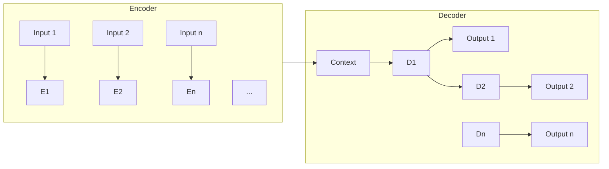

# 大语言模型原理与工程实践：动态交互

## 1. 背景介绍

### 1.1 大语言模型的兴起

近年来,大型语言模型(Large Language Model, LLM)在自然语言处理(NLP)领域掀起了一场革命。这些模型通过在大规模语料库上进行预训练,学习了丰富的语言知识和上下文信息,展现出令人惊叹的语言生成和理解能力。

LLM的出现,不仅推动了NLP任务的性能飞跃,更为人工智能系统带来了全新的发展机遇。传统的人工智能系统往往专注于特定领域,需要大量的人工标注数据和复杂的规则设计。而LLM则能够从海量的自然语言数据中自主学习,获取通用的语言理解和生成能力,从而在多个领域发挥作用。

### 1.2 动态交互的重要性

尽管LLM取得了令人瞩目的成就,但它们仍然面临着一些挑战。其中,缺乏动态交互能力是一个突出的问题。大多数LLM都是基于单轮输入生成单轮输出的范式,无法很好地处理多轮对话或持续的交互场景。

在现实世界中,人与人之间的交流往往是动态的、多轮的。为了实现更自然、更人性化的人机交互,LLM需要具备动态交互能力,能够根据上下文和历史信息进行响应,维持连贯的对话状态。这不仅对于对话系统至关重要,对于协助决策、问答系统等应用领域也是必不可少的。

本文将探讨大语言模型在动态交互场景下的原理和实践,包括核心概念、关键算法、数学模型,以及工程实现和应用案例,旨在为读者提供全面的理解和实践指导。

## 2. 核心概念与联系

### 2.1 序列到序列模型

序列到序列(Sequence-to-Sequence, Seq2Seq)模型是LLM动态交互的核心基础。该模型将输入序列(如对话历史)映射为输出序列(如响应),能够很好地处理可变长度的输入和输出。



如上图所示,Seq2Seq模型由两个主要部分组成:编码器(Encoder)和解码器(Decoder)。编码器将输入序列编码为上下文向量,解码器则根据上下文向量和先前生成的输出,预测下一个输出token。这种结构使模型能够捕获输入和输出之间的长期依赖关系,适用于动态交互场景。

### 2.2 注意力机制

注意力机制(Attention Mechanism)是Seq2Seq模型中的关键创新,它赋予模型选择性关注输入的不同部分的能力,从而更好地建模长期依赖关系。

在动态交互场景下,注意力机制可以让模型在生成响应时,自适应地关注对话历史中的不同部分,捕获相关的上下文信息。这不仅提高了响应的连贯性和相关性,也增强了模型处理长对话的能力。

### 2.3 记忆增强机制

虽然注意力机制赋予了Seq2Seq模型一定的记忆能力,但对于长期的、复杂的对话来说,仍然存在记忆遗忘的问题。为了解决这一挑战,研究人员提出了多种记忆增强机制,如记忆网络(Memory Network)、键值记忆网络(Key-Value Memory Network)等。

这些机制通过引入外部记忆模块,显式地存储和检索对话历史信息,从而增强了模型的长期记忆能力。在动态交互场景下,记忆增强机制可以帮助模型更好地捕获对话的上下文和历史信息,生成更加连贯、相关的响应。

## 3. 核心算法原理具体操作步骤

### 3.1 Transformer模型

Transformer是当前LLM中广泛采用的核心架构,它完全基于注意力机制,摒弃了传统的循环神经网络和卷积神经网络结构。Transformer的自注意力(Self-Attention)层能够直接捕获序列中任意两个位置之间的依赖关系,大大提高了并行计算能力和长期依赖建模能力。

在动态交互场景下,Transformer模型可以直接对输入序列(如对话历史)和输出序列(如响应)进行建模,无需进行序列对齐或特征工程。这种端到端的建模方式,不仅简化了模型的结构,也提高了模型的泛化能力。

Transformer的具体操作步骤如下:

1. 将输入序列(如对话历史)和输出序列(如响应)拼接为单个序列,添加特殊标记(如[BOS]、[EOS])表示序列的开始和结束。
2. 将拼接后的序列输入到Transformer的编码器,通过多层自注意力和前馈神经网络,获得序列的上下文表示。
3. 将上下文表示输入到Transformer的解码器,通过掩码自注意力(Masked Self-Attention)和编码器-解码器注意力(Encoder-Decoder Attention),预测每个位置的输出token概率。
4. 根据预测的token概率,使用贪婪搜索或束搜索(Beam Search)等策略,生成最终的输出序列(如响应)。

### 3.2 记忆增强机制

虽然Transformer模型具有一定的记忆能力,但对于长期的、复杂的对话来说,仍然存在记忆遗忘的问题。为了解决这一挑战,研究人员提出了多种记忆增强机制,如记忆网络(Memory Network)、键值记忆网络(Key-Value Memory Network)等。

这些机制通过引入外部记忆模块,显式地存储和检索对话历史信息,从而增强了模型的长期记忆能力。在动态交互场景下,记忆增强机制可以帮助模型更好地捕获对话的上下文和历史信息,生成更加连贯、相关的响应。

以记忆网络为例,其具体操作步骤如下:

1. 将对话历史中的每一轮对话(包括上下文和响应)编码为记忆向量,存储在记忆模块中。
2. 当有新的输入时,将输入编码为查询向量。
3. 计算查询向量与记忆模块中每个记忆向量的相关性得分。
4. 根据相关性得分,从记忆模块中检索出与查询最相关的记忆向量。
5. 将检索到的记忆向量与查询向量融合,作为Transformer模型的输入,生成响应。

通过这种方式,记忆网络能够显式地利用对话历史信息,从而提高响应的连贯性和相关性。

## 4. 数学模型和公式详细讲解举例说明

### 4.1 注意力机制

注意力机制是Transformer模型的核心,它赋予模型选择性关注输入的不同部分的能力,从而更好地建模长期依赖关系。

在动态交互场景下,注意力机制可以让模型在生成响应时,自适应地关注对话历史中的不同部分,捕获相关的上下文信息。

注意力机制的数学表示如下:

$$\begin{aligned}
\text{Attention}(Q, K, V) &= \text{softmax}\left(\frac{QK^T}{\sqrt{d_k}}\right)V \\
\text{head}_i &= \text{Attention}\left(QW_i^Q, KW_i^K, VW_i^V\right) \\
\text{MultiHead}(Q, K, V) &= \text{Concat}(\text{head}_1, \dots, \text{head}_h)W^O
\end{aligned}$$

其中:

- $Q$、$K$、$V$分别表示查询(Query)、键(Key)和值(Value)。
- $d_k$是缩放因子,用于防止点积的方差过大。
- $W_i^Q$、$W_i^K$、$W_i^V$、$W^O$是可学习的线性变换矩阵。
- $\text{MultiHead}$表示多头注意力机制,通过并行计算多个注意力头,捕获不同的依赖关系。

在动态交互场景下,查询$Q$可以是当前的输入(如用户的问题),而键$K$和值$V$可以是对话历史的编码表示。通过注意力机制,模型可以自适应地关注对话历史中与当前输入相关的部分,生成更加连贯、相关的响应。

### 4.2 记忆网络

记忆网络是一种记忆增强机制,它通过引入外部记忆模块,显式地存储和检索对话历史信息,从而增强了模型的长期记忆能力。

记忆网络的核心思想是,将对话历史中的每一轮对话(包括上下文和响应)编码为记忆向量,存储在记忆模块中。当有新的输入时,将输入编码为查询向量,并与记忆模块中的记忆向量进行匹配,检索出与查询最相关的记忆向量。最后,将检索到的记忆向量与查询向量融合,作为模型的输入,生成响应。

记忆网络的数学表示如下:

$$\begin{aligned}
m_i &= \text{Encoder}(c_i, r_i) &&\text{(记忆编码)} \\
q &= \text{Encoder}(x) &&\text{(查询编码)} \\
p_i &= \text{Softmax}(q^Tm_i) &&\text{(相关性得分)} \\
o &= \sum_i p_im_i &&\text{(记忆读取)} \\
r &= \text{Decoder}(q, o) &&\text{(响应生成)}
\end{aligned}$$

其中:

- $c_i$、$r_i$分别表示第$i$轮对话的上下文和响应。
- $m_i$是第$i$轮对话的记忆向量。
- $q$是当前输入的查询向量。
- $p_i$是查询向量与第$i$个记忆向量的相关性得分。
- $o$是根据相关性得分加权求和后的记忆读取结果。
- $r$是基于查询向量和记忆读取结果生成的响应。

通过这种方式,记忆网络能够显式地利用对话历史信息,从而提高响应的连贯性和相关性。

## 5. 项目实践:代码实例和详细解释说明

为了更好地理解大语言模型在动态交互场景下的实践,我们将基于PyTorch实现一个简单的对话系统,包括Transformer模型和记忆网络模块。

### 5.1 数据预处理

首先,我们需要对对话数据进行预处理,将其转换为模型可以接受的格式。我们将使用一个简单的对话数据集,其中每个样本包含对话历史和响应。

```python
import torch
from torchtext.data import Field, TabularDataset

# 定义字段
TEXT = Field(tokenize='spacy', lower=True, batch_first=True)
RESPONSE = Field(tokenize='spacy', lower=True, batch_first=True)

# 加载数据集
train_data, valid_data, test_data = TabularDataset.splits(
    path='data/', train='train.csv', validation='valid.csv', test='test.csv',
    format='csv', fields={'text': ('text', TEXT), 'response': ('response', RESPONSE)}
)

# 构建词表
TEXT.build_vocab(train_data, max_size=50000)
RESPONSE.build_vocab(train_data, max_size=50000)

# 批量加载数据
train_iter, valid_iter, test_iter = BucketIterator.splits(
    (train_data, valid_data, test_data), batch_size=32, device=device
)
```

在上面的代码中,我们使用`torchtext`库加载和预处理数据。我们定义了两个字段`TEXT`和`RESPONSE`,分别表示对话历史和响应。然后,我们加载数据集,构建词表,并使用`BucketIterator`批量加载数据。

### 5.2 Transformer模型

接下来,我们实现Transformer模型,包括编码器和解码器。

```python
import torch.nn as nn
import math

class TransformerEncoder(nn.Module):
    def __init__(self, input_dim, hid_dim, n_layers, n_heads, dropout):
        super().__init__()
        self.layers = nn.ModuleList([EncoderLayer(input_dim, hid_dim, n_heads, dropout) for _ in range(n_layers)])