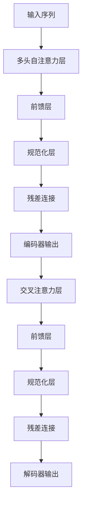

# 大语言模型原理与工程实践：大语言模型为什么这么强

## 1.背景介绍

### 1.1 人工智能的新里程碑

近年来,大型语言模型(Large Language Model,LLM)在自然语言处理领域取得了令人瞩目的成就,成为人工智能发展的一个新里程碑。这些模型通过在海量文本数据上进行预训练,学习了丰富的语言知识和上下文关联能力,展现出惊人的泛化性能。

大语言模型不仅能够完成传统的自然语言处理任务,如机器翻译、文本摘要、问答系统等,更令人惊叹的是,它们表现出了一定的推理和创造性思维能力,可以回答开放性问题、撰写文章、编写代码、分析数据等,在多个领域展现出人类水平的表现。

### 1.2 大语言模型的兴起

大语言模型的崛起可以追溯到2018年,谷歌发布了Transformer模型,这是第一个将自注意力机制成功应用于序列到序列建模的工作。随后,OpenAI发布了GPT(Generative Pre-trained Transformer)模型,通过在大规模语料上进行自监督预训练,取得了突破性进展。

接下来,BERT(Bidirectional Encoder Representations from Transformers)模型应运而生,它采用了双向编码器,进一步提高了语义表示的质量。在此基础上,GPT-2、GPT-3、BART、T5、PALM等一系列大型语言模型相继问世,参数规模不断扩大,性能不断提升。

其中,OpenAI发布的GPT-3是目前最大的语言模型,包含1750亿个参数,在广泛的下游任务上表现出色,引发了学术界和工业界的广泛关注。

## 2.核心概念与联系

### 2.1 自注意力机制

自注意力机制是大语言模型的核心创新,它允许模型在编码序列时捕捉远程依赖关系,有效解决了传统序列模型(如RNN)难以捕捉长距离依赖的问题。

在自注意力机制中,每个位置的表示是所有位置的表示的加权和,权重由位置之间的相似性决定。这种机制使得模型能够直接关注输入序列中的任何部分,捕捉全局依赖关系。

$$\mathrm{Attention}(Q, K, V) = \mathrm{softmax}(\frac{QK^T}{\sqrt{d_k}})V$$

其中,Q(Query)、K(Key)和V(Value)分别代表查询、键和值,通过计算查询与各个键的相似性得到注意力分数,再与值加权求和得到注意力表示。

### 2.2 Transformer架构

Transformer是第一个完全基于自注意力机制的序列到序列模型,它抛弃了传统的RNN和CNN结构,完全由注意力层和前馈层组成。

Transformer的编码器通过多头自注意力层捕捉输入序列中的依赖关系,生成对应的序列表示;解码器则在编码器的基础上,增加了对解码历史的自注意力,以及对编码器输出的交叉注意力,生成输出序列。



这种全注意力的架构,使得Transformer在并行计算方面具有天然的优势,大大提高了训练效率。同时,由于没有递归操作,也避免了梯度消失和梯度爆炸问题。

### 2.3 预训练与微调

大语言模型通常采用两阶段的训练策略:首先在大规模无监督语料上进行自监督预训练,学习通用的语言表示;然后在特定的下游任务上进行微调(finetuning),将预训练的模型迁移到目标任务。

预训练阶段通常采用自编码(Auto-Encoding)或因果语言模型(Causal Language Modeling)等自监督目标,利用大量无标注数据学习语义和上下文关联知识。而微调阶段则根据具体任务设计有监督目标,在较小的任务数据上对预训练模型进行进一步调整。

这种预训练与微调的范式,使得大语言模型能够从海量无标注数据中学习通用知识,再将其迁移到特定任务,大大提高了数据利用效率和泛化性能。

## 3.核心算法原理具体操作步骤  

### 3.1 Transformer编码器

Transformer编码器的核心是多头自注意力层和前馈层,通过这两种子层对输入序列进行编码,生成对应的序列表示。具体操作步骤如下:

1. **输入嵌入**:将输入序列的每个token映射为对应的嵌入向量表示。
2. **位置编码**:由于自注意力机制没有位置信息,因此需要为每个位置添加位置编码,赋予位置先验知识。
3. **多头自注意力**:对输入序列进行多头自注意力计算,捕捉序列内的长程依赖关系。
4. **残差连接与层归一化**:将自注意力输出与输入相加,并进行层归一化,构成一个子层。
5. **前馈层**:对子层输出进行全连接的前馈神经网络变换,提供非线性映射能力。
6. **残差连接与层归一化**:同上,构成另一个子层。
7. **子层堆叠**:重复上述过程N次(N为编码器层数),得到最终的编码器输出表示。

### 3.2 Transformer解码器  

解码器在编码器的基础上,增加了两种注意力机制:掩蔽的自注意力和交叉注意力。其操作步骤如下:

1. **输出嵌入**:将解码器输入(如前一个时间步的输出token)映射为嵌入向量表示。
2. **掩蔽自注意力**:对解码器历史输出进行自注意力,但被掩蔽以防止关注未来位置的信息。
3. **残差连接与层归一化**:构成一个子层。
4. **交叉注意力**:将编码器输出作为键和值,解码器输出作为查询,计算交叉注意力。
5. **残差连接与层归一化**:构成另一个子层。 
6. **前馈层**:与编码器类似,进行全连接的前馈神经网络变换。
7. **残差连接与层归一化**:构成第三个子层。
8. **子层堆叠**:重复上述过程N次(N为解码器层数),得到最终的解码器输出表示。
9. **输出层**:将解码器最终输出通过一个线性层和softmax,生成下一个token的概率分布。

通过上述操作,解码器能够关注输入序列的全局信息,同时只关注历史输出,逐步生成序列输出。

## 4.数学模型和公式详细讲解举例说明

### 4.1 自注意力计算

自注意力机制是大语言模型的核心创新,它允许模型捕捉输入序列中任意两个位置之间的依赖关系。下面我们详细解释自注意力的计算过程:

给定一个长度为 $n$ 的序列 $\boldsymbol{x} = (x_1, x_2, \ldots, x_n)$,我们首先将其映射为三个向量组 $Q$、$K$ 和 $V$,分别称为查询(Query)、键(Key)和值(Value):

$$Q = \boldsymbol{x}W^Q, \quad K = \boldsymbol{x}W^K, \quad V = \boldsymbol{x}W^V$$

其中 $W^Q$、$W^K$ 和 $W^V$ 是可学习的线性变换矩阵。

接下来,我们计算查询 $Q$ 与所有键 $K$ 的点积,得到一个注意力分数矩阵 $A$:

$$A = \mathrm{softmax}(\frac{QK^T}{\sqrt{d_k}})$$

其中,分母中的 $\sqrt{d_k}$ 是为了防止内积值过大导致梯度饱和。softmax函数则将每一行的注意力分数归一化为概率分布。

最后,我们将注意力分数矩阵 $A$ 与值矩阵 $V$ 相乘,得到自注意力的输出表示 $Z$:

$$Z = AV$$

直观上,自注意力输出 $Z$ 是所有位置的值向量的加权和,权重由位置之间的相似性决定。这种机制使得模型能够直接关注输入序列中的任何部分,捕捉全局依赖关系。

### 4.2 多头注意力

在实践中,我们通常使用多头注意力(Multi-Head Attention)机制,它允许模型从不同的表示子空间捕捉不同的依赖关系。

具体来说,我们将查询/键/值首先分别映射为 $h$ 个头,每个头对应一个子空间:

$$\begin{aligned}
Q_i &= \boldsymbol{x}W_i^Q, \quad &K_i = \boldsymbol{x}W_i^K, \quad &V_i = \boldsymbol{x}W_i^V \\
&\text{(对每个头 } i = 1, \ldots, h \text{ 计算)}
\end{aligned}$$

然后,我们对每个头分别计算自注意力输出 $Z_i$,再将它们拼接起来:

$$Z_i = \mathrm{Attention}(Q_i, K_i, V_i), \quad \text{MultiHead}(Q, K, V) = \mathrm{Concat}(Z_1, \ldots, Z_h)W^O$$

其中, $W^O$ 是另一个可学习的线性变换,用于将不同头的输出投影到同一个空间。

多头注意力机制赋予了模型从不同的表示子空间捕捉不同的依赖关系的能力,提高了模型的表达能力和性能。

### 4.3 位置编码

由于自注意力机制没有位置信息,因此需要为每个位置添加位置编码,赋予位置先验知识。Transformer使用了一种简单而有效的位置编码方式:

对于序列中的第 $i$ 个位置,它的位置编码向量 $\boldsymbol{p}_i$ 由以下公式定义:

$$\begin{aligned}
p_{i,2j} &= \sin\left(i / 10000^{2j/d_\text{model}}\right) \\
p_{i,2j+1} &= \cos\left(i / 10000^{2j/d_\text{model}}\right)
\end{aligned}$$

其中, $j$ 取值范围为 $[0, d_\text{model}/2)$, $d_\text{model}$ 是模型的隐藏层维度。

这种位置编码方式能够为不同的位置赋予不同的位置信息,并且由于使用了三角函数,因此具有一定的周期性,有利于模型学习相对位置关系。

在实际计算中,我们将位置编码向量直接加到对应位置的输入嵌入向量上,从而将位置信息融入到模型的表示中。

## 5.项目实践:代码实例和详细解释说明

为了更好地理解大语言模型的原理和实现,我们将基于PyTorch实现一个简化版的Transformer模型,并在机器翻译任务上进行训练和测试。

### 5.1 数据准备

我们使用常见的机器翻译数据集WMT'14 English-German,其中包含约400万个句对。我们将数据集划分为训练集、验证集和测试集。

```python
from torchtext.datasets import Multi30k
from torchtext.data import Field, BucketIterator

# 定义字段
SRC = Field(tokenize=str.split, init_token='<sos>', eos_token='<eos>', lower=True)
TRG = Field(tokenize=str.split, init_token='<sos>', eos_token='<eos>', lower=True)

# 加载数据集
train_data, valid_data, test_data = Multi30k.splits(exts=('.en', '.de'), fields=(SRC, TRG))

# 构建词表
SRC.build_vocab(train_data, min_freq=2)
TRG.build_vocab(train_data, min_freq=2)

# 构建迭代器
train_iter, valid_iter, test_iter = BucketIterator.splits(
    (train_data, valid_data, test_data), 
    batch_size=128, device=device)
```

### 5.2 模型实现

我们实现一个简化版的Transformer