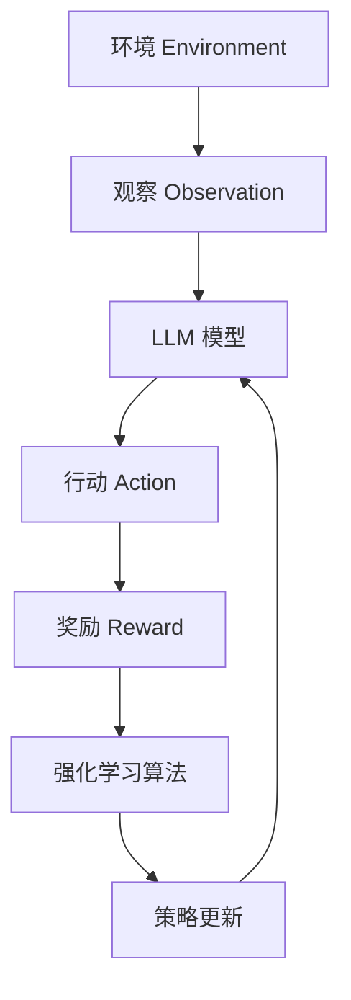

# 大语言模型原理与工程实践：强化学习的基本概念

## 1. 背景介绍

### 1.1 人工智能的发展历程

人工智能(Artificial Intelligence, AI)是当代科技发展的重要领域之一。自20世纪50年代问世以来,AI经历了几个重要的发展阶段。最初的AI系统主要基于符号主义和逻辑推理,但在解决实际问题时存在局限性。21世纪初,机器学习(Machine Learning, ML)的兴起使AI获得了新的动力,尤其是深度学习(Deep Learning)的出现,让AI在语音识别、图像识别等领域取得了突破性进展。

### 1.2 大语言模型的崛起

近年来,以Transformer为核心的大型语言模型(Large Language Model, LLM)成为AI发展的新热点。LLM通过在海量文本数据上进行预训练,学习文本的语义和上下文关系,从而获得强大的语言理解和生成能力。这种基于数据驱动的方法,使得LLM能够在自然语言处理、问答系统、文本摘要等任务中表现出色。

代表性的LLM包括GPT(Generative Pre-trained Transformer)系列、BERT(Bidirectional Encoder Representations from Transformers)、XLNet等。这些模型通过预训练和微调(fine-tuning)的方式,可以快速适应各种下游任务。LLM的出现为AI系统赋予了更强的语言理解和生成能力,推动了人机交互、内容生成等领域的发展。

### 1.3 强化学习在LLM中的作用

尽管LLM取得了巨大成功,但它们仍然存在一些局限性。例如,LLM缺乏长期记忆和持续学习能力,难以从环境中积累经验并调整策略。为了解决这些问题,研究人员开始将强化学习(Reinforcement Learning, RL)与LLM相结合。

强化学习是机器学习的一个重要分支,它通过与环境交互并获得反馈,学习如何选择最优策略以实现目标。将强化学习引入LLM,可以赋予模型持续学习和优化的能力,使其更加灵活和智能。同时,LLM也为强化学习提供了强大的语言理解和生成能力,有助于解决复杂的决策问题。

本文将重点探讨LLM与强化学习相结合的原理和实践,旨在为读者提供深入的理解和实用的指导。

## 2. 核心概念与联系

### 2.1 大语言模型(LLM)

大语言模型是一种基于深度学习的自然语言处理模型,通过在海量文本数据上进行预训练,学习文本的语义和上下文关系。LLM的核心是Transformer架构,它使用自注意力(Self-Attention)机制捕捉文本中的长距离依赖关系,从而提高了模型的表现能力。

LLM的预训练过程通常采用掩码语言模型(Masked Language Model)和下一句预测(Next Sentence Prediction)等任务,使模型学习理解和生成自然语言。经过预训练后,LLM可以通过微调(fine-tuning)的方式,快速适应各种下游任务,如文本分类、机器翻译、问答系统等。

LLM的优势在于它可以捕捉文本的丰富语义信息,并生成高质量的自然语言输出。但是,LLM也存在一些局限性,例如缺乏长期记忆和持续学习能力,难以从环境中积累经验并调整策略。

### 2.2 强化学习(RL)

强化学习是机器学习的一个重要分支,它通过与环境交互并获得反馈,学习如何选择最优策略以实现目标。强化学习系统由智能体(Agent)和环境(Environment)组成。智能体根据当前状态选择行动,环境根据这个行动转移到新的状态,并给出相应的奖励或惩罚。智能体的目标是最大化长期累积奖励。

强化学习的核心概念包括:

- 状态(State):描述环境的当前情况。
- 行动(Action):智能体可以采取的操作。
- 奖励(Reward):环境对智能体行动的反馈,指导智能体朝着目标前进。
- 策略(Policy):智能体根据状态选择行动的策略。
- 价值函数(Value Function):评估某个状态或状态-行动对的长期累积奖励。

强化学习算法通常分为基于价值的方法(如Q-Learning)和基于策略的方法(如策略梯度)。近年来,结合深度神经网络的深度强化学习(Deep Reinforcement Learning)取得了突破性进展,如DeepMind的AlphaGo系统。

### 2.3 LLM与强化学习的结合

将LLM与强化学习相结合,可以相互弥补两者的不足,形成一种新的智能系统。具体来说:

1. **LLM为强化学习提供语言理解和生成能力**:强化学习系统通常需要处理复杂的语言输入和输出,LLM可以帮助智能体更好地理解环境状态和任务描述,并生成高质量的自然语言响应。

2. **强化学习赋予LLM持续学习和优化的能力**:传统的LLM缺乏与环境交互并从中学习的能力。通过强化学习,LLM可以根据环境反馈不断优化自身策略,提高语言生成和任务完成的质量。

3. **构建智能对话系统**:结合LLM和强化学习,可以构建具有持续学习能力的智能对话系统,通过与用户交互不断优化对话策略,提供更加自然流畅的交互体验。

4. **解决复杂决策问题**:在一些复杂的决策问题中,如机器人控制、游戏AI等,LLM和强化学习的结合可以提供更加智能和灵活的解决方案。

总的来说,LLM与强化学习的结合为构建更加智能和通用的人工智能系统提供了新的思路和方法。

## 3. 核心算法原理具体操作步骤

### 3.1 基于LLM的强化学习框架

将LLM与强化学习相结合,需要一个统一的框架来协调两者的交互。一种常见的框架如下:

1. **环境(Environment)**:描述当前的状态,可以是文本形式或其他形式的输入。

2. **观察(Observation)**:环境状态被转换为LLM可以理解的观察输入。

3. **LLM模型(LLM Model)**:根据观察输入,LLM生成可能的行动。

4. **行动(Action)**:LLM输出的行动被执行在环境中。

5. **奖励(Reward)**:环境根据行动的结果给出奖励或惩罚信号。

6. **强化学习算法(RL Algorithm)**:根据奖励信号,更新LLM的策略参数。

7. **策略更新(Policy Update)**:优化后的策略被应用到LLM模型中。

这个过程循环进行,直到LLM学习到最优策略。在实际应用中,该框架可能需要一些调整和扩展,以适应特定的任务和环境。

### 3.2 基于策略梯度的算法

策略梯度(Policy Gradient)是强化学习中一种常用的基于策略的算法,它直接优化智能体的策略参数,使得在给定状态下选择的行动可以最大化预期的累积奖励。

对于基于LLM的强化学习系统,策略梯度算法的具体步骤如下:

1. **初始化LLM和策略参数**:使用预训练的LLM模型,并初始化策略参数。

2. **采样轨迹(Trajectory Sampling)**:根据当前策略,在环境中采样出一批轨迹(状态-行动-奖励序列)。

3. **计算回报(Return Computation)**:对每个轨迹计算累积回报(discounted cumulative reward)。

4. **计算策略梯度**:使用强化学习的策略梯度方法,计算策略参数的梯度,以最大化预期的累积回报。常用的策略梯度方法包括REINFORCE、Actor-Critic等。

   $$J(\theta) = \mathbb{E}_{\pi_\theta}[R] = \mathbb{E}_{\pi_\theta}\left[\sum_{t=0}^{T} \gamma^t r_t\right]$$
   $$\nabla_\theta J(\theta) = \mathbb{E}_{\pi_\theta}\left[\sum_{t=0}^{T} \nabla_\theta \log \pi_\theta(a_t|s_t) R_t\right]$$

   其中,$\pi_\theta$表示参数化的策略,$R_t$表示从时间步$t$开始的累积回报。

5. **更新策略参数**:使用优化算法(如梯度下降)更新LLM的策略参数。

6. **重复步骤2-5**:不断采样新的轨迹,计算梯度并更新策略参数,直到策略收敛。

在实际应用中,策略梯度算法可能需要一些变体和改进,如使用基线(Baseline)减小方差、引入熵正则化(Entropy Regularization)提高探索能力等。同时,也可以结合其他强化学习技术,如经验回放(Experience Replay)、目标网络(Target Network)等,来提高算法的性能和稳定性。

### 3.3 基于Q-Learning的算法

Q-Learning是强化学习中一种常用的基于价值的算法,它通过估计状态-行动对的价值函数(Q函数)来学习最优策略。对于基于LLM的强化学习系统,Q-Learning算法的具体步骤如下:

1. **初始化LLM和Q函数**:使用预训练的LLM模型,并初始化Q函数(通常使用神经网络来近似)。

2. **采样经验(Experience Sampling)**:与环境交互,采样状态-行动-奖励-下一状态的经验转换对(s, a, r, s')。

3. **存储经验(Experience Replay)**:将采样的经验存储到经验回放池(Experience Replay Buffer)中。

4. **从经验回放池中采样批次数据**:从经验回放池中随机采样一批经验转换对(s, a, r, s')。

5. **计算Q值目标**:使用贝尔曼方程(Bellman Equation)计算Q值目标,即期望的Q值。
   $$Q^*(s_t, a_t) = r_t + \gamma \max_{a'} Q(s_{t+1}, a')$$

6. **更新Q函数**:使用优化算法(如梯度下降)最小化Q函数与Q值目标之间的差异,从而更新Q函数的参数。

7. **根据Q函数选择行动**:在给定状态下,根据Q函数选择期望回报最大的行动,通常采用$\epsilon$-贪婪(epsilon-greedy)或软max策略进行探索和利用的权衡。

8. **重复步骤2-7**:不断与环境交互,更新Q函数,直到收敛。

在实际应用中,Q-Learning算法也可以结合其他技术,如双重Q-Learning(Double Q-Learning)、优先经验回放(Prioritized Experience Replay)等,来提高算法的性能和稳定性。同时,也可以使用深度神经网络来近似Q函数,形成深度Q网络(Deep Q-Network, DQN)算法。

### 3.4 基于Actor-Critic的算法

Actor-Critic算法是一种结合了策略梯度和Q-Learning的强化学习算法,它同时学习策略函数(Actor)和价值函数(Critic)。对于基于LLM的强化学习系统,Actor-Critic算法的具体步骤如下:

1. **初始化LLM、Actor和Critic**:使用预训练的LLM模型,并初始化Actor(策略函数)和Critic(价值函数),通常使用神经网络来近似。

2. **采样经验(Experience Sampling)**:与环境交互,采样状态-行动-奖励-下一状态的经验转换对(s, a, r, s')。

3. **存储经验(Experience Replay)**:将采样的经验存储到经验回放池(Experience Replay Buffer)中。

4. **从经验回放池中采样批次数据**:从经验回放池中随机采样一批经验转换对(s, a, r, s')。

5. **更新Critic(价值函数)**:使用时序差分(Temporal Difference, TD)学习方法,最小化Critic与真实回报之间的差异,从而更新Critic的参数。
   $$L_V = \mathbb{E}\