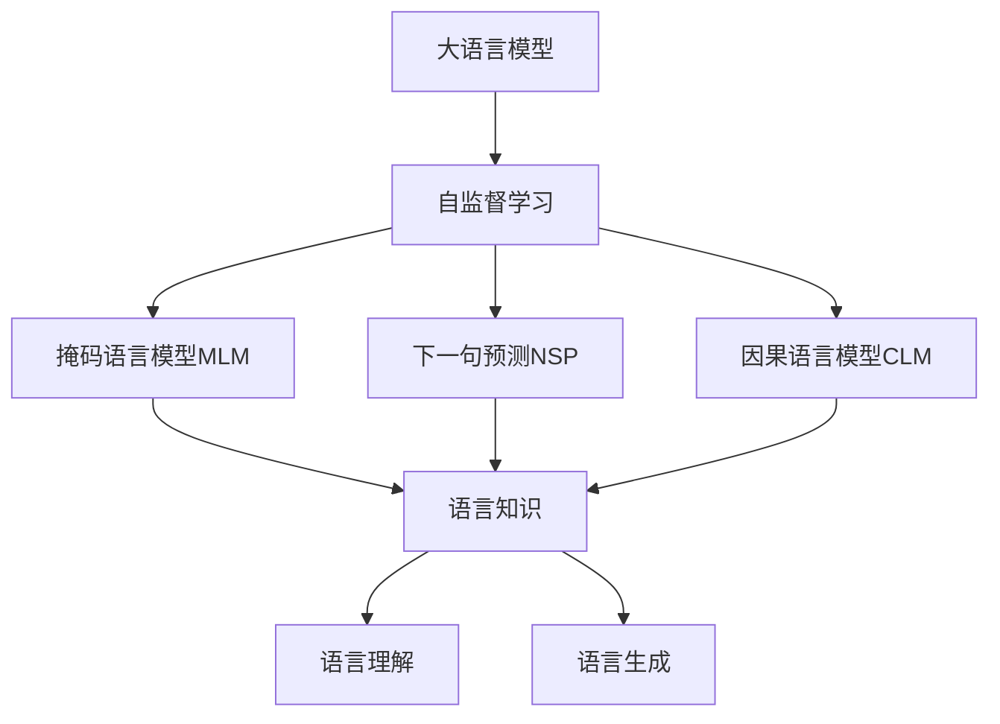

# 大语言模型原理与工程实践：方法瓶颈

## 1. 背景介绍

### 1.1 大语言模型的兴起

近年来,大型语言模型(Large Language Models, LLMs)在自然语言处理(NLP)领域取得了令人瞩目的成就。这些模型通过在海量文本数据上进行预训练,学习了丰富的语言知识,展现出惊人的语言生成和理解能力。著名的大语言模型包括GPT-3、PaLM、ChatGPT等,它们在各种NLP任务上表现出色,推动了人工智能的发展。

### 1.2 大语言模型的应用

大语言模型已广泛应用于多个领域,包括但不限于:

- **自然语言生成**: 内容创作、文本续写、对话系统等。
- **文本理解**: 问答系统、文本分类、信息抽取等。
- **代码生成**: 辅助编程、代码自动补全等。
- **多模态**: 图像描述、视频字幕等。

### 1.3 大语言模型的挑战

尽管大语言模型取得了巨大成功,但它们也面临着一些重大挑战和瓶颈,这些问题阻碍了模型的进一步发展和应用。本文将重点探讨大语言模型在原理和工程实践方面所面临的主要瓶颈和挑战。

## 2. 核心概念与联系

### 2.1 大语言模型的核心概念

大语言模型的核心思想是通过自监督学习(Self-Supervised Learning)从海量文本数据中捕捉语言的统计规律。常见的自监督学习目标包括:

- **掩码语言模型(Masked Language Modeling, MLM)**: 预测被掩码的词。
- **下一句预测(Next Sentence Prediction, NSP)**: 判断两个句子是否相连。
- **因果语言模型(Causal Language Modeling, CLM)**: 预测下一个词。

通过这些自监督学习目标,模型可以学习到丰富的语义和语法知识,从而具备强大的语言理解和生成能力。

### 2.2 大语言模型与其他NLP模型的联系

大语言模型是一种通用的NLP模型,可以通过微调(Fine-tuning)或提示学习(Prompt Learning)等方式,将预训练的语言知识迁移到下游任务。与传统的任务专用模型相比,大语言模型具有以下优势:

- **通用性**: 可以应用于广泛的NLP任务,避免了重复建模的工作。
- **高效性**: 只需要在较小的任务数据上进行微调,即可获得良好的性能。
- **可解释性**: 模型学习到的语言知识可以通过分析和可视化来解释。

然而,大语言模型也存在一些缺陷,如需要大量计算资源、存在偏差和不确定性等,这些问题将在后续章节中详细讨论。

## 3. 核心算法原理具体操作步骤

### 3.1 transformer 模型架构

transformer 是大语言模型的核心架构,它完全基于注意力机制(Attention Mechanism)构建,摒弃了传统的循环神经网络(RNN)和卷积神经网络(CNN)结构。transformer 架构主要由编码器(Encoder)和解码器(Decoder)两部分组成。

1. **编码器(Encoder)**:
   - 输入序列首先经过嵌入层(Embedding Layer)映射为向量表示。
   - 然后通过多个相同的编码器层(Encoder Layer)进行处理。
   - 每个编码器层包含两个子层:多头注意力层(Multi-Head Attention)和前馈网络层(Feed-Forward Network)。
   - 多头注意力层捕捉输入序列中不同位置之间的依赖关系。
   - 前馈网络层对每个位置的向量进行独立的非线性变换。

2. **解码器(Decoder)**:
   - 解码器的结构与编码器类似,也包含多个解码器层(Decoder Layer)。
   - 每个解码器层包含三个子层:掩码多头注意力层(Masked Multi-Head Attention)、编码器-解码器注意力层(Encoder-Decoder Attention)和前馈网络层。
   - 掩码多头注意力层用于捕捉已生成序列中不同位置之间的依赖关系,并通过掩码机制防止attending未来的位置。
   - 编码器-解码器注意力层将解码器的输出与编码器的输出进行关联,融合编码器捕捉的输入序列信息。

通过上述层层堆叠的注意力机制和前馈网络,transformer 模型可以高效地建模长距离依赖关系,并实现并行计算,从而显著提高了模型的性能和训练效率。

### 3.2 自监督学习目标

大语言模型通常采用自监督学习的方式进行预训练,以捕捉语言的统计规律。常见的自监督学习目标包括:

1. **掩码语言模型(Masked Language Modeling, MLM)**:
   - 在输入序列中随机掩码一部分词(通常为15%)。
   - 模型需要预测被掩码的词。
   - 目标函数是最大化被掩码词的条件概率。

2. **下一句预测(Next Sentence Prediction, NSP)**:
   - 给定两个句子,模型需要判断第二个句子是否为第一个句子的下一句。
   - 目标函数是最大化正确判断的概率。

3. **因果语言模型(Causal Language Modeling, CLM)**:
   - 给定一个序列的前缀,模型需要预测下一个词。
   - 目标函数是最大化下一个词的条件概率。

通过组合上述目标函数,大语言模型可以同时学习到掩码词预测、句子关系判断和序列生成等多种语言能力,从而获得通用的语言表示。

### 3.3 微调和提示学习

大语言模型通常采用两种方式将预训练的语言知识迁移到下游任务:

1. **微调(Fine-tuning)**:
   - 在预训练模型的基础上,添加一个任务特定的输出层。
   - 使用下游任务的数据,对整个模型(包括预训练参数和新增输出层)进行端到端的微调。
   - 微调过程中,预训练参数会根据下游任务进行适当的调整。

2. **提示学习(Prompt Learning)**:
   - 不对预训练模型的参数进行微调,而是设计一个任务相关的提示(Prompt)。
   - 将提示与输入序列拼接,输入到预训练模型中。
   - 模型根据提示生成的输出,即为下游任务的预测结果。
   - 提示的设计是关键,需要捕捉任务的语义,引导模型生成正确的输出。

两种方法各有优缺点。微调可以获得更好的性能,但需要大量的标注数据和计算资源。提示学习则更加灵活和高效,但性能通常略差于微调。在实践中,需要根据具体情况选择合适的方法。

## 4. 数学模型和公式详细讲解举例说明

### 4.1 transformer 注意力机制

注意力机制(Attention Mechanism)是 transformer 模型的核心,它允许模型动态地捕捉输入序列中不同位置之间的依赖关系。注意力分数用于衡量一个位置对另一个位置的重要性,从而实现对信息的加权聚合。

给定一个查询向量 $\boldsymbol{q}$、键向量 $\boldsymbol{K} = [\boldsymbol{k}_1, \boldsymbol{k}_2, \ldots, \boldsymbol{k}_n]$ 和值向量 $\boldsymbol{V} = [\boldsymbol{v}_1, \boldsymbol{v}_2, \ldots, \boldsymbol{v}_n]$,注意力计算过程如下:

$$\begin{aligned}
\text{Attention}(\boldsymbol{q}, \boldsymbol{K}, \boldsymbol{V}) &= \text{softmax}\left(\frac{\boldsymbol{q}\boldsymbol{K}^\top}{\sqrt{d_k}}\right)\boldsymbol{V} \\
&= \sum_{i=1}^n \alpha_i \boldsymbol{v}_i
\end{aligned}$$

其中,

- $d_k$ 是键向量的维度,用于缩放点积的值。
- $\alpha_i = \text{softmax}\left(\frac{\boldsymbol{q}\boldsymbol{k}_i^\top}{\sqrt{d_k}}\right)$ 是注意力分数,衡量查询向量 $\boldsymbol{q}$ 对键向量 $\boldsymbol{k}_i$ 的重要性。
- 注意力输出是值向量 $\boldsymbol{V}$ 的加权和,权重由注意力分数 $\alpha_i$ 决定。

多头注意力(Multi-Head Attention)是通过将注意力机制应用于不同的子空间,然后将结果拼接而成。具体来说,查询、键和值向量首先被线性投影到不同的子空间,然后在每个子空间中进行注意力计算,最后将所有子空间的结果拼接起来,形成最终的多头注意力输出。

$$\begin{aligned}
\text{MultiHead}(\boldsymbol{q}, \boldsymbol{K}, \boldsymbol{V}) &= \text{Concat}(\text{head}_1, \text{head}_2, \ldots, \text{head}_h)\boldsymbol{W}^O \\
\text{where}\quad \text{head}_i &= \text{Attention}(\boldsymbol{q}\boldsymbol{W}_i^Q, \boldsymbol{K}\boldsymbol{W}_i^K, \boldsymbol{V}\boldsymbol{W}_i^V)
\end{aligned}$$

其中,

- $\boldsymbol{W}_i^Q$、$\boldsymbol{W}_i^K$、$\boldsymbol{W}_i^V$ 是线性投影矩阵,用于将查询、键和值向量投影到不同的子空间。
- $\boldsymbol{W}^O$ 是另一个线性投影矩阵,用于将拼接后的向量映射回原始空间。
- $h$ 是注意力头的数量,通常设置为8或更多。

通过多头注意力机制,transformer 模型可以从不同的子空间捕捉输入序列的不同特征,提高了模型的表示能力。

### 4.2 transformer 模型优化

为了提高 transformer 模型的性能和训练效率,研究人员提出了多种优化策略,包括:

1. **位置编码(Positional Encoding)**:
   由于 transformer 模型完全基于注意力机制,因此需要一种方式来编码输入序列中每个位置的位置信息。位置编码通过将位置信息嵌入到输入向量中,使模型能够捕捉序列的位置依赖关系。

   $$\begin{aligned}
   \text{PE}_{(pos, 2i)} &= \sin\left(\frac{pos}{10000^{2i/d_\text{model}}}\right) \\
   \text{PE}_{(pos, 2i+1)} &= \cos\left(\frac{pos}{10000^{2i/d_\text{model}}}\right)
   \end{aligned}$$

   其中,

   - $\text{PE}_{(pos, i)}$ 是位置 $pos$ 的第 $i$ 个维度的位置编码。
   - $d_\text{model}$ 是模型的隐藏层维度。
   - $pos$ 是序列中的位置索引。

2. **残差连接(Residual Connection)和层归一化(Layer Normalization)**:
   为了缓解深度神经网络中的梯度消失和梯度爆炸问题,transformer 模型采用了残差连接和层归一化技术。残差连接将输入直接传递到下一层,而层归一化则对每一层的输出进行归一化,以加速收敛和提高模型的稳定性。

3. **Label Smoothing**:
   Label Smoothing 是一种正则化技术,通过将一部分概率质量从正确标签分配给其他标签,来平滑模型的输出分布。这可以提高模型的