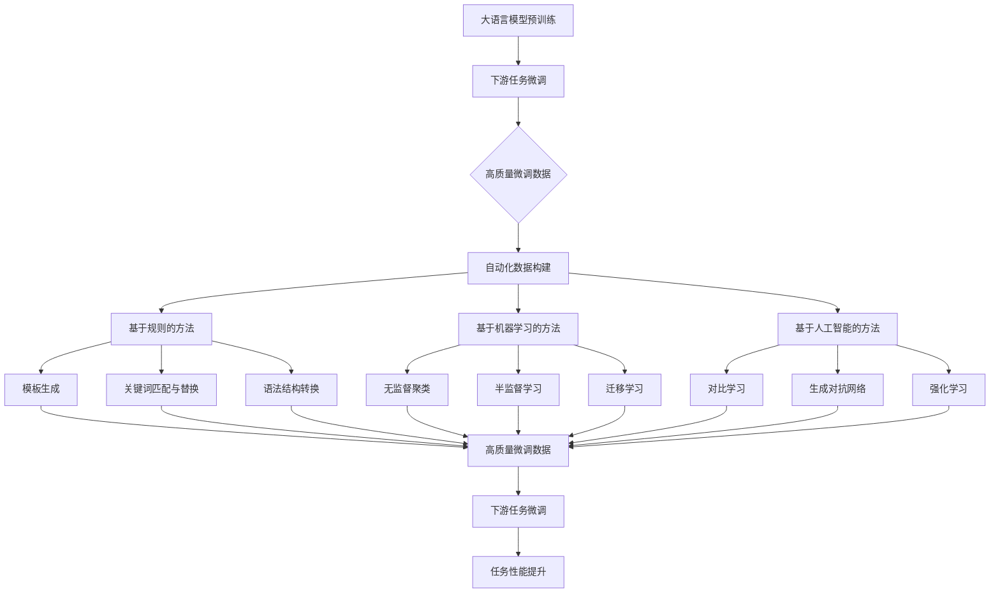

# 大语言模型原理与工程实践：有监督微调数据的自动化构建

## 1. 背景介绍
### 1.1 大语言模型的发展历程
### 1.2 有监督微调的重要性
### 1.3 高质量训练数据的必要性

## 2. 核心概念与联系
### 2.1 大语言模型
#### 2.1.1 Transformer架构
#### 2.1.2 预训练与微调
#### 2.1.3 零样本学习与少样本学习
### 2.2 有监督微调
#### 2.2.1 任务定义与分类
#### 2.2.2 微调策略与技巧
#### 2.2.3 微调数据的重要性
### 2.3 自动化数据构建
#### 2.3.1 数据采集与清洗
#### 2.3.2 数据增强技术
#### 2.3.3 数据自动标注方法

## 3. 核心算法原理具体操作步骤
### 3.1 基于规则的数据构建
#### 3.1.1 模板生成技术
#### 3.1.2 关键词匹配与替换
#### 3.1.3 语法结构转换
### 3.2 基于机器学习的数据构建 
#### 3.2.1 无监督聚类方法
#### 3.2.2 半监督学习方法
#### 3.2.3 迁移学习方法
### 3.3 基于人工智能的数据构建
#### 3.3.1 数据对比学习
#### 3.3.2 数据生成对抗网络
#### 3.3.3 强化学习与自动机器学习

## 4. 数学模型和公式详细讲解举例说明
### 4.1 Transformer模型的数学原理
#### 4.1.1 自注意力机制
#### 4.1.2 位置编码
#### 4.1.3 残差连接与层归一化 
### 4.2 对比学习的数学原理
#### 4.2.1 对比损失函数
#### 4.2.2 数据增强策略
#### 4.2.3 对比学习框架
### 4.3 生成对抗网络的数学原理
#### 4.3.1 生成器与判别器
#### 4.3.2 对抗损失函数
#### 4.3.3 Wasserstein距离

## 5. 项目实践：代码实例和详细解释说明
### 5.1 基于模板的数据生成
#### 5.1.1 定义模板与槽位
#### 5.1.2 实现槽位填充算法
#### 5.1.3 生成多样化的训练样本
### 5.2 基于对比学习的数据增强
#### 5.2.1 实现对比学习模型
#### 5.2.2 定义数据增强方法
#### 5.2.3 训练对比学习模型
### 5.3 基于生成对抗网络的数据生成
#### 5.3.1 实现生成器与判别器
#### 5.3.2 定义对抗损失函数
#### 5.3.3 训练生成对抗网络

## 6. 实际应用场景
### 6.1 智能客服领域
#### 6.1.1 问答对的自动生成
#### 6.1.2 对话意图的自动标注
#### 6.1.3 客服知识库的自动构建
### 6.2 金融领域
#### 6.2.1 金融文本的自动分类
#### 6.2.2 金融实体的自动识别
#### 6.2.3 金融事件的自动抽取
### 6.3 医疗健康领域  
#### 6.3.1 医学文本的自动标注
#### 6.3.2 医学实体的自动链接
#### 6.3.3 医疗对话的自动生成

## 7. 工具和资源推荐
### 7.1 开源工具包
#### 7.1.1 Hugging Face Transformers
#### 7.1.2 OpenAI GPT-3 API
#### 7.1.3 Google BERT
### 7.2 数据集资源
#### 7.2.1 GLUE基准测试集
#### 7.2.2 SQuAD问答数据集
#### 7.2.3 CommonCrawl网页数据
### 7.3 云计算平台
#### 7.3.1 亚马逊AWS
#### 7.3.2 微软Azure
#### 7.3.3 谷歌Cloud

## 8. 总结：未来发展趋势与挑战
### 8.1 大语言模型的发展趋势 
#### 8.1.1 模型参数量级的增长
#### 8.1.2 多模态学习的融合
#### 8.1.3 自监督学习的进一步发展
### 8.2 有监督微调的发展趋势
#### 8.2.1 任务无关的通用微调方法
#### 8.2.2 样本高效的少样本学习
#### 8.2.3 自适应的动态微调策略
### 8.3 自动化数据构建的挑战
#### 8.3.1 数据质量与数量的平衡
#### 8.3.2 数据偏差与公平性问题
#### 8.3.3 人机协作的优化方向

## 9. 附录：常见问题与解答
### 9.1 如何选择合适的大语言模型？
### 9.2 有监督微调需要多少训练数据？
### 9.3 自动化构建的数据质量如何评估？
### 9.4 如何平衡数据构建的成本与效果？
### 9.5 数据安全与隐私如何保障？

大语言模型（Large Language Model，LLM）是近年来自然语言处理领域的重大突破，其强大的语言理解和生成能力为许多应用带来了革命性的变化。然而，要将大语言模型应用于特定的下游任务，仍然需要在目标任务的数据上进行有监督的微调（Fine-tuning）。高质量的微调数据是提升模型性能的关键，但人工构建大规模高质量的标注数据非常耗时耗力。因此，如何自动化构建有监督微调数据，成为了大语言模型落地应用的一个重要挑战。

本文将系统性地探讨大语言模型有监督微调数据自动化构建的原理和实践。首先，我们将回顾大语言模型的发展历程，阐述有监督微调的重要性以及高质量训练数据的必要性。然后，我们将详细介绍几种主流的自动化数据构建方法，包括基于规则的方法、基于机器学习的方法和基于人工智能的方法。每种方法都有其特点和适用场景，我们将结合具体的算法原理和代码实例进行讲解说明。

基于规则的数据构建方法主要利用预定义的模板、关键词匹配替换、语法结构转换等技术，可以高效地生成大量符合特定模式的数据。但其泛化能力有限，难以覆盖所有的语言变体。基于机器学习的方法，如无监督聚类、半监督学习、迁移学习等，可以自动挖掘数据中的内在模式，扩充有限的标注数据。而基于人工智能的方法，如对比学习、生成对抗网络、强化学习等，进一步利用了深度神经网络强大的表示学习能力，能够生成更加多样化和高质量的数据。

在讲解这些方法的过程中，我们还将深入剖析其背后的数学原理，包括Transformer的自注意力机制、对比学习的损失函数、GAN的生成器和判别器等，帮助读者全面理解算法的内在机制。同时，我们还将展示这些方法在智能客服、金融、医疗健康等实际应用场景中的效果，证明其实用价值。

当然，大语言模型和有监督微调技术还在不断发展演进。展望未来，随着模型参数量级的增长、多模态学习的融合、自监督学习的进一步发展，相信大语言模型的性能还将不断提升。而有监督微调的发展方向，可能是探索任务无关的通用微调方法、样本高效的少样本学习、自适应的动态微调策略等。自动化数据构建也面临着数据质量与数量的平衡、数据偏差与公平性等挑战，还需要在人机协作方面进一步优化。

总之，大语言模型有监督微调数据的自动化构建，是一个涉及语言学、机器学习、人工智能等多个学科的综合性课题。本文对其进行了系统性的梳理和展望，抛砖引玉，希望为相关研究和应用提供一些参考和启发。在人工智能飞速发展的时代，让我们携手探索前沿科技，共同推动认知智能的进步。

作者：禅与计算机程序设计艺术 / Zen and the Art of Computer Programming