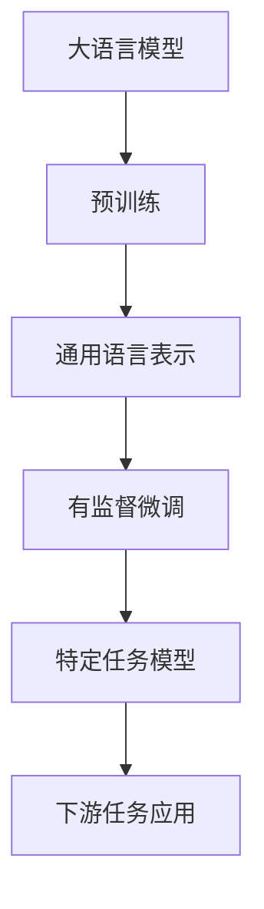
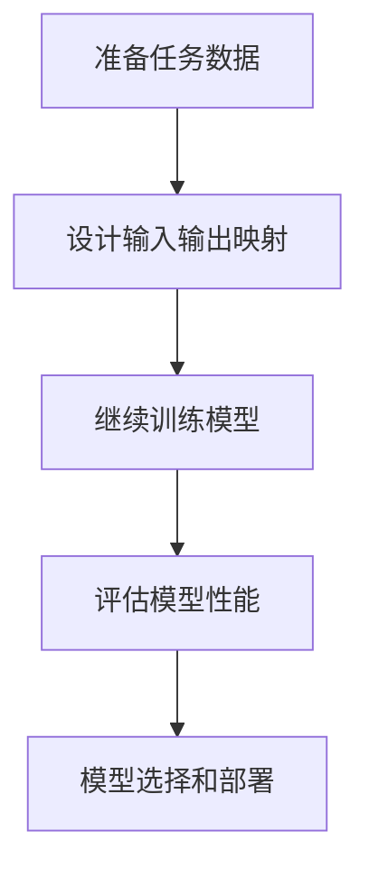

# 大语言模型原理与工程实践：有监督微调的应用场景

## 1. 背景介绍

### 1.1 大语言模型的兴起

近年来,大规模的语言模型在自然语言处理(NLP)领域掀起了一场革命。随着计算能力的不断提高和大量文本数据的累积,训练大型神经网络模型来学习语言模式和知识表示成为可能。这些被称为"大语言模型"(Large Language Models, LLMs)的模型,通过在海量文本数据上进行无监督预训练,学习了丰富的语言知识和上下文表示能力。

代表性的大语言模型包括GPT(Generative Pre-trained Transformer)系列、BERT(Bidirectional Encoder Representations from Transformers)、XLNet、RoBERTa等。它们展现出了令人惊叹的语言理解和生成能力,在各种自然语言处理任务上取得了卓越的表现,推动了整个领域的发展。

### 1.2 有监督微调的重要性

尽管大语言模型通过无监督预训练获得了强大的语言表示能力,但要将它们应用于特定的下游任务(如文本分类、机器翻译、问答系统等),仍需要进行有监督的微调(fine-tuning)。这个过程包括在特定任务的标注数据上继续训练模型,使其学习任务相关的模式和知识,从而优化模型在该任务上的表现。

有监督微调是将通用的大语言模型转化为特定任务的专家模型的关键步骤。通过微调,模型可以学习任务相关的语义和逻辑,提高在该任务上的准确性和泛化能力。同时,由于大语言模型已经学习了丰富的语言知识,微调所需的数据量和计算资源通常比从头训练要少得多,这使得在有限的资源下也能获得良好的性能。

本文将深入探讨大语言模型有监督微调的原理和实践,包括微调的基本流程、关键技术细节、常见挑战及解决方案,以及在不同应用场景中的实践经验和最佳实践。我们将结合理论知识和实际案例,为读者提供全面的指导和见解。

## 2. 核心概念与联系

在深入探讨有监督微调之前,我们需要先了解一些核心概念和它们之间的联系。这些概念构成了大语言模型微调的理论基础,对于理解和实践微调过程至关重要。

### 2.1 大语言模型架构

大语言模型通常采用基于Transformer的编码器-解码器架构或仅编码器架构。Transformer是一种革命性的注意力机制模型,能够有效地捕捉长距离依赖关系,从而更好地建模序列数据。

常见的大语言模型架构包括:

- GPT(Generative Pre-trained Transformer):采用解码器架构,专注于语言生成任务。
- BERT(Bidirectional Encoder Representations from Transformers):采用编码器架构,专注于语言理解任务。
- T5(Text-to-Text Transfer Transformer):采用编码器-解码器架构,将所有NLP任务统一为"文本到文本"的形式。

这些架构在预训练和微调阶段都发挥着重要作用。

### 2.2 预训练任务

大语言模型通过在大规模无标注文本数据上进行预训练,学习通用的语言表示。常见的预训练任务包括:

- 蒙版语言模型(Masked Language Modeling, MLM):随机掩蔽部分输入词,模型需要预测被掩蔽的词。
- 下一句预测(Next Sentence Prediction, NSP):判断两个句子是否相邻。
- 因果语言模型(Causal Language Modeling, CLM):给定前缀,模型需要预测下一个词或序列。

这些预训练任务旨在让模型学习语义和语法知识,捕捉上下文依赖关系,从而获得强大的语言表示能力。

### 2.3 有监督微调

有监督微调是将预训练的大语言模型应用于特定下游任务的关键步骤。在这个过程中,模型在标注的任务数据上进行进一步训练,学习任务相关的模式和知识。

微调通常包括以下步骤:

1. 准备任务数据集,包括输入文本和对应的标签或目标输出。
2. 设计适当的输入表示和输出头(output head),将任务数据映射到模型的输入和输出空间。
3. 在任务数据上继续训练模型,更新模型参数以优化任务指标。
4. 评估模型在验证集和测试集上的表现,根据需要进行超参数调整和模型选择。

通过有监督微调,大语言模型可以专门化于特定任务,提高在该任务上的性能和泛化能力。

### 2.4 下游任务应用

经过有监督微调后,大语言模型可以应用于各种自然语言处理任务,如文本分类、机器翻译、问答系统、文本摘要等。这些任务在不同领域都有广泛的应用,如信息检索、客户服务、内容创作、知识管理等。

通过将大语言模型与特定领域的知识和数据相结合,我们可以构建出高性能的专业化NLP系统,为各个行业带来巨大的价值。

## 3. 核心算法原理具体操作步骤

有监督微调是将通用的大语言模型转化为特定任务的专家模型的关键步骤。本节将详细介绍微调的核心算法原理和具体操作步骤,帮助读者深入理解这一过程。

### 3.1 微调流程概览

1. **准备任务数据**:首先需要准备用于微调的任务数据集,包括输入文本和对应的标签或目标输出。数据集通常被划分为训练集、验证集和测试集。

2. **设计输入输出映射**:将任务数据映射到大语言模型的输入和输出空间。这通常包括设计输入序列的表示方式(如添加特殊标记)和输出头的设计(如分类头或生成头)。

3. **继续训练模型**:在任务数据的训练集上继续训练大语言模型,更新模型参数以优化任务指标。这个过程通常采用监督学习的方式,使用任务相关的损失函数(如交叉熵损失)来指导模型学习。

4. **评估模型性能**:在验证集和测试集上评估微调后模型的性能,包括任务指标(如准确率、F1分数等)和其他质量指标。根据需要进行超参数调整和模型选择。

5. **模型选择和部署**:选择性能最佳的模型,并将其部署到生产环境中,用于实际的下游任务应用。

接下来,我们将详细介绍微调过程中的关键步骤和技术细节。

### 3.2 任务数据准备

任务数据的质量和数量对于微调的效果至关重要。一般来说,我们需要准备以下数据:

- **训练集**:用于模型继续训练和学习任务相关的模式和知识。
- **验证集**:用于监控训练过程中模型的性能变化,防止过拟合,并进行超参数调整。
- **测试集**:用于最终评估微调后模型的泛化能力和实际性能。

在准备数据时,需要注意以下几点:

1. **数据质量**:数据应该具有高质量的标注,避免噪声和错误。可以采用人工标注或者半监督学习的方式生成高质量的数据。

2. **数据量**:虽然大语言模型已经具备了丰富的语言知识,但对于一些复杂任务,仍需要足够的任务数据来进行微调。一般来说,数据量越大,模型的性能往往越好。

3. **数据分布**:训练集、验证集和测试集应该具有相似的数据分布,以确保模型的泛化能力。可以采用stratified sampling等策略来保持数据分布的一致性。

4. **数据预处理**:根据任务的特点,可能需要对数据进行预处理,如文本清理、标准化、分词等。这有助于提高模型的性能和收敛速度。

### 3.3 输入输出映射设计

为了将任务数据映射到大语言模型的输入和输出空间,我们需要设计合适的输入表示和输出头。这个过程需要根据具体的任务类型和模型架构进行调整。

#### 3.3.1 输入表示设计

常见的输入表示设计策略包括:

1. **文本序列表示**:将输入文本表示为一个序列,添加特殊标记(如[CLS]和[SEP])来delimiting输入。

2. **多序列输入**:对于需要处理多个输入序列的任务(如文本对分类、机器翻译等),可以将多个序列连接成一个输入序列。

3. **结构化输入**:对于一些结构化数据(如知识图谱、表格数据等),可以设计特殊的输入表示方式,将结构信息编码到输入中。

4. **多模态输入**:对于涉及多种模态数据(如图像、视频和文本)的任务,需要设计合适的方式将不同模态的数据融合到输入中。

设计输入表示时,需要考虑任务的特点和模型的限制(如最大序列长度等),以确保输入能够被模型有效地处理。

#### 3.3.2 输出头设计

输出头的设计取决于任务的类型,常见的输出头包括:

1. **分类头**:对于分类任务(如文本分类、情感分析等),输出头通常是一个线性层,将模型的最终隐状态映射到类别空间。

2. **生成头**:对于生成任务(如机器翻译、文本摘要等),输出头通常是一个解码器,根据模型的隐状态生成目标序列。

3. **结构化输出头**:对于一些结构化输出任务(如关系抽取、知识图谱完成等),需要设计特殊的输出头来生成结构化的输出。

4. **多任务输出头**:对于同时涉及多个任务的情况,可以设计共享底层表示的多任务输出头。

输出头的设计需要与模型架构和任务目标相匹配,以确保模型能够正确地生成所需的输出。同时,也需要考虑损失函数的设计,以指导模型在训练过程中优化正确的目标。

### 3.4 模型继续训练

在设计好输入输出映射后,我们可以开始在任务数据上继续训练大语言模型。这个过程通常采用监督学习的方式,使用任务相关的损失函数来指导模型学习。

#### 3.4.1 训练策略

常见的训练策略包括:

1. **全模型微调**:对整个大语言模型(包括编码器和解码器)进行微调,所有参数都会被更新。这种策略通常用于较小的模型或资源充足的情况。

2. **编码器微调**:只对编码器部分进行微调,而解码器部分保持不变。这种策略常用于机器翻译等生成任务,可以减少计算开销。

3. **层级微调**:先对模型的高层(靠近输出的层)进行微调,然后逐步微调低层。这种策略可以加快收敛速度,并且可以避免过度摆正(catastrophic forgetting)的问题。

4. **discriminative fine-tuning**:在预训练的解码器基础上,添加一个新的discriminative分类器头,并对该头和最后几层进行联合微调。这种策略常用于生成式任务中的discriminative重排序(reranking)。

选择合适的训练策略需要考虑任务的复杂性、可用的计算资源和模型大小等因素。

#### 3.4.2 优化器和学习率策略

在微调过程中,优化器和学习率策略对模型的收敛速度和性能也有重要影响。常见的优化器包括Adam、AdamW等,而学习率策略则包括线性衰减、余弦退火等。

一些常见的技巧包括:

1. **分层学习率**:对模型的不同部分(如