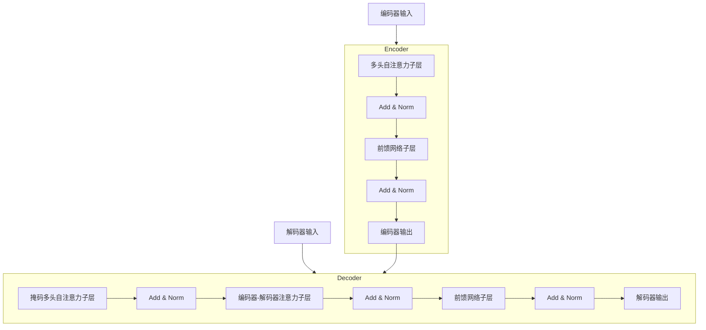

# 大语言模型原理与工程实践：未来的发展

## 1. 背景介绍

大语言模型(Large Language Models, LLMs)是一种基于深度学习的自然语言处理技术,通过在海量文本数据上训练,能够学习语言的复杂模式和语义关系。近年来,随着计算能力的提升和训练数据的增加,LLMs的性能不断突破,在自然语言理解、生成、翻译等任务上表现出色,引起了学术界和工业界的广泛关注。

LLMs的核心思想是利用transformer编码器-解码器架构和自注意力机制,对输入序列进行上下文建模,捕捉长程依赖关系。通过预训练-微调的范式,LLMs可以在大规模无标注数据上进行自监督学习,获取通用语言表示,然后在特定任务上进行少量微调,快速迁移到下游任务。

代表性的LLMs包括GPT(Generative Pre-trained Transformer)、BERT(Bidirectional Encoder Representations from Transformers)、XLNet、RoBERTa等,它们在各种自然语言处理任务上取得了令人瞩目的成绩,推动了该领域的快速发展。

## 2. 核心概念与联系

### 2.1 自注意力机制(Self-Attention)

自注意力机制是LLMs的核心组成部分,它允许模型捕捉输入序列中任意两个位置之间的关系,克服了传统循环神经网络只能关注局部信息的缺陷。

在自注意力机制中,每个位置的表示是通过对其他所有位置的表示进行加权求和而得到的,权重则由位置之间的相似性决定。这种全局依赖建模的方式,使得LLMs能够更好地理解长期上下文信息。

自注意力机制可以形式化表示为:

$$\text{Attention}(Q, K, V) = \text{softmax}(\frac{QK^T}{\sqrt{d_k}})V$$

其中,Q(Query)、K(Key)和V(Value)是通过线性变换从输入序列得到的,代表查询、键和值。$d_k$是缩放因子,用于防止点积过大导致的梯度饱和问题。

### 2.2 transformer编码器-解码器架构

transformer是LLMs中广泛采用的基础架构,它完全基于自注意力机制,避免了传统序列模型中的递归计算,从而具有更好的并行性和计算效率。

transformer架构由编码器(Encoder)和解码器(Decoder)两部分组成。编码器将输入序列映射为连续的表示,解码器则基于编码器的输出及自身的输出生成目标序列。

编码器由多个相同的层组成,每层包含两个子层:多头自注意力子层和前馈网络子层。解码器也由类似的结构组成,不同之处在于它还包含一个额外的注意力子层,用于关注编码器的输出。

该架构可以通过Mermaid流程图直观地展示:



### 2.3 预训练-微调范式

LLMs通常采用预训练-微调的两阶段训练范式。在预训练阶段,模型在大量无标注文本数据上进行自监督学习,获取通用的语言表示能力。常见的预训练目标包括:

- 掩码语言模型(Masked Language Modeling, MLM):随机掩盖部分输入token,模型需要预测被掩盖的token。
- 下一句预测(Next Sentence Prediction, NSP):判断两个句子是否为连续句子。
- 因果语言模型(Causal Language Modeling, CLM):给定前文,预测下一个token。

在微调阶段,模型在特定的下游任务数据上进行少量有监督训练,通过调整部分参数使模型适应该任务。这种迁移学习的方式,使LLMs能够快速适应新任务,避免从头开始训练。

## 3. 核心算法原理具体操作步骤

LLMs的训练过程可以概括为以下几个关键步骤:

1. **数据预处理**:将原始文本数据转换为模型可以处理的token序列,通常包括分词、词典构建、填充等步骤。

2. **构建模型架构**:根据任务需求选择合适的transformer编码器-解码器架构,确定层数、注意力头数等超参数。

3. **初始化模型参数**:使用正态分布或其他方法初始化模型的可训练参数。

4. **预训练**:在大规模无标注文本数据上进行自监督学习,优化MLM、NSP或CLM等预训练目标。常用的优化算法包括Adam、AdamW等。

5. **微调**:在特定下游任务数据上进行有监督微调,通过调整部分参数使模型适应该任务。可以采用不同的优化策略,如层级微调、discriminative fine-tuning等。

6. **模型评估**:在验证集或测试集上评估模型的性能,根据任务类型选择合适的评价指标,如精确率、召回率、BLEU分数等。

7. **模型部署**:将训练好的模型部署到生产环境,提供预测服务或集成到其他系统中。

需要注意的是,LLMs的训练过程通常需要大量的计算资源和时间,因此通常采用分布式训练、模型并行化等优化技术来加速训练。

## 4. 数学模型和公式详细讲解举例说明

### 4.1 transformer中的缩放点积注意力

在transformer的自注意力机制中,使用了缩放点积注意力(Scaled Dot-Product Attention)来计算注意力权重。其数学表达式如下:

$$\text{Attention}(Q, K, V) = \text{softmax}(\frac{QK^T}{\sqrt{d_k}})V$$

其中,Q(Query)、K(Key)和V(Value)分别表示查询、键和值,它们是通过线性变换从输入序列得到的。$d_k$是缩放因子,用于防止点积过大导致的梯度饱和问题。

具体来说,对于一个长度为$l$的输入序列$X = (x_1, x_2, \dots, x_l)$,我们首先使用三个不同的线性变换将其映射到查询$Q$、键$K$和值$V$的空间中:

$$\begin{aligned}
Q &= XW_Q \\
K &= XW_K \\
V &= XW_V
\end{aligned}$$

其中,$W_Q$、$W_K$和$W_V$是可训练的权重矩阵。

接下来,我们计算查询$Q$与所有键$K$的缩放点积,得到一个注意力分数矩阵$S$:

$$S = \frac{QK^T}{\sqrt{d_k}}$$

对$S$的每一行执行softmax操作,得到注意力权重矩阵$A$:

$$A = \text{softmax}(S)$$

最后,将注意力权重$A$与值$V$相乘,得到加权和表示$Z$:

$$Z = AV$$

$Z$就是transformer中的注意力输出,它捕捉了输入序列中不同位置之间的依赖关系。

通过上述计算过程,transformer能够有效地建模长期依赖,避免了传统RNN中的梯度消失问题。缩放点积注意力的引入,使得注意力机制在实践中更加稳定和高效。

### 4.2 transformer解码器中的掩码自注意力

在transformer的解码器中,由于需要生成序列,因此在计算自注意力时,我们不能让每个位置的表示直接关注未来的位置,否则会引入不合理的信息泄露。

为了解决这个问题,transformer解码器采用了掩码自注意力(Masked Self-Attention)机制。具体来说,在计算注意力分数矩阵$S$时,我们对其进行掩码操作:

$$S_{ij} = \begin{cases}
\frac{Q_iK_j^T}{\sqrt{d_k}}, & \text{if } i \geq j \\
-\infty, & \text{otherwise}
\end{cases}$$

其中,$S_{ij}$表示第$i$行第$j$列的元素,代表第$i$个位置关注第$j$个位置的分数。通过将$i < j$的元素设置为$-\infty$,在softmax操作后,这些位置的注意力权重将变为0,从而避免了未来信息的泄露。

掩码自注意力的数学表达式可以写为:

$$\text{MaskedAttention}(Q, K, V) = \text{softmax}(\frac{QK^T + M}{\sqrt{d_k}})V$$

其中,$M$是一个掩码矩阵,用于屏蔽未来位置的注意力分数。

通过掩码自注意力,transformer解码器能够有效地生成序列,同时保持自回归属性,确保每个位置的输出只依赖于当前和过去的信息。

## 5. 项目实践:代码实例和详细解释说明

为了更好地理解LLMs的实现细节,我们将使用PyTorch框架,构建一个简化版的transformer语言模型。完整代码可在GitHub上获取: [https://github.com/zenmeder/LLMPractice](https://github.com/zenmeder/LLMPractice)

### 5.1 定义模型架构

首先,我们定义transformer编码器和解码器的基本组件:

```python
import torch
import torch.nn as nn
import math

class MultiHeadAttention(nn.Module):
    # 多头注意力子层实现
    ...

class PositionWiseFeedForward(nn.Module):
    # 前馈网络子层实现 
    ...

class TransformerEncoderLayer(nn.Module):
    # 编码器层实现
    ...

class TransformerDecoderLayer(nn.Module):
    # 解码器层实现
    ...

class TransformerEncoder(nn.Module):
    # 编码器实现
    ...

class TransformerDecoder(nn.Module):
    # 解码器实现  
    ...
```

接下来,我们构建完整的transformer语言模型:

```python
class TransformerLM(nn.Module):
    def __init__(self, vocab_size, d_model, nhead, num_encoder_layers, num_decoder_layers, dim_feedforward, max_len, pad_id):
        super().__init__()
        
        self.encoder = TransformerEncoder(d_model, nhead, num_encoder_layers, dim_feedforward)
        self.decoder = TransformerDecoder(d_model, nhead, num_decoder_layers, dim_feedforward, max_len, vocab_size, pad_id)
        
        self.src_emb = nn.Embedding(vocab_size, d_model)
        self.tgt_emb = nn.Embedding(vocab_size, d_model)
        
        self.out_proj = nn.Linear(d_model, vocab_size)
        
    def forward(self, src, tgt):
        src_emb = self.src_emb(src)
        tgt_emb = self.tgt_emb(tgt)
        
        memory = self.encoder(src_emb)
        output = self.decoder(tgt_emb, memory)
        
        output = self.out_proj(output)
        
        return output
```

在这个实现中,我们定义了一个完整的transformer语言模型,包括编码器、解码器、嵌入层和输出投影层。`forward`函数接受源序列和目标序列作为输入,首先通过嵌入层将它们映射到模型空间,然后分别送入编码器和解码器进行计算,最后通过输出投影层得到预测的token概率分布。

### 5.2 训练和评估

接下来,我们定义数据加载、模型训练和评估的函数:

```python
import torchtext

# 数据加载
train_iter, val_iter, test_iter = torchtext.datasets.LanguageModelingDataset.iters(...)

# 模型初始化
model = TransformerLM(vocab_size, d_model, nhead, num_encoder_layers, num_decoder_layers, dim_feedforward, max_len, pad_id)

# 定义损失函数和优化器
criterion = nn.CrossEntropyLoss(ignore_index=pad_id)
optimizer = torch.optim.Adam(model.parameters(), lr=lr)