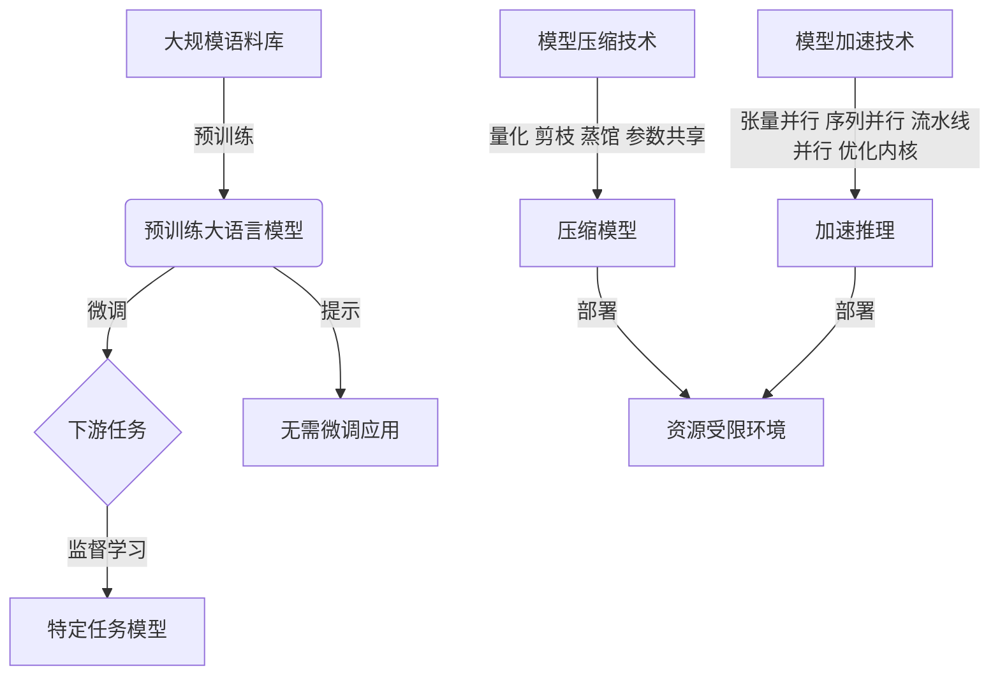

# 大语言模型原理与工程实践：案例介绍

## 1.背景介绍

### 1.1 大语言模型的兴起

近年来,大型语言模型(Large Language Models, LLMs)在自然语言处理(NLP)领域掀起了一场革命。这些模型通过在海量文本数据上进行预训练,学习到了丰富的语言知识和上下文信息,展现出惊人的语言生成、理解和推理能力。

大语言模型的兴起可以追溯到2018年,当时OpenAI发布了GPT(Generative Pre-trained Transformer)模型,这是第一个在通用语料库上预训练的大型transformer模型。随后,谷歌推出了BERT(Bidirectional Encoder Representations from Transformers)模型,它采用了双向transformer编码器,在自然语言理解任务上取得了突破性进展。

2020年,OpenAI发布了GPT-3,这是一个拥有1750亿个参数的超大型语言模型,展现出令人惊叹的文本生成能力。GPT-3的成功进一步推动了大语言模型在学术界和工业界的广泛关注和应用。

### 1.2 大语言模型的优势

相比于传统的NLP模型,大语言模型具有以下优势:

1. **语言理解能力强大**: 通过在海量语料上预训练,大语言模型能够捕捉到丰富的语言知识和上下文信息,从而更好地理解自然语言的语义和语用。

2. **泛化能力出色**: 由于预训练数据的多样性,大语言模型能够较好地泛化到不同领域和任务,减少了对大量标注数据的依赖。

3. **多任务学习能力**: 大语言模型可以通过适当的微调(fine-tuning)或提示(prompting)技术,在多个下游任务上取得良好表现,体现出强大的多任务学习能力。

4. **语言生成质量高**: 大语言模型擅长生成连贯、流畅、语义合理的自然语言文本,在机器翻译、文本摘要、内容创作等任务中表现出色。

### 1.3 大语言模型的挑战

尽管大语言模型取得了令人瞩目的成就,但它们也面临着一些重要挑战:

1. **计算资源需求巨大**: 训练大型语言模型需要海量的计算资源,包括高性能GPU、大量内存和存储空间,这对于许多组织来说是一个巨大的障碍。

2. **数据隐私和安全风险**: 大语言模型通常在公开的互联网数据上进行预训练,这可能会带来数据隐私和安全风险,如模型可能会记住和重现敏感信息。

3. **偏见和不当内容**: 由于预训练数据的偏差和缺陷,大语言模型可能会产生有偏见或不当的输出,这对于一些敏感应用场景是不可接受的。

4. **缺乏可解释性**: 大语言模型通常是黑箱模型,其内部工作机制对人类来说是不透明的,这限制了它们在一些需要高可解释性的领域的应用。

5. **对话一致性和长期记忆能力有限**: 尽管大语言模型在单轮对话中表现出色,但它们在维持多轮对话的一致性和利用长期记忆方面仍然存在局限性。

## 2.核心概念与联系

### 2.1 自注意力机制(Self-Attention)

自注意力机制是大语言模型中的核心概念之一,它允许模型捕捉输入序列中任意两个位置之间的关系,从而更好地建模长距离依赖关系。

在自注意力机制中,每个输入位置都会关注整个输入序列的所有位置,并根据它们之间的相关性赋予不同的权重。这种机制使得模型能够并行地捕捉全局信息,而不需要依赖于序列顺序或卷积核大小等限制。

自注意力机制可以形式化表示为:

$$
\mathrm{Attention}(Q, K, V) = \mathrm{softmax}\left(\frac{QK^T}{\sqrt{d_k}}\right)V
$$

其中 $Q$ 表示查询(Query)向量, $K$ 表示键(Key)向量, $V$ 表示值(Value)向量, $d_k$ 是缩放因子,用于防止点积过大导致梯度消失。

自注意力机制在大语言模型中的应用,使得模型能够更好地捕捉长距离依赖关系,提高了语言理解和生成的质量。

### 2.2 transformer架构

transformer是大语言模型中广泛采用的一种架构,它完全基于自注意力机制,不依赖于循环神经网络(RNN)或卷积神经网络(CNN)。transformer架构主要由编码器(encoder)和解码器(decoder)两部分组成。

编码器的作用是将输入序列映射为高维向量表示,而解码器则根据编码器的输出和目标序列生成输出序列。编码器和解码器都由多个相同的层组成,每一层都包含多头自注意力子层和前馈神经网络子层。

transformer架构的优势在于:

1. **并行计算能力强**: 自注意力机制允许模型并行捕捉全局信息,提高了计算效率。

2. **长距离依赖建模能力强**: 自注意力机制能够直接捕捉任意两个位置之间的关系,有利于建模长距离依赖关系。

3. **位置无关性**: transformer不依赖于序列顺序或卷积核大小,具有更好的位置无关性。

4. **易于优化**: transformer架构中的残差连接和层归一化有助于梯度传播,使得模型更易于优化。

transformer架构在大语言模型中的广泛应用,极大地提高了模型的性能和泛化能力。

### 2.3 预训练与微调(Fine-tuning)

大语言模型通常采用两阶段的训练策略:预训练(pre-training)和微调(fine-tuning)。

**预训练阶段**:模型在大规模的通用语料库上进行自监督学习,目标是学习到丰富的语言知识和上下文信息。常见的预训练目标包括掩码语言模型(Masked Language Modeling)和下一句预测(Next Sentence Prediction)等。

**微调阶段**:在预训练的基础上,模型会在特定的下游任务数据集上进行进一步的监督微调,以适应该任务的特征和要求。微调过程通常只需要少量的标注数据和较少的计算资源。

预训练和微调的分离使得大语言模型能够在通用语料库上学习到丰富的语言知识,然后通过微调将这些知识迁移到特定的下游任务上,从而提高了模型的性能和泛化能力。

此外,一些最新的工作探索了无需微调的提示(Prompting)技术,通过设计合适的提示,直接将预训练的大语言模型应用于下游任务,进一步降低了部署成本。

### 2.4 模型压缩与加速

尽管大语言模型展现出了强大的能力,但它们通常包含数十亿甚至上千亿个参数,这给模型的部署和推理带来了巨大的计算和存储开销。为了解决这一问题,研究人员提出了多种模型压缩和加速技术。

**模型压缩技术**包括:

1. **量化(Quantization)**: 将模型参数从32位或16位浮点数压缩为8位或更低位宽的定点数或整数,从而减小模型大小。

2. **剪枝(Pruning)**: 移除模型中不重要的权重或神经元,降低模型的冗余性。

3. **知识蒸馏(Knowledge Distillation)**: 使用一个大型教师模型指导训练一个小型的学生模型,将大模型的知识迁移到小模型中。

4. **参数共享**: 在transformer层中共享注意力参数或前馈网络参数,降低模型的总参数量。

**模型加速技术**包括:

1. **张量并行(Tensor Parallelism)**: 将模型的张量切分到多个加速器(如GPU)上进行并行计算。

2. **序列并行(Sequence Parallelism)**: 将输入序列切分成多个片段,并行处理这些片段。

3. **流水线并行(Pipeline Parallelism)**: 将模型切分成多个阶段,并行执行不同阶段的计算。

4. **优化推理内核**: 针对特定硬件(如GPU或TPU)优化推理内核,提高计算效率。

通过合理应用这些压缩和加速技术,可以显著降低大语言模型的计算和存储开销,促进它们在资源受限的环境中的部署和应用。

### 2.5 Mermaid流程图

以下是大语言模型的核心概念和流程的Mermaid流程图:

该流程图展示了大语言模型的典型生命周期:

1. 在大规模语料库上进行自监督预训练,获得预训练的大语言模型。
2. 对预训练模型进行微调或提示,应用于特定的下游任务。
3. 应用模型压缩和加速技术,降低计算和存储开销。
4. 将压缩和加速后的模型部署到资源受限的环境中。

## 3.核心算法原理具体操作步骤

在本节中,我们将详细介绍大语言模型中的两个核心算法:自注意力机制和transformer解码器。

### 3.1 自注意力机制

自注意力机制是transformer架构中的关键组件,它允许模型捕捉输入序列中任意两个位置之间的关系。以下是自注意力机制的具体操作步骤:

1. **输入映射**: 将输入序列 $X = (x_1, x_2, \dots, x_n)$ 映射为查询(Query)、键(Key)和值(Value)向量序列:

   $$
   Q = X \cdot W_Q \\
   K = X \cdot W_K \\
   V = X \cdot W_V
   $$

   其中 $W_Q$、$W_K$ 和 $W_V$ 分别是可学习的查询、键和值的权重矩阵。

2. **计算注意力分数**: 计算查询向量和键向量之间的点积,并应用缩放因子 $\sqrt{d_k}$ 进行归一化,得到注意力分数矩阵:

   $$
   \mathrm{Attention}(Q, K, V) = \mathrm{softmax}\left(\frac{QK^T}{\sqrt{d_k}}\right)V
   $$

   其中 $d_k$ 是键向量的维度。softmax函数用于将注意力分数归一化为概率分布。

3. **多头注意力**: 为了捕捉不同的子空间信息,transformer采用了多头注意力机制。每个注意力头都会独立计算注意力分数,然后将它们的结果拼接起来:

   $$
   \mathrm{MultiHead}(Q, K, V) = \mathrm{Concat}(\mathrm{head}_1, \dots, \mathrm{head}_h)W^O
   $$

   其中 $\mathrm{head}_i = \mathrm{Attention}(QW_i^Q, KW_i^K, VW_i^V)$,  $W_i^Q$、$W_i^K$、$W_i^V$ 和 $W^O$ 都是可学习的权重矩阵。

4. **残差连接和层归一化**: 为了更好地传播梯度和稳定训练,transformer在每个子层后应用了残差连接和层归一化操作。

通过自注意力机制,transformer能够直接捕捉输入序列中任意两个位置之间的关系,从而更好地建模长距离依赖关系。

### 3.2 transformer解码器

transformer解码器是生成任务(如机器翻译和文本生成)中的核心组件,它基于编码器的输出和目标序列生成输出序列。以下是transformer解码器的具体操作步骤:

1. **掩码自注意力**: 解码器首先对目标序列进行掩码自注意力操作,以捕捉目标序列中的依赖关系。由于在生