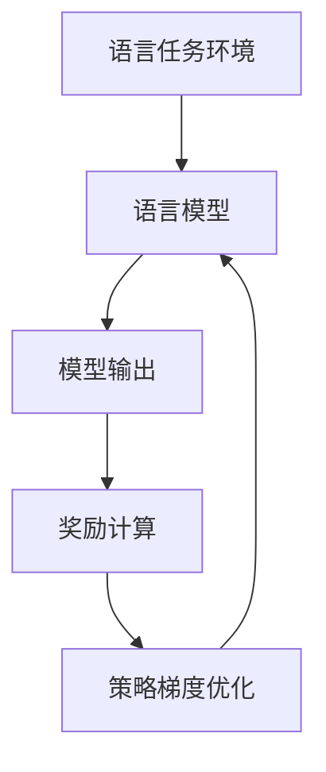
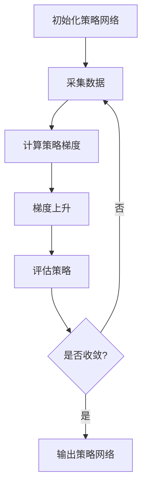

# 大语言模型原理与工程实践：策略网络训练：策略梯度

## 1. 背景介绍

在自然语言处理和人工智能领域,大型语言模型已经成为一个非常热门和前沿的研究方向。这些模型能够从大量的文本数据中学习语言的模式和规律,并且可以用于各种任务,如机器翻译、文本生成、问答系统等。然而,训练这些庞大的模型是一个极具挑战性的任务,需要大量的计算资源和创新的训练算法。

策略梯度是一种强化学习算法,它可以用于训练大型语言模型。与传统的监督学习不同,强化学习算法通过与环境交互来学习,目标是最大化一个累积奖励。在语言模型的情况下,环境就是语言任务本身,模型的输出被视为对环境的行为,奖励则与输出的质量相关。

策略梯度算法通过直接优化模型的策略(即输出的概率分布)来学习,而不是像监督学习那样最小化预测和标签之间的差异。这种方法具有很大的灵活性,可以处理各种复杂的语言任务,并且可以更好地捕捉语言的长期依赖关系。

### Mermaid 流程图:



## 2. 核心概念与联系

### 2.1 强化学习

强化学习是一种机器学习范式,其中智能体(agent)通过与环境交互来学习,目标是最大化一个累积奖励。强化学习算法可以分为两大类:基于价值的方法和基于策略的方法。

策略梯度属于基于策略的方法,它直接优化智能体的策略(即在给定状态下采取行动的概率分布)。与基于价值的方法相比,策略梯度更加通用,可以处理连续的动作空间和非马尔可夫决策过程。

### 2.2 策略网络

在语言模型的情况下,策略网络就是语言模型本身。它接收当前的上下文(状态),并输出下一个词的概率分布(策略)。通过采样或选择概率最高的词,模型可以生成连续的文本序列。

策略网络通常是一个深度神经网络,如循环神经网络(RNN)或转换器(Transformer)。它们能够捕捉语言的长期依赖关系,并生成自然流畅的文本。

### 2.3 策略梯度算法

策略梯度算法的目标是直接优化策略网络的参数,使得生成的文本序列获得更高的奖励。具体来说,它计算策略参数相对于期望奖励的梯度,并沿着梯度方向更新参数。

这个过程可以用下面的公式表示:

$$J(\theta) = \mathbb{E}_{\pi_\theta}[r(s, a)]$$

其中 $J(\theta)$ 是期望奖励, $\pi_\theta$ 是由参数 $\theta$ 定义的策略, $r(s, a)$ 是在状态 $s$ 下采取行动 $a$ 获得的奖励。

通过计算 $\nabla_\theta J(\theta)$ 并对参数 $\theta$ 进行梯度上升,我们可以提高策略的期望奖励。

## 3. 核心算法原理具体操作步骤

策略梯度算法的核心步骤如下:

1. **初始化策略网络**

   用随机权重初始化一个策略网络(通常是RNN或Transformer)。

2. **采集数据**

   使用当前的策略网络与环境(语言任务)交互,生成一批文本序列及其对应的奖励。这个过程称为回合(episode)。

3. **计算策略梯度**

   对于每个回合,计算策略梯度 $\nabla_\theta \log \pi_\theta(a_t|s_t)(r_t + \gamma r_{t+1} + \gamma^2 r_{t+2} + ...)$,其中 $\pi_\theta(a_t|s_t)$ 是在状态 $s_t$ 下采取行动 $a_t$ 的概率, $r_t$ 是相应的奖励, $\gamma$ 是折现因子。

4. **梯度上升**

   将所有回合的策略梯度求和,并用此梯度对策略网络的参数进行梯度上升,以提高期望奖励。

5. **重复训练**

   重复步骤2-4,直到策略网络收敛或达到预期性能。

需要注意的是,为了减小方差并加速收敛,通常会采用一些方法,如基线(baseline)、优势估计(advantage estimation)和策略梯度的变体算法(如PPO、TRPO等)。

### Mermaid 流程图:



## 4. 数学模型和公式详细讲解举例说明

### 4.1 策略梯度公式推导

我们的目标是最大化期望奖励 $J(\theta)$:

$$J(\theta) = \mathbb{E}_{\pi_\theta}[r(s, a)]$$

其中 $\pi_\theta$ 是由参数 $\theta$ 定义的策略, $r(s, a)$ 是在状态 $s$ 下采取行动 $a$ 获得的奖励。

根据链式法则,我们可以计算 $\nabla_\theta J(\theta)$:

$$\begin{aligned}
\nabla_\theta J(\theta) &= \nabla_\theta \mathbb{E}_{\pi_\theta}[r(s, a)] \\
&= \mathbb{E}_{\pi_\theta}\left[\nabla_\theta \log \pi_\theta(a|s) r(s, a)\right] \\
&= \mathbb{E}_{\pi_\theta}\left[\nabla_\theta \log \pi_\theta(a|s) Q^{\pi_\theta}(s, a)\right]
\end{aligned}$$

其中 $Q^{\pi_\theta}(s, a)$ 是在状态 $s$ 下采取行动 $a$,之后遵循策略 $\pi_\theta$ 所获得的期望回报。

由于计算 $Q^{\pi_\theta}(s, a)$ 通常是很困难的,我们可以用蒙特卡罗估计来近似它:

$$Q^{\pi_\theta}(s, a) \approx r(s, a) + \gamma r(s', a') + \gamma^2 r(s'', a'') + ...$$

其中 $\gamma$ 是折现因子,用于平衡即时奖励和长期奖励。

将这个近似代入前面的公式,我们得到策略梯度的蒙特卡罗估计:

$$\nabla_\theta J(\theta) \approx \mathbb{E}_{\pi_\theta}\left[\nabla_\theta \log \pi_\theta(a_t|s_t)(r_t + \gamma r_{t+1} + \gamma^2 r_{t+2} + ...)\right]$$

这就是我们在实际算法中计算和优化的梯度。

### 4.2 奖励设计示例

在语言模型的情况下,奖励函数的设计是一个关键问题。一个好的奖励函数应该能够准确衡量生成文本的质量,包括流畅性、相关性、信息量等方面。

以下是一些常见的奖励函数设计:

1. **基于参考答案的奖励**

   对于一些有参考答案的任务(如机器翻译、问答系统等),我们可以将生成的文本与参考答案进行比较,计算它们之间的相似度作为奖励。常用的相似度度量包括BLEU分数、ROUGE分数等。

2. **基于语言模型的奖励**

   我们可以训练一个单独的语言模型,并将生成文本在该模型下的概率作为奖励。概率越高,说明文本越自然流畅。

3. **基于人工评分的奖励**

   对于一些开放性的任务(如对话系统、文本生成等),我们可以让人工评估生成文本的质量,并将评分作为奖励。这种方法虽然成本较高,但可以更好地反映人类的主观偏好。

4. **组合奖励**

   我们还可以将上述多种奖励函数进行加权组合,以平衡不同的目标(如流畅性、相关性、信息量等)。

无论采用何种奖励函数,关键是要确保它能够有效地指导模型朝着正确的方向优化。在实际应用中,通常需要进行大量的试验和调优,以找到最佳的奖励设计。

## 5. 项目实践:代码实例和详细解释说明

在这一部分,我们将提供一个基于PyTorch实现的策略梯度算法示例,用于训练一个简单的语言模型。虽然这个例子相对简单,但它展示了策略梯度算法的核心思想和实现细节。

### 5.1 环境设置

首先,我们需要导入所需的Python库:

```python
import torch
import torch.nn as nn
import torch.optim as optim
from torch.distributions import Categorical
```

然后,定义一个简单的语言模型,它是一个单层LSTM:

```python
class LanguageModel(nn.Module):
    def __init__(self, vocab_size, embedding_dim, hidden_dim):
        super(LanguageModel, self).__init__()
        self.embeddings = nn.Embedding(vocab_size, embedding_dim)
        self.lstm = nn.LSTM(embedding_dim, hidden_dim)
        self.linear = nn.Linear(hidden_dim, vocab_size)

    def forward(self, inputs, hidden):
        embeds = self.embeddings(inputs)
        outputs, hidden = self.lstm(embeds.view(1, 1, -1), hidden)
        logits = self.linear(outputs.view(1, -1))
        return logits, hidden
```

我们还需要定义一个简单的环境,它将生成一个随机的文本序列作为目标:

```python
import random

class TextEnvironment:
    def __init__(self, vocab, max_length=20):
        self.vocab = vocab
        self.max_length = max_length

    def reset(self):
        self.target = [random.choice(self.vocab) for _ in range(self.max_length)]
        self.length = 0
        return self.target[:self.length]

    def step(self, action):
        self.length += 1
        if self.length >= self.max_length:
            done = True
        else:
            done = False
        reward = 1 if action == self.target[self.length - 1] else 0
        return self.target[:self.length], reward, done
```

### 5.2 策略梯度算法实现

接下来,我们实现策略梯度算法:

```python
def train_policy_gradient(env, model, optimizer, num_episodes):
    for episode in range(num_episodes):
        hidden = (torch.zeros(1, 1, model.lstm.hidden_size),
                  torch.zeros(1, 1, model.lstm.hidden_size))
        state = env.reset()
        log_probs = []
        rewards = []

        for step in range(env.max_length):
            state_tensor = torch.tensor(state).unsqueeze(0)
            logits, hidden = model(state_tensor, hidden)
            probs = nn.functional.softmax(logits, dim=-1)
            m = Categorical(probs)
            action = m.sample()
            log_prob = m.log_prob(action)
            log_probs.append(log_prob)

            state, reward, done = env.step(action.item())
            rewards.append(reward)

            if done:
                break

        # Calculate policy gradient
        discounted_rewards = []
        for t in range(len(rewards)):
            G = sum(rewards[t:])
            discounted_rewards.append(G)

        discounted_rewards = torch.tensor(discounted_rewards)
        policy_gradient = []
        for log_prob, G in zip(log_probs, discounted_rewards):
            policy_gradient.append(-log_prob * G)

        policy_gradient = torch.stack(policy_gradient).sum()

        # Update policy
        optimizer.zero_grad()
        policy_gradient.backward()
        optimizer.step()
```

这个函数实现了策略梯度算法的核心逻辑。对于每一个episode,它首先初始化LSTM的隐状态,然后与环境交互生成一个文本序列。在这个过程中,它记录了每一步的对数概率和奖励。

接下来,它计算折现的累积奖励,并根据公式 $\nabla_\theta J(\theta) \approx \mathbb{E}_{\pi_\theta}\left[\nabla_\theta \log \pi_\theta(a_t|s_t)(r_t + \gamma r_{t+1} + \gamma^2 r_{t+2} + ...)\right]$ 计算策略梯度。

最后,它使用计算出的策略梯度对模型参数进行梯度上升,以提高期望奖励。

### 5.3 训练和评估

现在,我们可以定