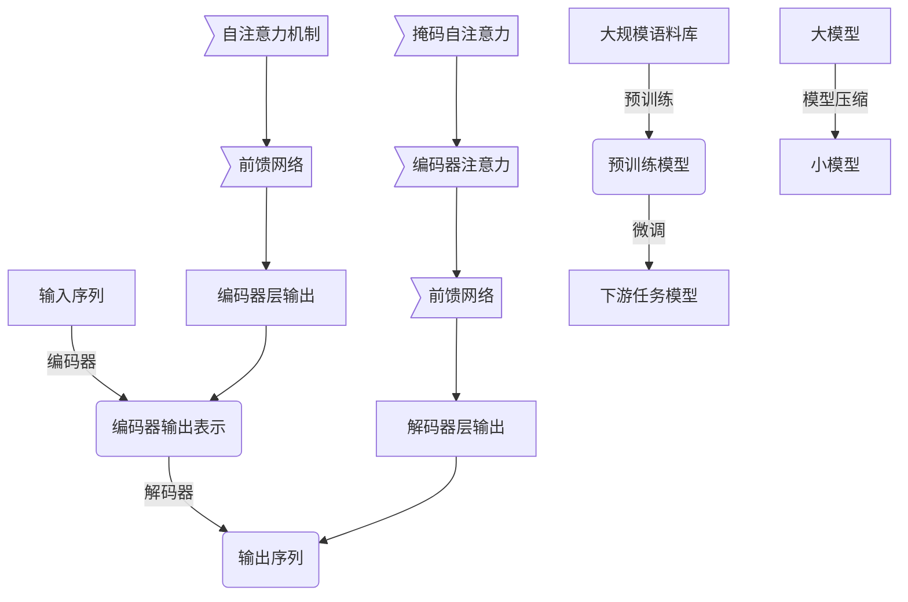

# 大语言模型原理与工程实践：组成模块选型

## 1. 背景介绍

### 1.1 大语言模型的兴起

近年来,大型语言模型(Large Language Models, LLMs)在自然语言处理(NLP)领域掀起了一场革命。这些模型通过在海量文本数据上进行预训练,学习到了丰富的语言知识和上下文理解能力,从而在下游任务中表现出令人惊叹的性能。

大语言模型的兴起可以追溯到2018年,当时OpenAI发布了Transformer模型,展示了其在机器翻译等任务中的卓越表现。此后,谷歌的BERT、OpenAI的GPT系列、以及其他模型不断刷新着大型语言模型的能力上限。

### 1.2 大语言模型的重要性

大语言模型在自然语言处理领域扮演着越来越重要的角色,原因有以下几点:

1. **通用性强** - 大语言模型通过预训练获得了广泛的语言理解能力,可以应用于多种下游任务,如问答、总结、文本生成等,无需从头开始训练。

2. **性能卓越** - benefiting from large-scale pretraining and model scaling, large language models have achieved state-of-the-art performance on various NLP benchmarks.

3. **可解释性** - 通过分析模型的注意力分布和激活模式,我们可以洞见模型内部的语言理解过程,这为模型的可解释性和可信赖性提供了支持。

4. **通用知识库** - 大语言模型在预训练过程中吸收了大量的自然语言知识,可以视为一种通用知识库,为下游应用提供丰富的知识支持。

### 1.3 大语言模型的挑战

尽管大语言模型取得了巨大的成功,但其在实际应用中仍面临一些挑战:

1. **计算资源需求巨大** - 训练和推理大语言模型需要大量的计算资源,这对硬件和能源消耗提出了很高的要求。

2. **数据质量和隐私** - 预训练数据的质量和隐私问题可能会影响模型的公正性和可靠性。

3. **安全性和可控性** - 大语言模型可能会生成有害或不当的内容,如何确保其安全性和可控性是一个重大挑战。

4. **可解释性和可信赖性** - 虽然大语言模型在某种程度上是可解释的,但仍需要更多的研究来提高其可解释性和可信赖性。

5. **泛化能力** - 大语言模型在看到的数据分布上表现出色,但在分布外的场景下泛化能力可能会受到影响。

为了应对这些挑战,我们需要在大语言模型的架构、训练策略、部署方式等多个方面进行创新和优化。本文将重点探讨大语言模型的组成模块选型,为读者提供实用的指导和最佳实践。

## 2. 核心概念与联系

在深入探讨大语言模型组成模块的选型之前,我们需要先了解一些核心概念及其之间的联系。

### 2.1 自注意力机制 (Self-Attention)

自注意力机制是大语言模型的核心组成部分之一。它允许模型捕捉输入序列中任意两个位置之间的关系,从而更好地建模长距离依赖。自注意力机制通过计算查询(Query)、键(Key)和值(Value)之间的相似性来确定注意力分布,然后对值进行加权求和以生成输出表示。

在大语言模型中,自注意力机制通常被组织成多头注意力(Multi-Head Attention)的形式,以捕捉不同的关系子空间。此外,为了增强模型的表示能力,通常会堆叠多个编码器(Encoder)或解码器(Decoder)层,每一层都包含自注意力子层和前馈网络(Feed-Forward Network)子层。

### 2.2 transformer架构

Transformer是一种全新的序列到序列(Seq2Seq)模型架构,它完全基于注意力机制,不依赖于循环神经网络(RNN)或卷积神经网络(CNN)。Transformer架构包括编码器(Encoder)和解码器(Decoder)两个主要部分。

编码器将输入序列映射到一系列连续的表示,而解码器则基于这些表示生成目标序列。编码器和解码器都由多个相同的层组成,每层包含多头自注意力子层和前馈网络子层。此外,解码器还包含一个额外的多头注意力子层,用于关注编码器的输出。

Transformer架构的优势在于并行性强、计算效率高,能够更好地捕捉长距离依赖关系。它在机器翻译、文本生成等任务中表现出色,成为大语言模型的主流架构选择。

### 2.3 预训练与微调 (Pretraining & Fine-tuning)

大语言模型通常采用两阶段策略:预训练(Pretraining)和微调(Fine-tuning)。

在预训练阶段,模型在大规模无监督文本数据上进行训练,目标是学习通用的语言表示。常见的预训练目标包括掩码语言模型(Masked Language Modeling)和下一句预测(Next Sentence Prediction)等。

在微调阶段,我们将预训练好的模型作为初始化权重,在特定的下游任务数据上进行进一步训练。由于模型已经学习到了通用的语言知识,只需要对其进行适当的调整,就可以将这些知识迁移到下游任务中。

预训练和微调的策略使得大语言模型能够从大规模无监督数据中学习知识,并将这些知识泛化到不同的下游任务,从而显著提高了模型的性能和数据效率。

### 2.4 模型压缩 (Model Compression)

尽管大语言模型在性能上表现出色,但它们通常包含数十亿甚至上千亿的参数,导致推理时的计算和存储开销极高。为了在资源受限的环境(如移动设备、边缘设备等)中部署这些模型,我们需要采用模型压缩技术来减小模型的footprint。

常见的模型压缩技术包括:

- **量化(Quantization)**: 将模型参数从32位或16位浮点数压缩到8位或更低的定点数表示。
- **知识蒸馏(Knowledge Distillation)**: 使用一个大型教师模型来指导训练一个小型的学生模型,以传递知识。
- **剪枝(Pruning)**: 通过移除模型中不重要的权重,从而减小模型大小。
- **矩阵分解(Matrix Decomposition)**: 将模型权重矩阵分解成低秩形式,以减少参数数量。

通过合理选择和组合这些技术,我们可以在保持模型性能的同时,显著降低其计算和存储开销,从而实现高效的模型部署。

### 2.5 Mermaid流程图

为了更好地理解大语言模型的核心概念及其联系,我们使用Mermaid流程图进行直观展示:

上图展示了大语言模型的核心组成部分及其工作流程:

1. 输入序列首先经过编码器进行编码,生成连续的表示序列。
2. 编码器由多个相同的层组成,每层包含自注意力机制和前馈网络。
3. 解码器基于编码器的输出表示,通过掩码自注意力、编码器注意力和前馈网络生成最终的输出序列。
4. 大语言模型通常采用预训练和微调的两阶段策略,先在大规模语料库上进行预训练,再在下游任务数据上进行微调。
5. 为了实现高效部署,我们可以使用模型压缩技术将大模型压缩为小模型。

通过对这些核心概念及其联系的理解,我们将能够更好地把握大语言模型的本质,为后续的模块选型奠定基础。

## 3. 核心算法原理具体操作步骤

在上一节中,我们介绍了大语言模型的核心概念及其联系。现在,我们将深入探讨自注意力机制和Transformer架构的具体算法原理和操作步骤。

### 3.1 自注意力机制

自注意力机制是大语言模型中最关键的组成部分之一。它允许模型捕捉输入序列中任意两个位置之间的关系,从而更好地建模长距离依赖。自注意力机制的具体操作步骤如下:

1. **线性投影**: 将输入序列 $X = (x_1, x_2, \dots, x_n)$ 分别投影到查询(Query)、键(Key)和值(Value)空间,得到 $Q = (q_1, q_2, \dots, q_n)$、$K = (k_1, k_2, \dots, k_n)$ 和 $V = (v_1, v_2, \dots, v_n)$。

   $$q_i = W_qx_i, k_i = W_kx_i, v_i = W_vx_i$$

   其中 $W_q$、$W_k$ 和 $W_v$ 分别是查询、键和值的线性投影矩阵。

2. **计算注意力分数**: 对于每个查询 $q_i$,计算它与所有键 $k_j$ 的点积,得到未缩放的注意力分数 $e_{ij}$。

   $$e_{ij} = q_i^Tk_j$$

3. **缩放和软max**: 将未缩放的注意力分数除以一个缩放因子 $\sqrt{d_k}$ (其中 $d_k$ 是键的维度),以防止梯度过大或过小。然后对每个查询位置的注意力分数应用softmax函数,得到注意力权重 $\alpha_{ij}$。

   $$\alpha_{ij} = \frac{e^{e_{ij}/\sqrt{d_k}}}{\sum_{l=1}^n e^{e_{il}/\sqrt{d_k}}}$$

4. **加权求和**: 将每个值向量 $v_j$ 乘以相应的注意力权重 $\alpha_{ij}$,再对所有加权值向量求和,得到注意力输出 $o_i$。

   $$o_i = \sum_{j=1}^n \alpha_{ij}v_j$$

5. **多头注意力**: 为了捕捉不同的关系子空间,我们将上述过程并行运行 $h$ 次,每次使用不同的线性投影矩阵。然后将这 $h$ 个注意力输出拼接起来,并通过另一个线性投影得到最终的多头注意力输出。

通过自注意力机制,模型可以动态地为每个位置分配注意力权重,从而捕捉输入序列中任意两个位置之间的依赖关系。这种灵活的关注机制是大语言模型取得卓越性能的关键所在。

### 3.2 Transformer架构

Transformer是一种全新的序列到序列(Seq2Seq)模型架构,它完全基于注意力机制,不依赖于循环神经网络(RNN)或卷积神经网络(CNN)。Transformer架构包括编码器(Encoder)和解码器(Decoder)两个主要部分,其具体操作步骤如下:

#### 3.2.1 编码器(Encoder)

1. **输入嵌入**: 将输入序列 $X = (x_1, x_2, \dots, x_n)$ 通过嵌入矩阵映射到连续的向量表示 $(e_1, e_2, \dots, e_n)$。

2. **位置编码**: 由于自注意力机制没有捕捉位置信息的能力,我们需要为每个位置添加一个位置编码向量,以注入位置信息。

   $$PE_{(pos, 2i)} = \sin(pos/10000^{2i/d_{model}})$$
   $$PE_{(pos, 2i+1)} = \cos(pos/10000^{2i/d_{model}})$$

   其中 $pos$ 是位置索引,而 $i