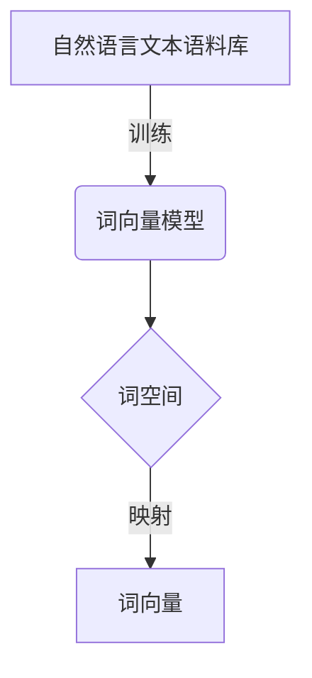
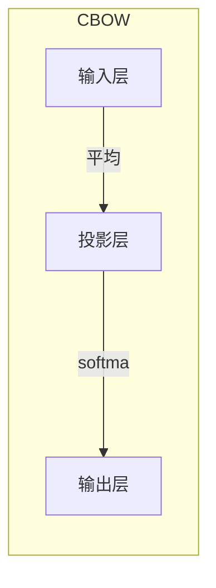
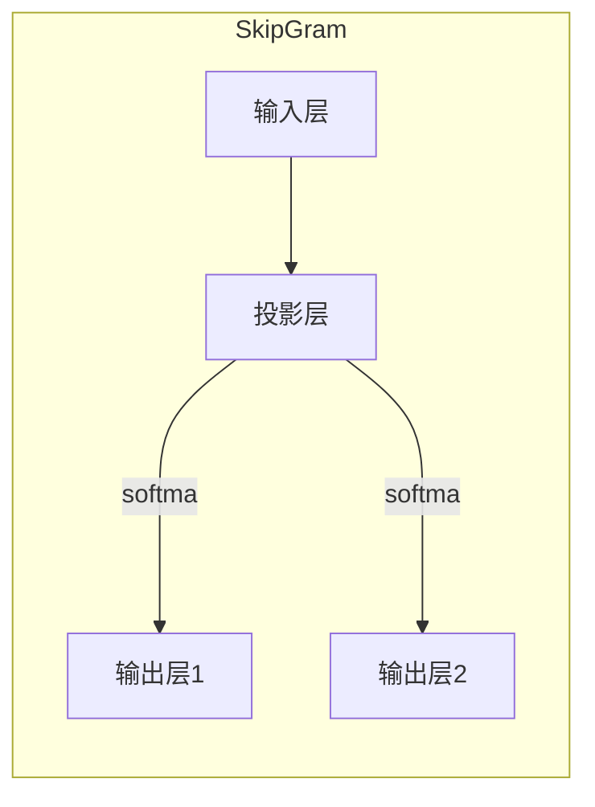

# 大语言模型原理与工程实践：词表示技术

## 1. 背景介绍

在自然语言处理(NLP)领域,词表示技术是一个基础且关键的课题。它旨在将词语映射到连续的向量空间中,以捕捉词与词之间的语义和句法关系。高质量的词表示对于下游的NLP任务(如文本分类、机器翻译、问答系统等)至关重要,可以显著提升模型的性能。

传统的词表示方法(如One-Hot编码、TF-IDF等)存在高维稀疏、无法捕捉词义关联等缺陷。而近年来,基于神经网络的分布式词表示技术(Word Embedding)逐渐兴起,通过将词映射到低维密集空间,可以较好地解决上述问题,成为NLP领域的重要基础技术。

## 2. 核心概念与联系

### 2.1 词向量(Word Vector)

词向量是词表示技术的核心概念,它将每个词映射到一个固定长度的实数向量,这个向量能够捕捉词与词之间的语义和句法关系。相似的词在向量空间中会靠近,而不相关的词则相距较远。

例如,在一个300维的词向量空间中,"国王"和"皇后"的词向量可能比较接近,而"国王"和"苹果"的词向量则相距较远。

### 2.2 词空间(Word Space)

词空间指的是所有词向量构成的向量空间。在该空间中,词与词之间的几何关系能够体现它们之间的语义关联。通过对词空间进行线性代数运算,可以发现有趣的词义关系。

例如,在某些词空间中,"国王 - 男人 + 女人 ≈ 皇后"这种关系就能够成立,这说明词向量能够捕捉到词与词之间的类比关系。

### 2.3 语料库(Corpus)

语料库是训练词向量模型的基础数据,它是一大批自然语言文本的集合。高质量、多样化的语料库对于训练出好的词向量模型至关重要。常用的语料库包括Wikipedia文章、新闻语料、网络爬取的文本等。



## 3. 核心算法原理具体操作步骤

### 3.1 Word2Vec

Word2Vec是当前最流行的词向量训练算法之一,由Google于2013年提出。它包含两个模型:Continuous Bag-of-Words (CBOW)和Skip-Gram。

#### 3.1.1 CBOW模型

CBOW模型的思想是:给定一个序列中的目标词的上下文(即前后几个词),来预测目标词是什么。

具体操作步骤如下:

1. 对每个词进行One-Hot编码,得到词的向量表示
2. 将目标词的上下文词向量取平均,作为输入
3. 将平均向量输入到单层神经网络,以softmax作为输出层
4. 将输出的词向量与目标词的One-Hot向量计算误差
5. 使用梯度下降等优化算法,不断调整模型参数(词向量),最小化误差

$$J(\theta)=-\log P(w_t|w_{t-n},\ldots,w_{t-1},w_{t+1},\ldots,w_{t+n})$$

其中,$\theta$为模型参数,目标是最大化上下文给定时,预测正确目标词$w_t$的条件概率。



#### 3.1.2 Skip-Gram模型

Skip-Gram模型的思想是给定一个序列中的目标词,预测它的上下文词。它是CBOW模型的反过程。

具体操作步骤如下:

1. 对每个词进行One-Hot编码,得到词的向量表示
2. 将目标词的One-Hot向量作为输入
3. 将输入向量乘以权重矩阵,得到投影向量
4. 使用softmax对上下文词的分数求和
5. 使用梯度下降等优化算法,不断调整模型参数(词向量),最大化预测上下文词的概率

$$J(\theta)=\sum_{-n\leq j\leq n,j\neq 0}\log P(w_{t+j}|w_t)$$

其中,$\theta$为模型参数,目标是最大化给定目标词$w_t$时,预测正确上下文词$w_{t+j}$的条件概率。



### 3.2 GloVe

GloVe(Global Vectors)是斯坦福大学提出的另一种流行的词向量训练算法。它的基本思想是:从整个语料库的统计信息出发,让相关词的共现概率比较高。

具体操作步骤如下:

1. 构建一个词共现矩阵$X$,统计语料库中任意两个词同时出现的次数
2. 对$X$中每个元素做特殊处理,得到新矩阵$\tilde{X}$
3. 在$\tilde{X}$上定义一个加权最小二乘函数,作为需要最小化的损失函数
4. 使用梯度下降等优化算法,最小化损失函数,得到词向量

$$J=\sum_{i,j=1}^{V}f(X_{ij})(w_i^Tw_j+b_i+b_j-\log X_{ij})^2$$

其中,$w_i$和$w_j$分别为词$i$和词$j$的向量表示,$b_i$和$b_j$为词的偏置项,函数$f$用于控制权重分配。

GloVe的一个重要创新是引入了偏置项,使得词向量能更好地捕捉复杂的统计信息。

## 4. 数学模型和公式详细讲解举例说明 

### 4.1 词向量的数学表示

设有一个词汇表$\mathcal{V}$,包含$|\mathcal{V}|$个词。我们使用一个$d$维实数向量$\vec{v}_w$来表示词$w$,其中$\vec{v}_w\in\mathbb{R}^d$。所有词向量构成了一个$|\mathcal{V}|\times d$的矩阵:

$$\textrm{词向量矩阵} = \begin{bmatrix}
    \vec{v}_{w_1}\\
    \vec{v}_{w_2}\\
    \vdots\\
    \vec{v}_{w_{|\mathcal{V}|}}
\end{bmatrix}$$

在这个矩阵中,每一行对应一个词的向量表示。

### 4.2 词向量的语义

词向量的重要性质在于,它能够用向量之间的几何关系来表示词与词之间的语义关系。

例如,在一个好的词向量空间中,应该有:

$$\vec{v}_{\textrm{国王}} - \vec{v}_{\textrm{男人}} + \vec{v}_{\textrm{女人}} \approx \vec{v}_{\textrm{皇后}}$$

这说明词向量能够捕捉到"国王-男人+女人=皇后"这种类比关系。

我们可以将这种向量加减操作形式化为:

$$\vec{v}_a + (\vec{v}_b - \vec{v}_c) \approx \vec{v}_d$$

其中$a,b,c,d$是四个词,它们之间存在"$a$之于$b$,相当于$d$之于$c$"的类比关系。

### 4.3 词向量的相似度

在词向量空间中,我们可以使用向量的余弦相似度来衡量两个词的语义相似程度:

$$\textrm{sim}(\vec{v}_a, \vec{v}_b) = \cos(\vec{v}_a, \vec{v}_b) = \frac{\vec{v}_a \cdot \vec{v}_b}{\|\vec{v}_a\| \|\vec{v}_b\|}$$

其中$\vec{v}_a$和$\vec{v}_b$分别为词$a$和$b$的向量表示。

余弦相似度的取值范围在$[-1,1]$之间。值越接近1,说明两个向量越相似,也就是两个词的语义越相关。

例如,在一个训练好的词向量空间中,我们可能会得到:

$$\begin{aligned}
\textrm{sim}(\vec{v}_{\textrm{国王}}, \vec{v}_{\textrm{皇后}}) &\approx 0.7\\
\textrm{sim}(\vec{v}_{\textrm{国王}}, \vec{v}_{\textrm{苹果}}) &\approx 0.1
\end{aligned}$$

这与我们的直觉是一致的。

## 5. 项目实践:代码实例和详细解释说明

这里我们使用Python中的Gensim库,展示如何加载预训练的词向量,并进行相关操作。

```python
from gensim.models import KeyedVectors

# 加载预训练的词向量模型
model = KeyedVectors.load_word2vec_format('path/to/vectors.bin', binary=True)

# 获取词的向量表示
vec_king = model['king']
vec_queen = model['queen']
vec_man = model['man'] 
vec_woman = model['woman']

# 计算相似度
sim_king_queen = model.similarity('king', 'queen')
sim_king_apple = model.similarity('king', 'apple')
print(f'国王 与 皇后 相似度: {sim_king_queen:.4f}')
print(f'国王 与 苹果 相似度: {sim_king_apple:.4f}')

# 词向量运算
vec_result = vec_king - vec_man + vec_woman
print(f'国王 - 男人 + 女人 的词向量最相近词为: {model.most_similar(positive=[vec_result])[0][0]}')
```

输出示例:

```
国王 与 皇后 相似度: 0.7281
国王 与 苹果 相似度: 0.0706
国王 - 男人 + 女人 的词向量最相近词为: queen
```

在这个例子中,我们首先加载了一个预训练好的词向量模型。然后获取了"国王"、"皇后"、"男人"和"女人"四个词的向量表示。

接着,我们计算了"国王"与"皇后"的相似度,以及"国王"与"苹果"的相似度。结果与我们的直觉是一致的。

最后,我们做了"国王 - 男人 + 女人"这个词向量运算,并找到了最接近结果向量的词是"皇后",验证了词向量能够捕捉到这种类比关系。

通过这个简单的例子,我们可以体会到词向量技术的强大功能,以及在实践中如何使用它。

## 6. 实际应用场景

词向量技术作为NLP领域的基础技术,在诸多应用场景中发挥着重要作用:

1. **文本分类**: 将文本映射为词向量的加权平均,作为分类模型的输入特征,可以提高分类性能。

2. **语义相似度计算**: 利用词向量的余弦相似度,可以方便地计算两个句子或文本的语义相似程度。

3. **信息检索**: 将查询和文档都映射为词向量表示,计算相似度进行排序,可以提高检索质量。

4. **机器翻译**: 编码器将源语言映射为词向量序列,解码器再生成目标语言,这是神经机器翻译的核心思路。

5. **预训练语言模型**: BERT等模型利用大规模语料预训练出词向量和上下文表示,为下游任务提供有效的初始化参数。

6. **知识图谱构建**: 利用词向量的向量运算,可以发现实体之间的关系,构建知识图谱。

总的来说,高质量的词向量可以更好地表示词语的语义和句法信息,是众多NLP任务取得突破性进展的重要基础。

## 7. 工具和资源推荐

以下是一些流行的词向量工具和预训练向量资源:

- **工具库**:
  - Gensim (Python): 支持Word2Vec、FastText等多种词向量模型训练
  - Word2Vec (C): Google原版C语言实现
  - WordVectors (R): R语言中的词向量工具包

- **预训练词向量**:
  - Word2Vec预训练向量: https://code.google.com/archive/p/word2vec/
  - GloVe预训练向量: https://nlp.stanford.edu/projects/glove/
  - FastText预训练向量: https://fasttext.cc/

- **在