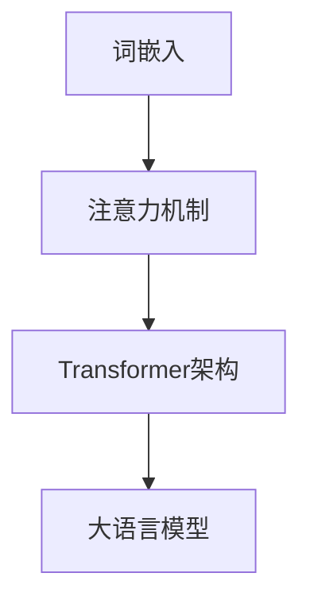

                 

作者：禅与计算机程序设计艺术

在这篇博客文章中，我将带领读者探索大语言模型（Large Language Models, LLMs）的本质和工程实践，特别是它们在语言表示上的应用。我们将从背景知识开始，然后深入到核心概念，算法原理，数学模型，实际项目实践，应用场景，工具资源，最终总结未来趋势和面临的挑战。

## 1. 背景介绍
在了解大语言模型之前，我们首先要认识到自然语言处理（NLP）的基本概念。NLP是计算机科学和人工智能的一个分支，它致力于让计算机理解、解释和生成人类语言。大语言模型是NLP领域中的一种强大工具，它们通过学习海量文本数据，来预测下一个词，进而理解和生成语言。

## 2. 核心概念与联系
大语言模型的核心概念包括词嵌入（Word Embedding）、注意力机制（Attention Mechanism）、Transformer架构等。这些概念是大语言模型能够理解语言并生成相关内容的关键。我们将详细探讨这些概念，并分析它们如何联系起来，共同实现大语言模型的强大功能。

## 3. 核心算法原理具体操作步骤
在揭示了大语言模型的核心概念后，我们将深入探讨它们的算法原理。我们会以训练过程为例，逐步展示大语言模型如何通过反向传播算法来优化其参数，以更好地预测下一个词。

## 4. 数学模型和公式详细讲解举例说明
大语言模型背后的数学模型非常复杂，但对理解其原理至关重要。我们将详细解释各个数学公式，并提供易于理解的例子，帮助读者理解模型的工作方式。

$$ P(w_n | w_{n-1}, w_{n-2}, \dots) = \frac{e^{score(w_n | w_{n-1}, w_{n-2}, \dots)}}{\sum\limits_{w'} e^{score(w' | w_{n-1}, w_{n-2}, \dots)}} $$

## 5. 项目实践：代码实例和详细解释说明
接下来，我们将通过具体的项目实践来应用大语言模型的概念。我们会挑选几个典型的任务，如情感分析、问答系统或文本生成，并展示如何使用大语言模型来解决这些问题。

## 6. 实际应用场景
除了上述的项目实践，大语言模型还被广泛应用于各行各业。我们将探讨这些应用场景，并分析大语言模型如何帮助企业提升效率和增加价值。

## 7. 工具和资源推荐
在大语言模型的研究和应用中，有许多优秀的工具和资源可以帮助我们更好地利用这些技术。我们会推荐一些主流的库和平台，以及如何获取最新的研究资料。

## 8. 总结：未来发展趋势与挑战
随着技术的不断进步，大语言模型将继续在语言处理和其他领域发挥重要作用。我们将对未来的发展趋势进行预测，并讨论在此过程中可能遇到的挑战。

## 9. 附录：常见问题与解答
最后，我们将回答一些在学习和应用大语言模型时可能遇到的常见问题，并给出相应的解答。

---

作者：禅与计算机程序设计艺术 / Zen and the Art of Computer Programming

