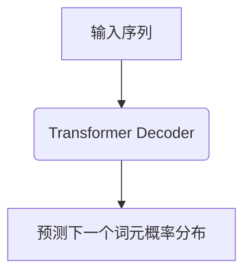
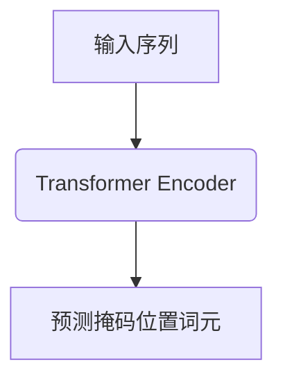
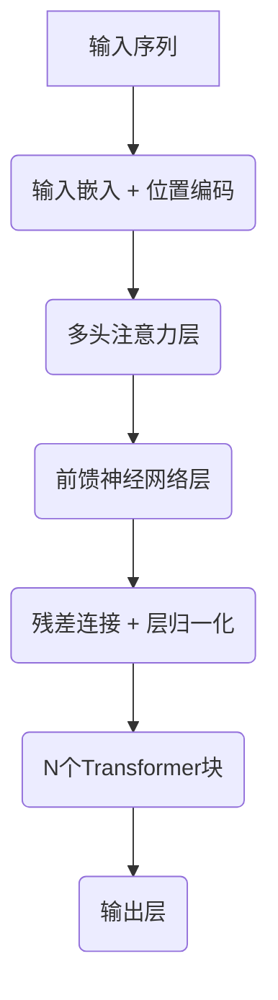

# 大语言模型原理基础与前沿 全局最优分配

## 1.背景介绍

### 1.1 自然语言处理的重要性

在当今信息时代,自然语言处理(NLP)已成为人工智能领域中最重要和最具挑战性的研究方向之一。随着数据量的激增和计算能力的飞速提高,NLP技术在各个领域得到了广泛应用,如机器翻译、智能问答、信息检索、情感分析等。

### 1.2 语言模型在NLP中的作用

语言模型是NLP的核心组成部分,旨在捕捉自然语言的统计规律和语义关联。传统的语言模型通常基于n-gram统计,只能建模局部语境,难以有效捕捉长距离依赖关系。近年来,随着深度学习技术的蓬勃发展,基于神经网络的语言模型(Neural Language Model)展现出了强大的语言理解和生成能力。

### 1.3 大语言模型的兴起

大型神经网络语言模型(Large Language Model,LLM)通过在海量文本数据上预训练,学习丰富的语义和世界知识表征,成为NLP领域的重大突破。代表性模型包括GPT、BERT、XLNet等,展现出了惊人的泛化能力,在多个下游任务上取得了超越人类的性能表现。

## 2.核心概念与联系

### 2.1 自回归语言模型

自回归语言模型(Autoregressive Language Model)是大语言模型的核心范式之一,其基本思想是基于历史词元序列,最大化预测下一个词元的条件概率。数学表达式如下:

$$P(x_1, x_2, \ldots, x_n) = \prod_{t=1}^n P(x_t | x_1, \ldots, x_{t-1})$$

其中$x_t$表示第t个词元。该范式的代表模型包括GPT系列。



### 2.2 掩码语言模型

掩码语言模型(Masked Language Model)是另一种广泛采用的大语言模型范式。它的目标是基于上下文,预测被掩码位置的词元。数学表达式如下:

$$\max_\theta \sum_{i=1}^n \log P(x_i | x_{\backslash i}; \theta)$$

其中$x_{\backslash i}$表示除掩码位置$i$之外的其他词元。该范式的代表模型包括BERT等。



### 2.3 序列到序列模型

序列到序列模型(Sequence-to-Sequence Model)将输入序列编码为上下文表征,再基于该表征生成目标序列,常用于机器翻译、文本摘要等任务。数学表达式如下:

$$P(y_1, \ldots, y_m | x_1, \ldots, x_n) = \prod_{t=1}^m P(y_t | y_1, \ldots, y_{t-1}, x_1, \ldots, x_n)$$

其中$x$和$y$分别表示源序列和目标序列。该范式的代表模型包括Transformer等。


上述范式可以相互嵌套组合,形成更加复杂和强大的语言模型架构。

## 3.核心算法原理具体操作步骤  

### 3.1 Transformer模型

Transformer是大语言模型的核心架构,它完全基于注意力机制,摒弃了传统的循环神经网络和卷积神经网络结构。Transformer的主要组成部分包括:

1. **输入嵌入层**: 将输入词元映射为向量表示。
2. **位置编码**: 为每个位置添加位置信息,捕捉序列的位置依赖关系。
3. **多头注意力层**: 并行计算多个注意力头,捕捉不同的语义关联。
4. **前馈神经网络层**: 对注意力输出进行非线性变换,提取更高层次的特征。
5. **规范化层**: 加速收敛并提高模型泛化能力。

Transformer的核心是自注意力机制,它允许每个词元直接关注到其他所有词元,捕捉长距离依赖关系。具体计算过程如下:

1. 计算查询(Query)、键(Key)和值(Value)向量:

   $$\begin{aligned}
   Q &= XW_Q \\
   K &= XW_K \\
   V &= XW_V
   \end{aligned}$$

   其中$X$为输入序列,$W_Q,W_K,W_V$为可学习的线性变换矩阵。

2. 计算注意力分数:

   $$\text{Attention}(Q, K, V) = \text{softmax}(\frac{QK^T}{\sqrt{d_k}})V$$

   其中$d_k$为缩放因子,用于防止点积过大导致的梯度饱和。

3. 多头注意力机制通过并行计算多个注意力头,再将它们的结果拼接,从而捕捉不同子空间的语义关联:

   $$\text{MultiHead}(Q, K, V) = \text{Concat}(head_1, \ldots, head_h)W^O$$
   $$\text{where } head_i = \text{Attention}(QW_i^Q, KW_i^K, VW_i^V)$$

   其中$W_i^Q,W_i^K,W_i^V,W^O$为可学习的线性变换矩阵。



上述Transformer架构可以应用于不同的语言模型范式,如自回归语言模型、掩码语言模型和序列到序列模型等。

### 3.2 预训练与微调

大语言模型通常采用两阶段训练策略:

1. **预训练(Pre-training)**: 在大规模无监督文本数据上训练模型,学习通用的语言表征。常用的预训练目标包括:
   - 掩码语言模型: 预测被掩码的词元
   - 下一句预测: 判断两个句子是否相邻
   - 自回归语言模型: 基于历史词元预测下一个词元

2. **微调(Fine-tuning)**: 在特定的下游任务上,使用有监督数据对预训练模型进行进一步调整,使其适应特定任务。微调通常只需要更新模型的部分参数,从而避免了从头开始训练的巨大计算开销。

预训练和微调的两阶段策略使得大语言模型能够高效地利用大规模无标注数据和少量有标注数据,实现了通用语言表征和特定任务之间的有效知识迁移。

## 4.数学模型和公式详细讲解举例说明

### 4.1 语言模型的概率计算

语言模型的核心目标是估计一个文本序列$\boldsymbol{x} = (x_1, x_2, \ldots, x_n)$的概率$P(\boldsymbol{x})$。根据链式法则,该概率可以分解为:

$$P(\boldsymbol{x}) = P(x_1, x_2, \ldots, x_n) = \prod_{t=1}^n P(x_t | x_1, \ldots, x_{t-1})$$

其中$P(x_t | x_1, \ldots, x_{t-1})$表示已知历史词元序列$(x_1, \ldots, x_{t-1})$时,第$t$个词元$x_t$的条件概率。

对于自回归语言模型,它直接对上述条件概率建模:

$$P(x_t | x_1, \ldots, x_{t-1}) = f_\theta(x_1, \ldots, x_{t-1})$$

其中$f_\theta$为神经网络模型,参数$\theta$通过最大似然估计学习得到:

$$\theta^* = \arg\max_\theta \sum_{\boldsymbol{x} \in \mathcal{D}} \log P_\theta(\boldsymbol{x})$$

$\mathcal{D}$为训练语料库。

对于掩码语言模型,它对被掩码位置的词元概率建模:

$$P(x_i | \boldsymbol{x}_{\backslash i}) = f_\theta(\boldsymbol{x}_{\backslash i})$$

其中$\boldsymbol{x}_{\backslash i}$表示除掩码位置$i$之外的其他词元,参数$\theta$同样通过最大似然估计学习得到。

### 4.2 注意力机制

注意力机制是大语言模型的核心,它使模型能够自适应地为不同的词元分配不同的注意力权重,从而捕捉长距离依赖关系。

给定一个查询向量$\boldsymbol{q}$和一组键向量$\boldsymbol{K} = [\boldsymbol{k}_1, \boldsymbol{k}_2, \ldots, \boldsymbol{k}_n]$,注意力分数计算如下:

$$\text{Attention}(\boldsymbol{q}, \boldsymbol{K}, \boldsymbol{V}) = \text{softmax}(\frac{\boldsymbol{q}\boldsymbol{K}^T}{\sqrt{d_k}})\boldsymbol{V}$$

其中$\boldsymbol{V} = [\boldsymbol{v}_1, \boldsymbol{v}_2, \ldots, \boldsymbol{v}_n]$为值向量序列,$d_k$为缩放因子,用于防止点积过大导致的梯度饱和。

$\text{softmax}(\frac{\boldsymbol{q}\boldsymbol{K}^T}{\sqrt{d_k}})$计算了查询向量与每个键向量之间的相似性分数,并通过softmax函数将其归一化为注意力权重。然后,注意力权重与值向量$\boldsymbol{V}$相乘,得到加权求和的注意力输出。

多头注意力机制通过并行计算多个注意力头,再将它们的结果拼接,从而捕捉不同子空间的语义关联:

$$\text{MultiHead}(\boldsymbol{Q}, \boldsymbol{K}, \boldsymbol{V}) = \text{Concat}(head_1, \ldots, head_h)\boldsymbol{W}^O$$
$$\text{where } head_i = \text{Attention}(\boldsymbol{Q}\boldsymbol{W}_i^Q, \boldsymbol{K}\boldsymbol{W}_i^K, \boldsymbol{V}\boldsymbol{W}_i^V)$$

其中$\boldsymbol{W}_i^Q,\boldsymbol{W}_i^K,\boldsymbol{W}_i^V,\boldsymbol{W}^O$为可学习的线性变换矩阵。

注意力机制赋予了模型动态关注不同位置信息的能力,是大语言模型取得卓越性能的关键所在。

## 5.项目实践:代码实例和详细解释说明

以下是一个使用PyTorch实现的简化版Transformer模型代码示例,用于掩码语言模型任务:

```python
import torch
import torch.nn as nn

class MultiHeadAttention(nn.Module):
    def __init__(self, embed_dim, num_heads):
        super().__init__()
        self.embed_dim = embed_dim
        self.num_heads = num_heads
        self.head_dim = embed_dim // num_heads

        self.qkv_proj = nn.Linear(embed_dim, 3 * embed_dim)
        self.out_proj = nn.Linear(embed_dim, embed_dim)

    def forward(self, x):
        batch_size, seq_len, _ = x.size()
        qkv = self.qkv_proj(x)
        q, k, v = qkv.chunk(3, dim=-1)

        q = q.view(batch_size, seq_len, self.num_heads, self.head_dim).transpose(1, 2)
        k = k.view(batch_size, seq_len, self.num_heads, self.head_dim).transpose(1, 2)
        v = v.view(batch_size, seq_len, self.num_heads, self.head_dim).transpose(1, 2)

        attn_scores = torch.matmul(q, k.transpose(-2, -1)) / math.sqrt(self.head_dim)
        attn_probs = nn.functional.softmax(attn_scores, dim=-1)
        attn_output = torch.matmul(attn_probs, v)
        attn_output = attn_output.transpose(1, 2).contiguous().view(batch_size, seq_len, -1)

        out = self.out_proj(attn_output)
        return out

class TransformerEncoder(nn.Module):
    def __init__(self, embed_dim, num_heads, ffn_dim, num_layers):
        