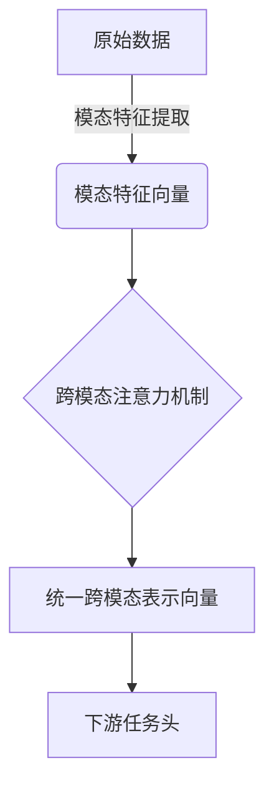
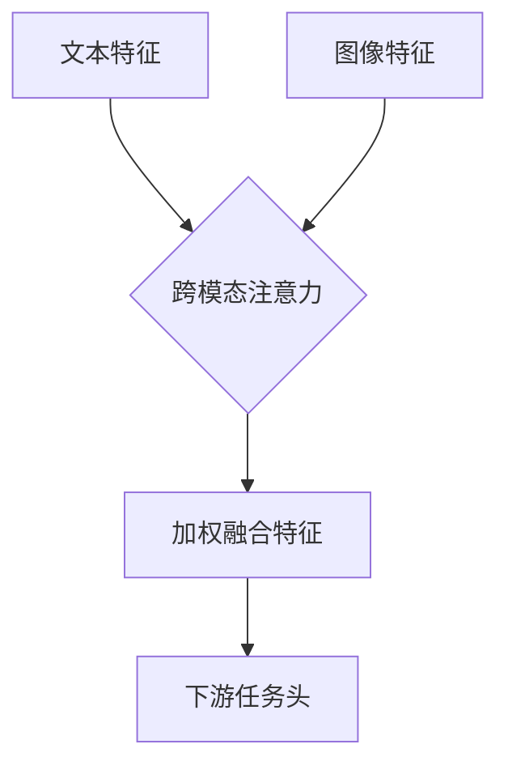

# 大语言模型原理基础与前沿 图文联合训练

## 1. 背景介绍

### 1.1 大语言模型的兴起

近年来,大型语言模型(Large Language Models, LLMs)在自然语言处理(NLP)领域取得了令人瞩目的成就。这些模型通过在海量文本数据上进行预训练,学习了丰富的语言知识和上下文信息,从而能够生成高质量、连贯的文本输出。

代表性的大语言模型包括 GPT-3、PaLM、ChatGPT 等,它们展现出了强大的文本生成、问答、总结和任务完成等能力,在多个 NLP 任务上取得了超越人类的性能。大语言模型的出现,推动了 NLP 技术的飞速发展,为各种应用场景带来了新的可能性。

### 1.2 图文联合训练的必要性

然而,纯文本训练数据的局限性制约了大语言模型的进一步发展。现实世界中,信息往往以多模态形式存在,如图像、视频等。单一的文本模态无法完全捕捉这些丰富的信息。因此,将图像等多模态数据融入大语言模型的训练过程,实现图文联合训练(Multimodal Training),成为了提升模型性能、拓展应用场景的关键途径。

图文联合训练能够让模型更好地理解图像内容,并生成与图像相关的高质量文本描述。此外,它还可以增强模型对视觉和语义信息之间关联的理解能力,为诸如视觉问答、图像分类和描述等任务奠定基础。

## 2. 核心概念与联系

### 2.1 图文联合表示学习

图文联合表示学习(Multimodal Representation Learning)是图文联合训练的核心概念。它旨在学习一种统一的表示空间,在该空间中,不同模态的数据(如文本和图像)可以被映射到相近的向量表示,从而捕捉它们之间的语义关联。

该概念的关键在于,通过联合训练,模型可以学习到一种跨模态的表示,使得不同模态的数据在该表示空间中具有相似的语义。例如,一张狗的图像和描述该图像的文本,在该表示空间中会被映射到相近的向量。

### 2.2 注意力机制在图文联合中的作用

注意力机制(Attention Mechanism)在图文联合训练中扮演着关键角色。它能够有效地捕捉不同模态之间的相关性,并对相关部分赋予更高的权重。

具体来说,注意力机制可以让模型在处理一个模态的数据时,同时关注另一个模态的相关部分。例如,在生成图像描述时,模型可以通过注意力机制关注图像中的不同区域,并根据这些区域生成相应的文本描述。

### 2.3 预训练与微调策略

与纯文本大语言模型类似,图文联合模型也需要经历预训练和微调两个阶段。在预训练阶段,模型在大规模的图文数据集上进行联合训练,学习通用的跨模态表示。而在微调阶段,预训练模型会在特定的下游任务数据集上进行进一步调整,以适应具体的应用场景。

预训练和微调策略的选择对模型性能有着重要影响。常见的预训练目标包括掩码语言模型(Masked Language Modeling)、图像文本对比(Image-Text Contrastive)等。微调策略则需要根据下游任务的特点进行优化,如添加特定的任务头、调整损失函数等。

## 3. 核心算法原理具体操作步骤

### 3.1 图文联合编码器

图文联合编码器(Multimodal Encoder)是图文联合模型的核心组件,负责将不同模态的输入数据编码为相应的特征表示。常见的编码器架构包括:

1. **双流编码器(Dual-stream Encoder)**:使用两个独立的编码器分别处理文本和图像输入,然后将两个模态的特征进行融合。
2. **单流编码器(Single-stream Encoder)**:将文本和图像输入拼接后,使用单个编码器进行联合编码。
3. **转换器编码器(Transformer Encoder)**:基于自注意力机制的编码器,可以直接对不同模态的输入进行联合编码。

无论采用何种架构,图文联合编码器的目标都是学习一种统一的跨模态表示,以捕捉不同模态之间的语义关联。

### 3.2 注意力融合机制

注意力融合机制(Attention Fusion)是图文联合模型中常用的技术,用于有效地融合不同模态的特征表示。主要分为以下几种方式:

1. **加性注意力融合(Additive Attention Fusion)**:将不同模态的特征表示相加,得到融合后的表示。
2. **乘性注意力融合(Multiplicative Attention Fusion)**:将不同模态的特征表示逐元素相乘,得到融合后的表示。
3. **多头注意力融合(Multi-Head Attention Fusion)**:基于多头自注意力机制,对不同模态的特征表示进行注意力加权融合。
4. **交叉注意力融合(Cross Attention Fusion)**:使用一个模态的特征作为查询,另一个模态的特征作为键值对,通过注意力机制进行融合。

不同的注意力融合机制适用于不同的场景,需要根据具体任务和数据特点进行选择和调优。

### 3.3 预训练目标

图文联合模型的预训练目标旨在学习通用的跨模态表示,以便后续在下游任务上进行微调。常见的预训练目标包括:

1. **掩码语言模型(Masked Language Modeling, MLM)**:在文本输入中随机掩码部分词元,模型需要根据上下文和图像信息预测被掩码的词元。
2. **图像文本对比(Image-Text Contrastive)**:最大化同一对图像和文本描述的相似度,最小化不同对的相似度。
3. **图像文本对抗(Image-Text Adversarial)**:使用对抗学习,让模型生成的文本描述能够欺骗判别器,从而提高描述质量。
4. **视觉问答(Visual Question Answering, VQA)**:根据图像和问题,预测正确的答案。
5. **图像分类(Image Classification)**:根据图像内容,预测正确的类别标签。

通常情况下,会组合多种预训练目标,以全面提升模型的表现。

### 3.4 微调策略

在完成预训练后,图文联合模型需要针对特定的下游任务进行微调,以进一步提高性能。常见的微调策略包括:

1. **添加任务特定头(Task-Specific Head)**:在预训练模型的输出上添加一个特定的头(Head),用于预测下游任务的目标(如分类标签、生成文本等)。
2. **微调全部或部分参数**:可以选择微调预训练模型的全部参数,或者只微调部分层(如最后几层)的参数。
3. **数据增强(Data Augmentation)**:通过各种数据增强技术(如随机裁剪、旋转等)生成更多的训练数据,提高模型的泛化能力。
4. **多任务学习(Multi-Task Learning)**:同时在多个相关任务上进行联合训练,以提高模型的泛化能力和鲁棒性。
5. **迁移学习(Transfer Learning)**:将在一个领域预训练的模型迁移到另一个领域,并进行进一步的微调。

微调策略的选择需要根据具体任务的特点、数据量和计算资源等因素进行权衡。

## 4. 数学模型和公式详细讲解举例说明

### 4.1 注意力机制公式

注意力机制是图文联合模型中的核心组件之一,它能够有效地捕捉不同模态之间的相关性。下面是注意力机制的数学公式:

给定一个查询向量 $\boldsymbol{q}$、一组键向量 $\boldsymbol{K} = \{\boldsymbol{k}_1, \boldsymbol{k}_2, \ldots, \boldsymbol{k}_n\}$ 和一组值向量 $\boldsymbol{V} = \{\boldsymbol{v}_1, \boldsymbol{v}_2, \ldots, \boldsymbol{v}_n\}$,注意力机制计算过程如下:

1. 计算查询向量和每个键向量之间的相似度分数:

$$\text{score}(\boldsymbol{q}, \boldsymbol{k}_i) = \boldsymbol{q}^\top \boldsymbol{k}_i$$

2. 对相似度分数进行软最大化(softmax)操作,得到注意力权重:

$$\alpha_i = \frac{\exp(\text{score}(\boldsymbol{q}, \boldsymbol{k}_i))}{\sum_{j=1}^n \exp(\text{score}(\boldsymbol{q}, \boldsymbol{k}_j))}$$

3. 将注意力权重与值向量相乘,得到加权和作为注意力输出:

$$\text{Attention}(\boldsymbol{q}, \boldsymbol{K}, \boldsymbol{V}) = \sum_{i=1}^n \alpha_i \boldsymbol{v}_i$$

在图文联合模型中,查询向量 $\boldsymbol{q}$ 可以来自一个模态(如文本),而键值对 $(\boldsymbol{K}, \boldsymbol{V})$ 可以来自另一个模态(如图像)。通过注意力机制,模型可以关注图像中与文本相关的部分,从而更好地捕捉跨模态的语义关联。

### 4.2 对比损失函数

对比损失函数(Contrastive Loss)是图文联合模型预训练中常用的一种损失函数,旨在最大化同一对图像和文本描述的相似度,最小化不同对的相似度。

给定一个批次中的图像-文本对 $\{(\boldsymbol{x}_i, \boldsymbol{y}_i)\}_{i=1}^N$,其中 $\boldsymbol{x}_i$ 表示图像特征向量,而 $\boldsymbol{y}_i$ 表示对应的文本特征向量。我们定义图像-文本对的相似度分数为:

$$s_{i,j} = \boldsymbol{x}_i^\top \boldsymbol{y}_j$$

对比损失函数的目标是最大化正样本对(同一对图像和文本)的相似度分数,最小化负样本对(不同对的图像和文本)的相似度分数。具体来说,损失函数可以定义为:

$$\mathcal{L}_\text{contrast} = -\frac{1}{N} \sum_{i=1}^N \log \frac{\exp(s_{i,i} / \tau)}{\sum_{j=1}^N \exp(s_{i,j} / \tau)}$$

其中 $\tau$ 是一个温度超参数,用于调节相似度分数的尺度。

通过优化这个损失函数,模型可以学习到一种统一的跨模态表示空间,使得同一对图像和文本描述在该空间中具有高度相似的向量表示,而不同对则相距较远。这种表示空间对于下游的图文任务(如视觉问答、图像描述等)是非常有益的。

### 4.3 视觉问答任务建模

视觉问答(Visual Question Answering, VQA)是图文联合模型的一个典型应用场景。给定一张图像和一个相关的自然语言问题,模型需要根据图像内容和问题,预测出正确的答案。

假设我们有一个图像特征向量 $\boldsymbol{v}$ 和一个问题特征向量 $\boldsymbol{q}$,我们可以使用注意力机制来融合这两个模态的信息:

$$\boldsymbol{z} = \text{Attention}(\boldsymbol{q}, \boldsymbol{v}, \boldsymbol{v})$$

其中,注意力机制使用问题特征向量 $\boldsymbol{q}$ 作为查询,图像特征向量 $\boldsymbol{v}$ 作为键值对,从而得到一个融合后的表示向量 $\boldsymbol{z}$。

接下来,我们可以使用一个前馈神经网络来预测答案:

$$\boldsymbol{a} =