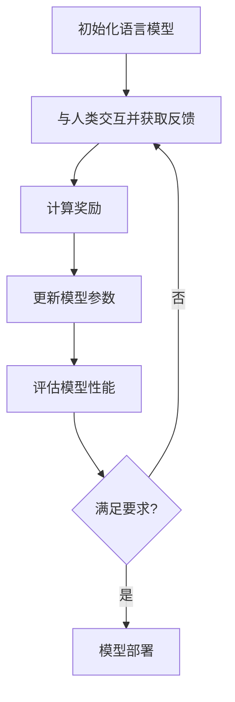

# 大语言模型原理基础与前沿 基于人类反馈的强化学习

## 1. 背景介绍

### 1.1 大语言模型的兴起

近年来,大型语言模型(Large Language Models, LLMs)在自然语言处理领域取得了令人瞩目的成就。这些模型通过在海量文本数据上进行预训练,学习到了丰富的语言知识和上下文信息,从而能够生成高质量、连贯且相关的文本输出。

代表性的大语言模型包括 GPT-3、PaLM、ChatGPT 等,它们展现出了强大的文本生成、问答、总结和任务完成等能力,在各种自然语言处理任务中表现出色。

### 1.2 人类反馈在语言模型中的重要性

尽管大语言模型取得了巨大的进步,但它们仍然存在一些局限性和缺陷。例如,生成的文本可能包含偏差、不一致或不合理的内容。此外,这些模型缺乏对语境和人类意图的深入理解,难以进行有意义的交互。

为了解决这些问题,研究人员提出了一种新的范式:基于人类反馈的强化学习。通过将人类反馈融入到模型的训练过程中,语言模型可以更好地理解和满足人类的需求,从而生成更加准确、相关和有用的输出。

## 2. 核心概念与联系

### 2.1 强化学习概述

强化学习(Reinforcement Learning, RL)是机器学习的一个重要分支,它关注如何让智能体(Agent)通过与环境(Environment)的交互来学习采取最优策略,从而最大化未来的回报(Reward)。

在强化学习中,智能体会观察到当前的环境状态,并根据策略选择一个行动。环境会根据这个行动转移到下一个状态,并给出相应的回报。智能体的目标是学习一个最优策略,使得在长期内获得的累积回报最大化。

### 2.2 人类反馈作为奖励信号

在基于人类反馈的强化学习中,人类反馈被视为奖励信号,用于指导语言模型的训练。当语言模型生成的输出符合人类的期望时,它会获得正面的反馈(正奖励);反之,如果输出存在问题或不合适,它会获得负面的反馈(负奖励)。

通过不断地与人类交互并获取反馈,语言模型可以逐步优化其策略,生成更加符合人类需求的输出。这种方法有助于缓解传统语言模型存在的局限性,使其更加人性化和可控。

### 2.3 人类反馈的类型

人类反馈可以采取多种形式,包括但不限于:

1. **评分反馈**: 人类为模型输出打分,反映其质量和适用性。
2. **编辑反馈**: 人类直接编辑和修改模型输出,以纠正错误或改进表达。
3. **偏好反馈**: 人类从多个候选输出中选择最佳选项。
4. **自然语言反馈**: 人类使用自然语言对模型输出进行评论和反馈。

不同类型的反馈可以根据具体的应用场景和需求进行选择和组合使用。

## 3. 核心算法原理具体操作步骤

基于人类反馈的强化学习过程可以概括为以下几个关键步骤:



### 3.1 初始化语言模型

首先,我们需要初始化一个基础的语言模型,通常是在大规模语料库上预训练的模型。这个模型将作为强化学习过程的起点。

### 3.2 与人类交互并获取反馈

接下来,我们让语言模型与人类进行交互,生成文本输出。人类会根据输出的质量和适用性提供反馈,可以是评分、编辑、偏好或自然语言形式。

### 3.3 计算奖励

根据人类提供的反馈,我们需要计算相应的奖励信号。这可以通过设计合适的奖励函数来实现,将人类反馈映射为数值奖励。

### 3.4 更新模型参数

利用计算得到的奖励信号,我们可以使用强化学习算法(如策略梯度算法)来更新语言模型的参数,使其朝着获取更高奖励的方向优化。

### 3.5 评估模型性能

在每个训练迭代后,我们需要评估模型的性能,检查它是否满足预期的要求。这可以通过在验证集或测试集上进行评估来实现。

### 3.6 模型部署或继续训练

如果模型的性能达到了预期的水平,我们就可以将其部署到实际应用中。否则,我们需要继续进行训练迭代,直到模型达到满意的性能为止。

通过不断地与人类交互、获取反馈并更新模型参数,语言模型可以逐步改进其输出质量,更好地满足人类的需求和期望。

## 4. 数学模型和公式详细讲解举例说明

在基于人类反馈的强化学习中,我们需要设计合适的数学模型和算法来实现关键步骤。以下是一些常用的数学模型和公式:

### 4.1 马尔可夫决策过程 (Markov Decision Process, MDP)

强化学习问题通常被建模为马尔可夫决策过程(MDP)。MDP由一组元组 $(S, A, P, R, \gamma)$ 定义,其中:

- $S$ 是状态空间
- $A$ 是动作空间
- $P(s'|s, a)$ 是状态转移概率,表示在状态 $s$ 下执行动作 $a$ 后转移到状态 $s'$ 的概率
- $R(s, a)$ 是回报函数,表示在状态 $s$ 下执行动作 $a$ 所获得的即时回报
- $\gamma \in [0, 1)$ 是折现因子,用于权衡即时回报和未来回报的重要性

在语言模型的情况下,状态可以表示为当前的对话历史或上下文,而动作则对应于模型生成的文本输出。

### 4.2 策略函数 (Policy)

策略函数 $\pi(a|s)$ 定义了在给定状态 $s$ 下选择动作 $a$ 的概率分布。我们的目标是找到一个最优策略 $\pi^*$,使得在 MDP 中的期望累积回报最大化:

$$
\pi^* = \arg\max_\pi \mathbb{E}_\pi \left[ \sum_{t=0}^\infty \gamma^t R(s_t, a_t) \right]
$$

其中 $s_t$ 和 $a_t$ 分别表示第 $t$ 个时间步的状态和动作。

### 4.3 策略梯度算法 (Policy Gradient)

策略梯度算法是一种常用的强化学习算法,它通过直接优化策略函数的参数来寻找最优策略。具体来说,我们需要最大化期望回报的目标函数:

$$
J(\theta) = \mathbb{E}_{\pi_\theta} \left[ \sum_{t=0}^\infty \gamma^t R(s_t, a_t) \right]
$$

其中 $\theta$ 是策略函数 $\pi_\theta$ 的参数。通过计算目标函数关于参数 $\theta$ 的梯度,我们可以使用梯度上升法来更新参数:

$$
\theta \leftarrow \theta + \alpha \nabla_\theta J(\theta)
$$

其中 $\alpha$ 是学习率。

在基于人类反馈的强化学习中,我们可以将人类反馈转化为奖励信号,并将其纳入到策略梯度算法中,从而优化语言模型的参数。

### 4.4 示例:基于评分反馈的策略梯度算法

假设我们使用评分反馈作为奖励信号。对于每个时间步 $t$,人类会为模型生成的输出 $y_t$ 给出一个评分 $r_t \in [0, 1]$,其中 $0$ 表示最差,而 $1$ 表示最佳。

我们可以将评分反馈直接作为奖励信号,并使用策略梯度算法来更新语言模型的参数 $\theta$:

$$
\nabla_\theta J(\theta) \approx \sum_{t=0}^T \nabla_\theta \log \pi_\theta(y_t|x, h_t) \cdot \left( \sum_{t'=t}^\infty \gamma^{t'-t} r_{t'} \right)
$$

其中 $x$ 是输入序列, $h_t$ 是第 $t$ 个时间步的隐藏状态, $T$ 是序列长度。

通过不断地与人类交互、获取评分反馈并更新模型参数,语言模型可以逐步学习生成更加符合人类期望的输出。

## 5. 项目实践: 代码实例和详细解释说明

为了更好地理解基于人类反馈的强化学习在语言模型中的应用,我们提供了一个基于 PyTorch 和 Hugging Face Transformers 库的代码示例。

### 5.1 环境设置

首先,我们需要导入必要的库和模块:

```python
import torch
import torch.nn as nn
from transformers import GPT2LMHeadModel, GPT2Tokenizer

# 加载预训练的 GPT-2 模型和分词器
model = GPT2LMHeadModel.from_pretrained('gpt2')
tokenizer = GPT2Tokenizer.from_pretrained('gpt2')
```

### 5.2 定义强化学习环境

我们定义一个强化学习环境类 `TextGenerationEnv`,用于与语言模型进行交互并获取人类反馈。

```python
class TextGenerationEnv:
    def __init__(self, model, tokenizer, max_length=100):
        self.model = model
        self.tokenizer = tokenizer
        self.max_length = max_length
        self.reset()

    def reset(self):
        self.input_ids = None
        self.past = None

    def step(self, action):
        # 将动作 (生成的文本) 添加到输入序列中
        input_ids = torch.cat([self.input_ids, action.unsqueeze(0)], dim=-1)

        # 使用语言模型生成下一个token
        outputs = self.model(input_ids, past_key_values=self.past)
        logits = outputs.logits[:, -1, :]
        self.past = outputs.past_key_values

        # 获取人类反馈 (这里使用虚构的反馈函数)
        reward = get_human_feedback(self.tokenizer.decode(input_ids[0]))

        return logits, reward, input_ids

def get_human_feedback(text):
    # 这是一个虚构的反馈函数,实际应用中需要替换为真实的人类反馈机制
    if "error" in text:
        return -1.0
    else:
        return 1.0
```

在这个示例中,我们使用一个简单的虚构反馈函数 `get_human_feedback` 来模拟人类反馈。在实际应用中,您需要替换为真实的人类反馈机制。

### 5.3 实现策略梯度算法

接下来,我们实现一个策略梯度算法来优化语言模型的参数。

```python
def policy_gradient(env, optimizer, max_episodes=1000, max_steps=20):
    episode_rewards = []
    for episode in range(max_episodes):
        env.reset()
        episode_reward = 0
        log_probs = []
        rewards = []

        for step in range(max_steps):
            # 生成下一个token
            logits, reward, input_ids = env.step(torch.tensor([[tokenizer.eos_token_id]]))
            probs = nn.Softmax(dim=-1)(logits)
            m = torch.distributions.Categorical(probs)
            action = m.sample()
            log_prob = m.log_prob(action)

            log_probs.append(log_prob)
            rewards.append(reward)
            episode_reward += reward

            if action.item() == tokenizer.eos_token_id:
                break

        # 计算策略梯度
        policy_loss = []
        for log_prob, reward in zip(log_probs, rewards):
            policy_loss.append(-log_prob * reward)
        policy_loss = torch.cat(policy_loss).sum()

        # 更新模型参数
        optimizer.zero_grad()
        policy_loss.backward()
        optimizer.step()

        episode_rewards.append(episode_reward)
        print(f"Episode {episode}: Reward = {episode_reward}")

    return episode_rewards
```

在这个示例中,我们使用策略梯度算法来优化语言模型的参数。在每个episode中,我们让