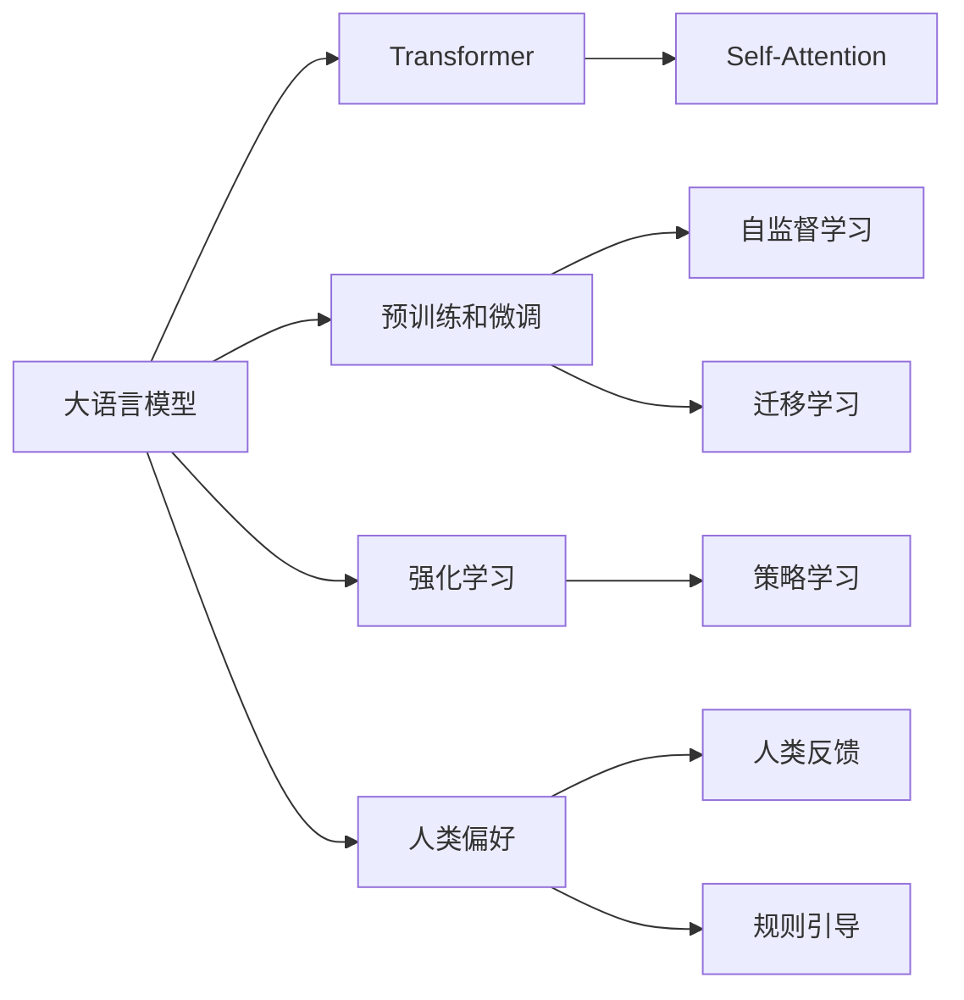

# 大语言模型原理基础与前沿 基于强化学习的微调和基于人类偏好的预训练

## 1. 背景介绍

近年来,大语言模型(Large Language Models, LLMs)在自然语言处理(Natural Language Processing, NLP)领域取得了巨大的突破和进展。从GPT-3到ChatGPT,再到最新的LLaMA和PaLM等模型,大语言模型展现出了惊人的自然语言理解和生成能力,在问答、对话、写作等诸多任务上达到甚至超越了人类的水平。

大语言模型之所以能取得如此卓越的成就,主要得益于以下几个方面的原因:

1. 海量的预训练数据:训练LLMs通常需要TB级别的文本语料,涵盖了网络上的海量文本信息,使模型能够学习到丰富的语言知识。

2. 强大的模型架构:Transformer等注意力机制的引入,极大地提升了语言模型建模长程依赖的能力。

3. 昂贵的算力支持:训练LLMs需要大量的GPU/TPU资源,动辄上百甚至上千块加速卡,耗资巨大。

4. 持续的创新突破:学界和业界在模型架构、训练范式、应用拓展等方面不断创新,推动LLMs的发展。

尽管LLMs已经取得了瞩目的成就,但其在实际应用中仍然面临诸多挑战:

1. 数据和模型偏差:预训练数据的偏差会使模型产生错误、有偏见的输出。

2. 可解释性差:LLMs是黑盒模型,其决策过程难以解释,这在某些应用场景下是不可接受的。 

3. 资源消耗大:LLMs的训练和推理都非常耗费算力资源,难以广泛应用。

4. 安全和伦理风险:LLMs可能被滥用于生成虚假信息、侵犯隐私等。

因此,如何进一步提升LLMs的性能和鲁棒性,并解决其面临的种种挑战,是目前学界和业界的重点研究方向。本文将重点介绍LLMs领域的两个前沿方向:基于强化学习的微调和基于人类偏好的预训练,探讨它们的原理、方法以及在提升LLMs性能方面的潜力。

## 2. 核心概念与联系

在深入探讨基于强化学习的微调和基于人类偏好的预训练之前,我们先来了解一下几个核心概念:

### 2.1 语言模型(Language Model)

语言模型是一类用于描述和学习语言规律的概率模型。给定一个单词序列 $X=(x_1,x_2,...,x_T)$,语言模型的目标是学习单词序列的联合概率分布 $P(X)$。根据概率论的链式法则,语言模型可以表示为:

$$P(X)=\prod_{t=1}^{T} P(x_t | x_1, x_2, ..., x_{t-1})$$

其中 $P(x_t | x_1, x_2, ..., x_{t-1})$ 表示在给定前 $t-1$ 个单词的情况下,第 $t$ 个单词为 $x_t$ 的条件概率。语言模型的目标就是要最大化训练数据的似然概率。

传统的语言模型如N-gram、LSTM等,其性能都受限于模型容量和建模长程依赖的能力。Transformer的出现使得语言模型的性能得到了质的飞跃。

### 2.2 Transformer与Self-Attention

Transformer是一种基于Self-Attention机制的序列建模架构,最早由Vaswani等人在2017年的论文《Attention is All You Need》中提出。相比RNN/LSTM等模型,Transformer在建模长程依赖方面具有天然的优势。

Transformer的核心是Self-Attention机制,其计算过程如下:

1. 将输入序列 $X \in \mathbb{R}^{n \times d}$ 映射为三个矩阵:Query矩阵 $Q$、Key矩阵 $K$、Value矩阵 $V$。

$$Q = XW^Q, K = XW^K, V = XW^V$$

其中 $W^Q, W^K, W^V \in \mathbb{R}^{d \times d_k}$ 是可学习的参数矩阵。

2. 计算 $Q$ 与 $K$ 的点积注意力分数,并做 Softmax 归一化:

$$A = \text{softmax}(\frac{QK^T}{\sqrt{d_k}})$$

3. 将注意力分数 $A$ 与 $V$ 相乘,得到输出表示:

$$O = AV$$

通过引入多头注意力机制,Transformer能够建模不同位置、不同子空间的信息。Transformer还通过残差连接、Layer Normalization、前馈网络(FFN)等结构增强特征的表达能力。

### 2.3 预训练与微调

预训练是指在大规模无标注语料上,以自监督学习的方式训练通用的语言表示模型。常见的预训练任务包括语言模型、去噪自编码、对比学习等。预训练使模型能学习到语言的通用知识和规律。

微调是指在预训练的基础上,使用下游任务的标注数据对模型进行进一步训练,使其适应特定任务。微调一般只需要较少的数据和训练步数,即可取得不错的效果。微调是迁移学习的常用范式。

### 2.4 强化学习

强化学习(Reinforcement Learning, RL)是一种重要的机器学习范式。在RL中,智能体(Agent)通过与环境(Environment)交互,根据环境反馈的奖励(Reward)不断调整策略(Policy),最终学习到最优的决策序列以获得最大的累积奖励。

RL 的数学框架可以表述为一个马尔可夫决策过程(Markov Decision Process, MDP):

- 状态空间 $\mathcal{S}$:表示智能体所处的状态集合。
- 动作空间 $\mathcal{A}$:表示智能体可执行的动作集合。 
- 状态转移概率 $\mathcal{P}$:$P(s'|s,a)$ 表示在状态 $s$ 下执行动作 $a$ 后转移到状态 $s'$ 的概率。
- 奖励函数 $\mathcal{R}$:$R(s,a)$ 表示在状态 $s$ 下执行动作 $a$ 后获得的即时奖励。
- 折扣因子 $\gamma$:$\gamma \in [0,1]$,表示未来奖励的折扣系数。

RL的目标是学习一个策略 $\pi$,使得在该策略下智能体能获得最大的期望累积奖励:

$$J(\pi) = \mathbb{E}_{\pi}\left[\sum_{t=0}^{\infty} \gamma^t R(s_t,a_t)\right] $$

常见的RL算法包括值函数方法(如Q-learning)、策略梯度方法(如REINFORCE)、Actor-Critic方法(如A3C)等。

### 2.5 人类偏好

人类偏好是指人类在完成某项任务时所遵循的偏好、习惯、原则等先验知识。将人类偏好引入机器学习,尤其是引入语言模型的训练过程中,有助于模型生成更加符合人类偏好的输出,如更加通顺、连贯、合乎逻辑,避免生成违背事实或产生危害的内容等。

常见的融合人类偏好的方法包括:

1. 人类反馈:通过人类对模型输出的评分、排序、选择等反馈,指导模型学习。

2. 人类示例:通过人类提供的高质量示例,如人类书写的文章、人类对话等,引导模型学习人类偏好。

3. 规则引导:通过设定规则、约束(如对模型输出进行过滤),使模型遵循人类偏好。

将人类偏好与语言模型相结合,有望让LLMs生成更加符合人类需求、更加安全可控的结果。

### 2.6 核心概念之间的关系

下图展示了本文涉及的几个核心概念之间的关系:

大语言模型是本文的核心概念,其性能的提升得益于Transformer架构、预训练微调范式、强化学习优化目标以及人类偏好的引入。Transformer的Self-Attention是其构建长程依赖能力的关键。预训练和微调分别基于自监督学习和迁移学习的思想。强化学习则通过智能体与环境的交互学习最优策略。人类偏好可通过人类反馈、规则引导等方式融入语言模型。

理解这些概念之间的联系,有助于我们更好地理解基于强化学习的微调和基于人类偏好的预训练的原理和方法。

## 3. 核心算法原理具体操作步骤

本章我们将详细介绍基于强化学习的微调和基于人类偏好的预训练的核心算法原理和具体操作步骤。

### 3.1 基于强化学习的微调

传统的语言模型微调通常基于监督学习,即利用标注数据对模型进行训练,优化目标为极大化训练数据的似然概率。然而,这种做法存在以下局限:

1. 需要大量高质量的标注数据,成本高昂。
2. 模型学到的只是训练数据的分布,泛化性能有限。
3. 无法对模型生成过程进行细粒度控制和优化。

基于强化学习的微调为解决上述问题提供了一种新的思路。其核心思想是将语言生成建模为一个序列决策过程,通过设计合适的奖励函数来引导模型学习符合特定目标的生成策略。

具体来说,基于强化学习的语言模型微调可以分为以下几个步骤:

#### Step 1. 定义MDP

首先需要将语言生成任务表述为一个MDP:

- 状态 $s$:模型生成的当前单词序列。
- 动作 $a$:模型生成的下一个单词。
- 奖励 $r$:根据生成单词序列的质量给出的即时奖励。
- 状态转移:根据语言模型的条件概率分布确定。

#### Step 2. 设计奖励函数

奖励函数 $r(s,a)$ 直接决定了模型学习的目标和方向,是基于强化学习微调的关键。一个理想的奖励函数应当满足以下特点:

1. 能够量化生成序列的质量,引导模型朝着正确的方向优化。
2. 具有可解释性,奖励值的高低应当与人类对生成质量的评判相一致。
3. 可微,以便于反向传播和梯度更新。

常见的奖励函数设计方法包括:

1. 基于评价指标:将BLEU、ROUGE等自然语言生成评价指标作为奖励。
2. 基于分类器:训练一个二分类器来判断生成序列是否符合要求,并将其预测概率作为奖励。
3. 基于人类反馈:通过人工评分、排序等方式收集人类反馈,并将其作为奖励。

举个例子,假设我们希望微调一个摘要生成模型,生成的摘要要求简洁、连贯、准确,则可以设计如下奖励函数:

$$r(s,a) = \alpha \cdot \text{ROUGE}(s,s^*) + \beta \cdot \text{Coherence}(s) + \gamma \cdot \text{Factual}(s)$$

其中 $s$ 为生成的摘要,$s^*$ 为参考摘要,ROUGE用于衡量生成摘要与参考摘要的重合度,Coherence用于衡量生成摘要的连贯性(可基于连贯性分类器),Factual用于衡量生成摘要的事实准确性(可基于知识图谱)。$\alpha, \beta, \gamma$ 为权重系数。

#### Step 3. 策略学习

有了合适的奖励函数后,就可以对语言模型进行策略学习。常用的策略学习算法包括:

1. 基于策略梯度的方法:REINFORCE算法及其变体。
2. 基于值函数的方法:Q-Learning及其变体。
3. 基于Actor-Critic的方法:A3C、PPO等