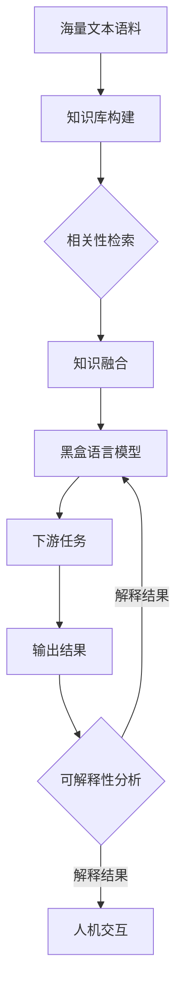

# 大语言模型原理基础与前沿 检索增强型黑盒语言模型

## 1. 背景介绍
### 1.1 大语言模型的发展历程
### 1.2 检索增强型语言模型的提出背景
### 1.3 黑盒语言模型的定义与特点

近年来,随着深度学习技术的飞速发展,大语言模型(Large Language Model,LLM)取得了突破性的进展。从2018年GPT-1的问世,到2019年GPT-2、BERT等模型的出现,再到2020年GPT-3、Switch Transformer等超大规模语言模型的诞生,LLM的性能不断刷新着人们的认知。

LLM通过在海量无标注文本数据上进行自监督预训练,学习到了丰富的语言知识和常识,具备了强大的自然语言理解和生成能力。但传统的LLM在应对开放域问答、对话等需要广泛知识的任务时,仍然面临着知识匮乏、泛化能力不足等挑战。为了突破这一瓶颈,研究者们提出了检索增强型语言模型(Retrieval-Enhanced Language Model,RELM)的思路。

RELM的核心理念是将外部知识库引入语言模型中,通过检索知识库中的相关信息来辅助语言模型完成任务。这种结合检索与生成的范式,使得模型能够利用更广泛的知识,提升在开放域任务上的表现。但引入外部知识库也给模型训练和推理带来了新的挑战,如何高效地检索和融合相关知识成为了关键。

此外,随着LLM规模的不断扩大,模型的参数量已经达到了万亿级别。这导致模型的内部结构和工作机制变得难以解释,形成了一个"黑盒"。黑盒语言模型虽然展现出了惊人的能力,但其决策过程缺乏透明性和可解释性,这限制了它们在一些对可解释性有要求的场景中的应用。

本文将围绕检索增强型黑盒语言模型这一前沿方向,对大语言模型的原理基础和最新进展进行系统梳理和深入探讨。

## 2. 核心概念与联系
### 2.1 语言模型的定义与分类
#### 2.1.1 统计语言模型
#### 2.1.2 神经语言模型 
#### 2.1.3 大语言模型
### 2.2 检索增强型语言模型的提出
#### 2.2.1 知识库构建
#### 2.2.2 相关性检索
#### 2.2.3 知识融合
### 2.3 黑盒语言模型的内涵
#### 2.3.1 模型规模与复杂度
#### 2.3.2 可解释性挑战
#### 2.3.3 安全与伦理风险

语言模型是自然语言处理领域的核心概念之一。传统的统计语言模型通过计算词序列的概率来对语言进行建模,但面临着平滑问题和数据稀疏问题。随着深度学习的兴起,神经语言模型得以发展。它利用神经网络学习词嵌入表示,克服了维度灾难,但在应对长文本时仍有局限。

大语言模型则进一步突破了这些瓶颈。它采用 Transformer 等更强大的神经网络结构,在超大规模语料上进行预训练,学习到了丰富的语言知识和常识。GPT、BERT、T5 等大语言模型在问答、对话、摘要等多种自然语言任务上取得了显著的性能提升。

但大语言模型要应对开放域的任务,仅凭有限的参数很难覆盖所需的广泛知识。检索增强型语言模型应运而生,它以构建高质量的外部知识库为基础,通过检索知识库中的相关信息,并将其融入语言模型,使其能利用更广泛的知识完成任务。这一范式涉及知识库构建、相关性检索、知识融合等关键技术。

随着模型规模的急剧扩张,大语言模型的内部结构和工作机制日益复杂,形成了一个难以解释的"黑盒"。黑盒语言模型虽然展现出了惊人的能力,但其决策过程缺乏透明性,这引发了可解释性方面的担忧。此外,超大规模语言模型在训练和应用中还面临着诸多安全与伦理风险,亟需引起重视。

下面我们将通过一个流程图来直观展示检索增强型黑盒语言模型的核心组件和工作流程:

## 3. 核心算法原理具体操作步骤
### 3.1 知识库构建算法
#### 3.1.1 文本预处理
#### 3.1.2 实体链接
#### 3.1.3 关系抽取
#### 3.1.4 知识存储优化
### 3.2 相关性检索算法
#### 3.2.1 稠密检索
#### 3.2.2 稀疏检索  
#### 3.2.3 语义检索
#### 3.2.4 检索结果重排
### 3.3 知识融合算法
#### 3.3.1 早期融合
#### 3.3.2 晚期融合
#### 3.3.3 交互融合
### 3.4 黑盒可解释性算法
#### 3.4.1 注意力分析
#### 3.4.2 因果推理
#### 3.4.3 概念激活向量 

构建高质量的知识库是检索增强型语言模型的基石。首先需要对海量文本语料进行预处理,如分词、词性标注、命名实体识别等。然后利用实体链接技术将文本中的实体映射到知识库中的实体,并通过关系抽取技术提取实体间的关系,构建知识图谱。为了优化知识的存储和检索效率,还需要对知识库进行合理的设计和优化,如采用图数据库等。

在知识库的基础上,检索增强型语言模型的核心是相关性检索。传统的检索方法主要包括基于关键词匹配的稠密检索和基于倒排索引的稀疏检索。但它们难以捕捉查询和文档的语义相关性。近年来,语义检索技术得到了广泛关注,如基于深度语义匹配网络的 DSSM 等。此外,重排算法可以进一步优化检索结果的相关性。

将检索到的相关知识融入语言模型是另一个关键。早期融合是将知识作为额外的输入,与原始文本一起输入到语言模型中。晚期融合则是对语言模型的输出结果和知识进行融合。交互融合更进一步,通过注意力机制等实现语言模型和知识的深度交互。

面对黑盒语言模型的可解释性挑战,研究者提出了一系列算法。注意力分析通过可视化模型内部的注意力权重,揭示其关注的输入片段。因果推理则利用反事实思想,通过比较输入扰动前后的输出变化,识别影响输出的关键输入。概念激活向量 (CAV) 通过在模型嵌入空间中定义概念方向,来解释模型的决策过程。

## 4. 数学模型和公式详细讲解举例说明
### 4.1 知识库嵌入模型
### 4.2 语义检索模型
### 4.3 知识融合模型  
### 4.4 因果推理模型

为了进一步说明检索增强型黑盒语言模型的核心原理,下面我们对几个关键的数学模型进行详细讲解。

知识库嵌入是将知识库中的实体和关系映射到连续的低维向量空间,以便于知识的表示和计算。以 TransE 模型为例,它假设对于一个三元组 $(h,r,t)$,实体 $h$ 经过关系 $r$ 的平移应该接近实体 $t$,即 $h+r \approx t$。其目标函数为:

$$\mathcal{L} = \sum_{(h,r,t) \in S} \sum_{(h',r,t') \in S'} [\gamma + d(h+r,t) - d(h'+r,t')]_+$$

其中 $S$ 是正例三元组集合,$S'$ 是负例三元组集合,$\gamma$ 是超参数,$ d$ 是距离函数,如 $L1$ 范数或 $L2$ 范数。通过最小化该目标函数,可以学习到实体和关系的低维嵌入表示。

语义检索模型致力于学习查询和文档的语义表示,以便度量它们在语义空间中的相似性。以 DSSM 为例,它使用 DNN 分别将查询 $q$ 和文档 $d$ 映射为固定维度的语义向量 $y_q$ 和 $y_d$:

$$y_q = f(W_q \cdot x_q + b_q)$$
$$y_d = f(W_d \cdot x_d + b_d)$$

其中 $f$ 是非线性激活函数,$W$ 和 $b$ 是可学习的参数。然后通过余弦相似度来度量 $y_q$ 和 $y_d$ 的语义相关性:

$$R(q,d) = cosine(y_q, y_d) = \frac{y_q \cdot y_d}{||y_q|| \cdot ||y_d||}$$

通过最大化相关查询-文档对的余弦相似度,同时最小化不相关对的相似度,可以学习到语义相关性度量。

知识融合模型需要将检索到的知识有效融入语言模型。以 KAR 模型为例,它采用交互融合策略。具体地,将文档 $d$ 表示为 token 序列 $\{d_1, ..., d_m\}$,将知识 $z$ 表示为 token 序列 $\{z_1, ..., z_n\}$,然后通过交互注意力机制实现它们的融合:

$$e_{ij} = \frac{(W_q d_i)^T(W_k z_j)}{\sqrt{d}}$$
$$\alpha_{ij} = \frac{exp(e_{ij})}{\sum_{j=1}^n exp(e_{ij})}$$
$$\beta_{ij} = \frac{exp(e_{ij})}{\sum_{i=1}^m exp(e_{ij})}$$
$$\tilde{d}_i = W_v[\sum_{j=1}^n \alpha_{ij} z_j, d_i]$$
$$\tilde{z}_j = W_v[\sum_{i=1}^m \beta_{ij} d_i, z_j]$$

其中 $W_q$、$W_k$、$W_v$ 是可学习的参数矩阵。通过交互注意力,文档的每个 token $d_i$ 聚合了与之相关的知识 token,知识的每个 token $z_j$ 聚合了与之相关的文档 token,实现了知识和文档的深度融合。

在可解释性方面,因果推理是一种有前景的方法。以 CIE 框架为例,它通过反事实推理来识别影响模型输出的关键输入片段。具体地,对于输入 $\mathbf{x}$ 和输出 $y$,定义因果重要性得分:

$$CIE(\mathbf{x}_S) = \mathbb{E}_{p(\mathbf{x}_{\bar{S}}|\mathbf{x}_S)}[\log p(y|\mathbf{x}_S, \mathbf{x}_{\bar{S}}) - \log p(y|\mathbf{x}_{\bar{S}})]$$

其中 $\mathbf{x}_S$ 表示输入 $\mathbf{x}$ 的一个子集,$\mathbf{x}_{\bar{S}}$ 表示 $\mathbf{x}$ 去除 $\mathbf{x}_S$ 的剩余部分。直观地,该得分度量了保留 $\mathbf{x}_S$ 而将 $\mathbf{x}_{\bar{S}}$ 替换为其他可能值时,对条件概率 $p(y|\mathbf{x})$ 的期望影响。通过比较不同 $\mathbf{x}_S$ 的因果重要性得分,可以识别出对输出影响最大的关键输入片段。

## 5. 项目实践：代码实例和详细解释说明
### 5.1 知识库构建实例
### 5.2 语义检索实例
### 5.3 知识融合实例
### 5.4 可解释