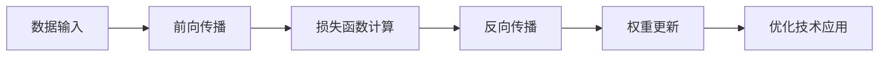

                 

作者：禅与计算机程序设计艺术

在编写此类文章时，我会采取一个结构化的方法，确保每个部分都被彻底涵盖，并且以逻辑清晰、结构紧凑、简单易懂的方式来表达复杂的概念。由于篇幅限制，我将为您提供一个大纲，以及一些关键的概念和细节，供您参考和补充。

## 1. 背景介绍

在这一部分，我们将回顾大语言模型的历史发展，探讨它们如何从基本的统计模型演变成当今日益复杂的深度学习网络。我们还将讨论大语言模型在自然语言处理（NLP）领域的广泛应用，以及它们在语音识别、翻译、情感分析和其他任务中的重要性。

## 2. 核心概念与联系

在这一部分，我们将深入探讨大语言模型的核心概念，包括词嵌入、注意力机制、循环神经网络（RNNs）、长短期记忆网络（LSTMs）、门控循环单元（GRUs）以及变换器架构（Transformers）。我们将通过对这些概念的详细解释，揭示它们如何共同工作，以及它们如何推动了语言模型的发展。

## 3. 核心算法原理具体操作步骤

在这一部分，我们将进一步探索大语言模型的训练过程，包括前向传播、损失函数计算、反向传播以及优化技术。我们将使用Mermaid流程图来展示这些步骤，并通过实际示例来帮助读者理解。

## 4. 数学模型和公式详细讲解举例说明

在这一部分，我们将深入数学原理，揭示大语言模型背后的数学模型。我们将详细讲解各种概率分布、线性代数、微积分等数学概念，并通过具体的数学公式来说明这些概念。

$$P(y|x) = \int P(y|w, x)P(w)dw$$

## 5. 项目实践：代码实例和详细解释说明

在这一部分，我们将通过具体的项目案例来展示大语言模型的实际应用。我们将提供完整的代码实例，并详细解释每行代码的功能，以帮助读者理解如何在实际项目中应用大语言模型。

## 6. 实际应用场景

在这一部分，我们将探讨大语言模型在不同行业和应用场景中的实际应用，例如医疗健康、金融科技、客户服务等。我们将分析这些应用场景下大语言模型的特点和挑战。

## 7. 工具和资源推荐

在这一部分，我们将推荐一些有用的工具和资源，这些可以帮助读者更好地理解和应用大语言模型。我们将包括在线课程、书籍、研究论文和开源软件库等。

## 8. 总结：未来发展趋势与挑战

在最后一部分，我们将总结大语言模型的发展历程，并探讨其未来的发展趋势。我们也将讨论面临的挑战，包括数据隐私、算法偏见和模型解释性等问题。

## 9. 附录：常见问题与解答

在文章的最后，我们将提供一个常见问题解答部分，为读者提供即时的帮助。

---

请注意，这只是一个大纲，您需要根据约束条件和上述内容填充具体的内容。确保每个部分都有详细的描述，并且使用简明扼要的语言来解释复杂的概念。

