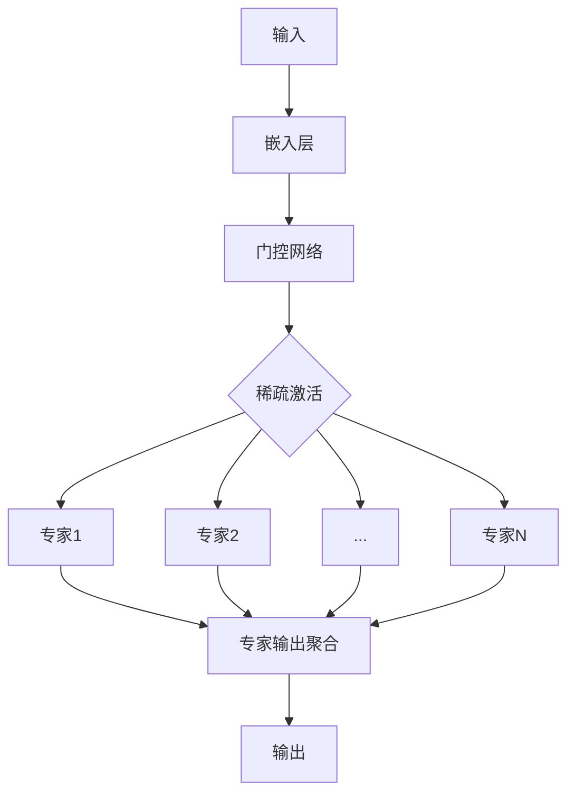

# 大语言模型原理基础与前沿 稀疏专家模型

## 1. 背景介绍
### 1.1 大语言模型的发展历程
#### 1.1.1 早期的语言模型
#### 1.1.2 神经网络语言模型的兴起  
#### 1.1.3 Transformer时代的到来
### 1.2 大语言模型面临的挑战
#### 1.2.1 模型参数量急剧增长
#### 1.2.2 训练成本不断提高
#### 1.2.3 推理效率有待提升
### 1.3 稀疏专家模型的提出
#### 1.3.1 动机：解决大模型面临的问题
#### 1.3.2 核心思想：引入专家模型和稀疏性
#### 1.3.3 潜力：实现高效可扩展的大模型

## 2. 核心概念与联系
### 2.1 Mixture-of-Experts (MoE)
#### 2.1.1 专家模型与门控网络
#### 2.1.2 MoE层的计算过程
#### 2.1.3 MoE在大模型中的应用
### 2.2 稀疏激活 
#### 2.2.1 Top-K稀疏性
#### 2.2.2 路由机制与负载均衡
#### 2.2.3 稀疏性带来的效率提升
### 2.3 模型并行与专家并行
#### 2.3.1 数据并行与模型并行
#### 2.3.2 专家并行：跨设备分布专家
#### 2.3.3 通信开销与负载均衡

## 3. 核心算法原理与具体步骤
### 3.1 前向计算流程
#### 3.1.1 输入表示与嵌入
#### 3.1.2 门控网络进行专家选择
#### 3.1.3 稀疏激活与专家计算
#### 3.1.4 专家输出聚合
### 3.2 反向传播与梯度计算
#### 3.2.1 损失函数与目标
#### 3.2.2 专家梯度的计算
#### 3.2.3 门控网络梯度的计算
#### 3.2.4 嵌入层梯度的计算
### 3.3 训练过程优化
#### 3.3.1 负载均衡损失
#### 3.3.2 专家间梯度同步
#### 3.3.3 训练策略与超参数选择

## 4. 数学模型与公式详解
### 4.1 MoE层的数学表示
#### 4.1.1 门控网络：$G(x) = \mathrm{softmax}(W_g x + b_g)$
#### 4.1.2 专家网络：$E_i(x) = f_i(W_i x + b_i)$
#### 4.1.3 MoE输出：$y = \sum_{i=1}^N G(x)_i \cdot E_i(x)$
### 4.2 Top-K稀疏激活
#### 4.2.1 数学定义：$\mathrm{TopK}(x, k) = \{i : x_i \geq x_{[k]}\}$
#### 4.2.2 门控输出稀疏化：$\hat{G}(x) = \mathrm{TopK}(G(x), k)$
#### 4.2.3 专家计算稀疏化：$\hat{E}_i(x) = \begin{cases} E_i(x), & i \in \hat{G}(x) \\ 0, & \text{otherwise} \end{cases}$
### 4.3 负载均衡损失
#### 4.3.1 专家负载：$L_i = \sum_{x \in \mathcal{B}} \hat{G}(x)_i$
#### 4.3.2 目标负载：$\bar{L} = \frac{1}{N} \sum_{i=1}^N L_i$
#### 4.3.3 负载均衡损失：$\mathcal{L}_{\text{balance}} = \sum_{i=1}^N (L_i - \bar{L})^2$

## 5. 项目实践：代码实例与详解
### 5.1 构建MoE层
#### 5.1.1 门控网络的实现
#### 5.1.2 专家网络的定义
#### 5.1.3 前向计算函数
### 5.2 实现稀疏激活
#### 5.2.1 Top-K算法的实现
#### 5.2.2 稀疏门控输出的计算
#### 5.2.3 专家计算的条件执行
### 5.3 分布式训练支持
#### 5.3.1 专家并行的实现
#### 5.3.2 设备间专家梯度同步
#### 5.3.3 负载均衡损失的计算

## 6. 实际应用场景
### 6.1 自然语言处理
#### 6.1.1 语言建模与文本生成
#### 6.1.2 机器翻译与多语言模型
#### 6.1.3 问答与对话系统
### 6.2 多模态学习
#### 6.2.1 图像描述生成
#### 6.2.2 视频字幕生成
#### 6.2.3 语音识别与合成
### 6.3 推荐系统
#### 6.3.1 用户兴趣建模
#### 6.3.2 个性化推荐生成
#### 6.3.3 跨域推荐

## 7. 工具与资源推荐
### 7.1 开源实现
#### 7.1.1 Mesh TensorFlow
#### 7.1.2 FairSeq
#### 7.1.3 DeepSpeed
### 7.2 预训练模型
#### 7.2.1 GPT-3
#### 7.2.2 Switch Transformer
#### 7.2.3 GLaM
### 7.3 数据集
#### 7.3.1 WikiText
#### 7.3.2 BookCorpus
#### 7.3.3 CC-News

## 8. 总结：未来发展与挑战
### 8.1 稀疏专家模型的优势
#### 8.1.1 降低训练与推理成本
#### 8.1.2 实现模型容量的扩展
#### 8.1.3 提高模型的泛化能力
### 8.2 未来研究方向
#### 8.2.1 动态专家路由机制
#### 8.2.2 专家多样性与协作
#### 8.2.3 模型压缩与知识蒸馏
### 8.3 面临的挑战
#### 8.3.1 专家负载不均衡问题
#### 8.3.2 专家间通信开销优化
#### 8.3.3 推理阶段的专家调度

## 9. 附录：常见问题解答
### 9.1 稀疏专家模型与传统集成学习的区别？
传统集成学习通常是训练多个独立的模型，然后将它们的输出进行组合。而稀疏专家模型是在单个模型内引入多个专家网络，并通过门控机制来选择激活的专家。这使得专家间可以共享底层的特征表示，同时又能够针对不同的输入进行专业化处理。

### 9.2 稀疏专家模型的主要优点是什么？
稀疏专家模型的主要优点包括：
1. 通过引入多个专家网络，可以大幅增加模型的容量，提高模型的表达能力。
2. 稀疏激活机制可以减少计算和内存开销，使得训练和推理更加高效。
3. 专家间可以并行计算，易于分布式训练，进一步提升训练效率。
4. 不同专家可以专注于处理不同的任务或领域，提高模型的泛化能力。

### 9.3 如何权衡专家数量、模型容量和计算效率？
选择合适的专家数量需要综合考虑以下因素：
1. 任务复杂度：对于更复杂的任务，通常需要更多的专家来捕获不同的特征和模式。
2. 可用计算资源：更多的专家意味着更高的计算和内存开销，需要权衡可用的计算资源。
3. 模型容量：增加专家数量可以提高模型容量，但也要避免过度参数化而导致过拟合。
4. 训练效率：专家数量过多可能会增加通信开销，影响训练效率。

需要通过实验来寻找合适的平衡点，既能获得良好的性能，又能保证计算效率。

### 9.4 稀疏专家模型的局限性有哪些？
稀疏专家模型虽然有很多优点，但也存在一些局限性：
1. 专家负载不均衡问题：如果某些专家被过多激活，而其他专家很少被使用，会导致计算资源的浪费。需要设计合适的负载均衡策略。
2. 专家间通信开销：专家间需要进行梯度同步和中间结果交换，这会带来额外的通信开销。需要优化通信方式和频率。
3. 推理阶段的专家调度：在推理阶段，需要根据输入动态地选择激活的专家，这可能会带来额外的延迟。需要设计高效的专家调度机制。
4. 解释性和可解释性：由于专家网络是动态选择的，模型的内部决策过程可能难以解释。需要开发相应的工具和方法来提高模型的可解释性。

### 9.5 稀疏专家模型适用于哪些场景？
稀疏专家模型在以下场景中特别有用：
1. 处理大规模和复杂的任务，如大型语言模型、多模态学习等。
2. 需要在海量数据上进行训练，且对计算效率有较高要求的场景。
3. 任务涉及多个领域或子任务，需要模型具备广泛的知识和能力。
4. 需要在资源受限的环境中部署大型模型，如移动设备、边缘计算等。

总的来说，稀疏专家模型为构建大规模、高效、多领域的智能系统提供了一种有前景的方向。

## Mermaid 流程图
下面是稀疏专家模型的核心概念和计算流程的 Mermaid 流程图：

1. 输入经过嵌入层得到特征表示。
2. 门控网络根据特征表示计算每个专家的权重。
3. 通过稀疏激活选择 Top-K 个权重最高的专家。
4. 被选中的专家对输入进行处理，生成各自的输出。
5. 专家的输出根据门控网络的权重进行加权聚合。
6. 聚合后的结果作为最终的输出。

这种稀疏专家结构可以灵活地引入大量专家，同时通过稀疏激活来控制计算开销，实现高效的大规模模型训练和推理。

作者：禅与计算机程序设计艺术 / Zen and the Art of Computer Programming