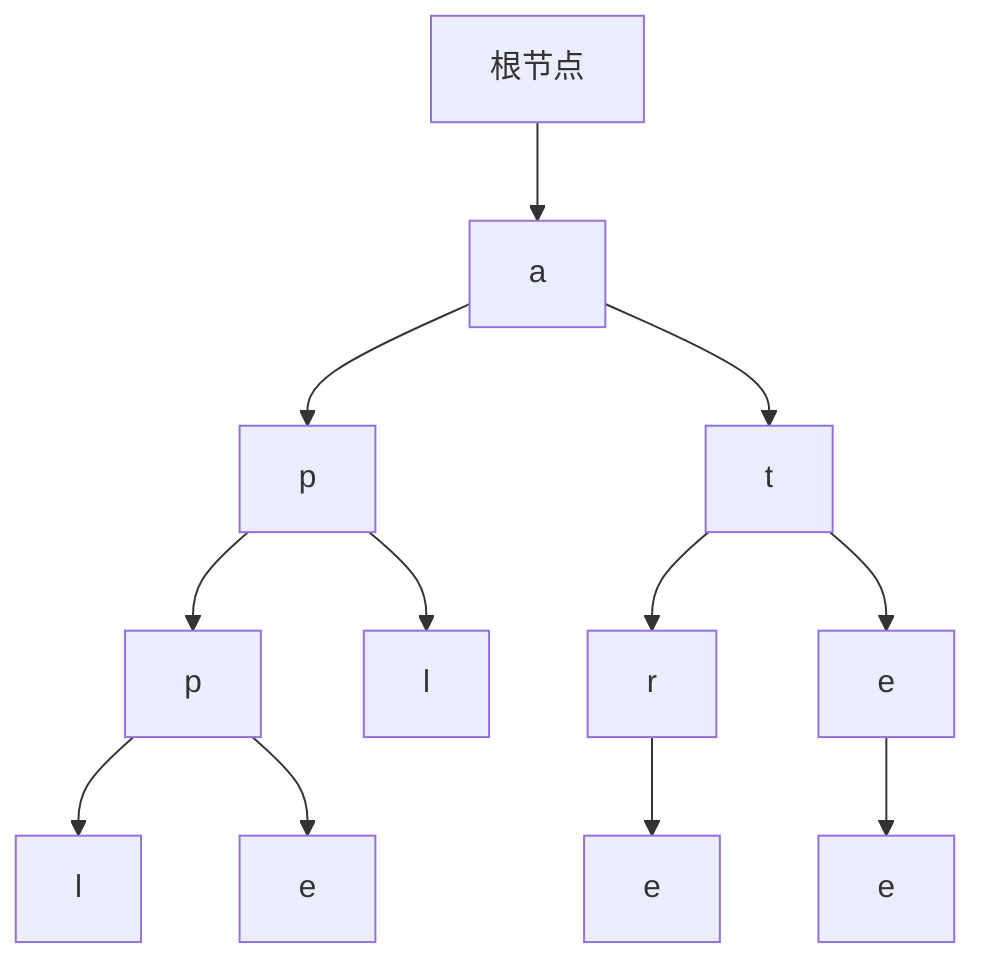
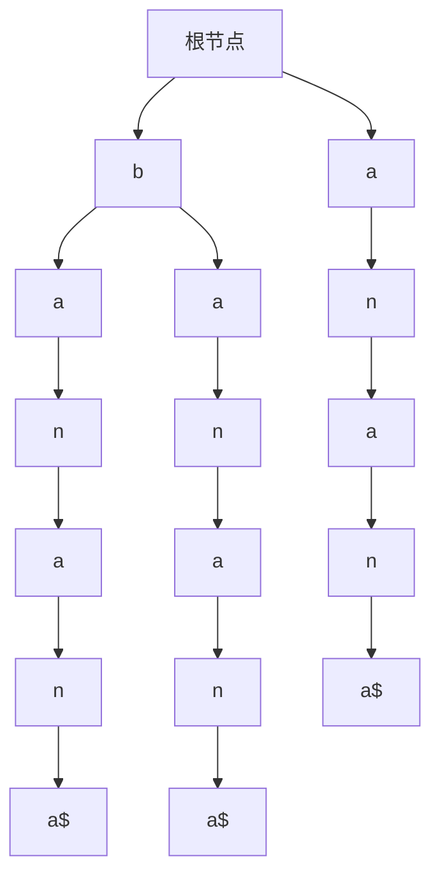

# 大语言模型原理基础与前沿 词元级检索

## 1. 背景介绍

### 1.1 自然语言处理的发展历程

自然语言处理(Natural Language Processing, NLP)是人工智能领域的一个重要分支,旨在使计算机能够理解和生成人类语言。随着深度学习技术的不断发展,NLP取得了长足的进步,尤其是大型语言模型的出现,使得NLP的性能有了质的飞跃。

### 1.2 大语言模型的兴起

传统的NLP系统通常采用基于规则或统计机器学习的方法,需要大量的人工特征工程。而大型语言模型则是基于大量的文本数据,使用深度神经网络自动学习语言的潜在规律和知识表示,从而避免了人工特征工程的瓶颈。

### 1.3 词元级检索的重要性

在大型语言模型中,词元(Token)是构建语言表示的基本单位。词元级检索是指根据输入的文本,快速定位和检索相关的词元及其上下文信息。这是大型语言模型的核心功能之一,对于提高模型的响应速度和准确性至关重要。

## 2. 核心概念与联系

### 2.1 词元化(Tokenization)

词元化是将原始文本分割成一系列有意义的词元的过程。常见的词元化方法包括基于空格的分词、基于规则的分词、基于统计的分词等。词元化是大型语言模型的预处理步骤,对后续的词元表示和检索有重要影响。

### 2.2 词元嵌入(Token Embedding)

词元嵌入是将离散的词元映射到连续的向量空间中的过程,使得具有相似语义的词元在向量空间中彼此靠近。常见的词元嵌入方法包括Word2Vec、GloVe、FastText等。词元嵌入是大型语言模型的基础表示,对于捕捉语义信息至关重要。

### 2.3 注意力机制(Attention Mechanism)

注意力机制是一种计算模型,能够自动学习输入序列中不同位置的重要性权重,从而更好地捕捉长距离依赖关系。注意力机制在大型语言模型中被广泛应用,用于建模词元之间的关系。

### 2.4 transformer架构

Transformer是一种全新的基于注意力机制的序列到序列模型架构,它完全放弃了传统的循环神经网络和卷积神经网络结构,使用多头自注意力机制来捕捉输入和输出序列之间的长距离依赖关系。Transformer架构在大型语言模型中得到了广泛应用,如BERT、GPT等。

### 2.5 词元级检索

词元级检索是指根据输入的文本,快速定位和检索相关的词元及其上下文信息。这是大型语言模型的核心功能之一,对于提高模型的响应速度和准确性至关重要。高效的词元级检索需要合理的数据结构和算法设计。

## 3. 核心算法原理具体操作步骤

### 3.1 前缀树(Trie)

前缀树是一种高效的数据结构,用于存储和检索字符串集合。它的核心思想是利用字符串的公共前缀来减少无谓的字符比较,从而提高查找效率。前缀树在词元级检索中有着广泛的应用。

#### 3.1.1 前缀树的构建过程

1. 初始化一个根节点,用于存储空字符串。
2. 对于每个字符串,从根节点开始,依次将字符插入树中。
   - 如果当前字符已经存在于树中,则沿着该边移动到下一个节点。
   - 如果当前字符不存在于树中,则创建一个新节点,并将该字符作为新节点的值。
3. 重复步骤2,直到所有字符串都被插入到树中。
4. 在插入过程中,可以使用标记位或特殊值来标记单词的结尾。



#### 3.1.2 前缀树的查找过程

1. 从根节点开始,依次比较输入字符串的每个字符。
2. 如果当前字符在树中存在,则沿着该边移动到下一个节点。
3. 如果当前字符在树中不存在,则说明输入字符串不存在于树中,查找失败。
4. 如果到达了单词结尾的标记位,则说明查找成功。

#### 3.1.3 前缀树的优缺点

优点:
- 最大限度地减少无谓的字符比较,查找效率高。
- 能够高效地处理字符串前缀查找。
- 插入和查找操作的时间复杂度均为O(k),其中k为字符串的长度。

缺点:
- 对于存储大量单词的场景,前缀树可能会占用较大的内存空间。
- 不适合处理模糊查找或通配符查找等场景。

### 3.2 后缀数组(Suffix Array)

后缀数组是一种用于处理字符串的数据结构,它将一个字符串的所有后缀按字典序排列,并存储每个后缀在原字符串中的起始位置。后缀数组在词元级检索中也有着重要的应用。

#### 3.2.1 后缀数组的构建过程

1. 对于一个长度为n的字符串,首先构建出它的n个后缀。
2. 将这n个后缀按字典序进行排序。
3. 记录每个后缀在原字符串中的起始位置,构成后缀数组。

例如,对于字符串"banana",它的后缀数组为:

```
0: "banana"
1: "anana"
2: "nana"
3: "ana"
4: "na"
5: "a"
```

排序后的后缀数组为:

```
5: "a"
3: "ana"
1: "anana"
0: "banana"
4: "na"
2: "nana"
```

因此,该字符串的后缀数组为[5, 3, 1, 0, 4, 2]。

#### 3.2.2 后缀数组的查找过程

1. 对输入的模式串进行字典序排序。
2. 在后缀数组中使用二分查找法,查找模式串的起始位置。
3. 如果找到,则输出该位置及其后续的字符串。

#### 3.2.3 后缀数组的优缺点

优点:
- 能够高效地处理模式串查找和子串查找等操作。
- 查找时间复杂度为O(m log n),其中m为模式串长度,n为文本长度。

缺点:
- 构建后缀数组的时间复杂度较高,为O(n log n)。
- 对于频繁插入或删除操作,后缀数组需要重新构建,效率较低。

### 3.3 后缀树(Suffix Tree)

后缀树是一种用于处理字符串的数据结构,它将一个字符串的所有后缀组织成一棵树状结构。后缀树在词元级检索中也有着重要的应用,尤其是在处理模式串查找和子串查找等操作时表现出色。

#### 3.3.1 后缀树的构建过程

1. 初始化一个根节点,用于存储空字符串。
2. 对于输入字符串的每个后缀,从根节点开始,依次插入到树中。
   - 如果当前字符已经存在于树中,则沿着该边移动到下一个节点。
   - 如果当前字符不存在于树中,则创建一个新节点,并将该字符作为新节点的值。
3. 重复步骤2,直到所有后缀都被插入到树中。
4. 在插入过程中,可以使用标记位或特殊值来标记每个后缀的结尾。



#### 3.3.2 后缀树的查找过程

1. 从根节点开始,依次比较输入模式串的每个字符。
2. 如果当前字符在树中存在,则沿着该边移动到下一个节点。
3. 如果当前字符在树中不存在,则说明模式串不存在于树中,查找失败。
4. 如果到达了后缀结尾的标记位,则说明查找成功。

#### 3.3.3 后缀树的优缺点

优点:
- 能够高效地处理模式串查找、子串查找、重复子串查找等操作。
- 查找时间复杂度为O(m),其中m为模式串长度。

缺点:
- 构建后缀树的时间复杂度较高,为O(n^2)。
- 对于频繁插入或删除操作,后缀树需要重新构建,效率较低。
- 后缀树的空间复杂度较高,对于长字符串可能会占用较大的内存空间。

### 3.4 后缀数组与后缀树的比较

后缀数组和后缀树都是用于处理字符串的数据结构,它们在词元级检索中有着重要的应用。两者的主要区别如下:

- 构建时间复杂度:
  - 后缀数组的构建时间复杂度为O(n log n)。
  - 后缀树的构建时间复杂度为O(n^2)。

- 查找时间复杂度:
  - 后缀数组的查找时间复杂度为O(m log n),其中m为模式串长度,n为文本长度。
  - 后缀树的查找时间复杂度为O(m),与模式串长度有关,与文本长度无关。

- 空间复杂度:
  - 后缀数组的空间复杂度为O(n)。
  - 后缀树的空间复杂度较高,最坏情况下可能达到O(n^2)。

- 应用场景:
  - 后缀数组更适合处理模式串查找和子串查找等操作。
  - 后缀树更适合处理重复子串查找、最长公共子串查找等操作。

综合来看,后缀树在查找效率上更加优秀,但构建和存储开销较大。后缀数组则在构建和存储方面更加高效,但查找效率略低于后缀树。在实际应用中,需要根据具体的场景和需求来选择合适的数据结构。

## 4. 数学模型和公式详细讲解举例说明

在词元级检索中,常见的数学模型和公式包括编辑距离(Edit Distance)、最长公共子序列(Longest Common Subsequence, LCS)等。

### 4.1 编辑距离

编辑距离是指将一个字符串转换为另一个字符串所需的最小编辑操作次数,其中编辑操作包括插入、删除和替换。编辑距离常用于计算两个字符串之间的相似度,在拼写纠错、DNA序列比对等领域有广泛应用。

#### 4.1.1 编辑距离的定义

设有两个字符串 $s_1$ 和 $s_2$,其长度分别为 $m$ 和 $n$,则 $s_1$ 和 $s_2$ 之间的编辑距离 $d(s_1, s_2)$ 可以通过以下递归公式定义:

$$
d(s_1, s_2) = \begin{cases}
0 & \text{if } m = n = 0 \\
m & \text{if } n = 0 \\
n & \text{if } m = 0 \\
\min\begin{cases}
d(s_1[1:m], s_2[1:n]) + 1 & \text{(删除)} \\
d(s_1[1:m], s_2) + 1 & \text{(插入)} \\
d(s_1, s_2[1:n]) + 1 & \text{(替换)} \\
d(s_1[1:m], s_2[1:n]) + \text{if } s_1[m] \neq s_2[n] & \text{(匹配)}
\end{cases} & \text{otherwise}
\end{cases}
$$

其中 $s_1[1:m]$ 表示字符串 $s_1$ 从第二个字符开始到最